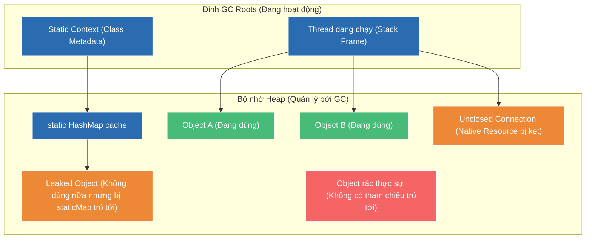

# Memory leak trong Java có thể xảy ra không? Ví dụ?

## ⚡ Tóm tắt ngắn (30s)
* **Có**, memory leak hoàn toàn có thể xảy ra trong Java dù đã có Garbage Collector (GC).
* **Bản chất**: Memory leak xảy ra khi ứng dụng không còn cần sử dụng một đối tượng nữa, nhưng đối tượng đó vẫn bị giữ tham chiếu mạnh (**Strong Reference**) bởi các đối tượng khác đang hoạt động liên kết với **GC Roots**. GC coi đối tượng này vẫn còn sống (Reachable) nên không thể thu gom, dẫn đến cạn kiệt Heap và gây lỗi **OutOfMemoryError**.
* **Nguyên nhân phổ biến**: `static` fields lạm dụng, `ThreadLocal` không giải phóng, không đóng I/O stream/mạng/database connection, quên hủy đăng ký listener/callback, ghi đè `equals` và `hashCode` sai cách trong Hash collections.

---

## 🔍 Chi tiết bản chất

### 1. Cơ chế rò rỉ bộ nhớ dưới góc nhìn GC
Garbage Collector thu gom bộ nhớ dựa trên thuật toán **Reachability Analysis**. Nó vẽ một đồ thị các tham chiếu từ các đỉnh **GC Roots** (ví dụ: biến local trên Stack frame, static fields của các class đã nạp, luồng hệ thống JNI). 
* Nếu một object không còn được logic nghiệp vụ sử dụng nhưng vẫn tồn tại ít nhất một đường dẫn tham chiếu mạnh (Strong Reference chain) từ GC Root, GC bắt buộc phải giữ lại object đó.
* Qua thời gian, các object "rác" này tích tụ trên Old Generation, làm tăng tần suất GC và cuối cùng gây crash ứng dụng.

### 2. Các nhóm nguyên nhân điển hình
* **Lạm dụng static fields**: Biến `static` thuộc về class, ClassLoader giữ class đó suốt vòng đời của JVM. Do đó, bất kỳ collection `static` nào không được dọn dẹp chủ động sẽ giữ chặt các object bên trong nó vĩnh viễn trên Heap.
* **Rò rỉ ThreadLocal**: Mỗi Thread lưu một ThreadLocalMap riêng. Khi luồng kết thúc, map này được GC. Tuy nhiên, trong các web server hiện đại (Tomcat, Undertow), các thread được tái sử dụng qua **Thread Pool** (không bao giờ chết). Nếu không gọi `ThreadLocal.remove()`, dữ liệu gắn với Thread đó sẽ nằm lỳ trên bộ nhớ mãi mãi.
* **Unclosed Resources**: Các tài nguyên hệ điều hành (file descriptors, socket, database connection) được quản lý ở tầng Native. Nếu không đóng chúng bằng `close()`, GC có thể dọn dẹp object Java bọc ngoài nhưng tài nguyên native bên dưới vẫn bị rò rỉ cho đến khi cạn tài nguyên hệ thống.
* **Bẫy Hash Collections**: Khi thêm đối tượng vào `HashMap` hay `HashSet`, nếu đối tượng đó bị thay đổi thuộc tính cấu thành giá trị `hashCode()` (hoặc định nghĩa sai `equals()`), HashMap sẽ tính sai bucket khi ta muốn gọi `remove()`. Đối tượng đó bị kẹt lại vô thời hạn.

---

## 🎨 Sơ đồ trực quan về rò rỉ bộ nhớ qua GC Roots



---

## 💻 Code Example

### BAD ❌ (Rò rỉ bộ nhớ qua ThreadLocal trong Thread Pool và quên đóng stream)
```java
public class LeakyService {
    // ❌ Tệ: ThreadLocal lưu giữ thông tin UserContext khổng lồ mà không bao giờ remove.
    // Vì ThreadPool tái sử dụng thread liên tục, UserContext của request cũ sẽ bị kẹt lại.
    private static final ThreadLocal<byte[]> userContext = new ThreadLocal<>();

    public void processRequest(byte[] requestData) throws IOException {
        userContext.set(new byte[10 * 1024 * 1024]); // Nạp 10MB dữ liệu người dùng vào ThreadLocal

        // ❌ Tệ: Đọc file bằng FileInputStream nhưng không đóng stream thủ công
        // hoặc không dùng try-with-resources. Nếu xảy ra exception giữa chừng, stream sẽ bị treo descriptor.
        FileInputStream fis = new FileInputStream("config.properties");
        int content = fis.read();
        System.out.println("Config byte: " + content);
        
        // Hoàn thành xử lý mà không gọi userContext.remove() và fis.close()
    }
}
```

### GOOD ✅ (Giải phóng ThreadLocal bằng try-finally và đóng tài nguyên tự động)
```java
public class SecureService {
    private static final ThreadLocal<byte[]> userContext = new ThreadLocal<>();

    public void processRequest(byte[] requestData) {
        try {
            userContext.set(new byte[10 * 1024 * 1024]); // Nạp dữ liệu
            
            // ✅ Tốt: Sử dụng Try-with-resources để tự động đóng file stream an toàn 
            // kể cả khi có ngoại lệ (Exception) xảy ra trong quá trình đọc.
            try (FileInputStream fis = new FileInputStream("config.properties")) {
                int content = fis.read();
                System.out.println("Config byte: " + content);
            } catch (IOException e) {
                // Xử lý lỗi đọc file một cách an toàn
            }
            
        } finally {
            // ✅ Bắt buộc: Phải xóa ThreadLocal trong khối finally để đảm bảo 
            // dữ liệu được giải phóng ngay khi luồng xử lý xong request hiện tại.
            userContext.remove();
        }
    }
}
```

---

## 📊 Trade-off Analysis

| Phương pháp quản lý tham chiếu | Lợi ích mang lại | Chi phí đánh đổi |
| :--- | :--- | :--- |
| **Strong Reference (Mặc định)** | Đơn giản, đảm bảo đối tượng luôn khả dụng khi cần thiết, không lo bị GC xóa mất giữa chừng. | Dễ gây rò rỉ bộ nhớ nếu lập trình viên quên ngắt kết nối tham chiếu khi kết thúc nghiệp vụ. |
| **Weak Reference (`WeakReference`)** | Đối tượng tự động bị GC dọn dẹp khi Heap bị quét qua (bất kể Heap đầy hay vơi). Chống memory leak cực tốt cho các bộ Cache. | Dữ liệu có thể biến mất bất kỳ lúc nào. Luôn phải kiểm tra giá trị `null` trước khi sử dụng. |
| **Soft Reference (`SoftReference`)** | GC chỉ thu hồi khi JVM rơi vào tình trạng thiếu bộ nhớ nghiêm trọng (sắp OOM). Phù hợp làm Memory-Sensitive Cache. | Phụ thuộc vào thuật toán nội bộ của GC, khó dự đoán chính xác thời điểm thu gom. |

---

## ⚠️ Common Gotchas & Questions follow-up
1. **Lầm tưởng "Chỉ cần gán null là GC sẽ dọn dẹp lập tức"**:
   Gán `obj = null` chỉ đơn thuần là cắt tham chiếu từ biến cục bộ đó tới object trên Heap. Nếu object đó vẫn nằm trong một list static hay map khác, GC vẫn không thể dọn. Thêm vào đó, GC chạy bất tuần tự (Asynchronous), gán null không kích hoạt dọn dẹp tức thì.
2. 👉 **Câu hỏi đào sâu từ interviewer**: *Làm sao ngăn ngừa rò rỉ bộ nhớ khi sử dụng Listener Pattern (Observer Pattern)?*
   * *(Trả lời: Luôn triển khai phương thức hủy đăng ký (unsubscribe/removeListener) trong khối dọn dẹp tài nguyên hoặc sử dụng **WeakHashMap** để lưu giữ danh sách các listener. Khi listener không còn tham chiếu mạnh bên ngoài, nó sẽ tự động bị dọn dẹp mà không gây rò rỉ bộ nhớ cho Subject).*