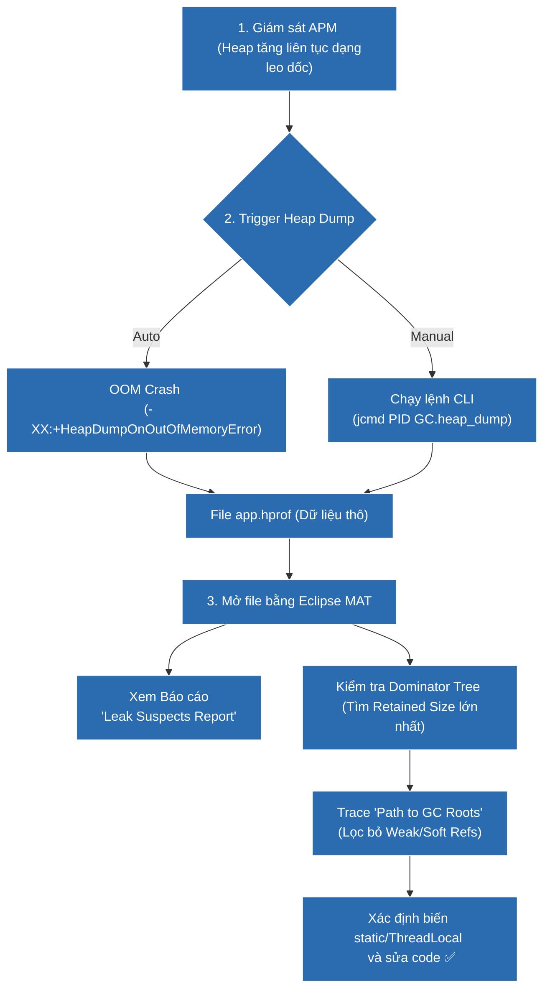

# Làm sao phân tích memory leak trong ứng dụng Java?

## ⚡ Tóm tắt ngắn (30s)
* **Quy trình chuẩn 3 bước**: (1) **Monitor & Detect** (Giám sát qua APM/Grafana thấy đồ thị Heap dạng răng cưa đi lên không hồi phục), (2) **Capture Heap Dump** (Chụp ảnh bộ nhớ bằng `jcmd` hoặc `jmap`), (3) **Analyze** (Dùng Eclipse MAT, JProfiler phân tích các đối tượng giữ nhiều Retained Size nhất).
* **Khái niệm cốt lõi**:
  * **Shallow Size**: Kích thước bộ nhớ vật lý của chính đối tượng đó (không tính các đối tượng mà nó trỏ tới).
  * **Retained Size**: Tổng dung lượng bộ nhớ được giải phóng nếu đối tượng đó bị GC thu gom (bao gồm toàn bộ cây tham chiếu phụ thuộc).
* **Bản chất phân tích**: Tìm đường dẫn tham chiếu ngược dài nhất từ đối tượng nghi ngờ rò rỉ tới các **GC Roots** (Path to GC Roots) loại trừ các Weak/Soft references.

---

## 🔍 Chi tiết bản chất

### Bước 1: Phát hiện rò rỉ (Monitoring)
* Đồ thị bộ nhớ bình thường sẽ có dạng răng cưa dao động liên tục: Heap tăng lên -> GC chạy -> Heap giảm sâu về mức nền ổn định.
* Khi có rò rỉ bộ nhớ, mức nền sau mỗi đợt Major GC/Full GC liên tục leo dốc (Heap Usage Baseline tăng dần) cho tới khi tiệm cận giới hạn Max Heap (`-Xmx`).

### Bước 2: Tạo Heap Dump (Capturing)
Heap Dump là file nhị phân định dạng `.hprof` chứa toàn bộ thông tin đối tượng trên Heap tại thời điểm chụp.
* **Cách 1 (Tự động khi lỗi xảy ra)**: Thêm tham số khởi chạy JVM để tự động chụp dump khi crash:
  `-XX:+HeapDumpOnOutOfMemoryError -XX:HeapDumpPath=/var/dumps/app.hprof`
* **Cách 2 (Chụp thủ công khi hệ thống đang chạy)**:
  Sử dụng `jcmd` (được khuyến nghị bởi Oracle vì an toàn và nhẹ hơn `jmap` cũ):
  `jcmd <PID> GC.heap_dump /var/dumps/live_app.hprof`

### Bước 3: Phân tích Heap Dump (Analyzing)
Sử dụng công cụ mã nguồn mở **Eclipse Memory Analyzer Tool (MAT)**:
1. **Histogram**: Liệt kê số lượng instances và dung lượng bộ nhớ của từng Class. Tìm class có số lượng instance tăng đột biến bất thường.
2. **Dominator Tree**: Biểu diễn cây phân quyền sở hữu bộ nhớ. Đối tượng nằm ở đỉnh cây chiếm giữ (Retained Size) nhiều bộ nhớ nhất. Đây thường là các đối tượng Cache, Connection Pool hoặc static collections.
3. **Path to GC Roots**: Click chuột phải vào đối tượng nghi ngờ, chọn `Path to GC Roots -> exclude all phantom/weak/soft references`. MAT sẽ hiển thị đường link tham chiếu mạnh duy nhất khiến GC không thể dọn dẹp đối tượng này.

---

## 🎨 Sơ đồ quy trình phân tích và khoanh vùng Memory Leak



---

## 💻 Code Example

### BAD ❌ (Chụp Heap dump bằng lệnh nguy hiểm trên production có Heap quá lớn)
```bash
# ❌ Tệ: Sử dụng jmap với cờ -F (Force) hoặc jmap -dump:live khi heap lớn (>64GB).
# Lệnh này sẽ ép dừng hoàn toàn JVM (Stop-The-World) cực lâu, làm đứt toàn bộ kết nối active
# của khách hàng và có thể khiến Kubernetes lầm tưởng pod bị đơ rồi tự động kill pod.
jmap -dump:live,format=b,file=heap.bin 1245
```

### GOOD ✅ (Sử dụng các công cụ hiện đại và an toàn để monitor và dump)
```bash
# ✅ Tốt: Sử dụng jcmd được khuyên dùng cho các phiên bản Java hiện đại (Java 8 -> 21)
# jcmd thực thi trực tiếp thông qua cơ chế chẩn đoán nội bộ của JVM, hoạt động mượt mà hơn.
jcmd 1245 GC.heap_dump /var/dumps/secure_app.hprof

# ✅ Hoặc tốt hơn: Sử dụng JVM tool Arthas (của Alibaba) để kiểm tra memory trực tiếp 
# mà không cần chụp toàn bộ heap dump khổng lồ làm treo hệ thống:
# arthas: vmtool --action forceGc
# arthas: dashboard
```

---

## 📊 Trade-off Analysis: So sánh phương pháp chụp Dump

| Phương pháp | Lợi ích | Chi phí đánh đổi |
| :--- | :--- | :--- |
| **Heap Dump thủ công (`jcmd`/`jmap`)** | Cung cấp cái nhìn toàn vẹn 100% về mọi đối tượng, địa chỉ và giá trị của biến tại thời điểm chụp. | Gây treo ứng dụng (STW) trong vài giây đến vài phút tùy dung lượng Heap. Dung lượng file dump rất lớn (bằng kích thước Heap vật lý). |
| **Heap Profiling qua JVM Agent (JProfiler/sampling)** | Thu thập dữ liệu liên tục theo thời gian thực (Time-series), theo dõi được sự thay đổi động của cấp phát bộ nhớ. | Gây suy giảm hiệu năng ứng dụng khoảng 5% - 15% (Performance Overhead) do phải ghi nhận log liên tục. |
| **VMTool / OQL Query trực tiếp** | Truy vấn trực tiếp các đối tượng sống trên Heap bằng ngôn ngữ SQL-like mà không cần dump ra file ổ cứng. | Đòi hỏi lập trình viên phải hiểu sâu cấu trúc JVM và câu lệnh truy vấn phức tạp. |

---

## ⚠️ Common Gotchas & Questions follow-up
1. **Lỗi MAT không hiển thị đúng bản chất do rò rỉ Native Memory**:
   Eclipse MAT chỉ phân tích được bộ nhớ thuộc quản lý của JVM Heap. Nếu ứng dụng bị rò rỉ bộ nhớ native (như DirectByteBuffer sử dụng trong Netty, gRPC, hoặc thư viện C/C++ nạp qua JNI), MAT sẽ báo cáo Heap hoàn toàn bình thường. Lúc này bắt buộc phải dùng các công cụ giám sát tầng OS như **jemalloc**, **Valgrind** hoặc cờ JVM `-XX:NativeMemoryTracking=detail`.
2. 👉 **Câu hỏi đào sâu từ interviewer**: *Thế nào là 'GC Roots' và tại sao một biến Local trong Stack frame lại là một GC Root chỉ mang tính tạm thời?*
   * *(Trả lời: GC Root là điểm xuất phát của luồng kiểm tra dọn rác. Một biến local nằm trong Stack frame là GC Root **chỉ khi phương thức chứa nó đang được thực thi**. Ngay khi phương thức return, Stack frame bị pop ra khỏi Call Stack, biến local đó biến mất, mối nối GC Root bị đứt hoàn toàn và các đối tượng chỉ được liên kết bởi nó sẽ lập tức đủ điều kiện để bị thu gom ở đợt GC tiếp theo).*