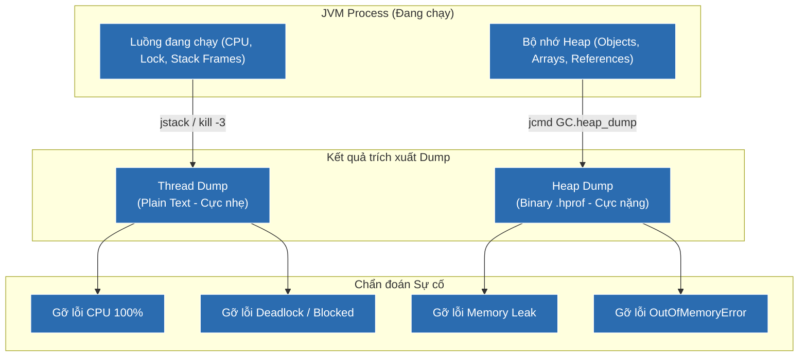

# So sánh chi tiết Thread Dump và Heap Dump trong chẩn đoán sự cố JVM

## ⚡ Tóm tắt ngắn (30s)
* **Thread Dump** là ảnh chụp trạng thái hoạt động của **tất cả các luồng (Threads)** tại một thời điểm. Nó cho biết Call Stack (luồng đang chạy dòng code nào), trạng thái luồng (RUNNABLE, WAITING, BLOCKED) và thông tin về khóa (locks). Dùng để debug **CPU High, Deadlocks, ứng dụng bị treo, Thread Leak**.
* **Heap Dump** là ảnh chụp toàn bộ **đối tượng trên bộ nhớ Heap** tại một thời điểm. Nó chứa thông tin chi tiết về kích thước đối tượng, nội dung dữ liệu và các liên kết tham chiếu. Dùng để debug **Memory Leak, lỗi OutOfMemoryError (OOM), mức tiêu thụ RAM bất thường**.

---

## 🔍 Chi tiết bản chất

### 1. Bản chất kỹ thuật của Thread Dump
* **Định dạng**: Văn bản thuần túy (Plain text), dung lượng cực kỳ nhỏ (vài trăm KB).
* **Nội dung**: Danh sách toàn bộ Thread của JVM. Mỗi thread hiển thị tên, độ ưu tiên, thread ID (tid), native ID (nid), trạng thái luồng và Call Stack chi tiết đến từng số dòng code.
* **Thời gian chụp**: Cực kỳ nhanh (dưới 100ms), không gây gián đoạn hay ảnh hưởng đáng kể tới hiệu năng hệ thống. Có thể chụp nhiều lần liên tục (ví dụ 3 lần cách nhau 5 giây) để theo dõi sự chuyển dịch trạng thái luồng.
* **Cách tạo**: `jstack <PID>`, `jcmd <PID> Thread.print`, hoặc gửi tín hiệu `kill -3 <PID>` trên Linux.

### 2. Bản chất kỹ thuật của Heap Dump
* **Định dạng**: Nhị phân (Binary - hprof), dung lượng khổng lồ (bằng kích thước bộ nhớ RAM thực tế đang dùng, có thể lên tới hàng chục GB).
* **Nội dung**: Danh sách tất cả Class, số lượng instances, dung lượng bộ nhớ vật lý của chúng, giá trị của các trường nguyên thủy và cấu trúc tham chiếu chéo giữa các đối tượng.
* **Thời gian chụp**: Lâu (từ vài giây đến vài phút tùy dung lượng Heap). JVM sẽ bị treo hoàn toàn (Stop-The-World) để đảm bảo tính toàn vẹn của dữ liệu bộ nhớ tại thời điểm chụp.
* **Cách tạo**: `-XX:+HeapDumpOnOutOfMemoryError` hoặc `jcmd <PID> GC.heap_dump <file_path>`.

---

## 🎨 Sơ đồ so sánh nguồn dữ liệu trích xuất từ JVM



---

## 💻 Code Example

### BAD ❌ (Mã đồng bộ hóa thô sơ dễ dẫn tới Deadlock khóa luồng vĩnh viễn)
```java
public class DeadlockDemo {
    private static final Object lockA = new Object();
    private static final Object lockB = new Object();

    public void processMethod1() {
        synchronized (lockA) {
            System.out.println("Thread 1: Giữ lock A...");
            try { Thread.sleep(50); } catch (InterruptedException e) {}
            synchronized (lockB) { // ❌ Có nguy cơ bị kẹt nếu Thread 2 đang giữ Lock B
                System.out.println("Thread 1: Giữ lock B...");
            }
        }
    }

    public void processMethod2() {
        synchronized (lockB) {
            System.out.println("Thread 2: Giữ lock B...");
            try { Thread.sleep(50); } catch (InterruptedException e) {}
            synchronized (lockA) { // ❌ Gây ra Deadlock chéo giữa 2 luồng!
                System.out.println("Thread 2: Giữ lock A...");
            }
        }
    }
}
```

### GOOD ✅ (Cách phân tích Deadlock bằng thông tin đọc từ Thread Dump)
```text
// Trích xuất Thread Dump chụp được qua 'jstack' cho thấy cấu trúc Deadlock rõ ràng:
Found one Java-level deadlock:
=============================
"Thread-1":
  waiting to lock monitor 0x0000018f67c8b900 (object 0x0000000715cf48e8, a java.lang.Object),
  which is held by "Thread-2"
"Thread-2":
  waiting to lock monitor 0x0000018f67c8ba00 (object 0x0000000715cf48d8, a java.lang.Object),
  which is held by "Thread-1"

Java stack information for the threads listed above:
===================================================
"Thread-1":
    at DeadlockDemo.processMethod1(DeadlockDemo.java:12)
    - waiting to lock <0x0000000715cf48e8> (a java.lang.Object)
    - locked <0x0000000715cf48d8> (a java.lang.Object)
"Thread-2":
    at DeadlockDemo.processMethod2(DeadlockDemo.java:22)
    - waiting to lock <0x0000000715cf48d8> (a java.lang.Object)
    - locked <0x0000000715cf48e8> (a java.lang.Object)

// ✅ Khắc phục: Sắp xếp lại thứ tự lock đồng nhất (Acquire locks in a consistent order)
// hoặc sử dụng tryLock() có thời gian timeout của java.util.concurrent.locks.ReentrantLock.
```

---

## 📊 Bảng so sánh toàn diện: Thread Dump vs Heap Dump

| Tiêu chí | Thread Dump | Heap Dump |
| :--- | :--- | :--- |
| **Dung lượng file** | Siêu nhẹ (vài trăm KB). | Rất nặng (bằng hoặc lớn hơn dung lượng Heap đang dùng). |
| **Thời gian tạo** | Tức thời (< 100ms). | Lâu (vài giây đến vài phút). |
| **Ảnh hưởng hệ thống** | Không đáng kể. | Gây dừng toàn bộ ứng dụng (STW) tạm thời. |
| **Độ khó phân tích** | Dễ, có thể đọc bằng mắt thường hoặc các web tool nhẹ. | Khó, bắt buộc dùng các tool chuyên dụng (MAT, JProfiler). |
| **Vấn đề giải quyết** | - CPU tăng vọt 100%<br>- Trạng thái luồng bị treo (Deadlock, Blocked)<br>- Thread leaks (số lượng thread tăng vô hạn). | - Tràn bộ nhớ (OutOfMemoryError)<br>- Phân tích rò rỉ bộ nhớ (Memory Leak)<br>- Tối ưu hóa cấu trúc dữ liệu thừa trên RAM. |

---

## ⚠️ Common Gotchas & Questions follow-up
1. **Lầm tưởng "Thread Dump chụp lúc nào cũng được"**:
   Vì Thread Dump là ảnh chụp tức thời (Snapshot), nếu bạn gặp vấn đề CPU tăng vọt bất chợt rồi giảm ngay lập tức, việc chụp Thread Dump trễ sẽ không ghi nhận được nguyên nhân. Bạn cần thiết lập công cụ chụp tự động hoặc chụp liên tục cách nhau mỗi 3-5 giây để có chuỗi lịch sử di chuyển trạng thái luồng.
2. 👉 **Câu hỏi đào sâu từ interviewer**: *Nếu ứng dụng bị treo nhưng Thread Dump không ghi nhận bất kỳ dòng BLOCKED nào, điều gì đang thực sự diễn ra?*
   * *(Trả lời: Ứng dụng có thể đang rơi vào trạng thái **Busy-wait (Live Lock)** hoặc **Infinite Loop** ở một luồng RUNNABLE, hoặc tất cả các luồng xử lý đều đang ở trạng thái **WAITING** do đợi dữ liệu phản hồi từ một API bên thứ ba hoặc Database mà không cấu hình thời gian kết nối tối đa - Connection Timeout).*