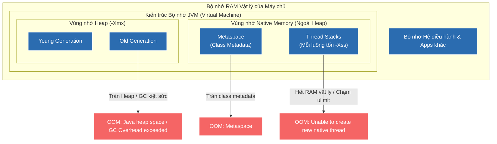

# Các loại OutOfMemoryError phổ biến trong Java và phương pháp giải quyết

## ⚡ Tóm tắt ngắn (30s)
* **OutOfMemoryError (OOM)** xảy ra khi máy ảo JVM không thể cấp phát thêm bộ nhớ vật lý cho đối tượng dù đã chạy hết pha thu gom rác tối đa.
* **5 loại OOM phổ biến nhất**:
  1. `java.lang.OutOfMemoryError: Java heap space`: Tràn bộ nhớ Heap do memory leak hoặc tải dữ liệu quá tải so với cấu hình `-Xmx`.
  2. `java.lang.OutOfMemoryError: GC Overhead limit exceeded`: GC chạy liên tục chiếm >98% thời gian CPU nhưng giải phóng <2% heap rác (hiệu năng sụp đổ).
  3. `java.lang.OutOfMemoryError: Metaspace`: Tràn vùng nhớ Native lưu trữ metadata của class (do nạp class động vô hạn).
  4. `java.lang.OutOfMemoryError: Unable to create new native thread`: Hệ điều hành hoặc JVM hết khả năng tạo thêm luồng vật lý mới.
  5. `java.lang.OutOfMemoryError: Requested array size exceeds VM limit`: Cố gắng khởi tạo mảng có số lượng phần tử vượt quá giới hạn lý thuyết tối đa của JVM.

---

## 🔍 Chi tiết bản chất

### 1. `Java heap space`
* **Cơ chế**: Vùng nhớ Heap dành cho lưu trữ đối tượng nghiệp vụ bị cạn kiệt hoàn toàn. 
* **Nguyên nhân**: Lập trình viên truy vấn lấy lên hàng triệu dòng dữ liệu từ database cùng lúc thay vì phân trang, hoặc do rò rỉ bộ nhớ dài hạn khiến Old Generation đầy 100%.

### 2. `GC Overhead limit exceeded`
* **Cơ chế**: Đây là cơ chế bảo vệ chủ động của JVM nhằm tránh việc hệ thống bị treo đơ vô ích khi dọn rác.
* **Nguyên nhân**: Bộ nhớ Heap thực chất đã đầy gần như 100%. GC chạy kiệt quệ liên tục trong 5 chu kỳ liên tiếp nhưng lượng bộ nhớ dọn sạch được cực kỳ ít ỏi. JVM quyết định ném lỗi này để quản trị viên can thiệp sớm thay vì để dịch vụ chạy trong trạng thái đơ lag nghiêm trọng.

### 3. `Metaspace`
* **Cơ chế**: Metaspace nằm ở Native Memory (ngoài Heap). Lỗi này xảy ra khi dung lượng lưu thông tin Class vượt quá giới hạn đặt bởi `-XX:MaxMetaspaceSize`.
* **Nguyên nhân**: Hệ thống sử dụng quá nhiều thư viện Dynamic Code Generation (như Spring AOP, Hibernate CGLIB, Jasper Reports) tạo ra vô hạn các class động ở runtime mà classloader không bao giờ unload.

### 4. `Unable to create new native thread`
* **Cơ chế**: Mỗi khi `new Thread()` trong Java, JVM sẽ gửi yêu cầu xuống hệ điều hành (OS) để cấp phát một luồng vật lý thực thụ (Native Thread).
* **Nguyên nhân**:
  * Bộ nhớ RAM vật lý ngoài Heap của máy chủ đã bị cạn kiệt, không đủ cấp phát bộ nhớ stack mặc định cho luồng mới (mặc định 1MB/thread).
  * Chạm giới hạn tối đa số lượng thread của hệ điều hành Linux (cấu hình bởi `ulimit -u` hoặc `/proc/sys/kernel/threads-max`).

---

## 🎨 Sơ đồ phân vùng kiến trúc bộ nhớ JVM và các điểm xảy ra lỗi OOM



---

## 💻 Code Example

### BAD ❌ (Khởi tạo luồng thủ công không giới hạn gây sập máy chủ hệ thống)
```java
public class BadThreadSpawner {
    public void executeTaskConcurrently() {
        // ❌ Tệ: Khởi tạo luồng trực tiếp bằng vòng lặp vô hạn mà không dùng Thread Pool.
        // Hệ thống sẽ nhanh chóng cạn kiệt tài nguyên native của OS và ném lỗi 
        // "Unable to create new native thread", làm crash toàn bộ hệ thống microservices.
        while (true) {
            new Thread(() -> {
                try {
                    Thread.sleep(Long.MAX_VALUE); // Giữ luồng sống vĩnh viễn
                } catch (InterruptedException e) {
                    Thread.currentThread().interrupt();
                }
            }).start();
        }
    }
}
```

### GOOD ✅ (Sử dụng ThreadPoolExecutor giới hạn số luồng và hàng đợi an toàn)
```java
public class SecureExecutorService {
    // ✅ Tốt: Thay vì tạo luồng vô hạn, ta quản lý tài nguyên bằng Thread Pool cấu hình chặt chẽ.
    // Sử dụng LinkedBlockingQueue có giới hạn capacity để tránh tràn Heap.
    private final ExecutorService executor = new ThreadPoolExecutor(
        10,                                     // Core Pool Size (Số luồng tối thiểu)
        50,                                     // Maximum Pool Size (Giới hạn trần số luồng)
        60L, TimeUnit.SECONDS,                 // Thời gian thu hồi luồng nhàn rỗi
        new LinkedBlockingQueue<>(1000),       // ✅ Giới hạn hàng đợi tối đa 1000 tasks tránh OOM
        new ThreadPoolExecutor.CallerRunsPolicy() // Chiến lược xử lý khi hàng đợi đầy
    );

    public void submitTask(Runnable task) {
        executor.submit(task);
    }
}
```

---

## 📊 Trade-off Analysis: Tăng Heap (-Xmx) vs Tối ưu hóa Code khi gặp OOM

| Hành động khắc phục | Lợi ích mang lại | Chi phí đánh đổi |
| :--- | :--- | :--- |
| **Tăng Heap size (`-Xmx`)** | Nhanh chóng, đơn giản, chỉ cần thay đổi tham số khởi chạy của JVM mà không cần sửa đổi hay test lại mã nguồn. | Nếu là rò rỉ bộ nhớ (Memory Leak), tăng Heap chỉ giúp trì hoãn thời gian nổ OOM. Heap càng lớn thì thời gian dừng GC (STW) càng lâu và file Heap dump càng nặng, cực kỳ khó phân tích. |
| **Tối ưu hóa mã nguồn (Phân trang dữ liệu, đóng connection, hủy static)** | Giải quyết triệt để tận gốc rễ vấn đề, hệ thống chạy mượt mà, ổn định trên hạ tầng tiết kiệm tài nguyên. | Tốn nhiều thời gian và chi phí của kỹ sư để profiling bộ nhớ, tìm bug, tái cấu trúc mã nguồn và chạy lại toàn bộ hệ thống test hồi quy. |

---

## ⚠️ Common Gotchas & Questions follow-up
1. **Gotcha nguy hiểm khi cấu hình MaxMetaspaceSize**:
   Mặc định JVM không giới hạn kích thước tối đa của Metaspace (nó có thể nở to cho tới khi ăn hết toàn bộ RAM vật lý của server). Trong môi trường Docker Container, nếu không cấu hình giới hạn `-XX:MaxMetaspaceSize`, tiến trình Java sẽ phình to vượt quá RAM giới hạn của Container, hệ điều hành sẽ kích hoạt trình diệt **Linux OOM Killer** và lập tức tắt ngóm ứng dụng Java mà không để lại bất kỳ file dump hay log lỗi JVM nào.
2. 👉 **Câu hỏi đào sâu từ interviewer**: *JVM xử lý thế nào khi một Thread bị lỗi OutOfMemoryError? Có phải toàn bộ JVM sẽ crash sập ngay lập tức?*
   * *(Trả lời: **Không**. Khi lỗi OutOfMemoryError xảy ra ở một Thread nghiệp vụ, JVM chỉ ném exception đó lên Call Stack của riêng Thread đó. Nếu Thread đó không bắt exception, nó sẽ chết và giải phóng toàn bộ bộ nhớ Stack và một phần Heap mà nó đang giữ. JVM vẫn tiếp tục hoạt động bình thường ở các Thread khác. Tuy nhiên, nếu OOM xảy ra ở luồng hệ thống cốt lõi (như GC Thread) hoặc gây hỏng cấu trúc bộ nhớ dùng chung, JVM mới bị crash hoàn toàn).*