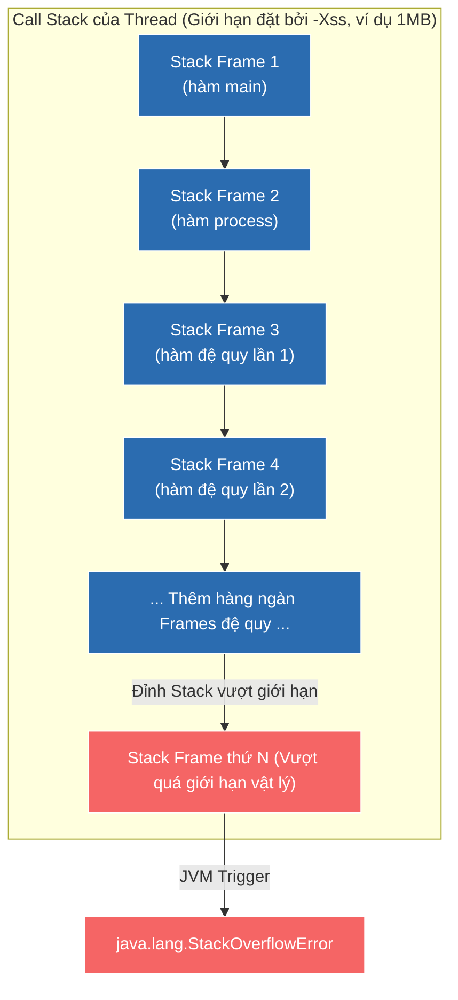

# Giải mã cơ chế xảy ra lỗi StackOverflowError trong Java

## ⚡ Tóm tắt ngắn (30s)
* **StackOverflowError** xảy ra khi bộ nhớ **Call Stack** dành riêng cho một luồng (Thread) bị cạn kiệt dung lượng cấp phát.
* **Bản chất**: Mỗi khi một Thread thực hiện gọi một phương thức, JVM sẽ tự động push một cấu trúc dữ liệu gọi là **Stack Frame** (chứa local variables, method arguments, return address) vào Call Stack của Thread đó. Nếu các phương thức liên tục gọi lồng nhau (đặc biệt là đệ quy vô hạn hoặc lồng quá sâu) mà không return, Call Stack sẽ vượt ngưỡng trần kích thước cấu hình bởi tham số `-Xss` của JVM.
* **Nguyên nhân điển hình**: Thuật toán đệ quy thiếu điều kiện dừng hoặc điều kiện dừng bị sai lệch, cấu trúc thực thể dữ liệu bị tham chiếu vòng vô hạn khi tự động serialize (JSON/ToString).

---

## 🔍 Chi tiết bản chất

### 1. Kiến trúc của Call Stack và Stack Frame
Bộ nhớ JVM chia thành 2 phân vùng chính phục vụ thực thi: Heap (dùng chung cho mọi thread để chứa object) và Stack (mỗi thread có 1 Stack riêng biệt, bảo mật và cực kỳ nhanh).
* Kích thước của mỗi Stack được thiết lập cố định ngay khi khởi tạo Thread thông qua cờ `-Xss` (thường mặc định là 1MB).
* Mỗi **Stack Frame** chứa:
  * **Local Variable Table**: Lưu các biến cục bộ nguyên thủy (int, float...) và các địa chỉ con trỏ trỏ tới Heap của đối tượng.
  * **Operand Stack**: Vùng làm việc trung gian của CPU để thực hiện các phép toán logic.
  * **Frame Data**: Lưu trữ thông tin trả về của phương thức (Return Address) và liên kết động (Dynamic Linking).

### 2. Tiến trình tràn Stack
Khi luồng liên tục chạy sâu vào các phương thức con mà chưa có phương thức nào kết thúc để thực hiện thao tác **Pop** (loại bỏ Frame khỏi Stack), Stack sẽ phình to liên tục. Ngay khi con trỏ đỉnh Stack vượt quá giới hạn biên được cấu hình, CPU sẽ kích hoạt ngắt phần cứng, JVM lập tức chặn đứng dòng thực thi và ném ra ngoại lệ `java.lang.StackOverflowError`.

---

## 🎨 Sơ đồ cấu trúc bộ nhớ Stack và hiện tượng tràn Stack Frame



---

## 💻 Code Example

### BAD ❌ (Đệ quy vô hạn do lỗi tham chiếu vòng tự động sinh chuỗi String)
```java
public class CyclicDependencyDemo {
    public static class User {
        public String name;
        public Order order;

        public User(String name) { this.name = name; }

        // ❌ Tệ: Override toString() tự động in thông tin Order.
        // Nếu Order cũng gọi toString() của User, ta sẽ rơi vào vòng lặp gọi hàm vô hạn
        // làm tràn Stack lập tức khi in log.
        @Override
        public String toString() {
            return "User{name='" + name + "', order=" + order + "}";
        }
    }

    public static class Order {
        public int id;
        public User user;

        public Order(int id, User user) {
            this.id = id;
            this.user = user;
        }

        @Override
        public String toString() {
            return "Order{id=" + id + ", user=" + user + "}";
        }
    }

    public static void main(String[] args) {
        User user = new User("Alex");
        Order order = new Order(101, user);
        user.order = order; // Tạo tham chiếu vòng chéo

        System.out.println(user); // ❌ Crash: java.lang.StackOverflowError
    }
}
```

### GOOD ✅ (Chuyển đổi thuật toán sang phong cách duyệt lặp Iterative hoặc phá vỡ tham chiếu vòng)
```java
public class SecureToStringDemo {
    public static class User {
        public String name;
        public Order order;

        public User(String name) { this.name = name; }

        // ✅ Tốt: Loại bỏ việc in sâu toàn bộ Object liên kết để cắt chuỗi tham chiếu vòng.
        // Chỉ in thông tin định danh của thực thể liên quan.
        @Override
        public String toString() {
            return "User{name='" + name + "', orderId=" + (order != null ? order.id : "null") + "}";
        }
    }

    public static class Order {
        public int id;
        public User user;

        public Order(int id, User user) {
            this.id = id;
            this.user = user;
        }

        @Override
        public String toString() {
            return "Order{id=" + id + ", userName=" + (user != null ? user.name : "null") + "}";
        }
    }

    public static void main(String[] args) {
        User user = new User("Alex");
        Order order = new Order(101, user);
        user.order = order;

        System.out.println(user); // ✅ Chạy thành công mượt mà!
    }
}
```

---

## 📊 Trade-off Analysis: Tinh chỉnh cấu hình kích thước Thread Stack Size (-Xss)

| Kích thước cấu hình `-Xss` | Lợi ích mang lại | Chi phí đánh đổi |
| :--- | :--- | :--- |
| **Kích thước nhỏ** (ví dụ `-Xss256k`) | Cho phép JVM khởi tạo được nhiều Thread đồng thời hơn trên cùng một dung lượng RAM vật lý của server. Cực kỳ tối ưu cho các ứng dụng Microservices chạy hàng nghìn threads đồng thời. | Call Stack nông. Các nghiệp vụ sử dụng thư viện xử lý XML lớn, gọi lồng framework Spring sâu hoặc thuật toán đệ quy phức tạp sẽ rất dễ bị lỗi StackOverflow. |
| **Kích thước lớn** (ví dụ `-Xss4m`) | Đảm bảo hệ thống vận hành cực kỳ an sau trước các chuỗi gọi hàm sâu của các thư viện lớn, hỗ trợ thuật toán đệ quy phức tạp chạy mượt mà. | Tốn nhiều RAM vật lý ngoài heap. Tổng số lượng Thread tối đa có thể khởi chạy đồng thời của ứng dụng sẽ bị sụt giảm mạnh (dễ gặp lỗi OOM Native). |

---

## ⚠️ Common Gotchas & Questions follow-up
1. **Lầm tưởng "Tăng Heap size (-Xmx) sẽ giúp giảm StackOverflowError"**:
   Đây là tư duy sai lầm kinh điển. Heap và Stack là hai vùng nhớ hoạt động hoàn toàn độc lập trong kiến trúc JVM. Việc tăng `-Xmx` không hề giúp tăng kích thước Call Stack của luồng. Ngược lại, Heap càng chiếm dụng nhiều RAM vật lý thì hệ điều hành càng có ít bộ nhớ native hơn để cấp phát Stack cho các luồng mới, làm giảm số lượng thread tối đa.
2. 👉 **Câu hỏi đào sâu từ interviewer**: *Java có cơ chế tối ưu hóa đệ quy đuôi (Tail Call Optimization - TCO) giống như Scala hay Kotlin để tránh StackOverflow không?*
   * *(Trả lời: **Mặc định là không**. Trình biên dịch chuẩn của HotSpot JVM hiện tại không tự động biên dịch mã đệ quy đuôi thành vòng lặp phẳng ở tầng bytecode do JVM cần bảo toàn cấu trúc Call Stack hoàn chỉnh phục vụ cho cơ chế bảo mật (Security Access Control) và ghi log Stack Trace chính xác khi xảy ra exception).*