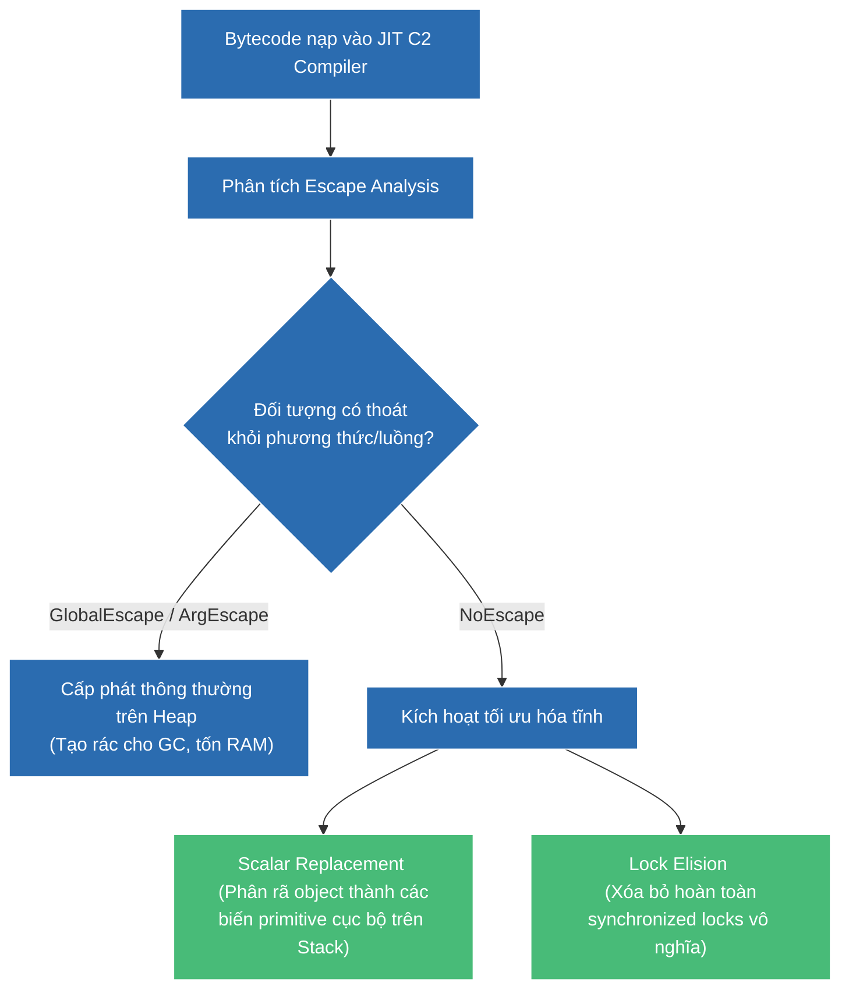

# Giải mã Escape Analysis — Vũ khí tối ưu hóa hiệu năng đỉnh cao của JIT Compiler

## ⚡ Tóm tắt ngắn (30s)
* **Escape Analysis (Phân tích thoát)** là một kỹ thuật tối ưu hóa tĩnh diễn ra ở tầng **JIT Compiler (C2)** của JVM, chứ không phải ở trình biên dịch `javac`.
* **Bản chất**: JIT Compiler sẽ phân tích mã nguồn đang chạy để xác định xem phạm vi tham chiếu (Scope) của một đối tượng được tạo ra trong một phương thức có bị "thoát" (escape) ra ngoài phạm vi của phương thức hoặc luồng (Thread) đó hay không.
* **3 cấp độ thoát của Object**:
  1. `GlobalEscape`: Đối tượng thoát ra phạm vi luồng hiện tại (ví dụ: gán vào static field, return từ method, hoặc lưu trong instance field của class dùng chung).
  2. `ArgEscape`: Đối tượng thoát qua đối số truyền vào khi gọi phương thức khác (nhưng không thoát ra toàn cục).
  3. `NoEscape`: Đối tượng bị giới hạn hoàn toàn bên trong phương thức khởi tạo ra nó.
* **Các tối ưu hóa đỉnh cao khi đạt `NoEscape`**:
  * **Scalar Replacement (Thay thế vô hướng)**: Phân rã đối tượng thành các biến nguyên thủy đơn lẻ trên Stack frame, triệt tiêu hoàn toàn việc khởi tạo object trên Heap.
  * **Lock Elision (Loại bỏ khóa)**: Bỏ qua hoàn toàn các từ khóa `synchronized` của đối tượng nếu nó không bao giờ thoát ra ngoài luồng hiện tại.

---

## 🔍 Chi tiết bản chất

### 1. Cơ chế hoạt động của Scalar Replacement
Mọi người thường nghĩ khi Escape Analysis phát hiện đối tượng không thoát, nó sẽ tiến hành cấp phát toàn bộ đối tượng đó trên Stack (Stack Allocation). Thực tế, HotSpot JVM làm một cách thông minh hơn: **Scalar Replacement**.
* **Scalar (Vô hướng)**: Là một biến nguyên thủy không thể chia nhỏ hơn nữa (như `int`, `double`, `boolean`).
* **Aggregate (Tích hợp)**: Là một Object chứa nhiều thuộc tính bên trong.
* Khi JIT xác định một object đạt trạng thái `NoEscape`, nó sẽ không tạo ra object đó trên Heap nữa. Thay vào đó, JIT chuyển đổi các thuộc tính bên trong object thành các biến nguyên thủy cục bộ và lưu trực tiếp trên **Stack Frame** (hoặc lưu trên thanh ghi CPU - registers).
* **Lợi ích**: Tiết kiệm 100% chi phí xin cấp phát bộ nhớ trên Heap, không tốn tài nguyên quản lý đầu mục đối tượng của JVM, và hoàn toàn không tạo ra bất kỳ một mảnh rác nào cho Garbage Collector dọn dẹp.

### 2. Cơ chế hoạt động của Lock Elision (Biệt lập luồng)
Nếu lập trình viên sử dụng các lớp Thread-safe như `StringBuffer` hay `Vector` trong phạm vi cục bộ của một phương thức:
* Mặc dù các phương thức bên trong `StringBuffer` đều có từ khóa `synchronized`, JIT Compiler sau khi thực hiện Escape Analysis nhận thấy đối tượng StringBuffer này đạt `NoEscape` (chỉ có luồng hiện tại thao tác được).
* JIT sẽ tự động **xóa bỏ hoàn toàn mã khóa lock/unlock** (Lock Elision) khi biên dịch sang mã máy vật lý, giúp tăng tốc độ thực thi lên gấp nhiều lần.

---

## 🎨 Sơ đồ xử lý tối ưu hóa của JIT Compiler qua Escape Analysis



---

## 💻 Code Example

### BAD ❌ (Mã cản trở Escape Analysis do cố tình return dữ liệu không cần thiết)
```java
public class LeakyObjectDemo {
    public static class Coordinate {
        public int x;
        public int y;
        public Coordinate(int x, int y) { this.x = x; this.y = y; }
    }

    // ❌ Tệ: Phương thức tính toán khoảng cách khoảng cách nhưng lại return nguyên cả Object Coordinate.
    // Việc return này làm đối tượng bị gán nhãn 'GlobalEscape'. 
    // JIT bắt buộc phải khởi tạo đối tượng Coordinate trên Heap, sinh ra rác liên tục trong vòng lặp.
    public Coordinate calculateOffset(int base, int step) {
        Coordinate coord = new Coordinate(base + step, base * step);
        return coord; 
    }

    public int getCombinedDistance() {
        int sum = 0;
        for (int i = 0; i < 100_000_000; i++) {
            Coordinate c = calculateOffset(i, 2);
            sum += c.x + c.y; // Thực tế ta chỉ cần giá trị tổng, không cần giữ object Coordinate
        }
        return sum;
    }
}
```

### GOOD ✅ (Mã cục bộ hóa cao độ giúp JIT kích hoạt Scalar Replacement thành công)
```java
public class OptimizedObjectDemo {
    public static class Coordinate {
        public int x;
        public int y;
        public Coordinate(int x, int y) { this.x = x; this.y = y; }
    }

    // ✅ Tốt: Viết mã theo dạng inline hoặc giữ scope của Coordinate hoàn toàn cục bộ 
    // bên trong phương thức tính toán.
    // Khi JIT thực thi và Inline phương thức này, nó nhận diện đối tượng 'Coordinate' đạt 'NoEscape'.
    // JIT sẽ phân rã hoàn toàn 'Coordinate c' thành 2 biến cục bộ primitive: 'int c_x' và 'int c_y' trên Stack.
    // 100 triệu vòng lặp sẽ chạy với hiệu năng thô tuyệt đối, không cấp phát bất kỳ object nào trên Heap!
    public int getCombinedDistance() {
        int sum = 0;
        for (int i = 0; i < 100_000_000; i++) {
            // Đối tượng Coordinate được giới hạn scope chặt chẽ trong vòng lặp:
            Coordinate c = new Coordinate(i + 2, i * 2);
            sum += c.x + c.y;
        }
        return sum;
    }
}
```

---

## 📊 Trade-off Analysis: Bật (-XX:+DoEscapeAnalysis) vs Tắt tối ưu hóa

| Cấu hình JVM | Lợi ích mang lại | Chi phí đánh đổi |
| :--- | :--- | :--- |
| **Bật Escape Analysis** (Mặc định từ Java 6) | - Hiệu năng xử lý tăng vọt đột phá.<br>- Giảm tải áp lực dọn rác cực lớn cho GC.<br>- Giảm tối đa chi phí đồng bộ hóa locks luồng. | JIT C2 Compiler phải tiêu tốn thêm thời gian phân tích đồ thị luồng dữ liệu (Warm-up phase của JVM tốn nhiều CPU hơn). |
| **Tắt Escape Analysis** (`-XX:-DoEscapeAnalysis`) | Rút ngắn thời gian warm-up biên dịch ban đầu của ứng dụng Java. | Ứng dụng chạy chậm hơn, ngốn rất nhiều RAM Heap cho các đối tượng tạm thời ngắn hạn, kích hoạt GC chạy dày đặc hơn. |

---

## ⚠️ Common Gotchas & Questions follow-up
1. **Lầm tưởng "Mọi đối tượng nhỏ không thoát đều được Scalar Replacement"**:
   Không phải lúc nào JIT cũng kích hoạt tối ưu hóa thành công. Nếu đối tượng quá phức tạp (chứa mảng động, kế thừa sâu nhiều lớp), hoặc kích thước của đối tượng vượt quá giới hạn đặt bởi tham số ngầm định của JVM, hoặc phân nhánh rẽ nhánh quá phức tạp khiến JIT không thể suy diễn được đồ thị tham chiếu, tối ưu hóa sẽ bị bỏ qua hoàn toàn.
2. 👉 **Câu hỏi đào sâu từ interviewer**: *Escape Analysis hoạt động ở giai đoạn Compile-time (javac) hay Runtime (JIT)? Vì sao?*
   * *(Trả lời: Escape Analysis hoạt động ở giai đoạn **Runtime (JIT C2 Compiler)**. Bởi vì ở compile-time, trình biên dịch `javac` chỉ thực hiện ánh xạ mã Java sang Bytecode trung gian độc lập nền tảng, hoàn toàn không biết luồng thực thi của JVM sẽ chạy lớp nào, mức độ tải ra sao, hay phần cứng máy chủ hỗ trợ những gì để tối ưu hóa trực tiếp).*