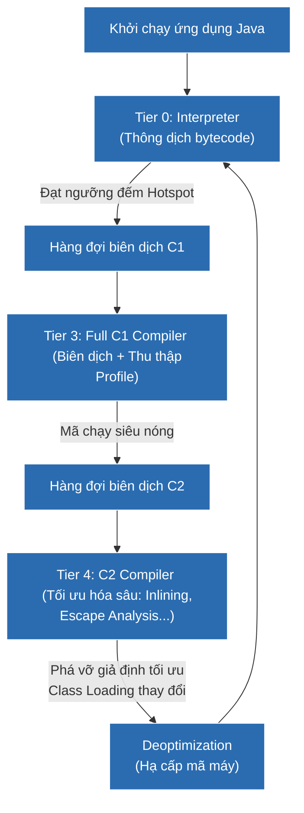

# Giải phẫu JIT Compiler — Trái tim tối ưu hóa tốc độ thực thi của JVM

## ⚡ Tóm tắt ngắn (30s)
* **JIT Compiler (Just-In-Time Compiler)** là trình biên dịch tại chỗ của JVM. Nó có nhiệm vụ biên dịch mã **Bytecode (.class)** trung gian thành **mã máy vật lý (Native Machine Code)** trực tiếp khi ứng dụng đang chạy để CPU thực thi với tốc độ thô tối đa.
* **Tiered Compilation (Biên dịch phân tầng)** là cơ chế cốt lõi từ Java 8+:
  * **Interpreter (Thông dịch)**: Khởi chạy ứng dụng tức thời, đọc và chạy từng câu lệnh bytecode (tốc độ chậm).
  * **C1 Compiler (Client - Tier 1-3)**: Biên dịch nhanh chóng sang mã máy thô, tối ưu hóa đơn giản để sớm tăng tốc mã nguồn.
  * **C2 Compiler (Server - Tier 4)**: Dành cho các đoạn code cực kỳ "nóng" (Hot Spots). Biên dịch chậm hơn nhưng tối ưu hóa cực sâu (Inlining, Escape Analysis, Loop Unrolling).

---

## 🔍 Chi tiết bản chất

### 1. Tại sao cần JIT Compiler?
Mã nguồn Java ban đầu được biên dịch bởi `javac` sang Bytecode. Bytecode là ngôn ngữ độc lập phần cứng và hệ điều hành, CPU không hiểu trực tiếp. 
* Nếu chỉ dùng **Interpreter (Thông dịch)** để dịch từng lệnh bytecode sang mã máy mỗi khi chạy qua, hiệu năng sẽ rất tệ (chậm hơn C/C++ hàng chục lần).
* JIT giải quyết vấn đề bằng cách giám sát (Profiling) mã nguồn khi ứng dụng chạy. Nó đếm số lần gọi của từng phương thức và số lần lặp của từng vòng lặp. 
* Khi một đoạn code đạt đến ngưỡng gọi nhất định (ví dụ mặc định 10,000 lần gọi), JIT dán nhãn đó là **Hot Spot (Điểm nóng)** và lập tức gửi sang hàng đợi biên dịch JIT để dịch thẳng sang mã máy vĩnh viễn.

### 2. Tiến trình Tiered Compilation hoạt động ra sao?
JVM HotSpot chia quá trình chạy thành 5 tầng (Tiers 0 đến 4):
* **Tier 0 (Interpreted Code)**: Chạy mã thuần thông dịch bằng JVM Interpreter.
* **Tier 1 (Simple C1)**: Biên dịch qua C1 nhưng hoàn toàn không thu thập dữ liệu Profile (chỉ chạy mã máy thô).
* **Tier 2 (Limited C1)**: Biên dịch qua C1 có thu thập một số thông tin thống kê profile cơ bản.
* **Tier 3 (Full C1)**: Biên dịch qua C1 thu thập toàn bộ dữ liệu thống kê profile của luồng chạy.
* **Tier 4 (C2 Compiler)**: Khi mã nguồn ở Tier 3 chạy cực kỳ thường xuyên, nó sẽ được thăng cấp lên Tier 4. Tại đây, trình biên dịch C2 sẽ tận dụng toàn bộ dữ liệu thống kê thu được từ Tier 3 để tối ưu hóa đỉnh cao:
  * **Method Inlining**: Lồng trực tiếp code của phương thức con vào phương thức cha để xóa bỏ chi phí gọi hàm (Stack push/pop).
  * **Loop Unrolling**: Trải phẳng vòng lặp để giảm số lần kiểm tra điều kiện nhảy CPU.
  * **Deoptimization (Hạ cấp mã máy)**: Nếu JIT phát hiện giả định tối ưu hóa không còn đúng nữa (ví dụ: xuất hiện một subclass mới phá vỡ cấu trúc đa hình đơn nhất), JIT sẽ lập tức hủy bỏ mã máy Tier 4 và chuyển luồng thực thi ngược về trạng thái thông dịch Tier 0 hoặc Tier 3.

---

## 🎨 Sơ đồ luồng thăng cấp mã nguồn qua Tiered Compilation



---

## 💻 Code Example

### BAD ❌ (Viết phương thức quá dài cản trở tối ưu hóa Method Inlining của JIT)
```java
public class ComplexService {
    // ❌ Tệ: Viết một phương thức khổng lồ có kích thước Bytecode lớn hơn 325 bytes
    // (Giới hạn mặc định tối đa cho Inlining của JVM đối với mã nóng là -XX:MaxInlineSize=35).
    // JIT Compiler sẽ hoàn toàn từ bỏ việc thực hiện Method Inlining cho phương thức này.
    // Kết quả: Hệ thống phải chịu chi phí tạo Stack Frame liên tục khi gọi hàm trong vòng lặp.
    public void processOrderComplex(Order order) {
        // ... 150 dòng logic xử lý dữ liệu phức tạp ...
        // ... thực hiện tính toán tài chính ...
        // ... ghi nhận log hệ thống ...
    }
}
```

### GOOD ✅ (Viết các phương thức ngắn, rõ ràng giúp JIT tối ưu hóa tuyệt đối)
```java
public class OptimizedService {
    // ✅ Tốt: Chia nhỏ logic thành các phương thức độc lập, ngắn gọn (<35 bytes bytecode).
    // JIT Compiler dễ dàng phân tích và tự động thực hiện inlining, ép toàn bộ code con 
    // chạy trực tiếp bên trong code cha như một khối liền mạch mà không tốn chi phí gọi hàm.
    public void processOrder(Order order) {
        validate(order);
        calculateTax(order);
        writeAuditLog(order);
    }

    private void validate(Order order) { /* <35 bytes */ }
    private void calculateTax(Order order) { /* <35 bytes */ }
    private void writeAuditLog(Order order) { /* <35 bytes */ }
}
```

---

## 📊 Trade-off Analysis: JIT Compiler vs AOT Compiler (Ahead-Of-Time - GraalVM)

| Tiêu chí | JIT Compiler (HotSpot JVM mặc định) | AOT Compiler (GraalVM Native Image) |
| :--- | :--- | :--- |
| **Thời gian khởi động** | Chậm (do vừa chạy vừa phải thông dịch và biên dịch JIT dần dần). | **Siêu nhanh (vài mili giây)**, vì toàn bộ ứng dụng đã được dịch sẵn sang mã máy vật lý. |
| **Dung lượng bộ nhớ (Memory footprint)** | Lớn (phải gánh thêm toàn bộ hạ tầng JIT, Profiler, Metadata). | Rất nhỏ, tối giản tối đa, lý tưởng cho Serverless / Kubernetes pods. |
| **Peak Performance (Hiệu năng đỉnh)** | **Cực cao**. Nhờ thu thập profile thực tế tại thời điểm runtime, JIT có thể thực hiện những tối ưu hóa cực kỳ bạo dạn và chính xác mà AOT tĩnh không thể làm được. | Khá tốt, nhưng khó đạt được hiệu năng đỉnh tối cao của JIT do thiếu dữ liệu thống kê hành vi thực tế của người dùng. |

---

## ⚠️ Common Gotchas & Questions follow-up
1. **TTSP (Time To Safepoint) do vòng lặp của JIT**:
   HotSpot JVM mặc định tự động loại bỏ lệnh kiểm tra Safepoint bên trong các vòng lặp kiểu `int` (được coi là Counted Loops) để tăng tốc độ lặp tối đa khi chạy JIT C2. Điều này dẫn tới thảm họa trễ Safepoint (TTSP kéo dài) nếu vòng lặp `int` đó thực hiện tính toán quá lâu, làm treo đứng các tác vụ Garbage Collection của hệ thống.
2. 👉 **Câu hỏi đào sâu từ interviewer**: *Cơ chế On-Stack Replacement (OSR) là gì và nó hoạt động khi nào?*
   * *(Trả lời: OSR là cơ chế thay thế mã máy ngay trên Stack. Khi một phương thức có chứa một vòng lặp chạy hàng triệu lần, JIT sẽ biên dịch vòng lặp đó trước. Sau đó, JVM thực hiện thay thế đoạn mã thông dịch cũ bằng mã máy vừa dịch ngay tại vị trí frame hiện tại của phương thức đang chạy dở dang, giúp tăng tốc tức thì mà không cần đợi phương thức đó kết thúc để gọi lại từ đầu).*