# Hiện tượng JVM Warm-up — Thách thức và chiến lược giải quyết trên Production

## ⚡ Tóm tắt ngắn (30s)
* **JVM Warm-up (Làm ấm máy ảo)** là khoảng thời gian ban đầu khi một ứng dụng Java mới khởi chạy.
* **Bản chất**: Lúc này, hầu hết mã nguồn ứng dụng chạy bằng **Interpreter (Thông dịch)** chậm chạp. Đồng thời, trình biên dịch **JIT Compiler** phải liên tục vắt kiệt sức CPU để thu thập profile, phân tích mã nóng và dịch sang mã máy.
* **Hậu quả**: Trong pha khởi động (khoảng vài chục giây đến vài phút đầu), hệ thống sẽ gặp hiện tượng **CPU Spike 100%**, thời gian phản hồi (Latency) cực kỳ cao và trễ không ổn định.
* **Giải pháp khắc phục**: Chạy Synthetic Traffic (làm ấm giả lập), nâng cấp lên JDK hiện đại, sử dụng cơ chế GraalVM AOT Native Image, hoặc chụp ảnh snapshot trạng thái qua công nghệ **CRaC (Coordinated Restore at Checkpoint)**.

---

## 🔍 Chi tiết bản chất

### 1. Tại sao xảy ra hiện tượng JVM Warm-up?
Khác với C++ biên dịch tĩnh ra mã máy trước khi chạy, Java biên dịch động JIT trong lúc ứng dụng đang chạy. 
* Khi một Pod/Container Java mới deploy lên Kubernetes nhận tải ngay lập tức:
  * Tất cả các class cần thiết phải được tìm kiếm, tải lên RAM và liên kết (Class Loading).
  * Mã nguồn được thực thi chậm chạp bởi Interpreter.
  * JIT bắt đầu chạy song song để đếm số lần thực thi của các phương thức. Khi đạt ngưỡng nóng, JIT gửi request biên dịch thăng cấp (C1 -> C2).
* Quá trình biên dịch JIT là tác vụ tiêu tốn cực kỳ nhiều CPU. Sự kết hợp giữa Interpreter chạy chậm và JIT ngốn CPU gây ra hiện tượng sụt giảm hiệu năng nghiêm trọng ban đầu.

### 2. Các chiến lược làm ấm JVM hiện đại
* **Synthetic Traffic (Khởi động làm ấm chủ động)**:
  * Cấu hình Kubernetes Readiness Probe kết hợp với kịch bản chạy thử giả lập (Warmup Script).
  * Gọi thử khoảng 10,000 - 50,000 requests giả lập đi qua toàn bộ các luồng API nghiệp vụ trọng yếu để ép JIT biên dịch toàn bộ mã sang mã máy trước khi Load Balancer chính thức mở cổng cho khách hàng truy cập.
* **GraalVM Native Image (Loại bỏ hoàn toàn Warm-up)**:
  * Sử dụng biên dịch Ahead-Of-Time (AOT). Biên dịch toàn bộ bytecode thành file thực thi mã máy duy nhất trước khi đóng gói ứng dụng.
  * Khởi động tức thì (dưới 50ms) với hiệu năng thô ổn định 100% ngay từ request đầu tiên.
* **CRaC (Coordinated Restore at Checkpoint)**:
  * Chạy ứng dụng Java trên môi trường staging, cho chạy tải làm ấm hoàn tất để JIT tối ưu hóa tối đa.
  * Chụp lại một Snapshot trạng thái RAM của cả tiến trình Java (Checkpoint) lưu xuống ổ cứng.
  * Khi deploy Pod mới, tiến trình Java chỉ cần nạp lại file Snapshot RAM này vào bộ nhớ (Restore) chỉ mất vài chục mili giây, thừa hưởng toàn bộ thành quả làm ấm trước đó.

---

## 🎨 Đồ thị hiệu năng (Latency & CPU) trong pha JVM Warm-up

```mermaid
gantt
    title Pha làm ấm JVM và sự chuyển dịch Hiệu năng
    dateFormat  X
    axisFormat %s

    section CPU Usage
    JIT Compilation (CPU Spike 100%): active, 0, 30
    Ổn định thô (CPU giảm về 20%): 30, 90

    section Latency (API Response Time)
    Thông dịch (Phản hồi chậm >500ms): critical, 0, 15
    Biên dịch C1/C2 (Trễ chập chờn 200ms): 15, 30
    Hiệu năng đỉnh (Phản hồi mượt mà <5ms): 30, 90
```



---

## 💻 Code Example

### BAD ❌ (Đại họa mở cổng tải ngay lập tức khi ứng dụng vừa khởi chạy)
```java
// ❌ Tệ: Cấu hình Spring Boot / API Gateway không có bộ làm ấm.
// Ngay khi ApplicationContext load xong, Spring Boot báo hiệu 200 OK lên Kubernetes.
// Kubernetes lập tức đổ hàng nghìn request/giây của khách hàng thực tế vào.
// Hậu quả: JIT chạy không kịp, CPU vọt 100%, hàng loạt request bị Gateway Timeout.
@SpringBootApplication
public class UnwarmedApplication {
    public static void main(String[] args) {
        SpringApplication.run(UnwarmedApplication.class, args);
        System.out.println("Ứng dụng đã sẵn sàng nhận tải!");
    }
}
```

### GOOD ✅ (Triển khai Warmup ApplicationListener để tự động làm ấm JIT trước khi mở cổng)
```java
@Component
public class WarmupRunner implements ApplicationListener<ApplicationReadyEvent> {
    private static final Logger log = LoggerFactory.getLogger(WarmupRunner.class);

    @Autowired
    private RestTemplate restTemplate;

    @Override
    public void onApplicationEvent(ApplicationReadyEvent event) {
        log.info("🚀 Bắt đầu tiến trình làm ấm chủ động (Warming up JVM JIT)...");
        
        // ✅ Tốt: Tạo kịch bản gọi giả lập 10,000 lần đi qua các API quan trọng.
        // Điều này ép buộc JIT Compiler thực hiện thăng cấp mã nguồn lên mã máy Tier 4 trước.
        for (int i = 0; i < 10000; i++) {
            try {
                // Gọi local endpoint của chính nó để chạy qua các Controller/Service
                restTemplate.getForObject("http://localhost:8080/api/v1/payment/warmup", String.class);
            } catch (Exception e) {
                // Bỏ qua lỗi kết nối trong pha warmup
            }
        }
        
        log.info("✅ JVM đã được làm ấm hoàn hảo! Sẵn sàng nhận tải thật.");
    }
}
```

---

## 📊 Trade-off Analysis: Giải pháp xử lý JVM Warm-up

| Giải pháp | Lợi ích mang lại | Chi phí đánh đổi |
| :--- | :--- | :--- |
| **Warmup Script chủ động** | Tận dụng được tối đa sức mạnh của JIT HotSpot chuẩn, đảm bảo hiệu năng đỉnh (Peak performance) tốt nhất. | Làm kéo dài thời gian deploy Pod trên Kubernetes (Startup Probe lâu hơn). Phải bảo trì mã nguồn warmup song hành với logic nghiệp vụ. |
| **GraalVM Native Image** | Khởi động tức thì (<50ms), tiết kiệm RAM vật lý cực lớn, mở rộng cực nhanh (Auto-scaling siêu nhạy). | Phức tạp hóa quá trình CI/CD build. Không hỗ trợ dynamic class loading và hạn chế lạm dụng reflection. Hiệu năng đỉnh thô có thể giảm nhẹ. |
| **CRaC (JDK 17+)** | Đạt cả 2 mục tiêu: Khởi động tức thì + Hiệu năng đỉnh tuyệt đối của JIT. | Yêu cầu hệ điều hành Linux phải hỗ trợ quyền root hoặc CRIU. Ứng dụng phải tự viết code đóng các connection đang mở trước khi chụp Checkpoint. |

---

## ⚠️ Common Gotchas & Questions follow-up
1. **Lầm tưởng "Cấu hình liveness/readiness probe ngắn là đủ"**:
   Nếu bạn cấu hình readiness probe quá ngắn (ví dụ chỉ check cổng TCP 8080 sống), Kubernetes sẽ lập tức cho traffic vào khi app chưa được làm ấm. Readiness probe đúng chuẩn phải truy cập vào một endpoint đặc biệt, endpoint này chỉ trả về `200 OK` sau khi tiến trình warmup chạy giả lập thành công.
2. 👉 **Câu hỏi đào sâu từ interviewer**: *Tại sao cấu hình `-Xcomp` (ép JVM biên dịch toàn bộ mã ngay khi start) lại là một bad practice để xử lý warm-up?*
   * *(Trả lời: Vì khi ép biên dịch tĩnh ngay từ đầu với `-Xcomp`, JVM sẽ không có cơ hội chạy thử để thu thập dữ liệu profile thực tế của người dùng. Trình biên dịch C2 sẽ không thể thực hiện các tối ưu hóa động tối thượng như đa hình đơn nhất hay escape analysis, kết quả là hiệu năng thô lâu dài của ứng dụng sẽ bị suy giảm mạnh so với để JIT biên dịch động).*