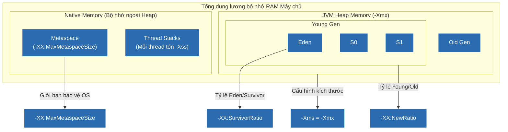

# Cẩm nang Tinh chỉnh JVM (JVM Tuning) chuẩn Senior dành cho Production

## ⚡ Tóm tắt ngắn (30s)
* **Không tinh chỉnh mù quáng**: Luôn bắt đầu từ cấu hình mặc định của JVM, bật GC Log, chạy Load Test, phân tích số liệu rồi mới tiến hành tuning từng tham số.
* **4 nhóm tham số cốt lõi cần làm chủ**:
  1. **Heap Sizing**: Đặt `-Xms` (kích thước tối thiểu) bằng `-Xmx` (kích thước tối đa) để tránh JVM co dãn Heap gây STW trễ.
  2. **Garbage Collector**: Kích hoạt ZGC (`-XX:+UseZGC`) cho dịch vụ có độ trễ cực thấp (<1ms) hoặc G1 GC (`-XX:+UseG1GC`) làm mặc định đa dụng.
  3. **Metaspace Sizing**: Cấu hình `-XX:MaxMetaspaceSize` để tránh class metadata ăn mòn hết RAM native gây Linux OOM Killer.
  4. **GC Logging**: Bật tính năng ghi nhật ký GC hiện đại chuẩn JDK 9+ (`-Xlog`).

---

## 🔍 Chi tiết bản chất và danh mục các tham số tối cao

### 1. Nhóm cấu hình kích thước bộ nhớ (Sizing Flags)
* `-Xms<size>` và `-Xmx<size>`: 
  * Cấu hình kích thước ban đầu và tối đa của Heap.
  * **Best Practice**: Luôn thiết lập `-Xms = -Xmx` (ví dụ `-Xms4g -Xmx4g`). Điều này triệt tiêu hoàn toàn chi phí hệ điều hành phải liên tục cấp phát và thu hồi trang bộ nhớ khi JVM muốn co dãn kích thước Heap, giúp giảm thiểu thời gian treo GC.
* `-XX:MetaspaceSize=<size>` và `-XX:MaxMetaspaceSize=<size>`:
  * Giới hạn kích thước vùng nhớ chứa Class Metadata. Trên production, nên đặt giới hạn tối đa (ví dụ `-XX:MaxMetaspaceSize=512m`) để sớm phát hiện lỗi rò rỉ class động và bảo vệ máy chủ khỏi sập do cạn kiệt RAM native.

### 2. Nhóm cấu hình bộ dọn rác (GC Selection Flags)
* `-XX:+UseG1GC`: Kích hoạt G1 GC (Garbage-First). Phù hợp đa số ứng dụng web có kích thước heap trung bình từ 4GB đến 32GB.
* `-XX:MaxGCPauseMillis=<N>`: Thiết lập thời gian dừng tối đa mong muốn cho G1 GC (mặc định là 200ms). G1 sẽ tự động điều chỉnh kích thước Young Gen để cố gắng đạt mục tiêu dừng này.
* `-XX:+UseZGC` (Java 15+): Kích hoạt bộ dọn rác độ trễ siêu thấp ZGC. Bắt buộc cho các hệ thống API Gateway, FinTech yêu cầu phản hồi tức thời dưới 1ms.

### 3. Nhóm cấu hình Generational (Thế hệ bộ nhớ)
* `-XX:NewRatio=<N>`: Tỷ lệ giữa vùng Old Generation và Young Generation (mặc định là 2, nghĩa là Old Gen chiếm 2/3 tổng Heap, Young Gen chiếm 1/3).
* `-XX:SurvivorRatio=<N>`: Tỷ lệ giữa phân vùng Eden và các vùng Survivor S0/S1 (mặc định là 8, nghĩa là Eden chiếm 8/10 Young Gen, mỗi vùng Survivor chiếm 1/10).
* `-XX:MaxTenuringThreshold=<N>`: Số lần sống sót tối đa của đối tượng qua các đợt Minor GC trước khi chính thức được thăng cấp (promote) lên Old Generation (mặc định là 15).

### 4. Nhóm cấu hình GC Logging & Diagnostic
* `-Xlog:gc*,gc+age=trace,safepoint:file=/var/log/gc.log:time,uptime,pid:filecount=5,filesize=100M`:
  * Cú pháp ghi log GC chuẩn mực từ Java 9 trở đi. Giúp thu thập chi tiết lịch sử thu gom rác, tuổi thọ đối tượng và thời gian trễ Safepoint để phục vụ phân tích sự cố.

---

## 🎨 Sơ đồ phân vùng tham số JVM tác động trực tiếp vào Kiến trúc RAM



---

## 💻 Code Example

### BAD ❌ (Cấu hình JVM sơ sài và thiếu an toàn cho Kubernetes Container)
```bash
# ❌ Tệ: Chạy ứng dụng Java trong Container mà không giới hạn bộ nhớ hoặc dùng Parallel GC.
# 1. Thiếu cấu hình GC logs khiến việc debug khi có sự cố nghẽn lag là bất khả thi.
# 2. Không đặt -Xms = -Xmx làm tăng vọt chi phí co dãn RAM của OS.
# 3. Sử dụng ParallelGC cũ gây dừng STW quá lâu cho API Web.
java -jar -Xmx2g payment-service.jar
```

### GOOD ✅ (Cấu hình JVM chuẩn mực, an toàn và tối ưu hóa độ trễ cho Production Docker Container)
```bash
# ✅ Tốt: Bộ cấu hình JVM tối ưu và chuyên nghiệp nhất cho môi trường Container:
java -server \
  -Xms4g -Xmx4g \
  -XX:MaxMetaspaceSize=512m \
  -XX:+UseG1GC \
  -XX:MaxGCPauseMillis=100 \
  -XX:+ParallelRefProcEnabled \
  -XX:+UnlockDiagnosticVMOptions \
  -XX:+HeapDumpOnOutOfMemoryError \
  -XX:HeapDumpPath=/var/logs/oom-dumps/ \
  -Xlog:gc*,safepoint:file=/var/logs/gc.log:time,uptime,pid:filecount=5,filesize=50M \
  -jar payment-service.jar
```

---

## 📊 Trade-off Analysis: Tinh chỉnh tối ưu Throughput vs Tối ưu Latency

| Mục tiêu Tuning | Tham số khuyên dùng | Lợi ích | Chi phí đánh đổi |
| :--- | :--- | :--- | :--- |
| **Tối ưu Throughput (Tổng lưu lượng)** | `-XX:+UseParallelGC` | Tối đa hóa hiệu năng thô của CPU, chạy các tác vụ Batch Job, tính toán tài chính khổng lồ hoàn thành nhanh nhất. | Chấp nhận thời gian dừng (STW) kéo dài lên tới hàng trăm mili giây mỗi khi GC chạy. Ứng dụng web sẽ bị đơ lag cục bộ. |
| **Tối ưu Latency (Độ trễ phản hồi)** | `-XX:+UseZGC` hoặc `-XX:+UseG1GC` kết hợp `-XX:MaxGCPauseMillis=50` | Phản hồi siêu tốc, độ trễ API cực kỳ ổn định, triệt tiêu hoàn toàn hiện tượng giật lag hệ thống. | CPU bị tiêu tốn nhiều hơn cho các tác vụ GC chạy nền đồng thời. Thông lượng (Throughput) thô của ứng dụng giảm nhẹ khoảng 3-5%. |

---

## ⚠️ Common Gotchas & Questions follow-up
1. **Bẫy sập Container do thiếu cờ UseContainerSupport**:
   Trong các phiên bản Java cũ (trước Java 8u191 hoặc Java 10), JVM không tự nhận diện được giới hạn RAM của Docker Container. Nếu ta không cấu hình cờ `-XX:+UseContainerSupport`, JVM sẽ lấy thông tin RAM vật lý của cả máy Host để tính toán kích thước Heap mặc định. Kết quả là tiến trình Java sẽ phình to quá giới hạn Container và bị **Linux OOM Killer** bắn chết lập tức.
2. 👉 **Câu hỏi đào sâu từ interviewer**: *Tại sao cấu hình `-XX:+ParallelRefProcEnabled` lại được khuyên dùng khi tuning G1 GC?*
   * *(Trả lời: Mặc định, quá trình dọn dẹp và cập nhật các loại tham chiếu mềm/yếu (Soft, Weak, Phantom References) trong pha GC được xử lý đơn luồng. Bật cờ này ép JVM sử dụng song song nhiều luồng CPU để xử lý các tham chiếu đó, giúp giảm đáng kể thời gian dừng Stop-The-World của các đợt GC).*