# Heap và stack khác nhau thế nào?

## ⚡ Tóm tắt ngắn (30s)
* **Stack (Bộ nhớ ngăn xếp)**: Lưu trữ các lời gọi hàm và biến cục bộ (kiểu nguyên thủy hoặc con trỏ tham chiếu Heap). Mỗi Thread sở hữu riêng 1 Stack độc lập, tự động thu hồi tài nguyên siêu tốc theo cơ chế LIFO khi kết thúc hàm.
* **Heap (Bộ nhớ đống)**: Lưu trữ toàn bộ thực thể đối tượng (Objects) và mảng được tạo ra qua từ khóa `new`. Dùng chung toàn cục giữa các Thread và do Garbage Collector (GC) quản lý thu hồi rác tự động.
* **Tối ưu JVM (Escape Analysis)**: Không phải mọi Object đều nằm trên Heap. Nếu đối tượng không thoát khỏi phạm vi phương thức, JVM sẽ tự động phân rã cấu trúc và lưu trực tiếp đối tượng đó trên **Stack** (Scalar Replacement) để triệt tiêu overhead của GC.

---

## 🔍 Chi tiết bản chất

### 1. Bản chất hoạt động của Stack (Thread-Private)
* Bộ nhớ Stack được chia nhỏ thành các **Stack Frame** (Khung ngăn xếp). Mỗi lần phương thức được gọi, một Frame mới được đẩy vào đỉnh Stack để quản lý.
* Frame chứa:
  * **Local Variable Table (LVT)**: Mảng lưu trữ các tham số truyền vào và biến cục bộ. Đối với dữ liệu nguyên thủy (primitive) thì lưu trực tiếp giá trị. Đối với đối tượng thì lưu địa chỉ vùng nhớ (Reference) trỏ sang Heap.
  * **Operand Stack**: Không gian trung gian thực hiện các phép toán logic/số học.
  * **Frame Data**: Lưu trữ thông tin tham chiếu hằng số pool, mã trả về của phương thức.
* Tốc độ truy cập cực kỳ nhanh do tính chất tuần tự (locality), thường được nạp trực tiếp vào Cache CPU L1/L2.

### 2. Bản chất hoạt động của Heap (Thread-Shared)
* Nơi lưu trữ tất cả các thực thể đối tượng thực tế (gồm cả các biến instance của đối tượng đó).
* Quy mô bộ nhớ cực lớn so với Stack. Được chia làm nhiều vùng thế hệ (**Young Gen, Old Gen**) để tối ưu hóa Garbage Collection.
* Việc truy cập biến trên Heap chậm hơn Stack do CPU phải thông qua thao tác giải mã con trỏ (Pointer Dereferencing) để truy xuất địa chỉ thực trên RAM vật lý, dễ xảy ra **Cache Miss**.

### 3. Escape Analysis (Phân tích thoát) & Tối ưu hóa Scalar Replacement
Đây là một trong những cơ chế tối ưu đỉnh cao của JVM từ Java 6+:
* **Global Escape**: Đối tượng thoát khỏi thread hiện tại (ví dụ: gán cho static field hoặc trả về từ phương thức).
* **Arg Escape**: Đối tượng được truyền làm tham số cho hàm khác nhưng không thoát ra ngoài luồng.
* **No Escape**: Đối tượng chỉ được sử dụng nội bộ hoàn toàn trong hàm khai báo.
* Khi xác định đối tượng thuộc trạng thái **No Escape**, JIT Compiler sẽ thực hiện **Scalar Replacement**: phân rã Object thành các biến nguyên thủy đơn lẻ và **gán trực tiếp trên Stack**. Nhờ vậy, đối tượng hoàn toàn không được tạo ra trên Heap, giúp giải phóng hoàn toàn gánh nặng thu dọn cho GC.

---

## 🎨 Sơ đồ tương tác bộ nhớ Stack & Heap

```mermaid
graph TD
    subgraph Stack["Bộ nhớ Stack (Mỗi luồng có 1 Stack riêng)"]
        subgraph Frame2["Stack Frame 2: printUser()"]
            RefUser["User uRef = 0x8899"]
        end
        subgraph Frame1["Stack Frame 1: main()"]
            PrimitiveX["int x = 42"]
        end
    end

    subgraph Heap["Bộ nhớ Heap (Dùng chung toàn hệ thống)"]
        ObjectUser["User Object (Address: 0x8899) <br> - name: 'Alice' <br> - age: 30"]
    end

    RefUser -.->|Trỏ địa chỉ reference| ObjectUser
    
    style Frame2 fill:#2d3748,stroke:#ed8936,stroke-width:2px
    style Frame1 fill:#2d3748,stroke:#ed8936,stroke-width:2px
    style Heap fill:#1a365d,stroke:#3182ce,stroke-width:2px
```



---

## 💻 Code Example

### BAD ❌ (Khởi tạo Object vô tội vạ làm rò rỉ Heap và gây áp lực cho GC)
```java
public class MemoryWaster {
    public void processCoordinates(int x, int y) {
        // ❌ Tồi tệ: Tạo ra wrapper Object Point trong vòng lặp kín chỉ để thực hiện tính toán đơn giản.
        // Dù đối tượng không thoát khỏi hàm (No Escape), việc lặp đi lặp lại hàng triệu lần
        // vẫn có khả năng làm đầy bộ nhớ Heap nếu JIT không kịp tối ưu hóa.
        for (int i = 0; i < 10_000_000; i++) {
            Point p = new Point(x + i, y + i); 
            doCalculation(p.x, p.y);
        }
    }
    
    private void doCalculation(int a, int b) { /* Tính toán */ }
    
    private static class Point {
        int x, y;
        Point(int x, int y) { this.x = x; this.y = y; }
    }
}
```

### GOOD ✅ (Viết code tối giản đối tượng trung gian, giúp JVM kích hoạt Escape Analysis)
```java
public class MemoryOptimizer {
    public void processCoordinates(int x, int y) {
        // ✅ Tốt: Loại bỏ wrapper Object không cần thiết, chạy trực tiếp trên biến cục bộ nguyên thủy.
        // Hoặc nếu bắt buộc phải dùng Point, đảm bảo JIT Compiler dễ dàng nhận biết trạng thái
        // "No Escape" bằng cách khai báo cục bộ tuyệt đối, không chia sẻ tham chiếu ra bên ngoài.
        for (int i = 0; i < 10_000_000; i++) {
            int currentX = x + i;
            int currentY = y + i; // Hoàn toàn lưu trên Stack Frame, tốc độ siêu tốc
            doCalculation(currentX, currentY);
        }
    }
    
    private void doCalculation(int a, int b) { /* Tính toán */ }
}
```

---

## 📊 Trade-off Analysis

| Tiêu chí | Bộ nhớ Stack | Bộ nhớ Heap |
| :--- | :--- | :--- |
| **Phạm vi** | Thuộc sở hữu riêng của từng Thread (**Thread-safe** tuyệt đối). | Dùng chung toàn cục giữa các Thread (**Phải đồng bộ hóa**). |
| **Kích thước** | Rất nhỏ (thường chỉ 1MB mặc định mỗi thread). | Rất lớn (lên tới hàng chục GB tùy cấu hình RAM). |
| **Tốc độ truy cập**| Cực nhanh (LIFO, nằm trong Cache CPU, địa chỉ liên tục). | Chậm hơn (phân bổ động, tốn chi phí giải mã con trỏ). |
| **Vòng đời** | Tự động thu hồi ngay khi phương thức kết thúc. | Tồn tại lâu dài, do Garbage Collector thu hồi bất đồng bộ. |
| **Lỗi phổ biến** | `StackOverflowError` (Khi đệ quy quá sâu). | `OutOfMemoryError` (Khi đầy RAM Heap). |

---

## ⚠️ Common Gotchas & Questions follow-up
1. **Lầm tưởng: Mọi Object luôn nằm trên Heap**:
   Nhờ có cơ chế **Escape Analysis** và **Scalar Replacement** nêu trên, rất nhiều đối tượng nhỏ, vòng đời ngắn, chỉ dùng nội bộ trong hàm thực chất đã được JVM phân rã thành các trường nguyên thủy và lưu trữ trực tiếp trên **Stack**.
2. **Kích thước Stack tối ưu (-Xss)**:
   Nếu ứng dụng của bạn không sử dụng các giải thuật đệ quy phức tạp hoặc cây thư mục lồng sâu, bạn có thể cân nhắc giảm cấu hình `-Xss` (ví dụ từ `1MB` mặc định xuống `256KB`). Việc này giúp tiết kiệm lượng lớn dung lượng RAM vật lý của hệ điều hành, cho phép tạo được nhiều Thread hơn trên cùng một server vật lý.
3. 👉 **Câu hỏi đào sâu từ interviewer**: *Nếu truyền một biến Primitive vào hàm thì thay đổi trong hàm có ảnh hưởng ngoài hàm không? Nếu truyền Object thì sao?*
   * *(Trả lời: Java là Pass-by-value hoàn toàn. Đối với Primitive, JVM sao chép trực tiếp giá trị lên vùng nhớ Stack Frame mới, do đó thay đổi trong hàm không ảnh hưởng ra ngoài. Đối với Object, JVM sao chép giá trị của "địa chỉ con trỏ tham chiếu" trên Stack. Do đó, cả 2 Stack Frame đều chứa 2 con trỏ trỏ chung về 1 Object duy nhất trên Heap. Sửa đổi thuộc tính của Object trong hàm sẽ phản ánh trực tiếp ra ngoài).*