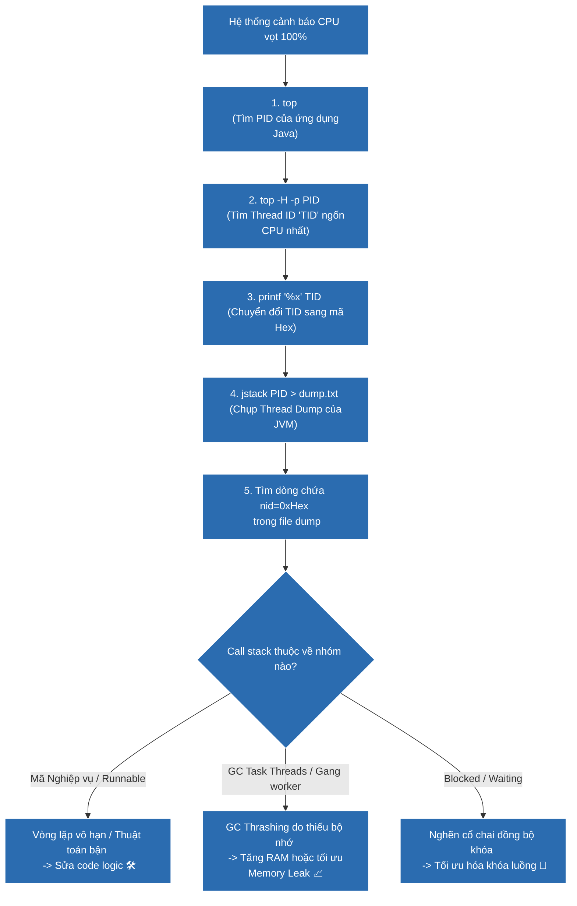

# Cẩm nang 4 bước vàng xử lý sự cố CPU High (100% CPU) trong ứng dụng Java

## ⚡ Tóm tắt ngắn (30s)
* **Quy trình 4 bước kinh điển trên Linux**:
  1. **Bước 1**: Dùng lệnh `top` để xác định chính xác mã tiến trình **Process ID (PID)** của ứng dụng Java đang ngốn CPU.
  2. **Bước 2**: Tìm Thread vật lý ngốn CPU bằng lệnh: `top -H -p <PID>`. Ghi lại mã Thread ID (**TID**) lớn nhất.
  3. **Bước 3**: Chuyển đổi số **TID** (dạng thập phân) sang dạng thập lục phân (**Hex**): `printf "%x\n" <TID>`. Ví dụ: `10813` chuyển thành `2a3d`.
  4. **Bước 4**: Chụp Thread Dump bằng `jstack <PID>` và tìm kiếm dòng chứa mã native thread ID: `nid=0x2a3d`. Từ đó đọc trực tiếp Call Stack để biết dòng code thủ phạm.
* **Nguyên nhân chính**: Vòng lặp vô hạn (Infinite Loop), thuật toán chờ bận (Busy-spin), đồng bộ hóa luồng tệ hại (Lock Contention), hoặc hiện tượng **GC Thrashing** (GC chạy điên cuồng liên tục do thiếu RAM).

---

## 🔍 Chi tiết bản thực chiến trên Production

### Bước 1 & 2: Xác định PID và TID
Trên môi trường Linux Production:
* Chạy `top` hoặc `htop` để quét nhanh hệ thống. Phát hiện tiến trình Java đang chiếm CPU cao (ví dụ: `PID = 12405`).
* Thực hiện "soi chi tiết" các luồng (Thread) chạy ngầm của tiến trình đó bằng lệnh:
  `top -H -p 12405`
  (Cờ `-H` ép `top` hiển thị toàn bộ luồng vật lý dưới dạng các tiến trình riêng lẻ). Tìm dòng có CPU chiếm dụng cao nhất (ví dụ: `TID = 12413`).

### Bước 3: Ánh xạ Thread Java và Thread OS
Mỗi Thread trong Java được ánh xạ 1-1 với một Native Thread của hệ điều hành Linux. Trong log Thread Dump của JVM, mã định danh Thread của OS được lưu dưới dạng Hex thông qua thuộc tính `nid=0x...`.
* Chuyển đổi TID thập phân sang Hex:
  `printf "%x\n" 12413`
  Kết quả trả về: `307d`.

### Bước 4: Chụp Dump và định vị Call Stack dòng code lỗi
Chụp Thread Dump nhanh chóng ra file văn bản:
`jstack 12405 > thread_dump.txt`
Mở file `thread_dump.txt` và tìm kiếm cụm từ: `nid=0x307d`.
Bạn sẽ định vị chính xác call stack của Thread đó. Ví dụ:
```text
"PaymentProcessor-Thread" #22 prio=5 os_prio=0 tid=0x00007f3c4c012800 nid=0x307d runnable [0x00007f3be456f000]
   java.lang.Thread.State: RUNNABLE
      at com.payment.service.OrderService.calculateInterest(OrderService.java:145)
      at com.payment.service.OrderService.process(OrderService.java:82)
```
Dòng code `OrderService.java:145` chính là thủ phạm đang thiêu rụi CPU của server.

---

## 🎨 Sơ đồ luồng chẩn đoán và khắc phục sự cố CPU High thực chiến



---

## 💻 Code Example

### BAD ❌ (Mã vòng lặp chờ bận - Busy-spin loop thiêu rụi 100% CPU của nhân)
```java
public class BusySpinProcessor {
    private volatile boolean ready = false;

    public void processData() {
        // ❌ Tệ: Vòng lặp chờ bận (Busy-spin loop) không nghỉ.
        // CPU của nhân đó sẽ liên tục chạy hết công suất 100% chỉ để kiểm tra điều kiện 'ready'.
        // Đây là nguyên nhân hàng đầu gây cháy CPU trên môi trường sản xuất.
        while (!ready) {
            // Không sleep, không có cơ chế chờ notify
        }
        System.out.println("Bắt đầu xử lý dữ liệu...");
    }
}
```

### GOOD ✅ (Sử dụng cơ chế Wait-Notify hoặc khóa ReentrantLock an toàn giải phóng CPU)
```java
public class BlockedWaitProcessor {
    private final Object lock = new Object();
    private volatile boolean ready = false;

    public void processData() {
        synchronized (lock) {
            // ✅ Tốt: Sử dụng cơ chế wait/notify của Object.
            // Luồng sẽ lập tức rơi vào trạng thái WAITING và tự động giải phóng 100% CPU.
            // CPU sẽ không tốn bất kỳ một chu kỳ xử lý nào cho luồng này cho đến khi được đánh thức.
            while (!ready) {
                try {
                    lock.wait(); // Giải phóng lock và nghỉ ngơi an toàn
                } catch (InterruptedException e) {
                    Thread.currentThread().interrupt();
                }
            }
        }
        System.out.println("Bắt đầu xử lý dữ liệu...");
    }
}
```

---

## 📊 Trade-off Analysis: So sánh công cụ chẩn đoán CPU

| Công cụ | Lợi ích | Chi phí đánh đổi |
| :--- | :--- | :--- |
| **Quy trình thủ công (`top` + `jstack`)** | Có sẵn trên mọi hệ thống Linux, không cần cài đặt thêm phần mềm bên ngoài, tuyệt đối an toàn cho Production. | Đòi hỏi nhiều bước thủ công, không lưu giữ lịch sử biểu đồ theo thời gian. |
| **async-profiler** | Tránh hoàn toàn lỗi **Safepoint Bias** (Jstack chỉ dump được thread tại Safepoint, gây lệch kết quả). Vẽ Flame Graph trực quan tuyệt đẹp. | Cần tải thư viện native của C/C++ lên server, yêu cầu cấu hình kernel hệ điều hành nâng cao (`perf_event_paranoid`). |
| **Arthas (`thread -n 3`)** | Cực kỳ nhanh, chỉ cần 1 câu lệnh gõ duy nhất là tự động tìm ra 3 thread ngốn CPU cao nhất kèm call stack tức thời. | Gây tăng nhẹ overhead tải hệ thống khi phân tích runtime. |

---

## ⚠️ Common Gotchas & Questions follow-up
1. **Cạm bẫy GC Thrashing gây báo động giả**:
   Khi hệ thống bị thiếu RAM nghiêm trọng, Garbage Collector sẽ phải chạy liên tục song song để vớt vát bộ nhớ. Khi ta chạy `top -H`, ta sẽ thấy các luồng như `VM Thread` hay `GC Thread#0 (Gang worker)` chiếm CPU cao 100%. Nếu không biết, lập trình viên sẽ tưởng lầm do code nghiệp vụ lỗi. Thực chất đây là lỗi **GC Thrashing**. Phương án xử lý duy nhất là tối ưu hóa dung lượng object hoặc tăng RAM/Heap.
2. 👉 **Câu hỏi đào sâu từ interviewer**: *Safepoint Bias là gì và tại sao nó lại ảnh hưởng đến tính chính xác khi phân tích CPU bằng jstack?*
   * *(Trả lời: Safepoint Bias là hiện tượng JVM chỉ có thể chụp ảnh trạng thái luồng (Thread Dump) khi luồng đó đi vào điểm an toàn (Safepoint). Nếu một luồng chạy một vòng lặp JIT tối ưu sâu không có Safepoint check, jstack sẽ phải đợi luồng đó kết thúc hoặc không thể chụp đúng vị trí thực tế của nó. Kết quả phân tích CPU sẽ bị thiên vị và không chính xác. Để khắc phục, ta sử dụng các công cụ profiler hiện đại dựa trên tín hiệu phần cứng của hệ điều hành như **async-profiler**).*