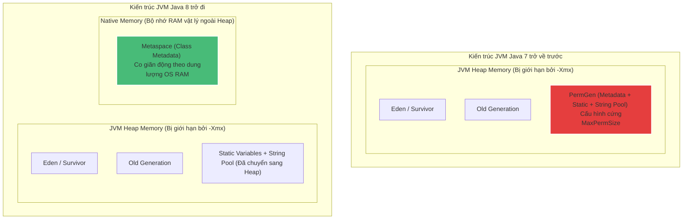

# Metaspace là gì? PermGen biến đi đâu từ Java 8?

## ⚡ Tóm tắt ngắn (30s)
* **Metaspace** là phân vùng bộ nhớ Native của hệ điều hành, được JVM sử dụng từ Java 8 để lưu trữ **Class Metadata** (thay thế cho vùng **PermGen** cũ nằm trong Heap).
* **Lý do PermGen bị khai tử**: PermGen có kích thước cố định cứng cấu hình lúc khởi động, cực kỳ dễ ném ra lỗi `java.lang.OutOfMemoryError: PermGen space` khi nạp nhiều class động.
* **Cơ chế Metaspace**: Tự động co giãn theo dung lượng RAM vật lý còn trống của hệ thống. Tuy nhiên, nếu nạp class động vô tội vạ mà không thu hồi, ứng dụng sẽ bị lỗi **Native OOM** làm sập toàn bộ tiến trình hệ điều hành.

---

## 🔍 Chi tiết bản chất

### 1. So sánh PermGen (Java 7 trở về trước) và Metaspace (Java 8+)
* **PermGen (Permanent Generation)**:
  * Nằm trực tiếp bên trong cấu trúc bộ nhớ Heap của JVM.
  * Bị giới hạn cứng bởi tham số `-XX:PermSize` và `-XX:MaxPermSize`.
  * Lưu trữ: Class Metadata, Phương thức, String Table (String Pool), Static Variables.
  * Do nằm trong Heap, khi PermGen dọn rác, nó bắt buộc phải kích hoạt pha dừng ứng dụng **Full GC** vô cùng nặng nề.
* **Metaspace**:
  * Độc lập hoàn toàn với Heap, sử dụng **Native Memory (bộ nhớ ngoài của OS)**.
  * Chỉ bị giới hạn bởi lượng RAM vật lý của máy chủ (mặc định không giới hạn kích thước chặn trên).
  * Vùng lưu trữ **String Pool** và **Static Variables** đã được di chuyển sang **vùng Heap chính** từ Java 7 để GC dọn dẹp hiệu quả hơn. Metaspace chỉ thuần túy lưu giữ Class Metadata (lớp, phương thức, chú thích, constant pool).

### 2. Hiểm họa rò rỉ bộ nhớ Metaspace (Metaspace Memory Leak)
Vì Metaspace tự động mở rộng, lập trình viên thường chủ quan nghĩ rằng không bao giờ bị tràn. Tuy nhiên, đây là cạm bẫy cực lớn:
* Khi sử dụng các thư viện sinh class động thời gian chạy (Runtime Code Generation) như **Spring AOP, Hibernate, CGLIB, ByteBuddy**... các ClassLoader động được tạo ra liên tục để nạp các Class tạm thời.
* Nếu ClassLoader đó không bị Garbage Collector thu hồi (do còn bị giữ tham chiếu), toàn bộ Class Metadata tương ứng trong Metaspace sẽ **không bao giờ bị xóa**.
* Hậu quả: Tiến trình Java ngốn sạch RAM vật lý của server, hệ điều hành lập tức kích hoạt bộ diệt tiến trình **OOM Killer** để bảo vệ hệ thống, khiến ứng dụng sập đột ngột mà không kịp ghi log ghi nhận sự cố.

---

## 🎨 Sơ đồ dịch chuyển bộ nhớ từ Java 7 sang Java 8+



---

## 💻 Code Example

### BAD ❌ (Sinh class động vô hạn bằng CGLIB không qua Cache, gây sập Metaspace nhanh chóng)
```java
import net.sf.cglib.proxy.Enhancer;
import net.sf.cglib.proxy.MethodInterceptor;

public class MetaspaceLeaker {
    public static void main(String[] args) {
        // ❌ Tồi tệ: Liên tục tạo ra class động mới trong vòng lặp vô hạn
        // CGLIB sẽ sinh ra hàng triệu Class mới trong runtime, ngốn sạch bộ nhớ Metaspace
        while (true) {
            Enhancer enhancer = new Enhancer();
            enhancer.setSuperclass(OriginalService.class);
            enhancer.setUseCache(false); // Vô hiệu hóa Cache Class
            enhancer.setCallback((MethodInterceptor) (obj, method, methodArgs, proxy) -> proxy.invokeSuper(obj, methodArgs));
            
            // Mỗi lần gọi create(), một Class dynamic mới được nạp vào Metaspace
            OriginalService proxyService = (OriginalService) enhancer.create(); 
            proxyService.doSomething();
        }
    }
    
    static class OriginalService {
        public void doSomething() {}
    }
}
```

### GOOD ✅ (Bật cơ chế Caching Class động hoặc cấu hình giới hạn cứng Metaspace bảo vệ OS)
```java
import net.sf.cglib.proxy.Enhancer;
import net.sf.cglib.proxy.MethodInterceptor;

public class SafeMetaspace {
    public static void main(String[] args) {
        Enhancer enhancer = new Enhancer();
        enhancer.setSuperclass(OriginalService.class);
        
        // ✅ Tốt: Sử dụng cơ chế Cache Class mặc định của thư viện
        // CGLIB sẽ tái sử dụng lại Class động đã sinh thay vì định nghĩa lại Class mới
        enhancer.setUseCache(true); 
        enhancer.setCallback((MethodInterceptor) (obj, method, methodArgs, proxy) -> proxy.invokeSuper(obj, methodArgs));
        
        while (true) {
            OriginalService proxyService = (OriginalService) enhancer.create(); 
            proxyService.doSomething();
            break; // Demo thoát an toàn
        }
    }
    
    static class OriginalService {
        public void doSomething() {}
    }
}
```

---

## 📊 Trade-off Analysis

| Tiêu chí | PermGen (Cũ) | Metaspace (Mới) |
| :--- | :--- | :--- |
| **Vị trí bộ nhớ** | Bên trong JVM Heap (Bị chia sẻ không gian lưu trữ). | Bên ngoài JVM Heap (Native Memory của OS). |
| **Giới hạn dung lượng**| Kích thước cố định (`MaxPermSize` mặc định `64MB - 85MB`). | Mặc định không giới hạn kích thước (Co giãn theo OS RAM). |
| **Tác động GC** | Rất nặng nề (Bất kỳ thay đổi nào đều dễ kích hoạt Full GC). | Nhẹ nhàng hơn nhiều. GC chỉ quét Metaspace khi ClassLoader bị hủy hoàn toàn. |
| **Khắc phục OOM** | Thường xuyên phải cấu hình tăng thủ công khi tích hợp nhiều thư viện. | Tránh được lỗi OOM ảo, nhưng cần giám sát chặt chẽ để tránh làm sập cả Server. |

---

## ⚠️ Common Gotchas & Questions follow-up
1. **Thiết lập tham số an toàn trong thực tế**:
   * Tuyệt đối không nên để Metaspace ở chế độ mặc định không giới hạn trong môi trường Production. Kẻ tấn công có thể lợi dụng lỗi rò rỉ nạp class để thực hiện tấn công từ chối dịch vụ (DoS) làm sập hệ điều hành của VPS/Container.
   * Luôn thiết lập tham số bảo vệ tối đa: **`-XX:MaxMetaspaceSize=256m`** hoặc **`512m`** tùy thuộc quy mô ứng dụng.
2. 👉 **Câu hỏi đào sâu từ interviewer**: *Metaspace có bao giờ được giải phóng dung lượng bộ nhớ (Garbage Collected) hay không?*
   * *(Trả lời: **Có**. Tuy nhiên, JVM chỉ có thể giải phóng Class Metadata trong Metaspace khi và chỉ khi ClassLoader nạp ra Class đó đã chết hoàn toàn và bị GC thu hồi. Điều này giải thích tại sao các Framework phức tạp như Spring Boot khi làm nóng tính năng Hot-Reloading thường tạo ClassLoader mới và cố gắng cô lập để ClassLoader cũ bị hủy thu hồi).*