# Class loading process gồm những bước nào?

## ⚡ Tóm tắt ngắn (30s)
Quá trình Class Loading trong JVM là hành trình chuyển đổi tệp tin vật lý `.class` từ đĩa cứng hoặc mạng thành một đối tượng thực thi trong bộ nhớ JVM. Hành trình này trải qua 3 giai đoạn lớn cực kỳ chặt chẽ:
1. **Loading (Nạp)**: Đọc luồng byte dữ liệu của class và dựng nên cấu trúc lớp nhị phân tương ứng trong bộ nhớ.
2. **Linking (Liên kết)**: Gồm 3 bước nhỏ:
   * **Verification**: Xác thực định dạng Bytecode có an toàn không.
   * **Preparation**: Cấp phát bộ nhớ cho biến tĩnh và gán **giá trị mặc định** (ví dụ: `0`, `null`).
   * **Resolution**: Giải quyết tham chiếu ký hiệu thành địa chỉ vùng nhớ vật lý trực tiếp.
3. **Initialization (Khởi tạo)**: Chạy khối lệnh tĩnh `static {}` và gán **giá trị thực tế** thiết lập bởi lập trình viên.

---

## 🔍 Chi tiết bản chất

### Giai đoạn 1: Loading (Tìm nạp)
JVM định vị tệp tin `.class` bằng cách sử dụng hệ thống ClassLoader phù hợp. Nó tạo ra một đại diện nhị phân của class trong bộ nhớ và khởi tạo một đối tượng `java.lang.Class` tương ứng trên vùng nhớ Heap để ứng dụng có thể tương tác thông qua Reflection sau này.

### Giai đoạn 2: Linking (Liên kết - Trái tim kỹ thuật)
* **Verification (Xác thực)**:
  * Đảm bảo cấu trúc tệp Class tuân thủ chuẩn Bytecode.
  * Ngăn chặn các tệp `.class` bị chỉnh sửa thủ công để chèn các đoạn mã phá hoại bộ nhớ, đảm bảo an toàn tuyệt đối cho JVM.
* **Preparation (Chuẩn bị)**:
  * Cấp phát bộ nhớ trong Metaspace cho các biến static của lớp.
  * **Chưa gán giá trị thực tế**. Ví dụ: với lệnh `public static int count = 42;`, tại bước này, JVM chỉ cấp phát bộ nhớ cho `count` và gán giá trị mặc định là **`0`**.
* **Resolution (Phân giải)**:
  * JVM chuyển hóa các tham chiếu tượng trưng (Symbolic References) trong bảng hằng số (Constant Pool) của lớp thành địa chỉ bộ nhớ trực tiếp (Direct References). Bước này có thể diễn ra muộn hơn (Lazy Resolution) tùy theo cấu hình JVM.

### Giai đoạn 3: Initialization (Khởi tạo thực tế)
* Đây là bước cuối cùng và cũng là bước chạy mã Java thực tế đầu tiên của Class.
* JVM tự động tổng hợp tất cả các lệnh gán biến tĩnh và khối mã `static {}` thành một phương thức đặc biệt trong Bytecode gọi là **`<clinit>`** (Class Initializer).
* Tại bước này, biến `count` ở trên mới chính thức nhận giá trị **`42`**.
* **Đảm bảo Thread-Safe**: JVM bảo vệ pha initialization này bằng cơ chế khóa nội bộ nghiêm ngặt. Nếu có nhiều luồng cùng cố gắng tải một Class lần đầu tiên, chỉ duy nhất một luồng được quyền thực thi `<clinit>`, các luồng khác bị chặn và chờ đợi.

---

## 🎨 Sơ đồ luồng 3 giai đoạn nạp Class của JVM

```mermaid
graph TD
    subgraph Phase1["Giai đoạn 1: Loading"]
        ReadClass["Đọc tệp tin .class vật lý <br> Tạo Class Object trên Heap"]
    end

    subgraph Phase2["Giai đoạn 2: Linking"]
        Verify["Verification <br> (Xác thực định dạng Bytecode)"] --> Prepare["Preparation <br> (Cấp phát tĩnh, gán giá trị mặc định: 0/null)"]
        Prepare --> Resolve["Resolution <br> (Đổi tham chiếu ký hiệu sang địa chỉ vật lý)"]
    end

    subgraph Phase3["Giai đoạn 3: Initialization"]
        Init["Initialization <br> (Chạy static block, gán giá trị thực tế: count = 42)"]
    end

    Phase1 --> Verify
    Resolve --> Phase3
    
    style Phase1 fill:#1a365d,stroke:#3182ce,stroke-width:2px
    style Phase2 fill:#2d3748,stroke:#ed8936,stroke-width:2px
    style Phase3 fill:#2c5282,stroke:#4299e1,stroke-width:2px
```



---

## 💻 Code Example

### BAD ❌ (Thiết kế phụ thuộc vòng tĩnh (Static Circular Dependency) gây giá trị khởi tạo sai lệch)
```java
public class ClassLoadingDanger {
    public static void main(String[] args) {
        // In ra giá trị khởi tạo thực tế
        System.out.println("A val: " + A.VAL);
        System.out.println("B val: " + B.VAL);
    }
}

class A {
    // ❌ Lỗi logic: A cần giá trị của B, B lại cần A tại thời điểm Class Loading
    public static final int VAL = B.VAL + 10; 
}

class B {
    public static final int VAL = A.VAL + 5; 
}
// Kết quả in ra có thể bị sai lệch nghiêm trọng thành: A val: 15, B val: 5!
// Do tại thời điểm nạp A, B.VAL đang ở bước Preparation nên có giá trị mặc định là 0.
```

### GOOD ✅ (Áp dụng Initialization-on-demand holder idiom để tạo Lazy Singleton an toàn tuyệt đối)
```java
public class SafeDatabaseConnector {
    private SafeDatabaseConnector() {
        System.out.println("Thiết lập kết nối Database nặng nề...");
    }

    // ✅ Giải pháp hoàn hảo: Inner class tĩnh chỉ được nạp và khởi tạo 
    // khi phương thức getInstance() được gọi thực tế (Lazy Loading).
    // Cơ chế Class Loading tự động đồng bộ hóa đa luồng an toàn tuyệt đối mà không cần dùng synchronized.
    private static class Holder {
        private static final SafeDatabaseConnector INSTANCE = new SafeDatabaseConnector();
    }

    public static SafeDatabaseConnector getInstance() {
        return Holder.INSTANCE; // Lúc này lớp Holder mới chính thức được load và init
    }
}
```

---

## 📊 Trade-off Analysis

| Cơ chế khởi tạo | Ưu điểm | Nhược điểm | Use Case |
| :--- | :--- | :--- | :--- |
| **Static Block Initialization** | Khởi tạo tài nguyên ngay lập tức khi ứng dụng vừa khởi động. Phù hợp cho cấu hình hằng số hệ thống. | Tăng thời gian khởi động app (Warm-up lag), dễ gây lỗi dependency vòng nếu thiết kế không tốt. | Hằng số môi trường toàn cục, thư viện toán học. |
| **Initialization-on-demand Holder**| **Lazy loading thực thụ**, không tốn tài nguyên lúc khởi động, đảm bảo an toàn đa luồng tự động nhờ JVM. | Khó tùy biến truyền tham số cấu hình linh hoạt vào constructor của đối tượng đơn lẻ (Singleton). | Khởi tạo các kết nối nặng (Database Pool, Network Clients). |

---

## ⚠️ Common Gotchas & Questions follow-up
1. **Lỗi khởi tạo tĩnh câm (Silent Static Initializer Error)**:
   Nếu một Exception không được bắt xảy ra bên trong khối lệnh `static {}` hoặc trong quá trình gán giá trị cho một biến `static`, JVM sẽ ném ra ngoại lệ **`java.lang.ExceptionInInitializerError`** duy nhất một lần. Các lần cố gắng gọi Class đó sau đó sẽ liên tục ném lỗi **`java.lang.NoClassDefFoundError`** che giấu đi nguyên nhân thực tế gây crash ban đầu, khiến việc debug trở nên vô cùng khó khăn.
2. 👉 **Câu hỏi đào sâu từ interviewer**: *Phương thức `Class.forName("ClassName")` khác gì với `ClassLoader.loadClass("ClassName")`?*
   * *(Trả lời: `Class.forName()` mặc định sẽ nạp class và **thực thi luôn pha Initialization** (chạy static block). Trong khi đó, `ClassLoader.loadClass()` chỉ dừng lại ở **pha Loading** mà chưa chạy Initialization, giúp tiết kiệm bộ nhớ khi chỉ muốn tải thông tin khai báo của lớp).*