# ClassLoader hierarchy hoạt động ra sao?

## ⚡ Tóm tắt ngắn (30s)
* **ClassLoader** trong Java hoạt động theo **Mô hình ủy quyền (Delegation Model)** ngược từ dưới lên trên. Khi cần nạp một Class, ClassLoader con sẽ ủy quyền yêu cầu đó cho ClassLoader cha tìm kiếm trước. Chỉ khi cha không tìm thấy, con mới tự đi nạp.
* Cấu trúc phân cấp 3 lớp ClassLoader mặc định bao gồm:
  1. **Bootstrap ClassLoader**: Nạp các class core JDK ở vùng an toàn (`rt.jar`, `java.lang`).
  2. **Platform/Extension ClassLoader**: Nạp các class mở rộng từ thư viện nền tảng JDK.
  3. **Application/System ClassLoader**: Nạp các class ứng dụng trong môi trường Classpath.
* Cơ chế này giúp bảo vệ tính nhất quán hệ thống, ngăn chặn mã độc ghi đè lên các class core nhạy cảm của Java (như `java.lang.String`).

---

## 🔍 Chi tiết bản chất

### 1. Nguyên lý hoạt động của Delegation Model (Ủy quyền)
Khi nhận yêu cầu nạp Class `com.example.Demo`:
* **Application ClassLoader** chuyển tiếp yêu cầu lên **Platform ClassLoader**.
* **Platform ClassLoader** chuyển tiếp yêu cầu lên **Bootstrap ClassLoader**.
* **Bootstrap ClassLoader** (Viết bằng C/C++ native) kiểm tra xem có chứa class này không.
  * Nếu tìm thấy $
ightarrow$ Nạp và trả về. Kết thúc.
  * Nếu không tìm thấy $
ightarrow$ Trả lại quyền cho **Platform ClassLoader** tự tìm kiếm trong các thư mục extension của nó.
* Nếu **Platform ClassLoader** cũng thất bại $
ightarrow$ Trả lại quyền cho **Application ClassLoader** tự quét thư mục Classpath cục bộ.
* Nếu cả hệ thống phân cấp đều thất bại $
ightarrow$ Ném ra ngoại lệ **`ClassNotFoundException`**.

### 2. Ba quy tắc cốt lõi của ClassLoader
* **Delegation (Ủy quyền)**: Con luôn hỏi cha trước khi tự làm.
* **Visibility (Tầm nhìn)**: ClassLoader cha không thể nhìn thấy các class được nạp bởi ClassLoader con. Ngược lại, ClassLoader con có thể nhìn thấy tất cả các class được nạp bởi ClassLoader cha.
* **Uniqueness (Tính duy nhất)**: Một Class chỉ được nạp đúng một lần duy nhất bởi một ClassLoader. Hai Class Loader độc lập có thể nạp cùng một class vật lý, tạo ra hai đối tượng Class khác biệt hoàn toàn trong JVM Heap.

### 3. Phá vỡ mô hình ủy quyền (Breaking Delegation)
Trong một số trường hợp thực tế, mô hình Delegation thuần túy gây tắc nghẽn. Ví dụ: **JDBC SPI (Service Provider Interface)**.
* Lớp `java.sql.DriverManager` được nạp bởi **Bootstrap ClassLoader** (Core JDK).
* Tuy nhiên, các Driver thực tế (như MySQL Driver) lại nằm ở Classpath ứng dụng, thuộc quyền quản lý của **Application ClassLoader**.
* Theo nguyên tắc Visibility, Bootstrap không thể nhìn thấy class của MySQL Driver bên dưới để khởi tạo.
* **Giải pháp**: JDBC sử dụng cơ chế phá vỡ bằng cách dùng **Thread Context ClassLoader** (lấy ClassLoader của thread hiện tại cấp cho Bootstrap sử dụng ngược xuống dưới).

---

## 🎨 Sơ đồ Phân cấp cây ủy quyền ClassLoader

```mermaid
graph TD
    subgraph Hierarchy["ClassLoader Hierarchy Stack"]
        Bootstrap["Bootstrap ClassLoader <br> (Core JDK: rt.jar, java.lang.*)"]
        Platform["Platform/Extension ClassLoader <br> (Platform libs: ext/*)"]
        App["Application ClassLoader <br> (Your Application Classpath)"]
        Custom["Custom ClassLoader <br> (Nạp động từ DB, Network...)"]
    end

    Custom -->|1. Ủy quyền lên| App
    App -->|2. Ủy quyền lên| Platform
    Platform -->|3. Ủy quyền lên| Bootstrap
    
    Bootstrap -->|4. Tìm thất bại -> Trả về| Platform
    Platform -->|5. Tìm thất bại -> Trả về| App
    App -->|6. Tìm thất bại -> Trả về| Custom
    
    style Bootstrap fill:#1a365d,stroke:#3182ce,stroke-width:2px
    style Platform fill:#2d3748,stroke:#ed8936,stroke-width:2px
    style App fill:#2c5282,stroke:#4299e1,stroke-width:2px
```



---

## 💻 Code Example

### BAD ❌ (Ghi đè cẩu thả phương thức loadClass() làm phá hỏng hoàn toàn Delegation Model)
```java
public class BrokenCustomClassLoader extends ClassLoader {
    @Override
    public Class<?> loadClass(String name) throws ClassNotFoundException {
        // ❌ Tồi tệ: Tự ý đọc file và nạp class trực tiếp mà không hỏi cha trước.
        // Có thể dẫn đến nạp trùng lặp Class hệ thống hoặc ném lỗi SecurityException 
        // khi cố tình can thiệp vào package lõi java.lang.*.
        byte[] classData = loadClassDataFromDisk(name);
        return defineClass(name, classData, 0, classData.length);
    }
    
    private byte[] loadClassDataFromDisk(String name) { return new byte[0]; }
}
```

### GOOD ✅ (Chỉ ghi đè findClass() để duy trì tính nhất quán của hệ thống phân cấp cha-con)
```java
public class SafeCustomClassLoader extends ClassLoader {
    @Override
    protected Class<?> findClass(String name) throws ClassNotFoundException {
        // ✅ Tốt: loadClass() của lớp cha vẫn được giữ nguyên để thực hiện Delegation Model.
        // Phương thức findClass() này chỉ được gọi tới khi tất cả ClassLoader cha đã tìm kiếm thất bại.
        try {
            byte[] classData = loadClassDataFromSecureSource(name);
            return defineClass(name, classData, 0, classData.length);
        } catch (IOException e) {
            throw new ClassNotFoundException(name, e);
        }
    }

    private byte[] loadClassDataFromSecureSource(String name) throws IOException {
        // Đọc dữ liệu giải mã từ mạng hoặc DB bảo mật
        return new byte[0];
    }
}
```

---

## 📊 Trade-off Analysis

| Cơ chế ClassLoader | Ưu điểm | Nhược điểm | Use Case phù hợp |
| :--- | :--- | :--- | :--- |
| **Standard Delegation** | Đảm bảo an ninh tuyệt đối, tránh lỗi xung đột thư viện cốt lõi, hoạt động ổn định mặc định. | Cứng nhắc, không thể tải động nhiều phiên bản của cùng một thư viện trong cùng thời điểm. | Ứng dụng Spring Boot, Java Web thông thường. |
| **Custom / Broken Delegation**| Tải động Class linh hoạt cực cao, cho phép nạp nhiều phiên bản trùng lặp (Multi-version isolation). | Rất phức tạp để kiểm soát, dễ xảy ra lỗi đụng độ bộ nhớ class cast và rò rỉ Metaspace. | Các hệ thống Plugins, Máy chủ ứng dụng (Tomcat), Kiến trúc OSGi. |

---

## ⚠️ Common Gotchas & Questions follow-up
1. **Lỗi ClassCastException ảo (Ghost ClassCastException)**:
   Nếu bạn nạp cùng một class `com.example.User` bằng hai Custom ClassLoader độc lập khác nhau, JVM sẽ đối xử với chúng như **hai Class hoàn toàn khác biệt**. Khi bạn cố gắng ép kiểu:
   ```java
   User user = (User) obj; // Ném ClassCastException mặc dù obj in ra chính là User!
   ```
2. 👉 **Câu hỏi đào sâu từ interviewer**: *Làm sao các máy chủ Web như Tomcat có thể chạy nhiều ứng dụng Web độc lập sử dụng các phiên bản thư viện Spring khác nhau trên cùng một JVM mà không bị xung đột?*
   * *(Trả lời: Tomcat phá vỡ mô hình Delegation Model tiêu chuẩn bằng cách tạo riêng cho mỗi ứng dụng Web một ClassLoader độc lập gọi là `WebappClassLoader`. ClassLoader này sẽ quét các thư viện nội bộ `WEB-INF/lib` của ứng dụng trước khi ủy quyền lên cha, giúp cô lập hoàn toàn môi trường chạy).*