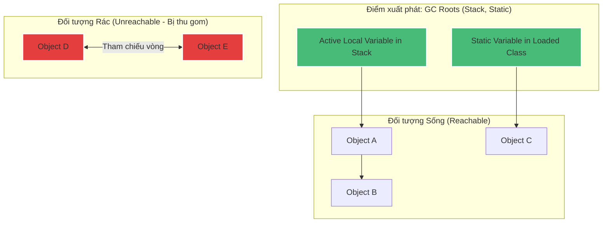

# Garbage Collection hoạt động ở mức khái niệm như thế nào?

## ⚡ Tóm tắt ngắn (30s)
* **Garbage Collection (GC)** là cơ chế tự động quản lý bộ nhớ của JVM, có nhiệm vụ phát hiện và thu hồi bộ nhớ Heap của các đối tượng không còn được sử dụng.
* **Giải thuật tối ưu**: JVM sử dụng thuật toán phân tích khả năng tiếp cận **Reachability Analysis** bắt đầu từ các gốc **GC Roots** để tìm kiếm đối tượng sống sót, thay thế hoàn toàn cho giải thuật đếm tham chiếu (**Reference Counting**) đã lỗi thời do lỗi tham chiếu vòng (Circular Reference).
* Có 3 kỹ thuật dọn dẹp nền tảng: **Mark-Sweep** (Đánh dấu - Quét), **Mark-Copy** (Đánh dấu - Sao chép) và **Mark-Compact** (Đánh dấu - Dồn dịch).

---

## 🔍 Chi tiết bản chất

### 1. Tại sao loại bỏ Reference Counting (Đếm tham chiếu)?
* Giải thuật cũ hoạt động bằng cách tăng biến đếm của đối tượng khi có biến trỏ tới và giảm đi khi biến đó biến mất. Khi biến đếm = 0 $
ightarrow$ dọn dẹp.
* **Tử huyệt**: Nếu Object A trỏ tới Object B, và Object B trỏ ngược lại Object A (Tham chiếu vòng). Cho dù không còn luồng ứng dụng nào sử dụng hai đối tượng này, biến đếm của chúng vẫn luôn = 1 $
ightarrow$ Rò rỉ bộ nhớ vĩnh viễn.

### 2. Thuật toán Reachability Analysis (Phân tích khả năng tiếp cận)
JVM bắt đầu quét từ các điểm xuất phát đặc biệt luôn sống gọi là **GC Roots**:
* Các biến cục bộ và tham số đang hoạt động nằm trong **JVM Stack** của mọi Thread.
* Các biến tĩnh (static fields) của các Class đang được nạp.
* Các tham chiếu từ mã Native JNI.
Hệ thống sẽ đi theo chuỗi liên kết để đánh dấu toàn bộ đối tượng có thể chạm tới. Những đối tượng nào **không nối với bất kỳ GC Root nào** sẽ bị coi là rác (Garbage) và đưa vào diện thu gom.

### 3. Ba kỹ thuật dọn dẹp cơ bản
* **Mark-Sweep (Đánh dấu - Quét)**:
  * *Cách làm*: Đánh dấu rác rồi giải phóng trực tiếp vùng nhớ đó.
  * *Nhược điểm*: Gây ra hiện tượng phân mảnh bộ nhớ (Memory Fragmentation). Bộ nhớ bị chia cắt thành nhiều lỗ hổng nhỏ, khiến ứng dụng không thể cấp phát bộ nhớ cho các đối tượng lớn kế tiếp mặc dù tổng dung lượng trống vẫn đủ.
* **Mark-Copy (Đánh dấu - Sao chép)**:
  * *Cách làm*: Chia bộ nhớ làm 2 nửa. Quét các đối tượng sống ở nửa A rồi sao chép dồn liên tục sang nửa B. Xóa sạch nửa A.
  * *Ưu điểm*: Cực nhanh, triệt tiêu hoàn toàn phân mảnh.
  * *Nhược điểm*: Tốn chi phí nhân đôi dung lượng RAM để làm vùng đệm.
* **Mark-Compact (Đánh dấu - Dồn dịch)**:
  * *Cách làm*: Đánh dấu đối tượng sống, sau đó dịch chuyển dồn toàn bộ đối tượng sống về một đầu bộ nhớ, xóa sạch phần bộ nhớ trống ở đầu còn lại.
  * *Ưu điểm*: Tiết kiệm RAM tối đa, không phân mảnh.
  * *Nhược điểm*: Tốc độ chậm nhất do phải dịch chuyển dữ liệu vật lý của đối tượng trên RAM và cập nhật lại tất cả các con trỏ tham chiếu.

---

## 🎨 Sơ đồ Đồ thị tiếp cận của GC Roots



---

## 💻 Code Example

### BAD ❌ (Cache dữ liệu thủ công bằng HashMap gây rò rỉ bộ nhớ nghiêm trọng do GC Roots giữ)
```java
public class MemoryLeakCache {
    // ❌ Tồi tệ: Static field là một GC Root. Nó giữ tham chiếu chặt (Strong Reference)
    // tới tất cả các đối tượng Metadata lưu trữ bên trong HashMap. 
    // Dù ứng dụng không còn dùng nữa, GC cũng không bao giờ có thể thu hồi bộ nhớ.
    private static final Map<String, BigMetadata> cache = new HashMap<>();

    public void addToCache(String id, BigMetadata data) {
        cache.put(id, data);
    }
}
```

### GOOD ✅ (Sử dụng WeakHashMap để cho phép GC tự động dọn dẹp khi mất tham chiếu ngoài)
```java
public class SafeMemoryCache {
    // ✅ Tốt: Sử dụng WeakHashMap. Các Key được bọc bởi WeakReference.
    // Khi một Key không còn bất kỳ biến bên ngoài nào trỏ tới, GC sẽ tự động
    // thu hồi Entry đó bất cứ lúc nào, giải phóng bộ nhớ an toàn.
    private static final Map<String, BigMetadata> cache = new WeakHashMap<>();

    public void addToCache(String id, BigMetadata data) {
        cache.put(id, data);
    }
}
```

---

## 📊 Trade-off Analysis

| Kỹ thuật dọn dẹp | Ưu điểm | Nhược điểm | Vùng áp dụng tối ưu |
| :--- | :--- | :--- | :--- |
| **Mark-Sweep** | Đơn giản, chi phí tính toán thấp nhất. | Gây phân mảnh bộ nhớ cực cao. | Dành cho các Garbage Collector đời cổ. |
| **Mark-Copy** | **Tốc độ siêu nhanh**, không phân mảnh bộ nhớ. | Tốn thêm 50% tài nguyên RAM dự phòng. | Dành cho vùng nhớ **Young Generation (Survivor S0/S1)**. |
| **Mark-Compact** | Tiết kiệm tối đa bộ nhớ RAM, không phân mảnh. | Chi phí CPU cực cao do phải di chuyển đối tượng vật lý trên bộ nhớ. | Dành cho vùng nhớ dài hạn **Old Generation**. |

---

## ⚠️ Common Gotchas & Questions follow-up
1. **Lầm tưởng về việc gọi `System.gc()`**:
   * Gọi `System.gc()` hoặc `Runtime.getRuntime().gc()` **không đảm bảo** JVM sẽ dọn rác ngay lập tức. Đây thuần túy chỉ là một lời "gợi ý" (Suggestion) gửi tới JVM. JVM hoàn toàn có quyền bỏ qua lời gợi ý này nếu đánh giá tài nguyên hệ thống đang ổn định.
   * Gọi `System.gc()` trong code thực tế là một Bad Practice cực kỳ nguy hiểm, vì nó thường cố gắng kích hoạt một pha **Full GC Stop-The-World** vô cùng nặng nề làm đơ toàn bộ hệ thống API trong vài giây.
2. 👉 **Câu hỏi đào sâu từ interviewer**: *WeakReference, SoftReference và PhantomReference khác nhau thế nào trong mắt Garbage Collector?*
   * *(Trả lời: **Strong Reference**: Đối tượng không bao giờ bị GC dọn. **SoftReference**: Đối tượng chỉ bị GC dọn khi hệ thống sắp cạn kiệt RAM (sắp ném ra OOM). **WeakReference**: Đối tượng bị GC dọn ngay lập tức trong đợt quét GC kế tiếp nếu không còn Strong Reference trỏ tới. **PhantomReference**: Dùng để theo dõi trạng thái đối tượng đã bị GC dọn hoàn toàn để thực hiện giải phóng tài nguyên hệ thống bên ngoài).*