# Minor GC, Major GC, Full GC khác nhau thế nào?

## ⚡ Tóm tắt ngắn (30s)
JVM chia bộ nhớ Heap thành các phân vùng để thực thi thu gom rác với quy mô và thời gian dừng ứng dụng (**Stop-The-World - STW**) khác biệt:
* **Minor GC (Young GC)**: Chỉ quét dọn trên vùng nhớ ngắn hạn **Young Generation** (Eden + Survivor). Diễn ra cực kỳ thường xuyên, tốc độ siêu nhanh (vài mili giây) và thời gian STW hầu như không đáng kể.
* **Major GC (Old GC)**: Chỉ quét dọn trên vùng nhớ dài hạn **Old Generation**. Diễn ra ít hơn nhưng tốn nhiều CPU và thời gian dừng lâu hơn nhiều so với Minor GC.
* **Full GC**: Đợt tổng vệ sinh quét dọn toàn bộ ngóc ngách của hệ thống bao gồm cả **Young Generation, Old Generation và vùng nhớ Metaspace**. Thời gian STW kéo dài từ vài trăm mili giây đến nhiều giây, gây đơ lag hệ thống nghiêm trọng.

---

## 🔍 Chi tiết bản chất

### 1. Minor GC (Thu gom rác thế hệ trẻ)
* Kích hoạt tự động khi phân vùng **Eden** bị lấp đầy bởi các đối tượng mới khởi tạo.
* Sử dụng giải thuật **Mark-Copy** do phần lớn đối tượng ở đây đều có vòng đời cực ngắn (Weak Generational Hypothesis) $
ightarrow$ Chỉ cần copy một lượng rất nhỏ đối tượng sống sang Survivor rồi xóa sạch Eden.
* Chi phí rất rẻ, luồng ứng dụng gần như không nhận ra độ trễ.

### 2. Major GC (Thu gom rác thế hệ già)
* Kích hoạt khi vùng **Old Generation** bị lấp đầy.
* Thường sử dụng giải thuật **Mark-Sweep-Compact** để triệt tiêu phân mảnh bộ nhớ.
* Do Old Gen chứa các đối tượng lớn và số lượng cực nhiều, việc quét và sắp xếp tốn rất nhiều tài nguyên CPU, thời gian dừng STW dài hơn Minor GC từ 10 đến 100 lần.

### 3. Full GC (Tổng thu gom rác toàn hệ thống)
Sự kiện đáng sợ nhất đối với hiệu năng của hệ thống. Kích hoạt bởi:
* Phân vùng **Old Generation** bị đầy hoàn toàn và không thể nhận thêm đối tượng thăng cấp từ Young Gen.
* Vùng nhớ **Metaspace** bị đầy và cần giải phóng các Class metadata lỗi thời.
* Lập trình viên gọi hàm ép buộc `System.gc()` một cách thiếu kiểm soát.
* JVM tự động kích hoạt khi phát hiện nguy cơ tràn bộ nhớ qua giải thuật phán đoán.
Trong suốt pha Full GC, mọi hoạt động của các luồng nghiệp vụ ứng dụng đều bị khóa cứng tuyệt đối.

---

## 🎨 Sơ đồ Phân vùng Heap tác động của các pha GC

```mermaid
graph TD
    subgraph Heap["Cấu trúc bộ nhớ Heap JVM"]
        subgraph Young["Young Generation"]
            Eden["Eden Space"]
            S0["Survivor S0"]
            S1["Survivor S1"]
        end
        Old["Old Generation"]
    end
    
    subgraph Native["Native RAM"]
        Meta["Metaspace"]
    end

    MinorGC["Minor GC (Quét Young Gen) <br> Tốc độ: Siêu nhanh (ms) <br> STW: Nhỏ"] -.-> Young
    MajorGC["Major GC (Quét Old Gen) <br> Tốc độ: Chậm <br> STW: Khá dài"] -.-> Old
    FullGC["Full GC (Tổng vệ sinh toàn cục) <br> Tốc độ: Siêu chậm <br> STW: Rất nặng nề (Seconds)"] ===> Heap
    FullGC ===> Native

    style Young fill:#2c5282,stroke:#4299e1,stroke-width:2px
    style Old fill:#1a365d,stroke:#3182ce,stroke-width:2px
    style FullGC fill:#e53e3e,stroke:#fff,stroke-width:3px
```



---

## 💻 Code Example

### BAD ❌ (Thiết lập cấu hình Young Generation quá bé khiến đối tượng ngắn hạn thăng cấp sớm gây Full GC liên tục)
```java
// ❌ Cấu hình JVM tồi:
// java -Xms4g -Xmx4g -XX:NewRatio=8 -jar app.jar
// NewRatio = 8 nghĩa là vùng Young Gen chỉ chiếm 1/9 tổng Heap (~440MB), còn lại 8/9 là Old Gen (~3.5GB)
// Hậu quả: Vùng Eden quá nhỏ, Minor GC xảy ra liên tục. Các đối tượng ngắn hạn (như HTTP Request/Response DTO)
// chưa kịp chết đã bị Minor GC "ép tuổi" thăng cấp sớm lên Old Gen (Premature Promotion).
// Old Gen nhanh chóng bị lấp đầy bởi rác ngắn hạn, kích hoạt Full GC liên tục làm sập hiệu năng.
public class ServerSimulation {
    public void handleHttpRequest() {
        // Sinh ra hàng triệu DTO tạm thời mỗi giây
        byte[] responseData = new byte[1024 * 100]; // 100KB DTO
        process(responseData);
    }
    private void process(byte[] data) {}
}
```

### GOOD ✅ (Tinh chỉnh tỷ lệ vùng Heap tối ưu giúp đối tượng ngắn hạn chết ngay tại Young Gen)
```java
// ✅ Cấu hình JVM tối ưu cho Web Application:
// java -Xms4g -Xmx4g -XX:NewRatio=2 -jar app.jar
// NewRatio = 2 nghĩa là vùng Young Gen chiếm 1/3 tổng Heap (~1.3GB), Eden Space cực rộng rãi.
// Hậu quả tốt: Các đối tượng tạm thời của HTTP Request thoải mái sinh ra và chết đi ngay trong Eden.
// Trải qua vài đợt Minor GC, chúng bị dọn sạch trước khi có cơ hội thăng cấp lên Old Gen.
// Old Gen luôn sạch sẽ, triệt tiêu được 99% số lần Full GC xảy ra.
public class PerfectServerSimulation {
    // Luồng code nghiệp vụ giữ nguyên sạch sẽ, hiệu năng tăng gấp 5 lần nhờ cấu hình JVM đúng
}
```

---

## 📊 Trade-off Analysis

| Loại GC | Vùng dọn dẹp | Tần suất | Thời gian dừng (STW) | Rủi ro hiệu năng |
| :--- | :--- | :--- | :--- | :--- |
| **Minor GC** | Chỉ Young Generation (Eden + Survivor). | Rất cao (Hàng giây/phút). | Cực nhỏ (1 - 10ms). | Không đáng kể. |
| **Major GC** | Chỉ Old Generation. | Thấp. | Trung bình - Dài. | Gây tăng nhẹ Latency của ứng dụng. |
| **Full GC** | Toàn bộ Heap + Metaspace. | Rất thấp (Lý tưởng là = 0).| Cực dài (Vài trăm ms $
ightarrow$ nhiều giây). | **Nguy cơ cao nhất** gây sập kết nối, sụt giảm Throughput nghiêm trọng. |

---

## ⚠️ Common Gotchas & Questions follow-up
1. **Lỗi Rò rỉ Promotion (Promotion Failure)**:
   Xảy ra khi Minor GC muốn chuyển một nhóm đối tượng sống sót từ Young Gen lên Old Gen, nhưng Old Gen tuy tổng dung lượng trống vẫn đủ, nhưng do bị phân mảnh bộ nhớ (Memory Fragmentation) nên không có bất kỳ block trống liên tục nào đủ lớn để chứa đối tượng. JVM lập tức rơi vào trạng thái hoảng loạn và buộc phải kích hoạt **Full GC** khẩn cấp để dồn dịch bộ nhớ.
2. 👉 **Câu hỏi đào sâu từ interviewer**: *Làm sao để giám sát và phát hiện xem ứng dụng của bạn đang bị ảnh hưởng bởi lỗi Full GC liên tục?*
   * *(Trả lời: Ta kích hoạt cơ chế ghi log GC bằng cấu hình JVM: `-Xlog:gc*` (Java 9+) hoặc sử dụng các công cụ giám sát trực tiếp như **jstat** (`jstat -gcutil <pid> 1000`), **VisualVM**, hoặc đẩy dữ liệu Prometheus thông qua **Micrometer JVM metrics** trong Spring Boot Actuator để vẽ biểu đồ tần suất pha dọn rác).*