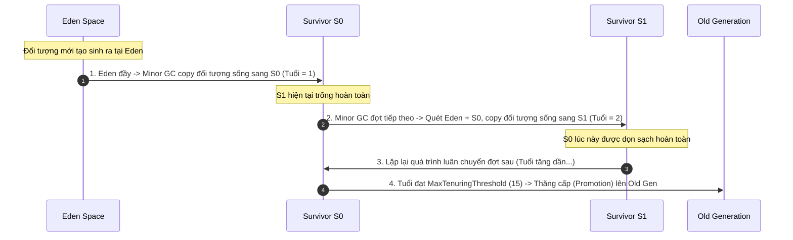

# Young generation, old generation là gì? Quy trình luân chuyển đối tượng ra sao?

## ⚡ Tóm tắt ngắn (30s)
* JVM chia bộ nhớ Heap làm hai phân vùng thế hệ chính dựa trên **Giả thuyết thế hệ yếu (Weak Generational Hypothesis)**: *"Hầu hết mọi đối tượng đều chết trẻ"*.
* **Young Generation (Thế hệ trẻ)**: Lưu giữ các đối tượng mới tạo. Gồm 3 vùng nhỏ: **Eden** (Nơi sinh ra) và cặp song sinh **Survivor S0 - S1** (Vùng đệm sống sót). Chiếm khoảng 1/3 dung lượng Heap.
* **Old Generation (Thế hệ già)**: Lưu giữ các đối tượng sống lâu năm, có kích thước cực lớn hoặc sống sót qua nhiều đợt kiểm thử GC. Chiếm khoảng 2/3 dung lượng Heap.
* **Quy trình luân chuyển**: Đối tượng sinh ra tại Eden $
ightarrow$ Minor GC chuyển sang S0/S1 và tăng Tuổi (Age) $
ightarrow$ Luân chuyển liên tục giữa S0 và S1 $
ightarrow$ Đạt ngưỡng tuổi tối đa (**MaxTenuringThreshold**) $
ightarrow$ Thăng cấp (**Promotion**) lên Old Generation.

---

## 🔍 Chi tiết bản chất

### 1. Tại sao cấu trúc Young Generation lại có hai vùng Survivor (S0 & S1)?
Đây là một tuyệt tác thiết kế của các kỹ sư JVM để áp dụng giải thuật **Mark-Copy** triệt tiêu phân mảnh bộ nhớ mà không lãng phí tài nguyên:
* Eden là nơi nạp đối tượng đầu tiên. Khi Eden đầy $
ightarrow$ Minor GC quét Eden và Survivor đang chứa dữ liệu (ví dụ S0), sao chép toàn bộ đối tượng còn sống sang Survivor còn lại (S1) một cách liên tục xếp khít nhau.
* Sau đó, JVM xóa sạch Eden và S0. Lúc này S0 trở thành vùng trống hoàn toàn.
* Ở đợt Minor GC tiếp theo, quy trình đảo ngược: quét Eden + S1 $
ightarrow$ Copy sang S0 $
ightarrow$ Xóa sạch Eden + S1.
* Nhờ thiết kế này, **luôn luôn có một vùng Survivor trống hoàn toàn (0% dữ liệu)** để làm đích đến cho thuật toán sao chép, bộ nhớ thế hệ trẻ hoàn toàn sạch sẽ không bị phân mảnh.

### 2. Quy trình thăng cấp (Promotion) chi tiết
Mỗi khi đối tượng sống sót sau một đợt Minor GC và được dịch chuyển thành công giữa các vùng Survivor, JVM sẽ ghi nhận sự kiện này bằng cách tăng biến đếm tuổi (**Age**) trong phần header của đối tượng (thuộc vùng **Mark Word** của đối tượng).
* Ngưỡng tuổi mặc định để thăng cấp là **`15`** đối với HotSpot JVM (cấu hình qua tham số `-XX:MaxTenuringThreshold`).
* Khi tuổi đạt tới ngưỡng này, ở đợt GC kế tiếp, đối tượng sẽ không được copy sang vùng Survivor nữa mà được chuyển hẳn sang **Old Generation** để định cư lâu dài.
* **Cơ chế Thăng cấp Đặc cách (Premature Promotion)**: Nếu kích thước đối tượng quá lớn vượt quá dung lượng cho phép của vùng Survivor, đối tượng đó sẽ được JVM đặc cách cho thăng cấp thẳng lên Old Generation ngay khi vừa sinh ra để tránh làm tràn vùng Survivor.

---

## 🎨 Sơ đồ Vòng đời luân chuyển đối tượng trong Heap



---

## 💻 Code Example

### BAD ❌ (Khởi tạo mảng Byte lớn liên tục làm tê liệt cơ chế Survivor, ép thăng cấp sớm gây Major GC)
```java
public class PrematurePromotion {
    public void generateGarbage() {
        // ❌ Tồi tệ: Khởi tạo mảng Byte dung lượng lớn (ví dụ 5MB) liên tục trong các tác vụ ngắn hạn.
        // Các mảng 5MB này vượt quá dung lượng tối đa của vùng Survivor nhỏ bé (thường chỉ vài chục MB).
        // JVM buộc phải đẩy thẳng (Premature Promotion) các mảng Byte này lên Old Gen để tránh tràn Survivor.
        // Old Gen nhanh chóng chứa đầy rác 5MB ngắn hạn, gây nghẽn và sập hiệu năng do Major GC.
        for (int i = 0; i < 1000; i++) {
            byte[] largeGarbage = new byte[1024 * 1024 * 5]; 
            doWork(largeGarbage);
        }
    }
    private void doWork(byte[] data) {}
}
```

### GOOD ✅ (Chia nhỏ dòng dữ liệu hoặc xử lý trực tuyến dạng Stream để tận dụng Eden)
```java
public class StreamOptimizer {
    public void processLargeData() {
        // ✅ Tốt: Thay vì nạp nguyên mảng lớn 5MB vào RAM, ta chia nhỏ dữ liệu thành các
        // block dung lượng bé (như 4KB) hoặc xử lý tuần tự dạng Stream.
        // Các block 4KB dễ dàng nằm gọn trong Eden, chết trẻ và bị dọn sạch bởi Minor GC siêu tốc,
        // tuyệt đối không làm phiền hay tràn lên vùng Old Gen.
        byte[] buffer = new byte[1024 * 4]; // 4KB Buffer
        while (hasMoreData()) {
            readDataToBuffer(buffer);
            doWork(buffer);
        }
    }
    private boolean hasMoreData() { return false; }
    private void readDataToBuffer(byte[] buf) {}
    private void doWork(byte[] data) {}
}
```

---

## 📊 Trade-off Analysis

| Phân vùng | Eden + Survivor (Young Gen) | Old Generation |
| :--- | :--- | :--- |
| **Bản chất đối tượng**| Vòng đời siêu ngắn (HTTP Request, biến tạm thời). | Vòng đời dài hạn (Spring Beans, Database Connection Pool, Caches). |
| **Dung lượng mặc định**| Chiếm **1/3** tổng dung lượng Heap. | Chiếm **2/3** tổng dung lượng Heap. |
| **Thuật toán áp dụng**| **Mark-Copy** (Sao chép tốc độ cao, yêu cầu vùng trống).| **Mark-Sweep-Compact** (Tránh phân mảnh, chi phí CPU cao). |
| **Tần suất GC** | Siêu cao (Hàng giây/phút). | Thấp. |
| **Chi phí thời gian** | Cực thấp (Vài mili giây). | Rất cao (Hàng trăm mili giây $
ightarrow$ giây). |

---

## ⚠️ Common Gotchas & Questions follow-up
1. **Tinh chỉnh Tỷ lệ phân chia thế hệ**:
   * Tham số **`-XX:SurvivorRatio=8`**: Xác định tỷ lệ kích thước giữa vùng Eden và các vùng Survivor. Giá trị mặc định là `8`, nghĩa là Eden chiếm 8 phần, S0 chiếm 1 phần, S1 chiếm 1 phần (Tổng thế hệ trẻ chia làm 10 phần).
   * Nếu SurvivorRatio quá lớn (ví dụ 20), vùng Survivor sẽ quá nhỏ, khiến đối tượng dễ bị đẩy sớm lên Old Gen. Nếu quá nhỏ, không gian Eden bị bóp nghẹt, Minor GC xảy ra liên tục.
2. 👉 **Câu hỏi đào sâu từ interviewer**: *Làm sao JVM tự động điều chỉnh tuổi thăng cấp mà không dùng tham số cố định?*
   * *(Trả lời: JVM sử dụng cơ chế tự động tối ưu gọi là **Target Survivor Ratio** (mặc định 50%). Sau mỗi đợt Minor GC, JVM sẽ tính toán tổng dung lượng của các đối tượng sống sót trong Survivor. Nếu tổng dung lượng này vượt quá 50% kích thước vùng Survivor, JVM sẽ tự động hạ thấp tuổi thăng cấp xuống (nhỏ hơn 15) để đẩy bớt đối tượng sang Old Gen, bảo vệ vùng Survivor không bị quá tải).*