# Sự khác biệt bản chất giữa Process (Tiến trình) và Thread (Luồng)

## ⚡ Tóm tắt ngắn (30s)
* **Process (Tiến trình)**: Là một thể hiện của chương trình đang chạy, được hệ điều hành cấp phát **không gian địa chỉ ảo và tài nguyên độc lập** (Virtual Memory, File Descriptors, Network Sockets). Các process không chia sẻ bộ nhớ trực tiếp với nhau.
* **Thread (Luồng)**: Là đơn vị thực thi nhỏ nhất bên trong một Process. Nhiều thread thuộc cùng một process **chia sẻ chung toàn bộ bộ nhớ của process đó** (Heap, Metaspace) nhưng sở hữu các tài nguyên riêng phục vụ thực thi như **Thread Stack, Program Counter (PC), Registers**.
* **Trọng tâm Senior**: Lập trình viên Senior lựa chọn Process khi cần **sự cô lập hoàn toàn (Isolation)** để đảm bảo an toàn hệ thống, và lựa chọn Thread khi cần **hiệu năng cao, độ trễ thấp và giao tiếp nhanh** giữa các luồng công việc.

---

## 🔍 Chi tiết bản chất thực chiến

### 1. Phân bổ Bộ nhớ & Tài nguyên (Resource Allocation)
* Khi một **Process** được tạo ra, hệ điều hành (OS) khởi tạo cấu trúc dữ liệu quản lý tiến trình (như Process Control Block - PCB) và cấp phát một vùng nhớ ảo riêng. Sự độc lập này ngăn chặn việc Process A can thiệp hay đọc trộm dữ liệu của Process B.
* Các **Thread** nằm gọn bên trong một Process. Chúng chia sẻ không gian bộ nhớ ảo này. Điều này mang lại lợi thế cực lớn về tốc độ do không cần ánh xạ địa chỉ mới, nhưng đặt ra thách thức về **Tranh chấp dữ liệu (Race Condition)** khi nhiều luồng cùng ghi vào một vùng nhớ trên Heap.

### 2. Chi phí Khởi tạo & Chuyển cảnh (Context Switching Overhead)
* **Khởi tạo (Creation)**: Tạo một Process yêu cầu OS thực hiện nhiều tác vụ hệ thống nặng nề (Fork/Exec, phân bổ page tables). Tạo Thread nhanh hơn khoảng 10-100 lần vì chỉ cần cấp phát một vùng Stack nhỏ (mặc định `-Xss1m` trong JVM) và đăng ký với bộ lập lịch (Scheduler).
* **Chuyển cảnh (Context Switch)**:
  * **Process Context Switch**: OS phải tráo đổi toàn bộ không gian địa chỉ ảo, làm sạch bộ nhớ đệm chuyển đổi địa chỉ phần cứng **TLB (Translation Lookaside Buffer)** $\rightarrow$ Gây sụt giảm hiệu năng nghiêm trọng (L1/L2 Cache Misses).
  * **Thread Context Switch**: Chỉ cần lưu và khôi phục các thanh ghi CPU (Registers) và Program Counter (PC). Do dùng chung không gian địa chỉ, dữ liệu trong CPU Cache vẫn có khả năng được tái sử dụng.

### 3. Phương thức Giao tiếp (Communication)
* **Giữa các Process**: Phải thông qua các cơ chế giao tiếp liên tiến trình **IPC (Inter-Process Communication)** phức tạp và tốn chi phí như: Sockets, Pipes, Message Queues hoặc Shared Memory.
* **Giữa các Thread**: Giao tiếp trực tiếp và siêu tốc thông qua việc đọc/ghi các đối tượng dùng chung trên Heap. Tuy nhiên, lập trình viên phải chủ động sử dụng các cơ chế đồng bộ hóa (Locks, Semaphores, Volatile) để bảo vệ dữ liệu.

---

## 🎨 Sơ đồ phân bổ vùng nhớ Process & Threads

```mermaid
graph TD
    subgraph OS["Hệ điều hành (OS) / RAM Vật lý"]
        subgraph ProcessSpace["Không gian Tiến trình (Process)"]
            subgraph SharedMemory["Vùng nhớ dùng chung (Shared)"]
                Heap["JVM Heap Memory <br> (Lưu trữ các đối tượng Object)"]
                Meta["Metaspace <br> (Lưu Class Metadata, Constants)"]
            end
            
            subgraph Thread1["Luồng 1 (Platform Thread)"]
                Stack1["Thread Stack 1 <br> (Local variables, Frame)"]
                PC1["PC & Registers 1"]
            end
            
            subgraph Thread2["Luồng 2 (Platform Thread)"]
                Stack2["Thread Stack 2 <br> (Local variables, Frame)"]
                PC2["PC & Registers 2"]
            end
        end
    end

    style ProcessSpace fill:#1a365d,stroke:#3182ce,stroke-width:2px
    style SharedMemory fill:#2d3748,stroke:#a0aec0
    style Thread1 fill:#1c1c1c,stroke:#48bb78,stroke-width:2px
    style Thread2 fill:#1c1c1c,stroke:#48bb78,stroke-width:2px
```



---

## 💻 Code Example

### BAD ❌ (Sinh Process mới ngoài hệ điều hành để xử lý tác vụ nền)
```java
// ❌ Tệ: Mỗi khi có request, lại gọi OS tạo tiến trình chạy lệnh bên ngoài.
// Việc này tiêu tốn lượng lớn tài nguyên OS và dễ bị tấn công Command Injection.
public void handleLogParsing(String filePath) throws IOException {
    ProcessBuilder pb = new ProcessBuilder("sh", "-c", "grep 'ERROR' " + filePath);
    Process process = pb.start(); // Khởi tạo một OS Process mới cực kỳ đắt đỏ
    // Đọc kết quả từ process input stream...
}
```

### GOOD ✅ (Sử dụng Thread Pool để xử lý tác vụ nền an toàn và tối ưu)
```java
public class LogParser {
    // ✅ Tốt: Tạo Thread Pool cố định tái sử dụng các luồng thực thi trong bộ nhớ
    private final ExecutorService executor = Executors.newFixedThreadPool(8);

    public void handleLogParsing(String filePath) {
        executor.submit(() -> {
            try (BufferedReader reader = new BufferedReader(new FileReader(filePath))) {
                String line;
                while ((line = reader.readLine()) != null) {
                    if (line.contains("ERROR")) {
                        processErrorLog(line);
                    }
                }
            } catch (IOException e) {
                log.error("Lỗi đọc file log", e);
            }
        });
    }
}
```

---

## 📊 Trade-off Analysis: So sánh Process vs Thread

| Tiêu chí | Process (Tiến trình) | Thread (Luồng) |
| :--- | :--- | :--- |
| **Tính cô lập (Isolation)** | **Cực cao**: Một process bị crash do lỗi phân đoạn (Segmentation fault) không ảnh hưởng tới các process khác. | **Thấp**: Một thread ném ra ngoại lệ không được catch (`OutOfMemoryError` trên heap) có thể kéo sập cả Process. |
| **Chi phí khởi tạo** | Rất cao (OS cần phân bổ RAM ảo, nạp nhị phân). | Rất thấp (Chỉ cần tạo Stack và đăng ký Scheduler). |
| **Context Switch** | Chậm (OS phải đổi Page Table, xóa bộ nhớ đệm TLB). | Rất nhanh (Chỉ đổi Registers và Program Counter). |
| **Truyền thông tin** | Chậm và phức tạp (Phải dùng IPC, Serialize dữ liệu). | Siêu nhanh (Đọc/ghi trực tiếp vùng nhớ Heap dùng chung). |
| **Khả năng Scale ngang** | Tự nhiên (Dễ dàng chạy trên nhiều Node mạng vật lý khác nhau). | Giới hạn bên trong một máy chủ vật lý duy nhất. |

---

## ⚠️ Common Gotchas & Questions follow-up
1. **Rủi ro rò rỉ Tiến trình con (Zombies/Defunct Processes)**:
   Nếu bạn tạo một Process trong Java bằng `ProcessBuilder` mà không xử lý hủy hoặc đợi nó kết thúc (`process.waitFor()`), tiến trình con đó khi chạy xong sẽ trở thành Zombie Process chiếm dụng bảng tiến trình của hệ điều hành.
2. 👉 **Câu hỏi đào sâu từ interviewer**: *Làm thế nào Java 21 Virtual Threads giải quyết vấn đề Thread Context Switch đắt đỏ của hệ điều hành?*
   * *(Trả lời: Java 21 giới thiệu Virtual Threads (Luồng ảo). Khác với Platform Threads truyền thống ánh xạ 1-1 với luồng của OS, hàng triệu Virtual Threads được quản lý trực tiếp bởi JVM ở tầng User Space. Khi một Virtual Thread thực hiện thao tác block I/O (như gọi DB, gọi API), JVM sẽ tự động tháo dỡ (unmount) luồng ảo đó khỏi luồng vật lý gánh đỡ (Carrier Thread) và lưu trạng thái Stack của nó lên Heap. Nhờ đó, luồng vật lý không bị block và có thể chạy luồng ảo khác. Chi phí unmount/mount luồng ảo chỉ là thao tác sao chép vùng nhớ Heap cực nhanh, triệt tiêu hoàn toàn chi phí Context Switch ở tầng nhân OS).*