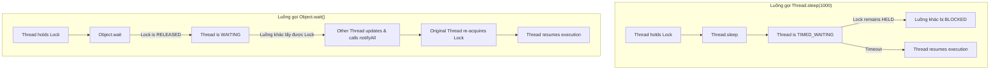

# Sự khác biệt toàn diện giữa Thread.sleep() và Object.wait()

## ⚡ Tóm tắt ngắn (30s)
Điểm khác biệt cốt lõi nhất nằm ở **hành vi đối với Khóa (Lock)**:
* **`Thread.sleep()`**: Là phương thức tĩnh (`static`) của lớp `Thread`. Nó bắt luồng hiện tại tạm dừng chạy trong một khoảng thời gian cụ thể nhưng **KHÔNG GIẢI PHÓNG KHÓA** mà luồng đó đang nắm giữ.
* **`Object.wait()`**: Là phương thức thực thể (`instance method`) của lớp `Object`. Nó bắt luồng nhả khóa hiện tại ra (**RELEASE LOCK**), đi ngủ và chờ đợi tín hiệu thức dậy (`notify/notifyAll`) hoặc hết hạn thời gian (`timeout`).

---

## 🔍 Chi tiết bản chất thực chiến

### 1. Bản chất hoạt động của Thread.sleep()
* `sleep()` chỉ đơn thuần là ra lệnh cho Scheduler của Hệ điều hành tạm dừng cấp phát CPU cho luồng hiện tại trong một thời lượng. Luồng chuyển sang trạng thái `TIMED_WAITING`.
* Nếu luồng đang ở trong một block `synchronized`, mọi khóa vẫn bị giữ chặt. Không một luồng nào khác có thể chạm vào các tài nguyên được bảo vệ bởi khóa đó.
* Thường dùng để: Tạo độ trễ nhân tạo, thực hiện cơ chế retry, poll dữ liệu định kỳ.

### 2. Bản chất hoạt động của Object.wait()
* `wait()` hoạt động dựa trên cơ chế Monitor Lock. Mục đích chính của nó là giải phóng khóa để nhường đường cho luồng khác chạy vào thay đổi dữ liệu hoặc trạng thái, sau đó mới đón tín hiệu thức dậy.
* Khi kết thúc thời gian chờ hoặc nhận tín hiệu đánh thức, luồng phải **tranh cướp lấy lại khóa** rồi mới có thể tiếp tục chạy từ dòng code sau `wait()`.
* Thường dùng để: Thiết kế hàng đợi đồng bộ, cơ chế Producer-Consumer, phối hợp hoạt động đa luồng.

---

## 🎨 Sơ đồ trực quan Vòng đời Thread đối với sleep() và wait()



---

## 💻 Code Example

### BAD ❌ (Lạm dụng sleep() trong khối synchronized gây nghẽn toàn hệ thống)
```java
public class HeavyLockService {
    private final Object lock = new Object();

    public void processData() {
        synchronized (lock) {
            System.out.println(Thread.currentThread().getName() + " chiếm khóa.");
            try {
                // ❌ Tệ: Ngủ 5 giây trong khi giữ khóa. 
                // Tất cả các thread khác gọi đến method này đều bị đứng hình xếp hàng!
                Thread.sleep(5000); 
            } catch (InterruptedException e) {
                Thread.currentThread().interrupt();
            }
            System.out.println(Thread.currentThread().getName() + " nhả khóa.");
        }
    }
}
```

### GOOD ✅ (Dùng wait() để phối hợp luồng thông minh, giải phóng tài nguyên lập tức)
```java
public class CooperativeService {
    private final Object lock = new Object();
    private boolean isReady = false;

    public void waitForReady() {
        synchronized (lock) {
            while (!isReady) {
                try {
                    // ✅ Tốt: Nhả khóa ngay lập tức để luồng khác vào gọi setReadyTrue()
                    lock.wait(); 
                } catch (InterruptedException e) {
                    Thread.currentThread().interrupt();
                }
            }
            System.out.println("Bắt đầu xử lý khi đã Ready!");
        }
    }

    public void setReadyTrue() {
        synchronized (lock) {
            isReady = true;
            lock.notifyAll(); // ✅ Đánh thức luồng đang wait
        }
    }
}
```

---

## 📊 Trade-off Analysis: So sánh chi tiết sleep() vs wait()

| Tiêu chí | Thread.sleep() | Object.wait() |
| :--- | :--- | :--- |
| **Lớp khai báo** | Lớp `java.lang.Thread` (phương thức static). | Lớp `java.lang.Object` (phương thức thực thể). |
| **Quản lý Khóa (Lock)** | **Giữ nguyên khóa**, không giải phóng bất kỳ tài nguyên khóa nào đang nắm giữ. | **Nhả khóa hoàn toàn** của đối tượng gọi wait(). |
| **Môi trường gọi** | Có thể gọi ở **bất kỳ đâu** trong mã nguồn. | **Bắt buộc** gọi bên trong khối/phương thức `synchronized`. |
| **Cách thức đánh thức** | Tự động tỉnh giấc sau khi **hết thời gian chỉ định** (timeout). | Cần luồng khác gọi `notify()`/`notifyAll()` (hoặc hết hạn timeout nếu cấu hình wait(timeout)). |
| **Trạng thái luồng (Thread State)** | `TIMED_WAITING` | `WAITING` hoặc `TIMED_WAITING` (đang nằm trong Wait Set). |

---

## ⚠️ Common Gotchas & Questions follow-up

* **Xử lý InterruptedException**:
  Cả `sleep()` và `wait()` đều ném ra ngoại lệ `InterruptedException`. Khi bắt được lỗi này, trạng thái bị gián đoạn (interrupt flag) của luồng sẽ bị JVM xóa đi.
  👉 **Quy tắc vàng**: Đừng nuốt ngoại lệ này một cách im lặng. Hãy khôi phục lại trạng thái interrupt bằng cách gọi: `Thread.currentThread().interrupt()` để báo hiệu cho các thành phần phía trên biết luồng đã bị yêu cầu hủy bỏ.
* 👉 **Câu hỏi đào sâu từ interviewer**: *Tại sao phương thức sleep() lại được thiết kế là static method?*
  * *(Trả lời: Việc sleep() được thiết kế là một static method của Thread nhằm nhấn mạnh nguyên lý: "Một luồng chỉ có thể điều khiển chính mình đi ngủ chứ không bao giờ có thể bắt một luồng khác đi ngủ". Nếu nó là một phương thức instance (như `threadA.sleep()`), lập trình viên sẽ dễ lầm tưởng rằng luồng hiện tại có thể ép luồng threadA đi ngủ, điều này hoàn toàn bất khả thi vì quyền điều khiển luồng thuộc về Thread Scheduler của Hệ Điều Hành).*