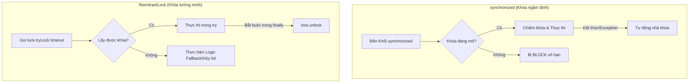

# ReentrantLock khác gì synchronized? Khi nào nên chọn loại nào?

## ⚡ Tóm tắt ngắn (30s)
* **`synchronized`** là cơ chế khóa có sẵn trong cú pháp ngôn ngữ (**Intrinsic Lock**). Ưu điểm lớn nhất là cú pháp cực kỳ ngắn gọn, tự động giải phóng khóa khi kết thúc khối mã (ngay cả khi xảy ra Exception), giúp hạn chế lỗi leak khóa.
* **`ReentrantLock`** (từ gói `java.util.concurrent.locks`) là một lớp triển khai khóa bằng mã Java nâng cao (**Explicit Lock**). Nó vượt trội `synchronized` nhờ cung cấp các tính năng cao cấp:
  1. Thử lấy khóa không block (`tryLock()`).
  2. Thử lấy khóa có thiết lập timeout (`tryLock(timeout)`).
  3. Cho phép luồng đang chờ khóa có thể bị ngắt (`lockInterruptibly()`).
  4. Hỗ trợ khóa công bằng (`Fair Lock`).
  5. Hỗ trợ nhiều điều kiện chờ đợi (`Multiple Conditions`).

---

## 🔍 Chi tiết bản chất thực chiến

### 1. Bản chất của "Reentrant" (Khóa tái vào)
Cả `synchronized` và `ReentrantLock` đều mang tính chất **Reentrant** (tái vào). Nghĩa là: Nếu một luồng đang nắm giữ khóa của đối tượng A, nó có thể thoải mái gọi một phương thức khác cũng yêu cầu chính khóa của đối tượng A mà không tự gây deadlock cho chính mình. JVM sẽ tăng biến đếm số lần giữ khóa (Hold Count) lên và giảm đi khi thoát ra khỏi khối code.

### 2. Sức mạnh của ReentrantLock vượt trội hơn synchronized ở đâu?
* **Khả năng tryLock()**: Tránh nghẽn luồng vô hạn. Luồng thử lấy khóa, nếu không được sẽ lập tức rút lui hoặc làm việc khác thay vì bị đóng băng trạng thái như `synchronized`.
* **Khóa Công bằng (Fairness)**: `new ReentrantLock(true)` đảm bảo luồng nào đến trước trong hàng đợi FIFO sẽ được cấp khóa trước. `synchronized` hoàn toàn là Unfair Lock.
* **Nhiều điều kiện chờ (Condition)**: Một `ReentrantLock` có thể tạo ra nhiều đối tượng `Condition` (`lock.newCondition()`). Điều này cho phép phân tách rạch ròi tín hiệu đánh thức luồng sản xuất và luồng tiêu thụ trên cùng một khóa (thay vì đánh thức chung chung bằng `notifyAll()`).

---

## 🎨 Sơ đồ trực quan So sánh Luồng xử lý khóa



---

## 💻 Code Example

### BAD ❌ (synchronized có thể gây đứng service vô hạn nếu hệ thống bị chậm)
```java
public class LegacyPaymentService {
    private final Object paymentLock = new Object();

    public void processPayment() {
        // ❌ Tệ: Nếu hệ thống bên ngoài chậm, thread sẽ bị block ở đây vô hạn, 
        // cạn kiệt thread pool nhanh chóng và làm sập toàn bộ ứng dụng.
        synchronized (paymentLock) {
            callThirdPartyGateway(); 
        }
    }
}
```

### GOOD ✅ (Dùng ReentrantLock bảo vệ thread pool bằng tryLock có timeout)
```java
public class ResilientPaymentService {
    private final ReentrantLock lock = new ReentrantLock();

    public void processPayment() {
        try {
            // ✅ Tốt: Thử lấy khóa trong vòng 2 giây, nếu quá thời gian sẽ hủy bỏ giao dịch
            if (lock.tryLock(2, TimeUnit.SECONDS)) {
                try {
                    callThirdPartyGateway();
                } finally {
                    // ✅ Bắt buộc: Phải giải phóng khóa trong khối finally
                    lock.unlock(); 
                }
            } else {
                // ✅ Tốt: Xử lý fallback khi hệ thống quá tải
                throw new PaymentTimeoutException("Hệ thống bận, vui lòng thử lại sau!");
            }
        } catch (InterruptedException e) {
            Thread.currentThread().interrupt();
        }
    }
}
```

---

## 📊 Trade-off Analysis: So sánh toàn diện synchronized vs ReentrantLock

| Tiêu chí | synchronized | ReentrantLock |
| :--- | :--- | :--- |
| **Loại hình cơ chế** | Ngôn ngữ tích hợp sẵn (Cú pháp gốc JVM). | Thư viện Java API (`java.util.concurrent.locks`). |
| **Độ phức tạp mã nguồn** | **Rất thấp**: Rất sạch sẽ, không lo leak khóa. | **Trung bình**: Đòi hỏi khối `try-finally` và bắt buộc gọi `unlock()` thủ công. |
| **Cơ chế công bằng (Fair)** | Không hỗ trợ (Chỉ có Unfair). | Có hỗ trợ thông qua cấu hình khởi tạo (`true`). |
| **Khả năng Không block** | Không (Chỉ có thể chờ đợi vô hạn). | Có (`tryLock()` hoặc `tryLock(timeout)`). |
| **Khả năng Bị gián đoạn** | Không hỗ trợ gián đoạn khi đang đợi khóa. | Có hỗ trợ thông qua `lockInterruptibly()`. |
| **Điều kiện chờ (Condition)** | Chỉ có 1 điều kiện gắn liền với Monitor Lock. | Vô số điều kiện nhờ liên kết nhiều đối tượng `Condition`. |
| **Hiệu năng (Performance)** | Rất tốt trong Java hiện đại nhờ JVM tối ưu hóa cao. | Cực kỳ vượt trội khi contention cực cao nhờ thuật toán lock-free nâng cao (AQS). |

---

## ⚠️ Common Gotchas & Questions follow-up

* **Quên gọi unlock() trong finally**:
  Đây là lỗi rò rỉ bộ nhớ và tài nguyên cực kỳ nghiêm trọng khi dùng `ReentrantLock`. Nếu code trong khối `try` bị lỗi và ném ra Exception trước khi đến dòng `unlock()`, khóa đó sẽ bị chiếm giữ vĩnh viễn $
ightarrow$ Toàn bộ luồng sau bị kẹt cứng.
  👉 **Quy tắc bắt buộc**: Luôn gọi `lock.unlock()` ở dòng đầu tiên của khối `finally`.
* 👉 **Câu hỏi đào sâu từ interviewer**: *Biểu diễn cơ chế hoạt động ngầm của ReentrantLock. Nó dùng cấu trúc gì để quản lý hàng đợi luồng?*
  * *(Trả lời: ReentrantLock hoạt động dựa trên khung sườn **AQS (AbstractQueuedSynchronizer)**. AQS sử dụng một biến trạng thái kiểu volatile mang tính nguyên tử (`state`) -- đại diện cho trạng thái khóa, và một hàng đợi hai chiều CLH (Craig, Landin, and Hagersten lock queue) dưới dạng danh sách liên kết các node luồng đang chờ. Các thao tác ghi đè trạng thái khóa được thực thi thông qua so sánh và tráo đổi nguyên tử CAS).*