# ReadWriteLock phù hợp khi nào? Phân tích hiệu năng và cơ chế hoạt động

## ⚡ Tóm tắt ngắn (30s)
* **`ReadWriteLock`** (triển khai phổ biến qua `ReentrantReadWriteLock`) là cơ chế khóa tách biệt quyền truy cập tài nguyên dùng chung thành 2 khóa riêng biệt:
  1. **Read Lock (Khóa đọc - Shared Lock)**: Nhiều luồng được phép đồng thời giữ khóa này để đọc dữ liệu song song.
  2. **Write Lock (Khóa ghi - Exclusive Lock)**: Chỉ duy nhất 1 luồng được phép nắm giữ khóa này để ghi/cập nhật dữ liệu. Khi khóa ghi được kích hoạt, mọi yêu cầu đọc/ghi khác đều bị chặn.
* **Use-case tối thượng**: Phù hợp nhất cho các hệ thống **Read-Heavy (Đọc cực nhiều, Ghi cực ít)**. Nếu tỷ lệ đọc/ghi đạt từ 90/10 trở lên, `ReadWriteLock` giúp tăng thông lượng xử lý của ứng dụng lên gấp nhiều lần so với khóa độc quyền (`synchronized` hay `ReentrantLock`).

---

## 🔍 Chi tiết bản chất thực chiến

### 1. Quy tắc hoạt động của ReadWriteLock
* **Read - Read**: Song song hoàn toàn. (Không block nhau).
* **Read - Write**: Tuần tự hóa. (Luồng ghi phải đợi tất cả luồng đọc hoàn tất; luồng đọc phải đợi luồng ghi nhả khóa).
* **Write - Write**: Tuần tự hóa hoàn toàn. (Không luồng ghi nào được chạy song song).

### 2. Sự đánh đổi khốc liệt (Trade-offs)
Mặc dù lý thuyết cho phép đọc song song nghe rất hấp dẫn, `ReadWriteLock` có chi phí quản lý nội bộ (lock overhead) lớn hơn nhiều so với `ReentrantLock` thông thường. 
Nếu hệ thống của bạn có tần suất ghi cao (ví dụ trên 15% tổng thao tác) hoặc thời gian đọc dữ liệu diễn ra quá nhanh, việc tranh giành khóa nội bộ của `ReadWriteLock` sẽ làm hiệu năng hệ thống **tệ hơn** cả khóa độc quyền thông thường.

---

## 🎨 Sơ đồ trực quan Cơ chế Đọc - Ghi song song

```mermaid
graph TD
    subgraph ReadLock["Read Lock (Shared)"]
        ThreadR1["Luồng Đọc 1"] --> Resource["Tài Nguyên Dùng Chung"]
        ThreadR2["Luồng Đọc 2"] --> Resource
        ThreadR3["Luồng Đọc 3"] --> Resource
    end
    
    subgraph WriteLock["Write Lock (Exclusive)"]
        ThreadW["Luồng Ghi (Độc Quyền)"] -- Block all Reads/Writes --> Resource2["Tài Nguyên Dùng Chung"]
    end
    
    style ReadLock fill:#1a365d,stroke:#48bb78,stroke-width:2px
    style WriteLock fill:#2d3748,stroke:#f56565,stroke-width:2px
```



---

## 💻 Code Example

### BAD ❌ (Dùng khóa độc quyền thô sơ gây nghẽn hiệu năng trên cache đọc nhiều)
```java
public class PoorPerformanceCache {
    private final Map<String, Object> map = new HashMap<>();
    private final Lock lock = new ReentrantLock(); // Khóa độc quyền toàn phần

    public Object get(String key) {
        lock.lock(); 
        try {
            // ❌ Tệ: Ngay cả khi 100 luồng chỉ muốn ĐỌC dữ liệu cùng lúc, 
            // chúng vẫn phải xếp hàng tuần tự từng luồng một.
            return map.get(key); 
        } finally {
            lock.unlock();
        }
    }

    public void put(String key, Object val) {
        lock.lock();
        try {
            map.put(key, val);
        } finally {
            lock.unlock();
        }
    }
}
```

### GOOD ✅ (Dùng ReentrantReadWriteLock mở khóa sức mạnh đọc song song song)
```java
public class HighThroughputCache {
    private final Map<String, Object> map = new HashMap<>();
    private final ReentrantReadWriteLock rwLock = new ReentrantReadWriteLock();
    private final Lock readLock = rwLock.readLock();   // Khóa đọc dùng chung
    private final Lock writeLock = rwLock.writeLock(); // Khóa ghi độc quyền

    public Object get(String key) {
        readLock.lock(); // ✅ Tốt: Hàng nghìn luồng đọc có thể chạy đồng thời
        try {
            return map.get(key);
        } finally {
            readLock.unlock();
        }
    }

    public void put(String key, Object val) {
        writeLock.lock(); // ✅ Tốt: Chỉ khóa hệ thống khi thực sự cần thay đổi dữ liệu
        try {
            map.put(key, val);
        } finally {
            writeLock.unlock();
        }
    }
}
```

---

## 📊 Trade-off Analysis: Khóa Độc Quyền vs ReadWriteLock

| Tiêu chí | Khóa Độc Quyền (ReentrantLock) | Khóa Đọc-Ghi (ReadWriteLock) |
| :--- | :--- | :--- |
| **Mức độ song song** | Thấp (Mọi thao tác đọc/ghi đều bị tuần tự hóa). | Cao (Đọc song song, chỉ ghi mới chặn hệ thống). |
| **Chi phí quản lý khóa (Overhead)**| **Rất thấp**: Rất nhanh và nhẹ. | **Cao**: Tốn nhiều chu kỳ CPU để cập nhật trạng thái đếm số luồng đọc. |
| **Nguy cơ đói luồng (Starvation)** | Không có (Hoặc rất ít nếu dùng Fair Lock). | **Cao**: Luồng ghi có thể bị đói khóa vĩnh viễn nếu luồng đọc liên tục ồ ạt tràn vào. |
| **Độ phức tạp code** | Đơn giản. | Phức tạp hơn chút (Quản lý 2 khóa song song). |
| **Tỷ lệ truy cập phù hợp** | Ghi nhiều hoặc Đọc/Ghi ngang bằng nhau. | Đọc chiếm đa số tuyệt đối (> 90%). |

---

## ⚠️ Common Gotchas & Questions follow-up

* **Vấn đề Đói luồng Ghi (Write Starvation)**:
  Mặc định, nếu các luồng đọc liên tục yêu cầu khóa đọc và giữ luồng đọc liên tục gối đầu nhau, luồng ghi sẽ **không bao giờ** giành được khóa ghi $\rightarrow$ Gây lỗi Starvation trầm trọng cho tiến trình cập nhật.
  👉 **Cách xử lý**: Khởi tạo ReentrantReadWriteLock với chế độ công bằng (`new ReentrantReadWriteLock(true)`). Khi đó, nếu có luồng ghi đang đợi, các luồng đọc mới đến sau sẽ bị ép xếp hàng chờ sau luồng ghi đó, tránh việc luồng đọc chiếm dụng khóa vô hạn.
* 👉 **Câu hỏi đào sâu từ interviewer**: *StampedLock trong Java 8 giải quyết điểm yếu gì của ReadWriteLock?*
  * *(Trả lời: StampedLock cung cấp cơ chế **Optimistic Reading** (Đọc lạc quan). Nó cho phép luồng đọc lấy dữ liệu mà không cần thực sự khóa tài nguyên (không tăng biến đếm khóa đọc). Sau khi đọc xong, luồng kiểm tra xem có luồng ghi nào vừa can thiệp vào dữ liệu không bằng cách so sánh mã Stamp. Nếu không có xung đột, dữ liệu được sử dụng lập tức $\rightarrow$ Hiệu năng đạt mức tiệm cận tối đa của phần cứng, loại bỏ hoàn toàn hiện tượng nghẽn do lock overhead).*