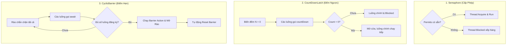

# Phân biệt toàn diện Semaphore, CountDownLatch và CyclicBarrier

## ⚡ Tóm tắt ngắn (30s)
Đây là ba công cụ đồng bộ hóa luồng nâng cao (**Synchronizers**) cực kỳ mạnh mẽ trong gói `java.util.concurrent`:
* **`Semaphore`**: Hoạt động như **Hệ thống cấp phép phép**. Nó quản lý một số lượng thẻ truy cập (`permits`) giới hạn. Luồng muốn truy cập tài nguyên phải giành được thẻ (`acquire()`) và trả lại khi xong (`release()`). Thích hợp để **giới hạn số luồng đồng thời** truy cập tài nguyên.
* **`CountDownLatch`**: Hoạt động như **Thiết bị đếm ngược**. Một hoặc nhiều luồng sẽ bị chặn cho đến khi các luồng khác thực hiện xong một chuỗi công việc và kéo biến đếm về 0 (`countDown()`). **Chỉ dùng được 1 lần duy nhất** (không thể reset).
* **`CyclicBarrier`**: Hoạt động như **Điểm hẹn hội quân**. Một nhóm luồng cố định sẽ đợi nhau tại một rào chắn (`await()`). Khi tất cả đã tụ hội đầy đủ, rào chắn sẽ mở ra để cả nhóm cùng tiếp tục. **Có thể tái sử dụng tuần hoàn** (Cyclic).

---

## 🔍 Chi tiết bản chất thực chiến

### 1. Bản chất Semaphore
* Semaphore quản lý một số nguyên đại diện cho giấy phép. Nó không liên kết quyền sở hữu với bất kỳ luồng cụ thể nào (Luồng A có thể acquire nhưng luồng B lại release hộ - đây là điểm khác với Lock thông thường).
* Nếu số permit = 1, nó được gọi là **Binary Semaphore**, hoạt động tương tự như một Mutex Lock nhưng không có tính chất Reentrant (Tái vào).

### 2. Bản chất CountDownLatch (Chờ tác vụ hoàn tất)
* Latch là một chiếc then cửa. Nó giữ cho cánh cửa đóng chặt cho đến khi biến đếm lùi về 0.
* Thường dùng khi luồng chính cần đợi các tác vụ khởi động hệ thống (như kết nối Database, load cấu hình, kết nối cache) chạy song song ở các luồng phụ hoàn tất rồi mới chính thức phục vụ request.

### 3. Bản chất CyclicBarrier (Chờ các luồng hội quân)
* Tự động reset biến đếm sau khi rào chắn bị phá vỡ để tiếp tục vòng lặp mới.
* Hỗ trợ cấu hình một **Barrier Action** (luồng chạy bổ sung) tự động thực thi ngay khi các luồng vừa hội tụ đầy đủ trước khi rào chắn mở ra. Phù hợp cho các thuật toán tính toán song song đa luồng chia theo giai đoạn (Multi-phase processing).

---

## 🎨 Sơ đồ trực quan So sánh 3 cơ chế Đồng Bộ Hóa



---

## 💻 Code Example

### BAD ❌ (Dùng CountDownLatch cho tác vụ tuần hoàn có chu kỳ làm leak rác và GC)
```java
public class CycleSystem {
    // ❌ Tệ: Nếu công việc cần lặp đi lặp lại nhiều vòng (chu kỳ), việc dùng CountDownLatch 
    // bắt buộc chúng ta phải tạo mới đối tượng CountDownLatch liên tục ở mỗi chu kỳ.
    // Điều này tạo gánh nặng cực lớn cho bộ nhớ Heap và Garbage Collector (GC).
    public void runCyclicTask() {
        while (true) {
            CountDownLatch latch = new CountDownLatch(3);
            startThreeWorkerThreads(latch);
            try {
                latch.await(); 
            } catch (InterruptedException e) {
                Thread.currentThread().interrupt();
            }
        }
    }
}
```

### GOOD ✅ (Dùng CyclicBarrier đúng cách cho bài toán hội quân tuần hoàn)
```java
public class CleanCycleSystem {
    // ✅ Tốt: Khởi tạo CyclicBarrier duy nhất 1 lần, tự động tái sử dụng cho các vòng sau
    private final CyclicBarrier barrier = new CyclicBarrier(3, () -> {
        // ✅ Run tự động mỗi khi đủ 3 worker hội tụ
        System.out.println("Cả 3 luồng đã hoàn thành giai đoạn. Tiến hành tổng hợp dữ liệu!");
    });

    public void startSystem() {
        for (int i = 0; i < 3; i++) {
            new Thread(new Worker()).start();
        }
    }

    private class Worker implements Runnable {
        @Override
        public void run() {
            try {
                while (!Thread.currentThread().isInterrupted()) {
                    doPhase1Work();
                    // ✅ Tốt: Đợi hai luồng còn lại hội quân tại đây
                    barrier.await(); 
                    
                    doPhase2Work();
                    barrier.await(); // ✅ Tái sử dụng barrier ngay lập tức cho phase tiếp theo!
                }
            } catch (Exception e) {
                // Xử lý InterruptedException và BrokenBarrierException
            }
        }
    }
}
```

---

## 📊 Trade-off Analysis: So sánh Semaphore vs CountDownLatch vs CyclicBarrier

| Tiêu chí | Semaphore | CountDownLatch | CyclicBarrier |
| :--- | :--- | :--- | :--- |
| **Mục đích chính** | Giới hạn số luồng truy cập tài nguyên song song cùng lúc. | Chờ đợi các tác vụ/luồng phụ khác hoàn thành. | Phối hợp nhóm luồng đồng bộ tại các cột mốc tính toán. |
| **Khả năng tái sử dụng** | Có ( permits liên tục tăng giảm qua acquire/release). | **Hoàn toàn không**. Biến đếm về 0 là hết hạn sử dụng. | **Có** (tự động reset về số luồng ban đầu sau khi mở rào). |
| **Thực thể kích hoạt** | Luồng đang chạy gọi `acquire()` hoặc `release()`. | Luồng phụ gọi `countDown()` (không bị block lại). | Chính các luồng đang xử lý gọi `await()` (bị block tại rào). |
| **Quản lý lỗi chéo** | Lỗi của 1 luồng không ảnh hưởng trực tiếp đến các luồng khác. | Không tự động hủy bỏ các luồng khác nếu 1 luồng bị lỗi. | **Lỗi dây chuyền**: Nếu 1 luồng bị interrupt hoặc Exception tại barrier, toàn bộ rào chắn vỡ (`BrokenBarrierException`). |

---

## ⚠️ Common Gotchas & Questions follow-up

* **Cạm bẫy BrokenBarrierException**:
  Trong `CyclicBarrier`, nếu một luồng bị ngắt (`interrupt`) hoặc gặp lỗi thời gian chờ khi đang nằm ở hàng đợi rào chắn, tất cả các luồng khác đang đợi tại rào chắn đó sẽ lập tức bị thức dậy và ném ra ngoại lệ `BrokenBarrierException`. Rào chắn chuyển sang trạng thái bị vỡ (`broken`).
  👉 **Cách xử lý**: Phải chủ động kiểm tra trạng thái rào chắn bằng `barrier.isBroken()` và gọi `barrier.reset()` để khôi phục rào chắn về trạng thái ban đầu trước khi tiếp tục chu kỳ mới.
* 👉 **Câu hỏi đào sâu từ interviewer**: *Phân biệt Semaphore với Lock thông thường. Tại sao nói Semaphore có thể gây ra hiện tượng mất kiểm soát tài nguyên?*
  * *(Trả lời: Điểm khác biệt mấu chốt là Lock có khái niệm "Sở hữu luồng" (Thread Ownership) - chỉ luồng nào chiếm khóa mới được phép nhả khóa. Semaphore hoàn toàn không có thuộc tính này; bất kỳ luồng nào cũng có thể gọi release() để tăng số permit lên, ngay cả khi nó chưa từng gọi acquire() trước đó. Lỗi logic này có thể vô tình làm tăng số lượng luồng truy cập vượt quá giới hạn thiết kế ban đầu).*