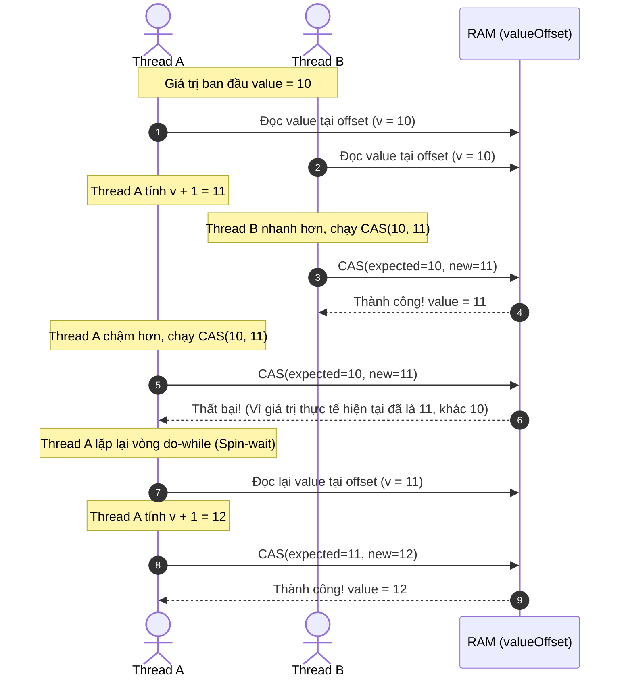

# Phân tích chuyên sâu cơ chế hoạt động của AtomicInteger

## ⚡ Tóm tắt ngắn (30s)
`AtomicInteger` trong Java cung cấp giải pháp thực thi các phép toán số học và cập nhật giá trị số nguyên một cách **thread-safe, lock-free và nguyên tử (atomic)**. Nó không sử dụng từ khóa `synchronized` hay cơ chế Lock cấp cao của HĐH để tránh bị block luồng (no heavy thread context switching). Thay vào đó, nó hoạt động dựa trên sự kết hợp hoàn hảo giữa:
1. Từ khóa **`volatile`** áp dụng cho biến chứa giá trị thực tế (`value`), bảo đảm tính **visibility** (mọi luồng thấy ngay giá trị mới nhất).
2. Cơ chế **CAS (Compare-And-Swap)** chạy trực tiếp chỉ thị cấp phần cứng để thực hiện cập nhật giá trị.
3. Địa chỉ bộ nhớ vật lý gián tiếp qua lớp nội bộ **`sun.misc.Unsafe`** (hoặc `VarHandle` từ Java 9 trở đi) giúp thao tác đọc/ghi trực tiếp trên RAM.

---

## 🔍 Chi tiết bản chất thực chiến

### 1. Cấu trúc bộ nhớ của AtomicInteger
Khi một class `AtomicInteger` được nạp vào JVM, nó thực hiện các bước cấu hình bộ nhớ đặc biệt:
```java
private static final sun.misc.Unsafe unsafe = sun.misc.Unsafe.getUnsafe();
private static final long valueOffset;

static {
    try {
        // Lấy địa chỉ offset bộ nhớ tuyệt đối của trường "value" trong class AtomicInteger
        valueOffset = unsafe.objectFieldOffset
            (AtomicInteger.class.getDeclaredField("value"));
    } catch (Exception ex) { throw new Error(ex); }
}

private volatile int value;
```
* **`valueOffset`**: Đây là địa chỉ tương đối (offset) của biến `value` bên trong đối tượng `AtomicInteger` trên Heap. Nhờ có offset này, JVM có thể ra lệnh cho CPU can thiệp thẳng vào ô nhớ cụ thể đó mà không cần thông qua các phương thức getter/setter thông thường.
* **`volatile int value`**: Đảm bảo rằng mọi thay đổi trên `value` được ghi thẳng vào bộ nhớ dùng chung (RAM / cache L3) và lập tức vô hiệu hóa cache dòng (cache line invalidation) của các CPU core khác.

### 2. Vòng lặp CAS (Optimistic Spin Loop)
Hãy phân tích phương thức `incrementAndGet()` (tương đương với `++i`):
```java
public final int incrementAndGet() {
    return unsafe.getAndAddInt(this, valueOffset, 1) + 1;
}
```
Bên trong `Unsafe.java` (hoặc lớp xử lý native), cơ chế này thực tế chạy một vòng lặp spin-wait:
```java
public final int getAndAddInt(Object o, long offset, int delta) {
    int v;
    do {
        // Đọc giá trị mới nhất trực tiếp từ địa chỉ offset bộ nhớ
        v = this.getIntVolatile(o, offset);
    } while(!this.compareAndSwapInt(o, offset, v, v + delta)); 
    // Nếu trong lúc ta đang tính toán (v + delta), có luồng khác đã thay đổi 'value' từ v thành v_new, 
    // thì compareAndSwapInt trả về false. Vòng lặp do-while tiếp tục thử lại (Spin).
    return v;
}
```

---

## 🎨 Sơ đồ trực quan Vòng lặp Spin-CAS của AtomicInteger



---

## 💻 Code Example

### BAD ❌ (Dùng Synchronized/Lock nặng nề chỉ để làm bộ đếm Counter)
```java
public class SynchronizedCounter {
    private int count = 0;

    // ❌ Tệ: Mỗi lần tăng biến đếm phải Lock toàn bộ object.
    // Khi có hàng trăm luồng truy cập đồng thời, luồng bị block xếp hàng liên tục, 
    // gây Context Switch cực kỳ đắt đỏ ở cấp độ Hệ điều hành.
    public synchronized void increment() {
        count++;
    }

    public synchronized int get() {
        return count;
    }
}
```

### GOOD ✅ (Dùng AtomicInteger tối ưu hiệu năng Lock-Free)
```java
import java.util.concurrent.atomic.AtomicInteger;

public class AtomicCounter {
    // ✅ Tốt: Lock-free, thread-safe, hiệu năng cực cao khi tranh chấp ở mức vừa và thấp
    private final AtomicInteger count = new AtomicInteger(0);

    public void increment() {
        count.incrementAndGet(); // ✅ Tuyệt đối an toàn
    }

    public int get() {
        return count.get();
    }
}
```

---

## 📊 Trade-off Analysis: synchronized vs AtomicInteger vs LongAdder

| Tiêu chí | `synchronized` / `ReentrantLock` | `AtomicInteger` | `LongAdder` (Java 8+) |
| :--- | :--- | :--- | :--- |
| **Cơ chế** | Khóa chặn luồng (Pessimistic/Blocking Lock) | Vòng lặp CAS (Optimistic Lock-free) | Phân mảnh vùng nhớ (Striped 64 - CAS nhiều cells độc lập) |
| **Chi phí khi tranh chấp thấp (Low Contention)** | Cao (Do overhead quản lý monitor lock của JVM/HĐH) | Cực thấp (Chỉ tốn 1 lệnh CPU CMPXCHG thành công ngay) | Thấp (Có thêm overhead quản lý mảng cells) |
| **Hiệu năng khi tranh chấp cực cao (High Contention)** | Trung bình (Luồng bị treo, không tốn CPU spin) | Nghẽn nghiêm trọng (Vòng spin lặp liên tục làm nghẽn CPU cores) | **Cực cao** (Chia tải ghi ra nhiều ô nhớ độc lập, triệt tiêu tranh chấp) |
| **Mức độ phức tạp** | Rất đơn giản, dễ đọc | Trung bình | Phức tạp hơn, chỉ tối ưu cho các phép tính cộng/tích lũy luỹ kế |

---

## ⚠️ Common Gotchas & Questions follow-up

* **Cạm bẫy ABA Problem**:
  CAS chỉ kiểm tra giá trị: *"Hiện tại bộ nhớ có đúng bằng X không?"*. Nếu luồng B thay đổi giá trị từ $X 
\rightarrow Y$, rồi lại đổi ngược từ $Y 
\rightarrow X$, luồng A khi nhảy vào so sánh vẫn thấy giá trị là $X$ và coi như không có chuyện gì xảy ra. Đối với kiểu nguyên thủy (`int`), ABA thường vô hại. Nhưng đối với các cấu trúc dữ liệu liên kết động (Lock-free Stack/Queue chứa Nodes), ABA có thể làm hỏng toàn bộ liên kết địa chỉ bộ nhớ (`Node reference`), gây leak dữ liệu hoặc crash app.
  👉 **Cách xử lý**: Sử dụng `AtomicStampedReference` hoặc `AtomicMarkableReference` để lưu kèm một số hiệu phiên bản (Version Stamp) tăng dần sau mỗi giao dịch.
* **Tối ưu hóa phần cứng L3 Cache Line**:
  Khi ghi liên tục vào biến volatile, CPU phải phát tín hiệu vô hiệu hóa dòng cache vật lý trên toàn hệ thống làm tốn băng thông bus phần cứng (Cache Coherence Protocol overhead).
* 👉 **Câu hỏi đào sâu từ interviewer**: *Khi hệ thống của bạn có hàng nghìn luồng liên tục ghi vào một bộ đếm (Metrics collector), tại sao dùng AtomicInteger lại gây CPU spike cực lớn và cách thay thế là gì?*
  * *(Trả lời: Vì các luồng sẽ liên tục rơi vào vòng do-while thất bại của CAS. Chúng sẽ liên tục chiếm dụng CPU core để "spin" (quay vòng thử lại) mà không chịu nhường CPU cho các tác vụ khác. Để giải quyết, Java 8 cung cấp `LongAdder` giúp phân tán biến đếm thành một mảng gồm nhiều ô nhớ độc lập (Cells). Mỗi luồng sẽ tự động hash để ghi vào một ô nhớ riêng biệt $\rightarrow$ triệt tiêu xung đột CAS. Khi cần lấy tổng, ta chỉ việc cộng giá trị của các ô nhớ đó lại).*