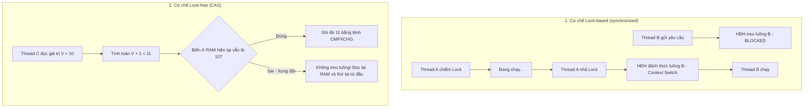

# Giải mã bản chất CAS (Compare-And-Swap) cấp độ CPU

## ⚡ Tóm tắt ngắn (30s)
**CAS (Compare-And-Swap)** là một kỹ thuật đồng bộ hóa không chặn luồng (**Lock-Free / Non-blocking**) cấp độ nguyên tử ở tầng thấp nhất. Nó cho phép một luồng cập nhật giá trị của một ô nhớ với điều kiện: **Giá trị hiện tại của ô nhớ phải hoàn toàn khớp với giá trị mong đợi (Expected Value)** mà luồng đã đọc trước đó. Nếu khớp, việc ghi đè giá trị mới (New Value) sẽ được CPU thực hiện như một thao tác nguyên tử duy nhất. Nếu không khớp, thao tác ghi sẽ thất bại hoàn toàn. 
Toàn bộ logic này được hỗ trợ trực tiếp bằng **chỉ thị phần cứng của CPU**, không cần thông qua hệ điều hành hay bất kỳ cấu trúc xếp hàng luồng nào.

---

## 🔍 Chi tiết bản chất thực chiến

### 1. Tầng phần cứng: Chỉ thị CPU CMPXCHG
Ở cấp độ phần cứng, CAS không chạy bằng mã Java hay C++ thông thường. Nó được biên dịch trực tiếp thành chỉ thị assembly chuyên dụng của bộ vi xử lý:
* Trên kiến trúc **x86/x64**: Sử dụng chỉ thị `CMPXCHG` (Compare and Exchange) kết hợp với tiền tố `LOCK`.
* Tiền tố `LOCK` buộc CPU phải kích hoạt cơ chế khóa đường truyền bus dữ liệu (Bus Lock) hoặc khóa dòng Cache chứa biến đó (Cache Lock / Cache Coherence). Điều này ngăn cản tuyệt đối các CPU cores khác can thiệp vào ô nhớ đó trong lúc thực thi chỉ thị `CMPXCHG`.

### 2. Sự khác biệt giữa Lock-Based và Lock-Free (CAS)
* **Lock-based (synchronized, ReentrantLock)**: Tiếp cận theo hướng bi quan (**Pessimistic**). Nó giả định xung đột luôn xảy ra nên lập tức khóa tài nguyên. Nếu luồng khác đến, nó sẽ bị chuyển trạng thái thành BLOCKED bởi OS Kernel. Việc chuyển đổi luồng (Context Switch) tốn khoảng vài micro giây (khoảng $2000 - 8000$ chu kỳ CPU) - cực kỳ đắt đỏ.
* **Lock-free (CAS)**: Tiếp cận theo hướng lạc quan (**Optimistic**). Nó cho phép mọi luồng tự do đọc ghi mà không cần khóa. Khi ghi, luồng tự kiểm tra xung đột. Nếu phát hiện bị luồng khác sửa đổi trước, nó chỉ đơn giản là thử lại (Retry / Spin). Do đó, luồng không bị treo, không tốn chi phí đổi ngữ cảnh của HĐH.

---

## 🎨 Sơ đồ trực quan So sánh Lock-based vs Lock-free CAS



---

## 💻 Code Example

### BAD ❌ (Mô phỏng CAS thủ công bằng vòng lặp không đồng bộ - Hoàn toàn không an toàn)
```java
public class FakeCASCounter {
    private int value = 0;

    // ❌ Tệ: Đoạn code này hoàn toàn không thread-safe dù có check expected.
    // Giữa dòng lệnh kiểm tra (if value == expected) và dòng lệnh gán (value = newValue) 
    // có một khoảng hở thời gian (race condition window) mà luồng khác có thể nhảy vào xen ngang!
    public boolean compareAndSwap(int expected, int newValue) {
        if (value == expected) { 
            value = newValue; 
            return true;
        }
        return false;
    }
}
```

### GOOD ✅ (Xây dựng cấu trúc Lock-free Stack thực thụ dùng CAS chuẩn chỉ)
```java
import java.util.concurrent.atomic.AtomicReference;

public class LockFreeStack<T> {
    private final AtomicReference<Node<T>> head = new AtomicReference<>(null);

    public void push(T value) {
        Node<T> newHead = new Node<>(value);
        Node<T> currentHead;
        do {
            currentHead = head.get();
            newHead.next = currentHead;
            // ✅ Sử dụng CAS nguyên tử của CPU thông qua AtomicReference
            // Nếu head đã bị thay đổi bởi luồng khác trong lúc ta thiết lập liên kết,
            // vòng lặp do-while sẽ tự động rollback và thực hiện lại.
        } while (!head.compareAndSet(currentHead, newHead));
    }

    public T pop() {
        Node<T> currentHead;
        Node<T> newHead;
        do {
            currentHead = head.get();
            if (currentHead == null) {
                return null;
            }
            newHead = currentHead.next;
        } while (!head.compareAndSet(currentHead, newHead)); // ✅ CAS nguyên tử
        return currentHead.value;
    }

    private static class Node<T> {
        final T value;
        Node<T> next;
        Node(T value) { this.value = value; }
    }
}
```

---

## 📊 Trade-off Analysis: So sánh các cấp độ Đồng bộ hóa

| Tiêu chí | Pessimistic Lock (Lock-based) | Optimistic Lock (CAS) | Wait-Free (Lý tưởng tối đa) |
| :--- | :--- | :--- | :--- |
| **Tính chất chặn luồng** | Chặn luồng (Blocking) | Không chặn (Non-blocking) | Không chặn (Non-blocking) |
| **Độ trễ (Latency)** | Lớn (Do Context switch) | Cực nhỏ khi tranh chấp thấp | Tuyệt đối bằng 0 |
| **Nguy cơ Deadlock** | Có nguy cơ cao | Hoàn toàn không | Hoàn toàn không |
| **Tận dụng CPU** | Nhường CPU cho luồng khác khi bị chặn | Tiêu tốn CPU cho vòng spin-wait nếu xung đột cao | Tối ưu tuyệt đối |
| **Khả năng Starvation** | Có thể bị starvation nếu độ ưu tiên luồng kém | Có thể xảy ra với một vài luồng kém may mắn luôn bị CAS fail | **Đảm bảo không** (Mọi bước đi của luồng đều hoàn thành có ích) |

---

## ⚠️ Common Gotchas & Questions follow-up

* **Vấn đề Hardware Bus Lock Storm**:
  Trong các hệ thống đa CPU (Multi-socket / Xeon server), việc gọi lệnh CAS quá dồn dập từ hàng trăm cores sẽ khiến dòng tín hiệu điều khiển `LOCK` dội liên tục lên Bus hệ thống. Điều này làm nghẽn bus trao đổi dữ liệu giữa các CPU sockets, làm sụt giảm nghiêm trọng hiệu năng của cả các tác vụ không liên quan đến multithreading.
* 👉 **Câu hỏi đào sâu từ interviewer**: *CAS có thể so sánh và cập nhật nguyên tử 2 thuộc tính cùng một lúc không? Cách xử lý như thế nào?*
  * *(Trả lời: Bản chất lệnh CPU CMPXCHG chỉ có thể thao tác trên một thanh ghi đơn lẻ đại diện cho 1 vùng nhớ có độ dài tối đa là 64-bit (8 bytes). Do đó, CAS cơ bản **không** thể so sánh và cập nhật 2 thuộc tính độc lập cùng lúc. Để xử lý bài toán này, ta có 2 phương án: 
    1. Gộp 2 thuộc tính vào trong 1 đối tượng duy nhất (Wrapper Object) rồi sử dụng `AtomicReference` để cập nhật tham chiếu của đối tượng đó.
    2. Sử dụng `AtomicStampedReference` vốn nhồi cả Reference (32/64 bit) và Integer Stamp (32 bit) vào một biến kiểu long hoặc đóng gói cặp đối tượng để CAS).*