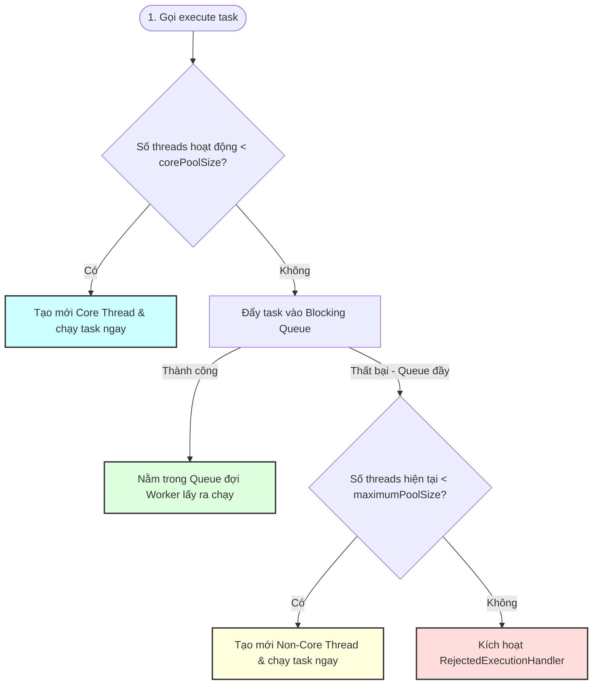

# Phân tích cơ chế hoạt động thực tế của Thread Pool

## ⚡ Tóm tắt ngắn (30s)
**Thread Pool** (trong Java triển khai qua `ThreadPoolExecutor`) là một mẫu thiết kế quản lý vòng đời luồng một cách có kiểm soát. Thay vì tạo mới và hủy bỏ luồng liên tục cho mỗi tác vụ (gây cực kỳ nhiều chi phí tạo luồng của hệ điều hành), Thread Pool duy trì một lượng luồng rảnh rỗi nhất định (**Worker Threads**) hoạt động thường trực. 
Khi có tác vụ mới (`Runnable` / `Callable`), hệ thống sẽ điều phối tác vụ đó qua sơ đồ quyết định gồm: **corePoolSize $
ightarrow$ Blocking Queue $
ightarrow$ maximumPoolSize $
ightarrow$ RejectedExecutionHandler**. Các Worker liên tục chạy một vòng lặp `while` vô hạn để lấy nhiệm vụ từ hàng đợi công việc (`BlockingQueue`) về xử lý.

---

## 🔍 Chi tiết bản chất thực chiến

### 1. Sơ đồ xử lý Task cốt lõi (Ghi nhớ cho phỏng vấn)
Khi bạn gọi phương thức `execute(Runnable task)` trên `ThreadPoolExecutor`, quy trình 4 bước sau sẽ diễn ra một cách tuần tự và chặt chẽ:
1. **Kiểm tra corePoolSize**: Nếu số lượng Worker đang chạy nhỏ hơn `corePoolSize`, Executor sẽ **tạo mới một Worker Thread** để chạy tác vụ đó ngay lập tức (ngay cả khi các luồng khác đang rảnh rỗi).
2. **Đẩy vào Queue**: Nếu số luồng đã đạt đến ngưỡng `corePoolSize`, Executor cố gắng đưa tác vụ đó vào hàng đợi công việc (`BlockingQueue.offer(task)`).
3. **Kiểm tra maximumPoolSize**: Nếu hàng đợi công việc đã bị **đầy** (offer trả về `false`), Executor sẽ kiểm tra xem số luồng hiện tại có nhỏ hơn `maximumPoolSize` hay không. Nếu có, nó sẽ **tạo mới một luồng phụ (non-core worker thread)** để thực thi tác vụ đó lập tức nhằm giảm tải cho hàng đợi.
4. **Kích hoạt Rejection**: Nếu số luồng đã chạm ngưỡng `maximumPoolSize` và hàng đợi công việc vẫn đầy nghẹt, Executor sẽ từ chối tác vụ bằng cách kích hoạt chính sách từ chối đã cấu hình (`RejectedExecutionHandler`).

### 2. Bản chất Worker Thread Loop (Làm sao luồng không bị chết?)
Bên trong `ThreadPoolExecutor`, các luồng Worker thực tế được bọc bởi lớp nội bộ `Worker` kế thừa từ `AbstractQueuedSynchronizer`. Phương thức `run()` của Worker gọi hàm `runWorker(Worker w)`:
```java
final void runWorker(Worker w) {
    Runnable task = w.firstTask;
    w.firstTask = null;
    try {
        // Vòng lặp vô tận giúp luồng sống mãi
        while (task != null || (task = getTask()) != null) {
            beforeExecute(w.thread, task); // Hook trước khi chạy
            try {
                task.run(); // Chạy trực tiếp phương thức run của Runnable
            } finally {
                afterExecute(task, null); // Hook sau khi chạy
                task = null;
            }
        }
    } finally {
        processWorkerExit(w); // Luồng tự hủy nếu thoát khỏi vòng lặp
    }
}
```
* Hàm `getTask()` sẽ tương tác với `workQueue`. 
* Nếu số luồng hiện tại nhỏ hơn hoặc bằng `corePoolSize`, `getTask()` sẽ gọi `workQueue.take()` $
ightarrow$ **luồng sẽ bị block** cho đến khi có task mới, tránh việc ngốn CPU vô ích.
* Nếu số luồng lớn hơn `corePoolSize`, nó sẽ gọi `workQueue.poll(keepAliveTime, unit)`. Nếu quá thời gian `keepAliveTime` mà không có task mới, luồng phụ đó sẽ bị hủy để giải phóng RAM cho HĐH.

---

## 🎨 Sơ đồ trực quan Vòng đời quyết định xử lý Task



---

## 💻 Code Example

### BAD ❌ (Khởi tạo luồng trực tiếp không kiểm soát cho mỗi HTTP Request)
```java
@RestController
public class OrderController {
    // ❌ Tệ: Khi có traffic spike (ví dụ 10,000 requests/giây), server sẽ tạo ra 10,000 Threads hệ điều hành.
    // Mỗi luồng tốn 1MB bộ nhớ ảo làm bộ nhớ Stack $
ightarrow$ Hệ thống lập tức sập nguồn vì OutOfMemoryError (OOM) 
    // hoặc hệ thống chạy cực chậm vì CPU liên tục đổi ngữ cảnh luồng.
    @PostMapping("/order")
    public void createOrder(@RequestBody Order order) {
        new Thread(() -> {
            saveOrderToDatabase(order);
            sendConfirmationEmail(order);
        }).start();
    }
}
```

### GOOD ✅ (Dùng ThreadPoolExecutor cấu hình tường minh để bảo vệ hệ thống)
```java
import java.util.concurrent.*;

public class OrderProcessingSystem {
    // ✅ Tốt: Thread Pool cố định và giới hạn khả năng chịu tải của JVM
    private final ThreadPoolExecutor executor = new ThreadPoolExecutor(
        8,                                 // corePoolSize
        16,                                // maximumPoolSize
        60L, TimeUnit.SECONDS,             // keepAliveTime cho các luồng phụ
        new ArrayBlockingQueue<>(1000),    // Bounded Queue bảo vệ bộ nhớ RAM
        new ThreadFactoryBuilder().setNameFormat("order-worker-%d").build(),
        new ThreadPoolExecutor.CallerRunsPolicy() // ✅ Backpressure: Luồng chính tự chạy hộ task nếu pool đầy nghẹt
    );

    public void processOrder(Order order) {
        executor.execute(() -> {
            saveOrderToDatabase(order);
            sendConfirmationEmail(order);
        });
    }
}
```

---

## 📊 Trade-off Analysis: So sánh các loại BlockingQueue trong Thread Pool

| Tên Hàng Đợi | Đặc điểm bộ nhớ | Hành vi khi tải cao | Ưu/Nhược điểm |
| :--- | :--- | :--- | :--- |
| **`LinkedBlockingQueue` (Unbounded)** | Không giới hạn kích thước mặc định | Lưu trữ vô hạn task $
ightarrow$ Tràn RAM gây OOM | Dễ dùng nhưng cực kỳ nguy hiểm nếu downstream bị chậm. |
| **`ArrayBlockingQueue` (Bounded)** | Giới hạn kích thước tĩnh (Fixed capacity) | Đầy queue $
ightarrow$ Tạo thêm thread phụ hoặc Reject | **An toàn nhất** cho JVM. Đòi hỏi cấu hình size chuẩn xác từ đầu. |
| **`SynchronousQueue` (Zero-capacity)** | Không chứa phần tử nào bên trong | Đẩy task $
ightarrow$ Phải có thread rảnh nhận ngay, nếu không sẽ mở rộng pool | Không gây trễ hàng đợi, cực nhanh. Nhược điểm: Phải có tối đa pool siêu lớn tránh nghẽn. |

---

## ⚠️ Common Gotchas & Questions follow-up

* **Rò rỉ luồng khi không Shutdown Thread Pool**:
  Các luồng trong Thread Pool là GC Roots. Nếu bạn tạo một Thread Pool cục bộ trong một phương thức và thoát ra mà không gọi `shutdown()`, các Worker Threads sẽ tiếp tục chạy spin và chờ đợi vô tận $
ightarrow$ Gây rò rỉ bộ nhớ và luồng nghiêm trọng cho JVM.
* 👉 **Câu hỏi đào sâu từ interviewer**: *Tại sao các ngoại lệ (Runtime Exception) xảy ra bên trong task được submit lên Thread Pool lại bị biến mất bí ẩn? Làm sao để xử lý và log các lỗi đó?*
  * *(Trả lời: Khi dùng `submit(Runnable/Callable)`, Executor bọc task đó trong đối tượng `FutureTask`. Lỗi Exception xảy ra sẽ bị bắt lại (`catch`) và lưu trữ nội bộ bên trong FutureTask để trả về khi người dùng gọi `Future.get()`. Nếu ta không gọi `Future.get()`, Exception đó sẽ bị "nuốt" hoàn toàn thầm lặng. Để xử lý triệt để:
    1. Sử dụng `execute(Runnable)` thay vì `submit()` để ném lỗi ra ngoài cho uncaught exception handler bắt được.
    2. Bọc toàn bộ code trong khối `try-catch` thủ công bên trong task.
    3. Cung cấp một `ThreadFactory` tùy biến có cài đặt `UncaughtExceptionHandler`).*