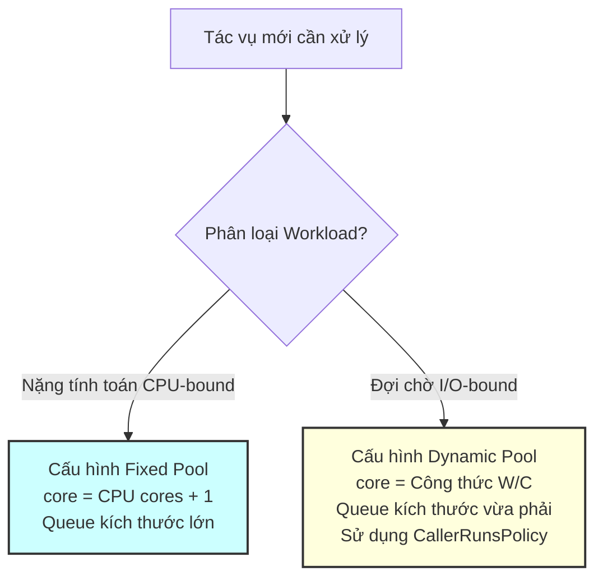

# Tuyệt kỹ Tuning ThreadPoolExecutor và Công thức thực chiến

## ⚡ Tóm tắt ngắn (30s)
Không có một cấu hình ThreadPoolExecutor nào phù hợp cho mọi bài toán. Việc thiết lập tham số phụ thuộc hoàn toàn vào bản chất của tác vụ (**Workload Profile**). Các tham số cần tuning bao gồm: **corePoolSize** (số luồng tối thiểu thường trực), **maximumPoolSize** (số luồng tối đa khi quá tải), và **workQueue** (hàng đợi điều hòa).
* **CPU-bound (Tính toán nặng)**: Đòi hỏi số luồng **nhỏ**, tiệm cận số lõi CPU vật lý để tránh overhead đổi ngữ cảnh.
* **I/O-bound (Giao tiếp mạng/ổ đĩa)**: Đòi hỏi số luồng **lớn**, tỷ lệ thuận với thời gian luồng phải nằm chờ phản hồi từ các hệ thống bên ngoài.

---

## 🔍 Chi tiết bản chất thực chiến

### 1. Công thức tính toán kích thước Thread Pool thực chiến

#### A. Đối với tác vụ CPU-bound (Mã hóa, Xử lý ảnh, Render, Data Parsing nặng)
Tại đây, CPU hoạt động liên tục ở mức $100%$. Tạo thêm luồng chỉ làm CPU tốn thời gian đổi chỗ (Context Switch) chứ không làm nhanh hơn.
$$	ext{Kích thước tối ưu} = N_{	ext{CPU}} + 1$$
*(Trong đó $N_{	ext{CPU}}$ là số nhân logical của máy chủ. Luồng cộng thêm $1$ đóng vai trò dự phòng khi xảy ra hiện tượng Page Fault của hệ điều hành).*

#### B. Đối với tác vụ I/O-bound (Gọi Database SQL/NoSQL, gọi REST API bên ngoài, Đọc ghi file dung lượng lớn)
Tại đây, luồng chủ yếu nằm ở trạng thái WAITING để đợi phản hồi từ thiết bị phần cứng bên ngoài. CPU hoàn toàn rảnh rỗi. Ta cần tạo nhiều luồng để tận dụng tối đa thời gian rảnh này của CPU.
$$	ext{Kích thước tối ưu} = N_{	ext{CPU}} 	imes U_{	ext{CPU}} 	imes left(1 + rac{W}{C}
ight)$$
* $N_{	ext{CPU}}$: Số lượng nhân CPU có sẵn.
* $U_{	ext{CPU}}$: Tỷ lệ sử dụng CPU mong muốn ($0 le U_{	ext{CPU}} le 1$).
* $W$ (Wait Time): Thời gian luồng phải nằm chờ phản hồi (ví dụ: mất $200	ext{ms}$ để API bên ngoài trả về dữ liệu).
* $C$ (Compute Time): Thời gian CPU thực sự xử lý logic nghiệp vụ sau khi nhận dữ liệu (ví dụ: chỉ mất $5	ext{ms}$ để mapping JSON).
* 👉 *Ví dụ thực tế*: Server có 8 cores CPU ($N_{	ext{CPU}} = 8$), muốn CPU chạy $50%$ công suất ($U_{	ext{CPU}} = 0.5$). Tác vụ gọi DB mất 95ms đợi ($W = 95$) và 5ms tính toán ($C = 5$). 
  $$	ext{Số lượng threads} = 8 	imes 0.5 	imes left(1 + rac{95}{5}
ight) = 4 	imes 20 = 80 	ext{ threads}$$

### 2. Các chính sách từ chối tác vụ (RejectedExecutionHandler)
Khi hệ thống bị nghẽn (Queue đầy, Thread đạt maximum), bạn phải chọn 1 trong 4 chiến lược xử lý:
1. **`AbortPolicy` (Mặc định)**: Ném lập tức lỗi `RejectedExecutionException`. Luồng gọi execute bị lỗi. Phù hợp cho các tác vụ phi giao dịch, cần báo lỗi ngay lập tức về cho client.
2. **`CallerRunsPolicy`**: Luồng gửi tác vụ (ví dụ luồng HTTP Request của Tomcat/Undertow) sẽ **tự tay chạy trực tiếp** tác vụ đó. Điều này tự động **giảm tốc độ đẩy request** của client xuống, tạo ra một cơ chế tự bảo vệ (**Backpressure**) tuyệt vời cho hệ thống.
3. **`DiscardPolicy`**: Thầm lặng vứt bỏ tác vụ bị từ chối mà không báo bất kỳ lỗi nào. Chỉ dùng khi tác vụ là logs/metrics phụ có thể mất mát.
4. **`DiscardOldestPolicy`**: Vứt bỏ tác vụ lâu nhất ở đầu hàng đợi để nhét tác vụ mới vào.

---

## 🎨 Sơ đồ trực quan Cấu hình Thread Pool theo Workload



---

## 💻 Code Example

### BAD ❌ (Sử dụng cấu hình mặc định nguy hại Executors.newCachedThreadPool())
```java
import java.util.concurrent.ExecutorService;
import java.util.concurrent.Executors;

public class BadService {
    // ❌ Tệ: newCachedThreadPool có maximumPoolSize = Integer.MAX_VALUE!
    // Nó sử dụng SynchronousQueue, nghĩa là cứ có task đến là nó tạo mới thread nếu không có thread rảnh.
    // Khi bị DDOS hoặc tải đột biến, hệ thống sẽ tạo ra hàng chục nghìn luồng $
ightarrow$ Gây OOM sập server ngay lập tức.
    private final ExecutorService executor = Executors.newCachedThreadPool();
}
```

### GOOD ✅ (Cấu hình chi tiết ThreadPoolExecutor an toàn cho ứng dụng Spring/REST API)
```java
import java.util.concurrent.*;
import java.util.concurrent.atomic.AtomicInteger;

public class RobustIOExecutor {
    
    public static ThreadPoolExecutor createIOThreadPool() {
        int cores = Runtime.getRuntime().availableProcessors();
        
        return new ThreadPoolExecutor(
            cores * 2,                         // corePoolSize: Tác vụ I/O vừa phải
            cores * 5,                         // maximumPoolSize: Giới hạn trên chặt chẽ bảo vệ tài nguyên RAM
            60L, TimeUnit.SECONDS,             // Hủy luồng phụ sau 1 phút rảnh
            new ArrayBlockingQueue<>(500),     // Hàng đợi tĩnh (Bounded Queue)
            new NamedThreadFactory("io-worker"),
            new ThreadPoolExecutor.CallerRunsPolicy() // ✅ Backpressure: Tránh nghẽn hàng đợi bằng CallerRuns
        );
    }

    private static class NamedThreadFactory implements ThreadFactory {
        private final String baseName;
        private final AtomicInteger threadNum = new AtomicInteger(1);

        public NamedThreadFactory(String baseName) { this.baseName = baseName; }

        @Override
        public Thread newThread(Runnable r) {
            Thread t = new Thread(r, baseName + "-" + threadNum.getAndIncrement());
            t.setDaemon(false);
            t.setPriority(Thread.NORM_PRIORITY);
            return t;
        }
    }
}
```

---

## 📊 Trade-off Analysis: So sánh các RejectedExecutionPolicy

| Chiến lược từ chối | Hành vi thực tế | Ưu điểm | Nhược điểm |
| :--- | :--- | :--- | :--- |
| **`AbortPolicy`** | Ném ngoại lệ ngay khi submit task | Phát hiện lỗi sớm, bảo toàn tính đúng đắn dữ liệu | Gây crash/fail request từ phía khách hàng nếu không catch |
| **`CallerRunsPolicy`** | Luồng gọi execute tự chạy tác vụ | Tự động tạo Backpressure, làm chậm luồng nạp task | Có thể làm nghẽn luồng xử lý UI hoặc luồng HTTP chính nếu task quá nặng |
| **`DiscardPolicy`** | Thầm lặng bỏ qua task | Không tốn CPU xử lý, không ném exception phiền phức | Mất dữ liệu thầm lặng, cực khó debug dấu vết |
| **`DiscardOldestPolicy`** | Hủy task cũ nhất trong queue để thế chỗ | Đảm bảo các task mới nhất luôn được ưu tiên xử lý | Gây mất mát các công việc cũ đã xếp hàng lâu |

---

## ⚠️ Common Gotchas & Questions follow-up

* **Mối họa ngầm định từ Executors Factory**:
  Hầu hết các lập trình viên đều có thói quen dùng `Executors.newFixedThreadPool(n)`. Hàm này thực chất cấu hình `LinkedBlockingQueue` không giới hạn dung lượng (`Integer.MAX_VALUE`). Khi tải cao, queue phình to làm cạn kiệt Heap trước khi kích hoạt bất kỳ cảnh báo nào.
* 👉 **Câu hỏi đào sâu từ interviewer**: *Làm thế nào để thay đổi kích thước corePoolSize hoặc maximumPoolSize của một ThreadPoolExecutor đang chạy (Runtime) mà không cần phải restart ứng dụng?*
  * *(Trả lời: ThreadPoolExecutor cung cấp các phương thức setter động cực kỳ linh hoạt như `setCorePoolSize(int)` và `setMaximumPoolSize(int)`. Khi gọi các hàm này, Executor sẽ tự động điều chỉnh số lượng worker đang hoạt động trong runtime: sa thải bớt worker rảnh rỗi hoặc khởi chạy thêm worker mới nếu cần. Ta có thể map các hàm này với công cụ quản lý cấu hình tập trung như Spring Cloud Config, Consul, hoặc JMX để tùy biến cấu hình tải theo thời gian thực).*