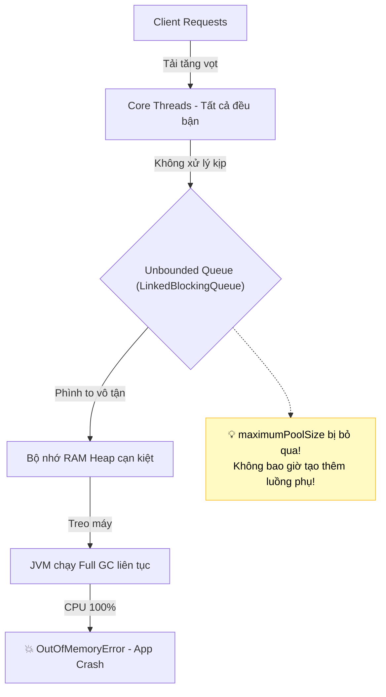

# Hiểm họa tiềm tàng từ Unbounded Queue trong Thread Pool

## ⚡ Tóm tắt ngắn (30s)
Sử dụng **Unbounded Queue** (hàng đợi không giới hạn kích thước, ví dụ `LinkedBlockingQueue` được khởi tạo mặc định không truyền tham số kích thước) trong Thread Pool là **một trong những nguyên nhân hàng đầu gây sập bộ nhớ (OutOfMemoryError - OOM)** trên môi trường Production.
Nguyên nhân cốt lõi là vì khi sử dụng Unbounded Queue, hàng đợi sẽ **luôn chấp nhận** mọi tác vụ mới được đẩy vào mà không bao giờ báo đầy. Hệ quả trực tiếp:
1. Tham số `maximumPoolSize` bị **vô hiệu hóa hoàn toàn** (không bao giờ có thêm luồng phụ nào được tạo ra vượt quá `corePoolSize`).
2. Khi hệ thống hạ nguồn (Database, API bên thứ ba) bị chậm, các tác vụ sẽ tích tụ vô tận trong hàng đợi, phình to bộ nhớ Heap của JVM cho đến khi cạn kiệt tài nguyên RAM vật lý.

---

## 🔍 Chi tiết bản chất thực chiến

### 1. Tại sao maximumPoolSize bị vô hiệu hóa?
Hãy xem lại mã nguồn quyết định tạo luồng phụ của `ThreadPoolExecutor.execute()`:
```java
int c = ctl.get();
if (workerCountOf(c) < corePoolSize) {
    if (addWorker(command, true)) return;
    c = ctl.get();
}
// Bước đẩy task vào hàng đợi
if (isRunning(c) && workQueue.offer(command)) {
    // ... nằm lại trong queue
}
else if (!addWorker(command, false)) // Chỉ chạy dòng này khi queue.offer() trả về false!
    reject(command);
```
Nếu `workQueue` là Unbounded Queue (như `LinkedBlockingQueue` với dung lượng mặc định là $2^{31}-1 approx 2	ext{ tỷ}$ phần tử):
* Phương thức `workQueue.offer()` sẽ **luôn trả về `true`** (trừ khi bộ nhớ RAM vật lý cạn kiệt trước).
* Khối điều kiện `else if (!addWorker(command, false))` để kích hoạt số luồng tối đa `maximumPoolSize` **không bao giờ được chạm tới**.
* Do đó, Thread Pool của bạn thực chất chỉ hoạt động với tối đa là `corePoolSize` luồng xử lý, bất kể bạn có set `maximumPoolSize` lớn cỡ nào!

### 2. Kịch bản Tuyến tính dẫn tới sụp đổ hệ thống (OOM Cascade)
1. 💥 **Traffic Spike**: Hệ thống nhận lượng tải tăng đột biến từ $100$ requests/s lên $5000$ requests/s.
2. 🐢 **Downstream Bottleneck**: Database hoặc API của bên thứ 3 bắt đầu phản hồi chậm ($50	ext{ms} 
\rightarrow 5000	ext{ms}$).
3. 📦 **Queue Accumulation**: Các luồng core bị nghẽn làm hàng đợi phình to thần tốc. Mỗi tác vụ trong queue giữ một lượng dữ liệu lớn (DTO, JSON strings, connection metadata).
4. 💀 **GC Thrashing & OOM**: Bộ nhớ JVM cạn kiệt. Bộ thu dọn rác (GC) hoạt động liên tục ở chế độ Full GC để cứu vãn bộ nhớ nhưng vô ích $\rightarrow$ CPU chạm ngưỡng $100%$ chỉ để dọn rác (GC overhead limit exceeded) rồi sập nguồn hoàn toàn.

---

## 🎨 Sơ đồ trực quan Bản chất nghẽn do Unbounded Queue



---

## 💻 Code Example

### BAD ❌ (Sử dụng Fixed Thread Pool mặc định chứa hàng đợi vô hạn)
```java
import java.util.concurrent.ExecutorService;
import java.util.concurrent.Executors;

public class OrderService {
    // ❌ Tệ: Executors.newFixedThreadPool sử dụng LinkedBlockingQueue không giới hạn dung lượng ngầm định.
    // Khi nghiệp vụ thanh toán (payment) bị chậm, queue chứa hàng triệu giao dịch, 
    // làm sập RAM của JVM lập tức.
    private final ExecutorService executor = Executors.newFixedThreadPool(50);

    public void processOrder(Runnable payTask) {
        executor.submit(payTask);
    }
}
```

### GOOD ✅ (Sử dụng Bounded Queue kết hợp CallerRunsPolicy bảo vệ RAM)
```java
import java.util.concurrent.*;

public class SafeOrderService {
    // ✅ Tốt: Sử dụng ArrayBlockingQueue giới hạn dung lượng nghiêm ngặt (2000 tasks)
    // Khi queue đầy và đạt 100 threads, CallerRunsPolicy tự động bắt luồng HTTP request 
    // phải tự thực thi tác vụ $\rightarrow$ Tự động phanh chân ga nạp request.
    private final ThreadPoolExecutor executor = new ThreadPoolExecutor(
        20,                                // corePoolSize
        100,                               // maximumPoolSize
        30L, TimeUnit.SECONDS,
        new ArrayBlockingQueue<>(2000),    // Bounded Queue
        new ThreadPoolExecutor.CallerRunsPolicy() // ✅ Tự động phanh (Backpressure)
    );

    public void processOrder(Runnable payTask) {
        executor.execute(payTask);
    }
}
```

---

## 📊 Trade-off Analysis: Unbounded vs Bounded Queue

| Tiêu chí so sánh | Unbounded Queue (Vô hạn) | Bounded Queue (Hữu hạn) |
| :--- | :--- | :--- |
| **Khả năng chịu tải đột biến (Spike)** | Nuốt hết toàn bộ task $\rightarrow$ Tránh từ chối nghiệp vụ tạm thời | Phải ném ngoại lệ hoặc dùng cơ chế phanh khi quá tải |
| **Bảo vệ Bộ nhớ Heap** | **Hoàn toàn không** (Rủi ro crash OOM cực lớn) | **Tuyệt đối** (Dung lượng RAM tối đa luôn trong tầm kiểm soát) |
| **Tận dụng tối đa Thread Pool** | Không tận dụng được `maximumPoolSize` | Tận dụng hoàn hảo các luồng phụ khi quá tải |
| **Độ phức tạp cấu hình** | Không cần cấu hình dung lượng | Đòi hỏi tính toán chính xác dung lượng queue và chính sách từ chối |

---

* 👉 **Câu hỏi đào sâu từ interviewer**: *Nếu ứng dụng của bạn yêu cầu không bao giờ được phép làm rớt request (no drop), nhưng RAM máy chủ lại cực kỳ giới hạn, bạn sẽ thiết kế hàng đợi và Thread Pool như thế nào để đảm bảo an toàn tuyệt đối?*
  * *(Trả lời: Để giải quyết bài toán mâu thuẫn này, ta không được dùng Unbounded Queue (OOM rủi ro cao) và cũng không thể dùng AbortPolicy (gây rớt/từ chối request). Giải pháp chuẩn chỉ là sử dụng **Bounded Queue** (ví dụ dung lượng $1000$) kết hợp với **`CallerRunsPolicy`**. Khi hàng đợi và thread đạt trần, luồng Web Container gửi request sẽ buộc phải tự xử lý công việc đó. Khi luồng Web Container bận chạy task, nó không thể nhận request mới từ bên ngoài, làm đầy hàng đợi TCP ở hệ điều hành $\rightarrow$ hệ thống Load Balancer phía trên sẽ nhận biết được ứng dụng đang quá tải để điều phối request sang node khác hoặc làm chậm tốc độ client một cách tự nhiên).*