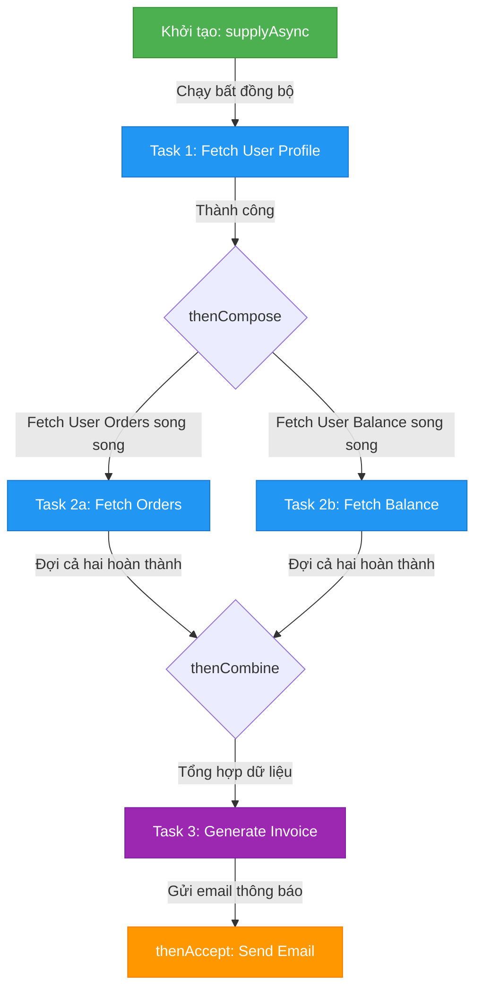

# CompletableFuture dùng để làm gì? Phân tích mô hình Asynchronous Pipelines

## ⚡ Tóm tắt ngắn (30s)
`CompletableFuture` (được giới thiệu từ Java 8) là một lớp hiện thực hóa interface `Future` và `CompletionStage`, đại diện cho kết quả của một tác vụ bất đồng bộ (**Asynchronous**).
Khác biệt tối thượng so với `Future` truyền thống:
1. **Non-blocking Pipelines**: Hỗ trợ xây dựng các chuỗi xử lý (pipelines) theo phong cách Functional Programming mà không cần block luồng gọi (`Future.get()` gây block luồng).
2. **Asynchronous Callbacks**: Tự động kích hoạt các hàm callback (như `thenApply`, `thenAccept`, `thenCompose`) ngay khi tác vụ hoàn thành.
3. **Flexible Combination**: Cho phép kết hợp song song hoặc tuần tự nhiều luồng bất đồng bộ độc lập một cách dễ dàng (`allOf`, `anyOf`, `thenCombine`).

---

## 🔍 Chi tiết bản chất thực chiến

### 1. Sự thất bại của Future truyền thống (Legacy Future)
Trước Java 8, interface `Future` chỉ đóng vai trò là một "hộp giữ chỗ" cho kết quả tương lai. Để lấy kết quả, ta bắt buộc phải gọi `future.get()` (gây block luồng chạy hiện tại cho đến khi task xong) hoặc dùng vòng lặp active polling bận rộn (`future.isDone()` liên tục) làm lãng phí CPU. Không hề có cơ chế đăng ký callback để phản ứng tự động khi có kết quả.

### 2. Sức mạnh tối thượng của CompletionStage & Chaining Pipelines
`CompletableFuture` giải quyết triệt để bài toán trên bằng cách cho phép ta định nghĩa một đường ống xử lý (Data Pipeline) bất đồng bộ. Khi dữ liệu đổ về từ tầng I/O, nó sẽ tự động chảy qua các mắt xích (stages):

* **Biến đổi kết quả (Transformation)**:
  * `thenApply(Function)`: Thực thi đồng bộ trên cùng luồng vừa hoàn thành tác vụ trước đó.
  * `thenApplyAsync(Function, Executor)`: Thực thi bất đồng bộ trên một luồng khác được chỉ định từ Thread Pool.
* **Tiêu thụ kết quả (Consumer)**:
  * `thenAccept(Consumer)`: Nhận kết quả nhưng không trả về giá trị mới (kiểu trả về là `CompletableFuture<Void>`).
* **Ghép nối tuần tự các tác vụ phụ thuộc (Monadic FlatMap)**:
  * `thenCompose(Function<T, CompletableFuture<U>>)`: Dùng khi tác vụ tiếp theo bản thân nó cũng là một hàm bất đồng bộ trả về một `CompletableFuture` khác. Tránh tình trạng lồng nhau kiểu `CompletableFuture<CompletableFuture<U>>`.
* **Kết hợp song song độc lập (Zip/Join)**:
  * `thenCombine(CompletableFuture, BiFunction)`: Chạy song song cả hai tác vụ độc lập, đợi cả hai cùng xong rồi gom kết quả xử lý tiếp.

---

## 🎨 Sơ đồ luồng xử lý Asynchronous Pipelines



---

## 💻 Code Example

### BAD ❌ (Lạm dụng Future.get() gây block luồng, triệt tiêu tính bất đồng bộ)
```java
import java.util.concurrent.*;

public class LegacyUserService {
    private final ExecutorService executor = Executors.newFixedThreadPool(10);

    public UserInfo getUserInfo(String userId) throws Exception {
        // ❌ Tệ: Đẩy task vào pool và gọi .get() ngay lập tức, luồng hiện tại bị block cứng!
        Future<Profile> profileFuture = executor.submit(() -> fetchProfile(userId));
        Profile profile = profileFuture.get(); // Block luồng gọi tại đây!

        Future<Orders> ordersFuture = executor.submit(() -> fetchOrders(profile));
        Orders orders = ordersFuture.get(); // Block tiếp tục!

        return new UserInfo(profile, orders);
    }
    
    private Profile fetchProfile(String id) { return new Profile(); }
    private Orders fetchOrders(Profile p) { return new Orders(); }
}
```

### GOOD ✅ (Xây dựng chuỗi Async Pipeline non-blocking hoàn hảo)
```java
import java.util.concurrent.*;

public class ModernUserService {
    private final ExecutorService ioExecutor = Executors.newFixedThreadPool(20);

    public CompletableFuture<UserInfo> getUserInfoAsync(String userId) {
        // ✅ Tốt: Xâu chuỗi pipelines bất đồng bộ hoàn toàn non-blocking.
        return CompletableFuture.supplyAsync(() -> fetchProfile(userId), ioExecutor)
            // Dùng thenCompose để làm phẳng (flatten) các CompletableFuture lồng nhau
            .thenComposeAsync(profile -> 
                CompletableFuture.supplyAsync(() -> fetchOrders(profile), ioExecutor)
                    .thenApply(orders -> new UserInfo(profile, orders)), 
                ioExecutor
            );
    }

    private Profile fetchProfile(String id) { return new Profile(); }
    private Orders fetchOrders(Profile p) { return new Orders(); }
}
```

---

## 📊 So sánh Future và CompletableFuture

| Tiêu chí | Future (Java 5) | CompletableFuture (Java 8) |
| :--- | :--- | :--- |
| **Cơ chế lấy kết quả** | Gọi hàm blocking `.get()` hoặc active polling | Hàm callback non-blocking như `thenAccept` |
| **Ghép chuỗi (Chaining)** | Không hỗ trợ | Hỗ trợ tuyệt hảo (`thenApply`, `thenCompose`) |
| **Kết hợp nhiều luồng** | Rất khó khăn và thủ công | Dễ dàng qua `allOf`, `anyOf`, `thenCombine` |
| **Xử lý Exception** | Phải bắt ngoại lệ thủ công tại chỗ gọi `.get()` | Khai báo tập trung qua `exceptionally`, `handle` |

---

## ⚠️ Common Gotchas & Questions follow-up

* **Hiểm họa nghẽn mạch ForkJoinPool.commonPool()**:
  Khi không truyền `Executor` vào các hàm `*Async` (ví dụ `supplyAsync(() -> { ... })`), JVM mặc định sử dụng `ForkJoinPool.commonPool()`. Pool dùng chung này có số lượng luồng giới hạn bằng số lượng nhân CPU vật lý trừ 1. Nếu bạn chạy các tác vụ block I/O nặng (HTTP call, DB call) bằng `commonPool`, bạn sẽ làm cạn kiệt tài nguyên của pool này, khiến các thư viện khác (như Parallel Streams, các phần bất đồng bộ hệ thống) bị đơ toàn tập.
  👉 **Luôn luôn tự định nghĩa Executor/ThreadPool chuyên dụng cho các tác vụ I/O blocking!**
* 👉 **Câu hỏi đào sâu từ interviewer**: *Sự khác biệt bản chất giữa `thenApply` và `thenApplyAsync` khi chúng cùng nằm trong một chuỗi pipeline là gì? Luồng nào sẽ thực thi chúng?*
  * *(Trả lời: Với `thenApply(fn)`, hàm `fn` sẽ được thực thi đồng bộ bởi chính luồng vừa hoàn thành tác vụ ngay phía trước nó trong pipeline (nếu tác vụ trước đã hoàn thành lúc gọi `thenApply`, nó có thể được chạy bởi luồng chính hiện tại). Còn với `thenApplyAsync(fn, executor)`, JVM chắc chắn sẽ đóng gói `fn` thành một task mới và đẩy vào `executor` được chỉ định (hoặc `ForkJoinPool.commonPool` nếu bỏ trống) để chạy bất đồng bộ ở một luồng khác hoàn toàn, không phụ thuộc vào trạng thái hoàn thành nhanh hay chậm của luồng trước).*

---