# Từ khóa synchronized hoạt động như thế nào trong Java?

## ⚡ Tóm tắt ngắn (30s)
* **`synchronized`** là cơ chế đồng bộ hóa nguyên bản của Java, được dùng để thiết lập các vùng loại trừ tương hỗ (**Mutual Exclusion - Critical Section**) ngăn chặn tranh chấp luồng (Race Condition).
* Nó hoạt động dựa trên cơ chế khóa ẩn gọi là **Monitor Lock (hoặc Intrinsic Lock)** gắn liền với mỗi đối tượng trên bộ nhớ Heap.
* Khi luồng đi vào vùng synchronized, nó bắt buộc phải giành được quyền sở hữu Monitor của đối tượng đó. Mọi luồng khác cố gắng tranh giành Monitor sẽ bị chặn và đưa vào hàng đợi trạng thái **BLOCKED**.

---

## 🔍 Chi tiết bản chất

### 1. Phân loại cách sử dụng
* **Mức phương thức thực thể (Instance Method)**: Khóa trên đối tượng hiện tại `this`.
* **Mức phương thức tĩnh (Static Method)**: Khóa trên đối tượng Class (`ClassName.class`).
* **Khối lệnh đồng bộ (Synchronized Block)**: Khóa trên một đối tượng cụ thể được chỉ định. Đây là cách làm được khuyến nghị vì phạm vi khóa nhỏ nhất (tối ưu hiệu năng).

### 2. Cơ chế JVM bên dưới (Bytecode)
Trong mã bytecode, khối lệnh synchronized được quản lý bằng hai lệnh đặc biệt:
* **`monitorenter`**: Luồng cố gắng tăng biến đếm của Monitor lên 1. Nếu thành công, luồng giữ khóa.
* **`monitorexit`**: Giảm biến đếm Monitor về 0 để luồng khác giành khóa (JVM tự động chèn lệnh này cả trong khối `catch` để đảm bảo không bị kẹt khóa vĩnh viễn khi xảy ra Runtime Exception).

### 3. Tiến trình tối ưu hóa Khóa của JVM (Lock Inflation)
Java HotSpot VM tối ưu hóa hiệu suất của `synchronized` thông qua các cấp độ nâng cấp khóa tự động:
1. **Biased Lock (Khóa thiên vị)**: Thiết lập khi chỉ có duy nhất 1 thread thao tác. Không tốn chi phí khóa thực tế.
2. **Lightweight Lock (Khóa nhẹ)**: Sử dụng kỹ thuật quay vòng kiểm tra thử (**Spin lock / CAS**) khi có tranh chấp rất thấp từ 2 luồng nhưng thời gian giữ khóa ngắn.
3. **Heavyweight Lock (Khóa nặng)**: Khi tranh chấp dữ dội, JVM nâng cấp khóa lên hệ điều hành (OS Mutex), đưa luồng bị chặn vào hàng đợi ngủ chờ phục hồi, gây chi phí đổi ngữ cảnh (Context switch) cực cao.

---

## 🎨 Sơ đồ luồng hoạt động của Monitor Lock

```mermaid
graph TD
    A["Luồng T1 tiếp cận vùng Synchronized"] --> B["Yêu cầu lấy Monitor của Object"]
    B --> C{"Monitor đã bị giữ?"}
    C -- Yes --> D["Đưa T1 vào hàng đợi EntryList <br> Trạng thái: BLOCKED"]
    C -- No --> E["Chiếm hữu Monitor (Biến đếm = 1)"]
    E --> F["Thực thi mã Critical Section"]
    F --> G["Gặp monitorexit <br> Trả tự do cho Monitor (Biến đếm = 0)"]
    G --> H["Đánh thức các luồng trong EntryList"]
    
    style C fill:#2d3748,stroke:#ed8936,stroke-width:2px
    style D fill:#e53e3e,stroke:#fff,stroke-width:2px
    style E fill:#48bb78,stroke:#fff,stroke-width:2px
```



---

## 💻 Code Example

### BAD ❌ (Đồng bộ hóa phạm vi quá rộng gây thảm họa Performance)
```java
public class BigService {
    // ❌ Tồi tệ: Khóa toàn bộ phương thức chứa tiến trình kết nối mạng I/O dài hạn
    public synchronized void updateUserData(String id, String data) {
        String rawData = fetchFromExternalApi(id); // Phép I/O mạng mất 2 giây
        parseAndSaveToDatabase(rawData, data);     // Ghi dữ liệu mất 10 miligiây
    }
}
```

### GOOD ✅ (Đồng bộ hóa khối hẹp nhất có thể)
```java
public class BigService {
    private final Object dbLock = new Object(); // Khởi tạo lock chuyên dụng chuyên nghiệp

    public void updateUserData(String id, String data) {
        String rawData = fetchFromExternalApi(id); // Chạy song song không chặn luồng khác
        
        // Chỉ khóa vùng lưu trữ dữ liệu thực sự cần thiết
        synchronized (dbLock) { // ✅ Phạm vi khóa cực nhỏ (10ms)
            parseAndSaveToDatabase(rawData, data);
        }
    }
}
```

---

## 📊 Trade-off Analysis

| Tiêu chí | Từ khóa synchronized | Thư viện ReentrantLock |
| :--- | :--- | :--- |
| **Độ phức tạp** | Rất đơn giản, không sợ rò rỉ khóa (tự giải phóng). | Phức tạp hơn, bắt buộc giải phóng trong khối `finally` (`lock.unlock()`). |
| **Tính linh hoạt** | Khóa cấu trúc khối lồng nhau (Block-structured). | Khóa liên phương thức (Hand-over-hand), thử lấy khóa có timeout (`tryLock`). |
| **Tính công bằng (Fairness)**| Không hỗ trợ thứ tự hàng đợi luồng. | Hỗ trợ lập lịch khóa công bằng (Fair lock - Thread nào đợi trước lấy trước). |
| **Khả năng ngắt** | Luồng bị chặn BLOCKED không thể bị ngắt (Interrupt). | Luồng có thể bị ngắt khi đang chờ khóa (`lockInterruptibly`). |

---

## ⚠️ Common Gotchas & Questions follow-up
* **Hiện tượng Khóa chết (Deadlock)**:
  Xảy ra khi Thread 1 giữ Lock A yêu cầu Lock B, đồng thời Thread 2 giữ Lock B yêu cầu Lock A. Hệ thống bị đóng băng vĩnh viễn.
  👉 **Cách phòng tránh**: Luôn thiết lập trật tự giành khóa nhất quán (Lock Ordering) hoặc chuyển sang dùng `tryLock(timeout)` của `ReentrantLock` để tự động rút lui sau một khoảng thời gian chờ đợi thất bại.
* 👉 **Câu hỏi đào sâu từ interviewer**: *Synchronized có khả năng tái vào (Reentrant) không?*
  *(Trả lời: Có. Intrinsic Lock trong Java là Reentrant. Nghĩa là nếu một luồng đang nắm giữ Lock hiện tại, khi nó gọi một phương thức khác cũng yêu cầu chính Lock đó, nó sẽ tự động được đi qua mà không bị tự khóa chính mình. JVM theo dõi bằng cách tăng biến đếm của Monitor lên).*