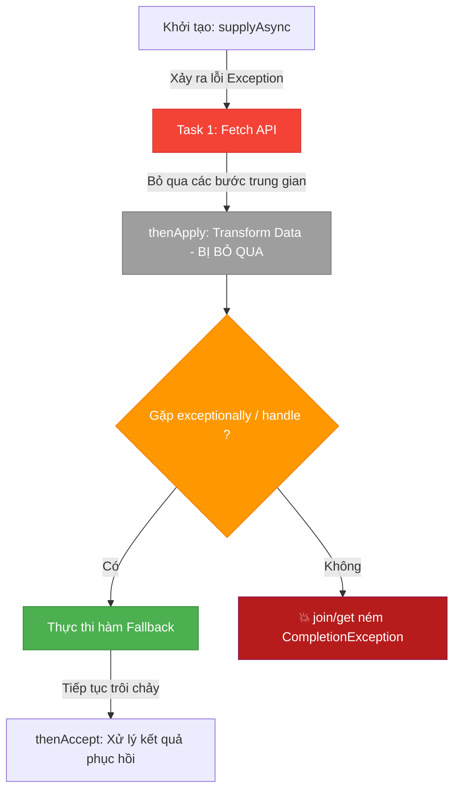

# Cách xử lý Exception trong CompletableFuture thực chiến

## ⚡ Tóm tắt ngắn (30s)
Vì `CompletableFuture` chạy bất đồng bộ trên các luồng khác nhau, các khối `try-catch` truyền thống không thể bắt được ngoại lệ sinh ra trong luồng phụ. Java cung cấp ba phương thức chính để xử lý lỗi một cách khai báo (declarative):
1. **`exceptionally(Function<Throwable, T> fn)`**: Hoạt động như một khối `catch`. Nó chỉ được kích hoạt khi có lỗi xảy ra và cho phép trả về một giá trị dự phòng (fallback/default value) cùng kiểu dữ liệu `T`.
2. **`handle(BiFunction<T, Throwable, U> fn)`**: Hoặc thành công hoặc thất bại đều chạy qua đây. Nhận vào cả kết quả thành công (`T`) và lỗi (`Throwable`), cho phép biến đổi kiểu dữ liệu trả về từ `T` sang `U`.
3. **`whenComplete(BiConsumer<T, Throwable> action)`**: Giống khối `finally`. Thực thi hành động dọn dẹp tài nguyên hoặc log lỗi mà không thay đổi giá trị hay chặn ngoại lệ của chuỗi pipeline.

---

## 🔍 Chi tiết bản chất thực chiến

### 1. Cơ chế lan truyền lỗi (Exception Propagation)
Khi một mắt xích trong pipeline ném ra một ngoại lệ không được bắt, JVM sẽ tự động bọc ngoại lệ đó vào trong một lớp `CompletionException`. Ngoại lệ này sẽ tự động lan truyền xuôi dòng (downstream) qua toàn bộ các mắt xích tiếp theo của pipeline, khiến toàn bộ các mắt xích đó bị bỏ qua (không thực thi) cho đến khi gặp một mắt xích xử lý ngoại lệ hoặc chạm đích cuối cùng (khiến `join()` hoặc `get()` ném ra exception).

### 2. Bản chất các phương thức đánh chặn lỗi

* **`exceptionally`**:
  ```java
  CompletableFuture.supplyAsync(() -> queryDatabase())
      .exceptionally(ex -> {
          logger.error("DB Error", ex);
          return Collections.emptyList(); // Trả về list rỗng làm fallback cứu cánh
      });
  ```
  *Đặc điểm:* Chỉ chạy khi lỗi xảy ra. Giúp pipeline tiếp tục trôi chảy bằng cách trả về một giá trị hợp lệ.

* **`handle`**:
  ```java
  CompletableFuture.supplyAsync(() -> callThirdPartyAPI())
      .handle((result, ex) -> {
          if (ex != null) {
              return "Fallback API Response";
          }
          return result.toUpperCase(); // Xử lý kết quả thành công
      });
  ```
  *Đặc điểm:* Cực kỳ linh hoạt, chạy trong mọi tình huống. Cho phép chuyển đổi kiểu trả về (ví dụ nhận vào String, ném lỗi trả về Integer).

* **`whenComplete`**:
  ```java
  CompletableFuture.supplyAsync(() -> downloadFile())
      .whenComplete((result, ex) -> {
          if (ex != null) {
              logger.error("Download failed!");
          }
          cleanupTempFiles(); // Chỉ dọn tài nguyên, không thay đổi kết quả
      });
  ```
  *Đặc điểm:* Nhận kết quả dạng `BiConsumer` (chỉ tiêu thụ dữ liệu, không trả về giá trị). Nếu pipeline trước đó có lỗi, `whenComplete` cũng không dập tắt được lỗi đó, luồng gọi cuối cùng vẫn sẽ nhận lỗi.

---

## 🎨 Sơ đồ Luồng Lan truyền và Đánh chặn Exception



---

## 💻 Code Example

### BAD ❌ (Dùng try-catch bọc quanh .join() ở cuối cùng, triệt tiêu tính bất đồng bộ non-blocking)
```java
import java.util.concurrent.CompletableFuture;

public class BadPaymentService {
    public void processPayment(String orderId) {
        CompletableFuture<String> paymentTask = CompletableFuture.supplyAsync(() -> {
            if (true) throw new RuntimeException("Cổng thanh toán bị sập!");
            return "SUCCESS";
        });

        // ❌ Tệ: Chờ đợi đồng bộ (blocking) bằng join() rồi dùng try-catch.
        // Làm mất đi toàn bộ lợi thế non-blocking của CompletableFuture.
        try {
            String status = paymentTask.join(); 
            System.out.println("Status: " + status);
        } catch (Exception ex) {
            System.out.println("Đã bắt lỗi đồng bộ: " + ex.getMessage());
        }
    }
}
```

### GOOD ✅ (Xử lý Exception hoàn toàn khai báo và Non-blocking)
```java
import java.util.concurrent.CompletableFuture;

public class SafePaymentService {
    public void processPayment(String orderId) {
        // ✅ Tốt: Bắt lỗi trực tiếp trên pipeline, non-blocking hoàn toàn.
        CompletableFuture.supplyAsync(() -> {
            if (true) throw new RuntimeException("Cổng thanh toán bị sập!");
            return "SUCCESS";
        })
        .exceptionally(ex -> {
            System.out.println("Ghi log lỗi cổng thanh toán: " + ex.getCause().getMessage());
            return "FAILED_FALLBACK"; // Trả về mã fallback để tiếp tục chạy tiếp
        })
        .thenAccept(status -> {
            // Mắt xích này vẫn chạy trôi chảy nhờ giá trị phục hồi FAILED_FALLBACK
            System.out.println("Trạng thái cuối cùng của giao dịch: " + status);
        });
    }
}
```

---

## 📊 Phân biệt exceptionally, handle và whenComplete

| Tiêu chí | exceptionally | handle | whenComplete |
| :--- | :--- | :--- | :--- |
| **Khi nào thực thi?** | Chỉ khi có ngoại lệ xảy ra | Luôn luôn thực thi | Luôn luôn thực thi |
| **Đầu vào** | `Throwable` | `T` (kết quả) và `Throwable` (lỗi) | `T` (kết quả) và `Throwable` (lỗi) |
| **Đầu ra** | Trả về giá trị cùng kiểu `T` | Trả về giá trị kiểu `U` (có thể khác `T`) | Không trả về giá trị (Void) |
| **Nuốt Exception?** | **Có** (Khôi phục lỗi thành giá trị thường) | **Có** (Có thể khôi phục hoặc ném lại lỗi) | **Không** (Lỗi tiếp tục lan truyền ra ngoài) |

---

## ⚠️ Common Gotchas & Questions follow-up

* **Cạm bẫy Treo luồng vĩnh viễn (CompletableFuture Hang)**:
  Nếu một tác vụ bất đồng bộ gọi API bên ngoài bị đơ (không phản hồi và cũng không ném lỗi), toàn bộ chuỗi pipeline sẽ treo vĩnh viễn, rò rỉ luồng. Từ Java 9+, hãy luôn luôn áp dụng `orTimeout(timeout, unit)` hoặc `completeOnTimeout(defaultValue, timeout, unit)` ở cuối pipeline để kích hoạt `TimeoutException`, từ đó kích hoạt nhánh `exceptionally` để giải phóng luồng tự cứu hệ thống!
* 👉 **Câu hỏi đào sâu từ interviewer**: *Nếu phương thức `exceptionally` của bạn tự nó lại ném ra một Exception mới, thì chuyện gì xảy ra với các pipeline tiếp theo?*
  * *(Trả lời: Nếu bản thân hàm xử lý trong `exceptionally` lại phát sinh một RuntimeException mới, giá trị khôi phục của nó sẽ thất bại. Ngoại lệ mới này lại tiếp tục được bọc vào `CompletionException` mới và tiếp tục lan truyền xuôi dòng. Các hàm `thenApply` hoặc `thenAccept` phía sau sẽ tiếp tục bị bỏ qua, trừ khi phía sau có thêm một khối `exceptionally` hoặc `handle` khác đón đầu để xử lý tiếp).*

---