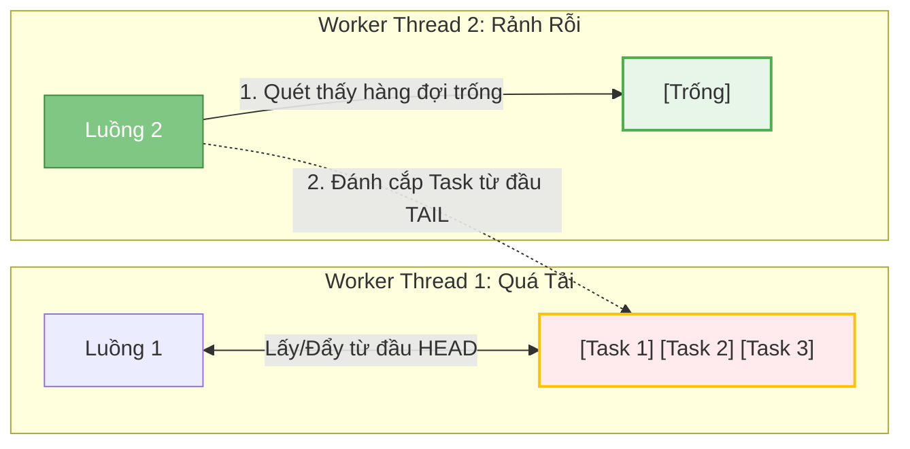

# ForkJoinPool phù hợp với bài toán nào? Thuật toán Work-Stealing

## ⚡ Tóm tắt ngắn (30s)
`ForkJoinPool` (được giới thiệu từ Java 7) là một Thread Pool chuyên biệt được thiết kế riêng cho các tác vụ tính toán song song sử dụng mô hình **Chia để trị (Divide and Conquer)**.
Trọng tâm cốt lõi tạo nên sự bá đạo của nó là thuật toán **Work-Stealing (Đánh cắp công việc)**:
* Mỗi thread worker sở hữu một hàng đợi tác vụ hai đầu (**Deque**) cục bộ.
* Khi một worker hoàn thành toàn bộ công việc trong Deque của mình, thay vì đi ngủ, nó sẽ tự động quét sang Deque của các worker khác đang quá tải và **"đánh cắp"** các tác vụ nằm ở cuối (tail) của Deque đó để thực thi. Cơ chế này đảm bảo tất cả các nhân CPU của hệ thống luôn hoạt động hết công suất, triệt tiêu tối đa thời gian rảnh của luồng.

---

## 🔍 Chi tiết bản chất thực chiến

### 1. Thuật toán Work-Stealing vận hành như thế nào?
Trong một Thread Pool thông thường (như `ThreadPoolExecutor`), tất cả các luồng cùng chia sẻ một hàng đợi công việc duy nhất (`BlockingQueue`). Việc này dẫn đến tranh chấp khóa (lock contention) cực lớn khi số lượng luồng tăng lên.
`ForkJoinPool` giải quyết vấn đề này bằng cách gán cho mỗi luồng worker một Deque riêng biệt:
1. **LIFO/FIFO cục bộ**: Thread sở hữu Deque sẽ đẩy tác vụ vào và lấy tác vụ ra xử lý từ đầu **Head** của Deque (LIFO - chế độ mặc định để tối ưu hóa bộ nhớ cache CPU, dữ liệu nóng chạy trước).
2. **Work-Stealing**: Các worker rảnh rỗi sẽ đi "ăn trộm" tác vụ từ đầu **Tail** của Deque của các worker khác. Nhờ khai thác ở hai đầu đối nghịch (Head vs Tail), sự tranh chấp khóa giữa luồng chủ Deque và luồng đi ăn trộm được giảm xuống mức tối thiểu.

### 2. Các lớp tác vụ cốt lõi
Để chạy trong `ForkJoinPool`, tác vụ phải kế thừa `ForkJoinTask`, phổ biến nhất là:
* **`RecursiveAction`**: Cho các tác vụ "chia để trị" không cần trả về kết quả (ví dụ: cập nhật song song mảng dữ liệu).
* **`RecursiveTask<V>`**: Cho các tác vụ "chia để trị" có trả về giá trị (ví dụ: tính tổng mảng khổng lồ, xử lý thuật toán phân rã).

### 3. Phân biệt kịch bản Phù hợp vs Không phù hợp
* **Phù hợp tuyệt đối**:
  * Các bài toán tính toán tính chất toán học nặng (CPU-bound) có cấu trúc đệ quy tự nhiên: MergeSort song song, tính toán ma trận lớn, phân tích cấu trúc cây dữ liệu khổng lồ.
  * Bản chất cơ chế `Parallel Stream` trong Java 8 chạy ngầm định trên `ForkJoinPool.commonPool()`.
* **Tuyệt đối không phù hợp (Anti-pattern)**:
  * Các tác vụ nghẽn I/O (I/O-bound) như gọi HTTP, truy vấn Database, đọc/ghi file. Vì khi luồng bị block chờ I/O, nó không thể xử lý công việc và cũng không thể cho luồng khác "steal" việc, làm tê liệt toàn bộ Thread Pool.

---

## 🎨 Sơ đồ Cơ chế hoạt động của thuật toán Work-Stealing



---

## 💻 Code Example

### BAD ❌ (Lạm dụng ForkJoinPool cho I/O Blocking nặng gây nghẽn toàn bộ Common Pool)
```java
import java.util.concurrent.*;
import java.util.stream.IntStream;

public class BadParallelStream {
    public void sendSpamEmails() {
        // ❌ Tệ: Tận dụng Parallel Stream (chạy ngầm trên ForkJoinPool.commonPool)
        // để thực hiện gọi API gửi Email (I/O block cực nặng ~2s/email).
        // Làm tê liệt toàn bộ các tác vụ song song khác trong hệ thống JVM sử dụng commonPool.
        IntStream.range(0, 1000).parallel().forEach(id -> {
            callEmailGatewayAPI(id); 
        });
    }

    private void callEmailGatewayAPI(int id) {
        try { Thread.sleep(2000); } catch (InterruptedException e) {}
    }
}
```

### GOOD ✅ (Áp dụng ForkJoinPool chuẩn mực cho bài toán chia để trị CPU-bound)
```java
import java.util.concurrent.*;

public class SumCalculator extends RecursiveTask<Long> {
    private static final int THRESHOLD = 10_000; // Ngưỡng phân rã tác vụ
    private final long[] array;
    private final int start;
    private final int end;

    public SumCalculator(long[] array, int start, int end) {
        this.array = array;
        this.start = start;
        this.end = end;
    }

    @Override
    protected Long compute() {
        int length = end - start;
        if (length <= THRESHOLD) {
            // Tác vụ đủ nhỏ, tính toán tuần túy để kết thúc đệ quy
            long sum = 0;
            for (int i = start; i < end; i++) sum += array[i];
            return sum;
        }

        // ✅ Tốt: Chia đôi mảng và fork tác vụ song song
        int mid = start + length / 2;
        SumCalculator leftTask = new SumCalculator(array, start, mid);
        SumCalculator rightTask = new SumCalculator(array, mid, end);

        leftTask.fork(); // Đẩy tác vụ trái vào Deque của luồng hiện tại để luồng khác có thể steal
        long rightResult = rightTask.compute(); // Luồng hiện tại trực tiếp xử lý tác vụ phải
        long leftResult = leftTask.join();    // Chờ đợi kết quả tác vụ trái (non-blocking)

        return leftResult + rightResult;
    }

    public static void main(String[] args) {
        long[] data = new long[1_000_000];
        ForkJoinPool pool = new ForkJoinPool();
        Long totalSum = pool.invoke(new SumCalculator(data, 0, data.length));
        System.out.println("Total: " + totalSum);
    }
}
```

---

## 📊 Phân biệt ThreadPoolExecutor và ForkJoinPool

| Tiêu chí so sánh | ThreadPoolExecutor (Java 5) | ForkJoinPool (Java 7) |
| :--- | :--- | :--- |
| **Cấu trúc hàng đợi** | Một hàng đợi duy nhất dùng chung (`BlockingQueue`) | Mỗi luồng worker có hàng đợi hai đầu cục bộ (`Deque`) |
| **Thuật toán cốt lõi** | Luồng rảnh rỗi block chờ trên queue chung | **Work-Stealing** (đánh cắp tác vụ từ luồng bận) |
| **Quan hệ giữa các tác vụ** | Các tác vụ độc lập tuyến tính | Các tác vụ đệ quy có tính cha-con (`fork`, `join`) |
| **Kịch bản phù hợp nhất** | Tác vụ độc lập, I/O bound, Web Request xử lý | Tác vụ tính toán đệ quy song song, CPU bound |

---

## ⚠️ Common Gotchas & Questions follow-up

* **Cạm bẫy nghẽn mạch do `commonPool()`**:
  Trong JVM, `ForkJoinPool.commonPool()` là một thực thể tĩnh dùng chung cho toàn bộ ứng dụng (kể cả Parallel Stream, CompletableFuture nếu không gán Executor). Kích thước mặc định của nó là `Runtime.getRuntime().availableProcessors() - 1`. Nếu bạn có mã nguồn bị nghẽn I/O chạy trong commonPool, toàn bộ ứng dụng của bạn sẽ bị vạ lây.
* 👉 **Câu hỏi đào sâu từ interviewer**: *Tại sao khi gọi `leftTask.fork()` rồi tiếp tục gọi `rightTask.fork()` và `join()` cả hai lại bị coi là phản hiệu năng (anti-pattern)? Thứ tự tối ưu là gì?*
  * *(Trả lời: Nếu ta viết `leftTask.fork(); rightTask.fork(); rightTask.join(); leftTask.join();` thì ta đang đẩy cả hai task vào hàng đợi rồi luồng hiện tại lại đứng đợi (join) vô ích. Thứ tự tối ưu bắt buộc phải là: `leftTask.fork();` (đẩy task 1 vào hàng đợi cho luồng khác lấy) -> `rightResult = rightTask.compute();` (luồng hiện tại trực tiếp xử lý luôn task 2 không qua hàng đợi) -> `leftResult = leftTask.join();` (luồng hiện tại đón nhận kết quả task 1). Việc này giảm thiểu chi phí đẩy task vào queue và chuyển ngữ cảnh tối đa).*

---