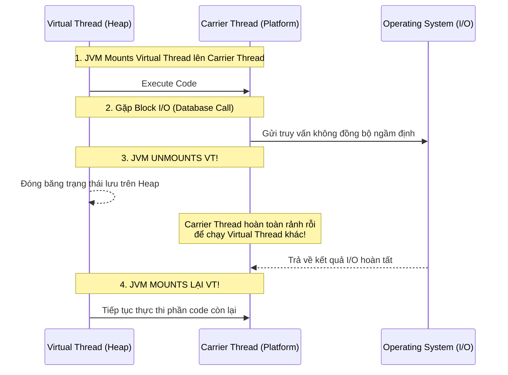

# Java 21 Virtual Threads: Cuộc cách mạng lập trình đồng thời siêu quy mô

## ⚡ Tóm tắt ngắn (30s)
**Virtual Threads (Luồng ảo)** giới thiệu chính thức trong **Java 21 (Project Loom)** là những luồng siêu nhẹ (lightweight threads) được quản lý trực tiếp bởi môi trường thực thi Java Virtual Machine (JVM) thay vì hệ điều hành (OS).
* **Mô hình truyền thống (Platform Threads)**: Ánh xạ 1:1 với OS thread. Rất đắt đỏ (~1MB RAM/thread, chi phí chuyển cảnh cao, giới hạn ở mức vài nghìn luồng).
* **Mô hình Virtual Threads**: Ánh xạ M:N (hàng triệu Virtual Threads chạy trên một số ít **Carrier Threads - luồng chuyên chở** của hệ điều hành). Virtual Threads cực rẻ (chỉ chiếm ~vài trăm bytes bộ nhớ trên Heap).
* **Ứng dụng thực chiến**: Giúp xây dựng hệ thống đồng thời cực khủng với mô hình lập trình đồng bộ, đơn giản truyền thống (thread-per-request) thay thế hoàn toàn cho lập trình bất đồng bộ phản ứng phức tạp (Reactive Programming).

---

## 🔍 Chi tiết bản chất thực chiến

### 1. Cơ chế Mount và Unmount ( Carrier Threads Mapping )
Khi ứng dụng khởi chạy một Virtual Thread, JVM sẽ tiến hành gắn (**Mount**) Virtual Thread này lên một luồng nền tảng thông thường (`Platform Thread`), đóng vai trò là **Carrier Thread (Luồng chuyên chở)** để CPU thực thi.

Điểm kỳ diệu nằm ở chỗ: Khi Virtual Thread chạm vào một thao tác **Block I/O** (ví dụ: query MySQL, gọi RestTemplate sang API khác, sleep luồng):
1. JVM chặn bắt sự kiện blocking đó và tiến hành gỡ bỏ (**Unmount**) Virtual Thread ra khỏi Carrier Thread.
2. Trạng thái hiện tại của Virtual Thread (con trỏ ngăn xếp, biến local) được cất vào **Heap**.
3. Carrier Thread bây giờ hoàn toàn rảnh rỗi và lập tức được JVM gán để chuyên chở một Virtual Thread khác đang đợi.
4. Khi hệ thống OS trả về tín hiệu I/O hoàn tất, JVM sẽ khôi phục trạng thái Virtual Thread cũ từ Heap và **Mount** nó trở lại lên một Carrier Thread đang rảnh để tiếp tục chạy nốt phần code còn lại.

### 2. Vấn đề Pinning (Găm luồng) - Hiểm họa hiệu năng
Mặc dù rất mạnh mẽ, Virtual Thread sẽ bị **gài chặt (Pinned)** vào Carrier Thread và **không thể unmount** nếu:
1. Virtual Thread chạy trong một khối code đồng bộ hóa **`synchronized`** (block hoặc method).
2. Virtual Thread thực thi mã gốc thông qua **JNI (Native Methods)**.
*Hệ quả:* Khi bị găm luồng, nếu có I/O block xảy ra, Carrier Thread vật lý bên dưới cũng bị block cứng theo, làm tê liệt khả năng mở rộng quy mô.
*Giải pháp thực chiến:* Thay thế toàn bộ các khối code sử dụng `synchronized` bằng **`ReentrantLock`** để đảm bảo khả năng unmount mượt mà của Virtual Threads.

---

## 🎨 Sơ đồ Cơ chế Mount/Unmount của Virtual Threads



---

## 💻 Code Example

### BAD ❌ (Dùng synchronized găm chặt Virtual Thread gây nghẽn Carrier Thread)
```java
import java.util.concurrent.ExecutorService;
import java.util.concurrent.Executors;

public class BadVirtualThreadService {
    private final ExecutorService executor = Executors.newVirtualThreadPerTaskExecutor();

    public void process() {
        executor.submit(() -> {
            // ❌ Tệ: synchronized găm Virtual Thread vào Carrier Thread.
            // Khi Thread.sleep (I/O Block) chạy, Carrier Thread vật lý bên dưới bị khóa cứng!
            synchronized (this) {
                try {
                    Thread.sleep(5000); // Giả lập DB query
                } catch (InterruptedException e) {}
            }
        });
    }
}
```

### GOOD ✅ (Thay thế bằng ReentrantLock giải phóng hoàn toàn Carrier Thread)
```java
import java.util.concurrent.ExecutorService;
import java.util.concurrent.Executors;
import java.util.concurrent.locks.ReentrantLock;

public class GoodVirtualThreadService {
    private final ExecutorService executor = Executors.newVirtualThreadPerTaskExecutor();
    // ✅ Tốt: Thay thế synchronized bằng ReentrantLock
    private final ReentrantLock lock = new ReentrantLock();

    public void process() {
        executor.submit(() -> {
            lock.lock();
            try {
                // ✅ Tuyệt vời: JVM unmount Virtual Thread này ra khỏi Carrier Thread bình thường.
                // Carrier Thread rảnh rỗi phục vụ đắc lực cho hàng ngàn task khác!
                Thread.sleep(5000); 
            } catch (InterruptedException e) {
                Thread.currentThread().interrupt();
            } finally {
                lock.unlock();
            }
        });
    }
}
```

---

## 📊 So sánh Platform Threads và Virtual Threads

| Tiêu chí so sánh | Platform Threads (Luồng truyền thống) | Virtual Threads (Java 21) |
| :--- | :--- | :--- |
| **Quản lý bởi** | Hệ điều hành (OS Kernel) | Java Virtual Machine (JVM) |
| **Kích thước bộ nhớ** | ~1 MB cố định (Thread Stack) | Khởi điểm ~vài trăm Bytes (co giãn động trên Heap) |
| **Chi phí khởi tạo** | Rất đắt (Bắt buộc phải dùng Thread Pool) | Cực rẻ (Khởi tạo trực tiếp bằng từ khóa `new`, không cần pool) |
| **Số lượng tối đa** | Hàng ngàn (Giới hạn bởi tài nguyên RAM của hệ thống) | Hàng triệu (Giới hạn bởi dung lượng của bộ nhớ Heap) |
| **Vòng đời sử dụng** | Tái sử dụng liên tục thông qua Pool | Dùng một lần rồi bỏ (Short-lived, Disposable) |

---

## ⚠️ Common Gotchas & Questions follow-up

* **Sai lầm Pooling Virtual Threads**:
  Vì thói quen dùng Thread Pool của lập trình Java truyền thống, nhiều người viết code cố tình tạo pool cho Virtual Threads (ví dụ cấu hình `ThreadLocal` hoặc giới hạn số lượng Virtual Thread qua pool). Đây là một **Anti-pattern cực nặng**. Virtual Threads được thiết kế để "dùng xong rồi vứt". Không bao giờ được dùng pool đối với Virtual Threads. Nếu muốn giới hạn lưu lượng (Rate Limit) truy cập hạ nguồn, hãy sử dụng **`Semaphore`** thay thế!
* 👉 **Câu hỏi đào sâu từ interviewer**: *Virtual Threads có giúp cải thiện tốc độ xử lý (latency) của một tác vụ tính toán toán học (CPU-bound) thuần túy hay không? Tại sao?*
  * *(Trả lời: Hoàn toàn **Không**. Virtual Threads sinh ra không phải để tăng tốc độ tính toán của CPU. Ngược lại, đối với các tác vụ thuần túy CPU-bound (không có bất kỳ block I/O nào), Virtual Threads không mang lại lợi ích gì mà thậm chí còn tốn thêm một chút chi phí quản lý của JVM. Sức mạnh tối thượng của Virtual Threads là **nâng tầm khả năng đáp ứng đồng thời (Throughput)** của hệ thống chứa nhiều tác vụ I/O blocking nặng (như hệ thống Web Backend truyền thống gọi DB và API)).*

---