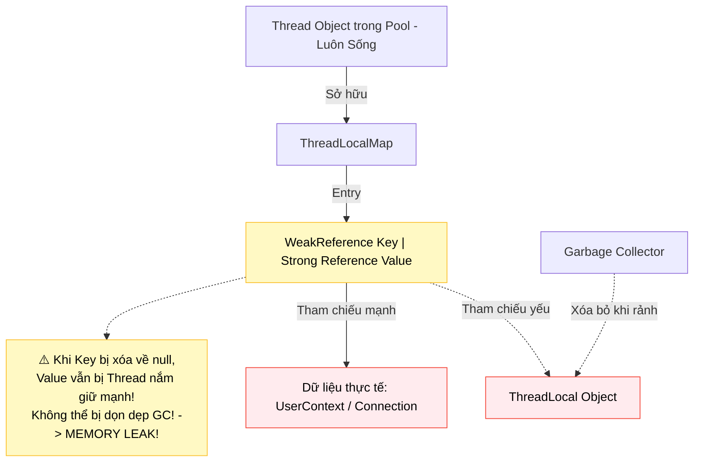

# ThreadLocal: Hiểm họa rò rỉ bộ nhớ Thread Pool & Giải pháp ScopedValue Java 21

## ⚡ Tóm tắt ngắn (30s)
`ThreadLocal` là cơ chế cung cấp các biến nội bộ cục bộ cho từng luồng sở hữu độc lập. Nó giúp lưu trữ và truy cập thông tin ngữ cảnh xuyên suốt các tầng xử lý (như Transaction ID, User Context) mà không cần truyền tham số tường minh qua phương thức.
Tuy nhiên, trong môi trường sử dụng **Thread Pool** (nơi các luồng được giữ lại để tái sử dụng vĩnh viễn):
1. **Memory Leak**: Nếu không gọi `threadLocal.remove()` ở cuối vòng đời của một tác vụ, dữ liệu sẽ bám chặt vào luồng đó mãi mãi gây rò rỉ RAM vật lý nghiêm trọng.
2. **Data Contamination**: Dữ liệu ngữ cảnh của người dùng cũ sẽ vô tình bị rò rỉ sang cho yêu cầu xử lý (Request) của người dùng tiếp theo sử dụng chung luồng đó trong Pool.
3. **Java 21 ScopedValue**: Giải pháp thay thế tối tân hơn, cấu trúc bất biến (immutable), tự động giải phóng vùng nhớ khi ra khỏi scope xử lý.

---

## 🔍 Chi tiết bản chất thực chiến

### 1. Cấu trúc nội tại của ThreadLocalMap và Cơ chế Rò rỉ RAM
Bản chất, mỗi luồng `Thread` sở hữu một biến thành viên kiểu `ThreadLocal.ThreadLocalMap`.
Bản đồ Map này lưu giữ các cặp khóa-giá trị:
* **Khóa (Key)**: Là một tham chiếu yếu **`WeakReference<ThreadLocal<?>>`**.
* **Giá trị (Value)**: Là một tham chiếu mạnh **`Strong Reference`** dẫn tới đối tượng thực tế chứa dữ liệu.

Khi biến tham chiếu `ThreadLocal` của bạn ra khỏi phạm vi hoạt động và bị Garbage Collector (GC) thu hồi, trường khóa (Key) là tham chiếu yếu sẽ bị xóa bỏ và trả về `null`.
Tuy nhiên, **trường giá trị (Value) vẫn tồn tại và giữ tham chiếu mạnh** từ đối tượng luồng hiện tại. Vì luồng trong Thread Pool không bao giờ chết, bản đồ `ThreadLocalMap` của luồng đó tiếp tục lưu giữ giá trị này trong bộ nhớ vô tận $\rightarrow$ Rò rỉ bộ nhớ Heap nghiêm trọng.

### 2. Sự nhiễm độc dữ liệu chéo (Data Contamination)
Khi Request A hoàn thành, luồng số #5 quay lại pool mà chưa dọn dẹp `ThreadLocal`. Request B được đẩy vào luồng số #5. Khi code của Request B gọi `threadLocal.get()`, nó sẽ đọc trực tiếp dữ liệu nhạy cảm của Request A cũ, gây lỗi nghiệp vụ logic và bảo mật nghiêm trọng.

### 3. Java 21 ScopedValue: Tương lai thay thế hoàn hảo
Để giải quyết các yếu điểm chết người của `ThreadLocal` (Dễ rò rỉ bộ nhớ, tính khả biến mutable không an toàn, chi phí bộ nhớ cao khi chạy với hàng triệu Virtual Threads), Java 21 giới thiệu **`ScopedValue`**:
* **Bất biến (Immutable)**: Chỉ được gán giá trị một lần duy nhất lúc khởi tạo scope.
* **Thời gian sống xác định (Strict Scope Boundary)**: Chỉ có hiệu lực trong phạm vi của một khối mã chạy (chạy qua lambda `ScopedValue.where(KEY, value).run(() -> { ... })`). Khi khối kết thúc, JVM tự động dọn dẹp biến, loại bỏ hoàn toàn khả năng rò rỉ RAM.

---

## 🎨 Sơ đồ Cấu trúc tham chiếu gây rò rỉ bộ nhớ của ThreadLocal



---

## 💻 Code Example

### BAD ❌ (Sử dụng ThreadLocal trong Thread Pool không dọn dẹp gây rò rỉ RAM)
```java
import java.util.concurrent.*;

public class UserContextFilter {
    // ❌ Tệ: Dùng ThreadLocal lưu trữ thông tin User trong Filter chạy trên Thread Pool.
    // Nếu quên giải phóng, luồng bị tái sử dụng sẽ giữ chặt RAM chứa UserContext.
    private static final ThreadLocal<UserContext> contextHolder = new ThreadLocal<>();

    public void doFilter(String userToken) {
        UserContext context = authenticate(userToken);
        contextHolder.set(context); // Thiết lập giá trị cho luồng hiện tại

        processRequest();
        
        // ❌ Cực kỳ nguy hiểm: Quên gọi contextHolder.remove() ở đây!
        // Dẫn tới rò rỉ bộ nhớ RAM và rò rỉ thông tin người dùng sang request sau!
    }

    private UserContext authenticate(String token) { return new UserContext(token); }
    private void processRequest() { /* Logic xử lý */ }
}
```

### GOOD ✅ (Giải pháp an toàn với Try-Finally & remove() hoặc ScopedValue Java 21)
```java
import java.util.concurrent.*;

public class SafeUserContextFilter {
    private static final ThreadLocal<UserContext> contextHolder = new ThreadLocal<>();

    public void doFilter(String userToken) {
        UserContext context = authenticate(userToken);
        try {
            contextHolder.set(context);
            processRequest();
        } finally {
            // ✅ Tốt: Bắt buộc giải phóng biến trong khối finally để bảo vệ RAM
            contextHolder.remove(); 
        }
    }

    // ✅ Đỉnh cao Java 21: Sử dụng ScopedValue thay thế hoàn toàn ThreadLocal
    private static final ScopedValue<UserContext> SCOPED_CONTEXT = ScopedValue.newInstance();

    public void doFilterModern(String userToken) {
        UserContext context = authenticate(userToken);
        // ✅ Tốt: Liên kết giá trị trong scope, tự động giải phóng vùng nhớ khi kết thúc
        ScopedValue.where(SCOPED_CONTEXT, context).run(() -> {
            processRequestModern(); 
        }); 
    }

    private UserContext authenticate(String token) { return new UserContext(token); }
    private void processRequest() {}
    private void processRequestModern() {
        UserContext current = SCOPED_CONTEXT.get(); // Lấy dữ liệu an toàn
    }
}
```

---

## 📊 So sánh ThreadLocal và ScopedValue

| Tiêu chí so sánh | ThreadLocal (Java 1.2) | ScopedValue (Java 21) |
| :--- | :--- | :--- |
| **Tính khả biến (Mutability)** | Khả biến (Có thể gọi `.set()` thay đổi bất kỳ lúc nào) | Bất biến (Chỉ được gán một lần duy nhất tại điểm khởi đầu scope) |
| **Ranh giới hoạt động** | Mơ hồ (Cho đến khi luồng chết hoặc gọi `remove()`) | Nghiêm ngặt (Tự động hết hiệu lực khi ra khỏi lambda chạy) |
| **Hiệu năng quy mô** | Rất kém khi chạy với hàng triệu luồng ảo Virtual Threads | Cực kỳ tối ưu cho Virtual Threads (JVM tối ưu bộ nhớ trực tiếp) |
| **Nguy cơ Memory Leak** | Rất cao nếu lập trình viên quên gọi `.remove()` | **Hoàn toàn bằng 0** (Do cơ chế tự động dọn dẹp của JVM) |

---

## ⚠️ Common Gotchas & Questions follow-up

* **Cạm bẫy kế thừa biến sang luồng con (InheritableThreadLocal)**:
  Khi sử dụng `InheritableThreadLocal`, các luồng con được sinh ra sẽ tự động sao chép toàn bộ dữ liệu từ luồng cha. Trong các framework bất đồng bộ, luồng con thường được lấy từ một pool khác, dẫn đến dữ liệu rác lan truyền chéo bừa bãi và chi phí copy dữ liệu rất lớn.
* 👉 **Câu hỏi đào sâu từ interviewer**: *Tại sao Garbage Collector không thể thu hồi giá trị (Value) trong ThreadLocalMap khi khoá (Key) đã bị dọn dẹp về null? Trình bày cách JVM tự cứu vãn bộ nhớ nếu có?*
  * *(Trả lời: Vì biến Value được nắm giữ bởi một tham chiếu mạnh xuất phát từ thực thể `Thread` hiện tại đang sống dai dẳng trong Thread Pool. JVM giải quyết thụ động bằng cách: mỗi khi ta gọi các hàm `get()`, `set()` hoặc `remove()` trên một thực thể `ThreadLocal` bất kỳ, JVM sẽ tiện tay quét và dọn dẹp các ô nhớ "bị mồ côi" (stale entries - ô nhớ có key bằng null) trong `ThreadLocalMap` của luồng đó. Tuy nhiên, nếu luồng sau đó không bao giờ gọi các hàm này nữa, dữ liệu mồ côi vẫn sẽ nằm im trong RAM gây Memory Leak, do đó việc chủ động gọi `remove()` trong khối `finally` là bắt buộc).*

---