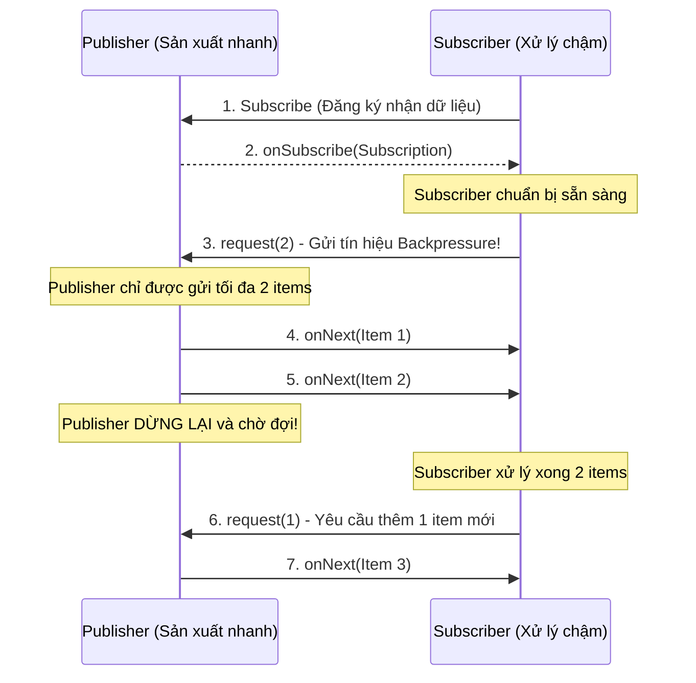

# Backpressure (Áp lực ngược) là gì? Nguyên lý Flow Control trong Reactive Streams

## ⚡ Tóm tắt ngắn (30s)
**Backpressure (Áp lực ngược)** là cơ chế kiểm soát lưu lượng dòng chảy dữ liệu (**Flow Control**) trong hệ thống lập trình phản ứng (Reactive Programming) hoặc hệ thống phân tán bất đồng bộ.
* **Mô hình đẩy dữ liệu (Push Model) truyền thống**: Producer liên tục đẩy dữ liệu bất chấp tốc độ tiêu thụ của Consumer. Nếu Consumer xử lý chậm, bộ đệm (Buffer) sẽ phình to gây tràn RAM (OOM) hoặc làm rớt dữ liệu (Drop packet).
* **Mô hình áp lực ngược (Reactive Pull Model)**: Consumer sẽ đóng vai trò chủ động điều tiết. Nó sẽ gửi một tín hiệu yêu cầu (`request(n)`) báo cho Producer biết: *"Tôi chỉ có thể xử lý tối đa n phần tử ở thời điểm hiện tại"*. Producer bắt buộc chỉ được gửi tối đa đúng `n` phần tử và phải dừng lại chờ cho đến khi nhận được yêu cầu tiếp theo từ Consumer.

---

## 🔍 Chi tiết bản chất thực chiến

### 1. Mô hình Push vs Pull trong xử lý dữ liệu
Trong lập trình đa luồng thông thường, nếu luồng viết chạy quá nhanh so với luồng đọc, dữ liệu tạm thời được chứa trong hàng đợi. Tuy nhiên, hàng đợi luôn luôn có giới hạn vật lý.
* Nếu dùng **Unbounded Queue**, ta đối mặt với nguy cơ sập RAM hệ thống (OOM).
* Nếu dùng **Bounded Queue**, luồng viết sẽ bị block cứng khi hàng đợi đầy. Trong mô hình hướng sự kiện (Event-driven) hoặc Non-blocking I/O, việc block luồng là tối kỵ vì nó làm tê liệt toàn bộ luồng xử lý sự kiện (Event Loop).

Do đó, **Backpressure** ra đời để giải quyết bài toán non-blocking flow control:

### 2. Mô hình Reactive Streams và Java 9 Flow API
Từ Java 9, cơ chế này được chuẩn hóa thông qua lớp `java.util.concurrent.Flow` chứa 4 Interfaces cốt lõi:
1. **`Publisher<T>`**: Nhà sản xuất dữ liệu, chịu trách nhiệm xuất bản các phần tử theo yêu cầu.
2. **`Subscriber<T>`**: Nhà tiêu thụ dữ liệu, đăng ký nhận tin từ Publisher.
3. **`Subscription`**: Sợi dây liên kết độc quyền giữa Publisher và Subscriber. Đây là nơi chứa hàm then chốt `request(long n)` để thực thi áp lực ngược, và `cancel()` để dừng luồng dữ liệu.
4. **`Processor<T, R>`**: Mắt xích trung gian đóng vai trò vừa là Subscriber vừa là Publisher để biến đổi dữ liệu.

### 3. Bốn chiến lược xử lý khi hàng đợi đầy (Backpressure Strategies)
Khi dữ liệu đến dồn dập vượt quá khả năng xử lý, hệ thống phải áp dụng một trong các chiến lược cứu cánh sau:
* **BUFFER**: Lưu trữ dữ liệu vào một hàng đợi hữu hạn. Nếu đầy quá sẽ chặn hoặc ném lỗi bảo vệ bộ nhớ.
* **DROP**: Lập tức vứt bỏ các gói dữ liệu mới nhất được gửi đến nếu Consumer đang bận xử lý dữ liệu cũ.
* **LATEST**: Chỉ giữ lại gói dữ liệu mới nhất nhận được và ghi đè đè lên tất cả dữ liệu cũ chưa kịp tiêu thụ.
* **ERROR**: Ném lỗi lập tức để từ chối nhận thêm dữ liệu, hủy bỏ liên kết Subscription.

---

## 🎨 Sơ đồ Vận hành Áp lực ngược trong Reactive Streams



---

## 💻 Code Example

### BAD ❌ (Đẩy dữ liệu không kiểm soát, nuốt trọn RAM gây crash OOM nhanh chóng)
```java
import java.util.concurrent.SubmissionPublisher;

public class BadDataPipeline {
    public static void main(String[] args) throws InterruptedException {
        // SubmissionPublisher mặc định sử dụng buffer hữu hạn nhưng nếu đẩy quá nhanh
        // và không có cơ chế backpressure ở subscriber, hệ thống sẽ rơi vào tình trạng đơ.
        SubmissionPublisher<byte[]> publisher = new SubmissionPublisher<>();

        // Subscriber tiêu thụ cực kỳ chậm (mất 1 giây cho mỗi MB dữ liệu)
        publisher.subscribe(new Flow.Subscriber<>() {
            private Flow.Subscription subscription;
            @Override
            public void onSubscribe(Flow.Subscription subscription) {
                this.subscription = subscription;
                // ❌ Tệ: Yêu cầu vô hạn dữ liệu ngay từ đầu! Vô hiệu hóa Backpressure!
                subscription.request(Long.MAX_VALUE); 
            }
            @Override
            public void onNext(byte[] item) {
                try { Thread.sleep(1000); } catch (InterruptedException e) {} // Chậm
            }
            @Override
            public void onError(Throwable throwable) {}
            @Override
            public void onComplete() {}
        });

        // Publisher liên tục ném dữ liệu khổng lồ vào hệ thống
        while (true) {
            publisher.submit(new byte[1024 * 1024]); // Đẩy liên tục 1MB/lượt
        }
    }
}
```

### GOOD ✅ (Sử dụng Flow API điều tiết dòng chảy dữ liệu chuẩn mực)
```java
import java.util.concurrent.Flow;
import java.util.concurrent.SubmissionPublisher;

public class SafeDataPipeline {
    public static void main(String[] args) {
        SubmissionPublisher<String> publisher = new SubmissionPublisher<>();

        publisher.subscribe(new Flow.Subscriber<>() {
            private Flow.Subscription subscription;
            private int processedCount = 0;

            @Override
            public void onSubscribe(Flow.Subscription subscription) {
                this.subscription = subscription;
                // ✅ Tốt: Chỉ yêu cầu xử lý trước đúng 3 phần tử để thăm dò năng lực
                subscription.request(3); 
            }

            @Override
            public void onNext(String item) {
                System.out.println("Processing: " + item);
                try { Thread.sleep(500); } catch (InterruptedException e) {} // Xử lý chậm

                processedCount++;
                if (processedCount % 2 == 0) {
                    // ✅ Tốt: Xử lý xong đến đâu thì chủ động kéo thêm dữ liệu đến đó
                    // Luôn luôn duy trì tải trọng an toàn cho bộ nhớ đệm
                    System.out.println("--> Requesting 2 more items...");
                    subscription.request(2);
                }
            }

            @Override
            public void onError(Throwable throwable) {
                System.err.println("Error: " + throwable.getMessage());
            }

            @Override
            public void onComplete() {
                System.out.println("Done!");
            }
        });
    }
}
```

---

## 📊 Trade-off của các chiến lược xử lý Backpressure

| Chiến lược | Lợi ích | Điểm yếu nguy hại | Trường hợp áp dụng thực tế |
| :--- | :--- | :--- | :--- |
| **BUFFER** | Không mất mát bất kỳ dòng dữ liệu nào | Bộ đệm có nguy cơ phình to gây OOM nếu nghẽn kéo dài | Giao dịch tài chính, thanh toán hoá đơn |
| **DROP** | Cực kỳ an toàn cho RAM, không bao giờ lo quá tải | Mất mát dữ liệu nghiêm trọng không phục hồi | Logs hệ thống, các gói tin giám sát không trọng yếu |
| **LATEST** | Luôn cập nhật được trạng thái mới nhất của hệ thống | Bỏ qua toàn bộ tiến trình lịch sử ở giữa | Biểu đồ giá chứng khoán, đo nhiệt độ phòng realtime |
| **ERROR** | Phát hiện sự cố quá tải lập tức để cảnh báo | Gây gián đoạn trải nghiệm người dùng, huỷ kết nối | Hệ thống API Gateway bảo vệ tải máy chủ |

---

## ⚠️ Common Gotchas & Questions follow-up

* **Cạm bẫy nhầm lẫn giữa Backpressure và Rate Limiting**:
  Rất nhiều nhà phát triển nhầm tưởng hai khái niệm này là một.
  * **Rate Limiting**: Là cơ chế giới hạn tải **tĩnh** được áp đặt từ trước (ví dụ chặn tối đa 100 requests/s từ phía Client). Nó không quan tâm máy chủ hiện tại đang rảnh hay bận.
  * **Backpressure**: Là cơ chế điều tiết tải **động** tự động thích nghi dựa trên năng lực xử lý thực tế tại thời điểm chạy (runtime) của hệ thống hạ nguồn. Nếu hệ thống hạ nguồn khoẻ, nó nhận nhiều; nếu yếu, nó tự động hãm phanh.
* 👉 **Câu hỏi đào sâu từ interviewer**: *Làm sao để triển khai cơ chế Backpressure xuyên suốt qua mạng (Network Boundary) giữa hai Microservices độc lập giao tiếp qua giao thức HTTP?*
  * *(Trả lời: Trên môi trường mạng, ta không thể truyền trực tiếp biến đối tượng Subscription của Java. Để giải quyết, ta sử dụng giao thức truyền tải hỗ trợ Reactive Network như **RSocket** (độc lập ngôn ngữ, hỗ trợ kiểm soát dòng dữ liệu cấp độ network frame) hoặc sử dụng tính năng **Reactive gRPC** kết hợp với cơ chế Flow Control sẵn có của giao thức truyền tải lớp dưới là **HTTP/2** (thông qua cơ chế điều chỉnh kích thước WINDOW UPDATE frame cấp độ TCP)).*

---