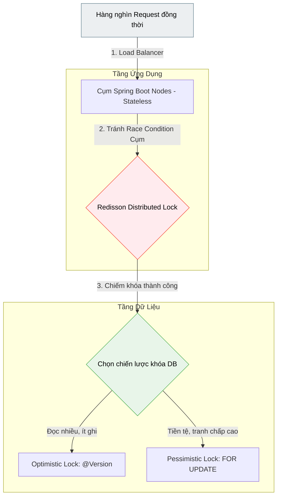

# Thiết kế Multi-Tier Concurrent Service an toàn trước tranh chấp dữ liệu

## ⚡ Tóm tắt ngắn (30s)
Thiết kế một dịch vụ đa tầng xử lý đồng thời (**Multi-Tier Concurrent Service**) an toàn, tránh lỗi tranh chấp dữ liệu (Race Condition) và khóa chết (Deadlock) trên môi trường thực tế yêu cầu 4 nguyên lý vàng cốt lõi:
1. **Stateless Beans**: Tầng ứng dụng (Spring Controllers/Services) phải hoàn toàn không chứa trạng thái khả biến (mutable state).
2. **Database Locking**: Áp dụng **Optimistic Locking** (@Version) cho hệ thống đọc nhiều viết ít; và **Pessimistic Locking** (SELECT FOR UPDATE) cho các giao dịch đặc biệt nhạy cảm về mặt tiền tệ.
3. **Distributed Locks**: Sử dụng **Redisson (Redis)** để tạo khoá phân tán khi chạy cụm (Cluster) nhiều Server, luôn thiết lập Timeout và LeaseTime cho khoá để tránh treo hệ thống.
4. **Deadlock Mitigation**: Đảm bảo chiếm khoá theo một thứ tự nhất quán tuyệt đối và áp dụng cơ chế thử lấy khoá có giới hạn thời gian (`tryLock`).

---

## 🔍 Chi tiết bản chất thực chiến

### 1. Stateless Application Layer: Nguyên tắc cốt tử
Trong Spring Framework, mặc định các Bean được khởi tạo ở scope **`Singleton`** (chỉ có duy nhất một thực thể trong JVM chạy xuyên suốt ứng dụng). Do đó, Spring Service tuyệt đối **không được phép khai báo các biến thành viên khả biến (mutable instance variables)** để lưu thông tin người dùng. Mọi trạng thái trung gian bắt buộc phải được truyền qua biến cục bộ (Local Variables) nằm gọn trong Stack Frame riêng của từng luồng xử lý request.

### 2. Chiến lược Khoá Database thực chiến: Optimistic vs Pessimistic

* **Optimistic Locking (Khóa lạc quan)**:
  * *Vận hành:* Không hề khoá dòng dữ liệu. Sử dụng trường số phiên bản `@Version` trong JPA. Khi cập nhật: `UPDATE product SET stock = 10, version = 2 WHERE id = 1 AND version = 1`.
  * *Hệ quả:* Nếu luồng khác đã update trước đó, số dòng ảnh hưởng trả về bằng 0 $\rightarrow$ JPA ném ra `OptimisticLockingFailureException`. Ứng dụng phải chủ động bắt lỗi này và thực hiện cơ chế thử lại (Retry).
  * *Phù hợp:* Đọc nhiều, ghi ít, tỉ lệ va chạm tranh chấp thấp. Hiệu năng hệ thống cực cao.

* **Pessimistic Locking (Khóa bi quan)**:
  * *Vận hành:* Khoá cứng dòng dữ liệu tại Database từ lúc đọc thông qua câu lệnh `SELECT ... FOR UPDATE`. Các luồng khác muốn đọc dòng này để ghi đều phải xếp hàng đợi.
  * *Phù hợp:* Va chạm giao dịch cao, nhạy cảm cực độ (Ví dụ: Ví điện tử thanh toán trừ tiền, rút tiền ATM, đặt vé máy bay giữ ghế).
  * *Nguy cơ:* Gây thắt cổ chai hiệu năng của Database và rất dễ dẫn tới Deadlock nếu lập trình viên cẩu thả.

### 3. Distributed Lock (Khóa phân tán) với Redisson
Khi ứng dụng của bạn nhân bản ra 10 Nodes chạy sau Load Balancer, các cơ chế khoá cục bộ của JVM như `ReentrantLock` hay `synchronized` hoàn toàn vô dụng. Ta bắt buộc phải nhờ cậy vào hệ thống quản lý khoá tập trung bên ngoài như Redis (sử dụng thư viện **Redisson**):
* **Bẫy sập không có LeaseTime**: Nếu node giữ khoá bị sập đột ngột (Crash, OOM, đứt cáp mạng), khoá phân tán sẽ treo vĩnh viễn trên Redis, làm tê liệt toàn bộ cụm Server.
* **Giải pháp**: Luôn luôn cấu hình thời gian tự động giải phóng khoá (LeaseTime) kết hợp với cơ chế gia hạn khoá tự động (**Watchdog** của Redisson).

---

## 🎨 Sơ đồ Kiến trúc Concurrent Service an toàn đa tầng



---

## 💻 Code Example

### BAD ❌ (Dùng Lock trong bộ nhớ JVM cho Service chạy Cluster và cập nhật DB không an toàn)
```java
import org.springframework.stereotype.Service;
import org.springframework.transaction.annotation.Transactional;

@Service
public class BadStockService {
    private int localTempStock = 100; // ❌ Tệ 1: Mutable variable trong Singleton Bean!

    // ❌ Tệ 2: synchronized vô dụng trên Cluster và làm nghẽn toàn bộ luồng xử lý trên 1 node.
    @Transactional
    public synchronized void purchaseProduct(Long productId, int quantity) {
        Product product = db.find(productId); // Không có khoá bảo vệ
        if (product.getStock() >= quantity) {
            product.setStock(product.getStock() - quantity);
            db.save(product); // Nguy cơ Lost Update cực cao khi nhiều luồng cùng ghi đè
        }
    }
}
```

### GOOD ✅ (Thiết kế hoàn hảo kết hợp Redisson Lock, Stateless Service và DB Lock)
```java
import org.redisson.api.RLock;
import org.redisson.api.RedissonClient;
import org.springframework.stereotype.Service;
import org.springframework.transaction.annotation.Transactional;
import java.util.concurrent.TimeUnit;

@Service
public class SafeStockService {
    private final RedissonClient redissonClient;
    private final ProductRepository productRepository;

    public SafeStockService(RedissonClient redissonClient, ProductRepository productRepository) {
        this.redissonClient = redissonClient;
        this.productRepository = productRepository;
    }

    public void processOrder(Long productId, int quantity) throws InterruptedException {
        String lockKey = "lock:product:" + productId;
        RLock lock = redissonClient.getLock(lockKey);

        // ✅ Tốt 1: Thử lấy khoá phân tán với Timeout chặt chẽ (Chờ 5s, giữ khoá tối đa 10s)
        if (lock.tryLock(5, 10, TimeUnit.SECONDS)) {
            try {
                // ✅ Tốt 2: Luồng xử lý gọi method có transaction riêng để ghi nhận DB lập tức
                executePurchaseInTransaction(productId, quantity);
            } finally {
                // ✅ Bắt buộc giải phóng khoá phân tán trong khối finally bảo vệ cụm Server
                if (lock.isHeldByCurrentThread()) {
                    lock.unlock();
                }
            }
        } else {
            throw new RuntimeException("Hệ thống bận, vui lòng thử lại sau!");
        }
    }

    @Transactional
    public void executePurchaseInTransaction(Long productId, int quantity) {
        // ✅ Tốt 3: Sử dụng Pessimistic Lock (SELECT FOR UPDATE) tại DB
        // Đảm bảo không luồng nào khác ghi đè lên số lượng kho hàng cùng lúc
        Product product = productRepository.findByIdForUpdate(productId)
            .orElseThrow(() -> new RuntimeException("Sản phẩm không tồn tại!"));

        if (product.getStock() < quantity) {
            throw new RuntimeException("Sản phẩm đã hết hàng!");
        }

        product.setStock(product.getStock() - quantity);
        productRepository.save(product);
    }
}
```

---

## 📊 Trade-off: So sánh các tầng khóa bảo vệ dữ liệu

| Cơ chế khóa | Ưu điểm | Nhược điểm nguy hại | Trường hợp sử dụng chuẩn |
| :--- | :--- | :--- | :--- |
| **Optimistic Lock** | Cực kỳ nhanh, không block DB connection, tránh treo luồng | Đòi hỏi xử lý retry phức tạp ở tầng ứng dụng nếu cập nhật thất bại | Hệ thống mạng xã hội, quản lý User Profile |
| **Pessimistic Lock** | An toàn tuyệt đối ở tầng DB, không lo mất dữ liệu ghi | Block kết nối DB vật lý, nguy cơ gây deadlock cao | Hệ thống ví điện tử, số dư tài khoản ngân hàng |
| **Distributed Lock** | Đồng bộ hóa hoàn hảo trên môi trường Cluster nhiều node | Phụ thuộc vào bên thứ 3 (Redis), tăng độ trễ mạng (network latency) | Phòng chống đặt trùng phòng khách sạn, bão request mua hàng sale |

---

## ⚠️ Common Gotchas & Questions follow-up

* **Cạm bẫy Transaction lồng trong Lock (Spring Transaction Gotcha)**:
  Đây là lỗi kinh điển của các lập trình viên Spring. Nếu bạn viết khoá phân tán **bên trong** một phương thức được đánh dấu `@Transactional`, khoá phân tán sẽ giải phóng **trước** khi Spring commit dữ liệu xuống Database.
  * *Kịch bản lỗi:* Luồng A giải phóng lock phân tán $\rightarrow$ Luồng B lập tức lấy được lock và nhảy vào đọc DB $\rightarrow$ Lúc này luồng A chưa commit giao dịch xuống DB $\rightarrow$ Luồng B đọc dữ liệu cũ $\rightarrow$ **Race Condition tái diễn!**
  * *Giải pháp vàng:* **Luôn luôn bọc khối khoá phân tán bên ngoài ranh giới của Transaction (chạy transaction sau khi đã lấy được lock thành công).**
* 👉 **Câu hỏi đào sâu từ interviewer**: *Làm thế nào để phát hiện và giảm thiểu nguy cơ Deadlock khi sử dụng Pessimistic Lock tại tầng Database?*
  * *(Trả lời: 1. Để phòng tránh Deadlock, quy tắc bất di bất dịch là **phải sắp xếp thứ tự chiếm khoá một cách nhất quán**. Ví dụ: Khi chuyển tiền từ ví X sang ví Y, ta luôn so sánh ID của X và Y, luồng xử lý bắt buộc phải khoá ví có ID nhỏ trước, rồi mới khoá ví có ID lớn sau. Việc này triệt tiêu hoàn toàn khả năng xảy ra chu kỳ đợi chéo (Circular Wait). 2. Ở tầng DB, cấu hình `innodb_lock_wait_timeout` (MySQL/PostgreSQL) ngắn (~2-3 giây) để tự động huỷ giao dịch bị treo, giải phóng tài nguyên. 3. Sử dụng các công cụ giám sát để phân tích đồ thị đợi khoá (Lock Wait History) phát hiện nút thắt cổ chai).*
