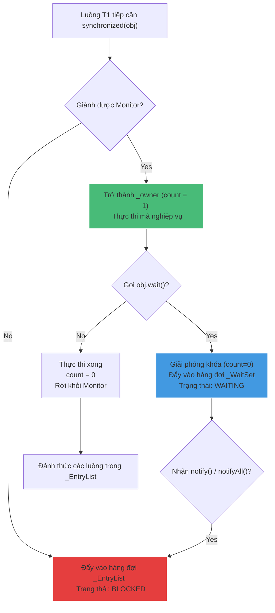

# Monitor Lock (Intrinsic Lock) hoạt động như thế nào trong JVM?

## ⚡ Tóm tắt ngắn (30s)
* **Monitor Lock (Intrinsic Lock - Khóa ngầm định)** là cơ chế đồng bộ hóa tích hợp sẵn trong cấu trúc của **mọi đối tượng Java**. Cơ chế này đảm bảo tại một thời điểm chỉ có tối đa một luồng được phép thực thi khối mã được bảo vệ (`synchronized`).
* Khi một luồng cố gắng đi vào khối `synchronized(obj)`, nó bắt buộc phải giành được quyền sở hữu Monitor gắn với `obj`.
* Nếu giành khóa thành công, luồng trở thành **Owner**. Nếu thất bại, luồng sẽ bị chặn đứng (Blocked) và đẩy vào hàng đợi chờ đợi (**EntryList**) của Monitor.

---

## 🔍 Chi tiết bản chất cấu trúc Monitor

Mỗi đối tượng Java lưu trữ trên bộ nhớ Heap đều có một **Object Header** gồm 2 trường chính:
1. **Class Metadata Address**: Trỏ tới thông tin định nghĩa lớp của đối tượng đó.
2. **Mark Word**: Chứa các thông tin trạng thái của đối tượng bao gồm: Hashcode, Tuổi của đối tượng (dành cho GC), và quan trọng nhất là **Lock State Bits (Các bit biểu diễn trạng thái khóa)**.

### 1. Trạng thái Khóa trong Mark Word
Tùy thuộc vào mức độ tranh chấp, JVM sẽ tự động nâng cấp trạng thái khóa (Lock Inflation):
* **Unlocked (001)**: Đối tượng chưa bị khóa bởi bất kỳ luồng nào.
* **Biased (101)**: Khóa thiên vị. JVM tối ưu cho trường hợp chỉ có duy nhất một luồng truy cập liên tục vào khối đồng bộ mà không có tranh chấp. Thread ID được ghi trực tiếp vào Mark Word.
* **Lightweight (000)**: Khóa nhẹ. Xảy ra khi có một vài luồng tranh chấp nhưng thời gian giữ khóa cực ngắn. JVM sử dụng kỹ thuật quay vòng kiểm tra thử (**CAS Spin-lock**) thay vì chặn luồng.
* **Heavyweight (010)**: Khóa nặng. Khi tranh chấp gay gắt, JVM nâng cấp khóa lên Monitor thực tế của hệ điều hành (OS Mutex). Luồng bị chặn sẽ rơi vào giấc ngủ sâu (Sleep) và chịu chi phí Context Switch cực lớn.

### 2. Cấu trúc của một Monitor (ObjectMonitor)
Trong JVM, thực thể Monitor được biểu diễn bởi lớp `ObjectMonitor` gồm các thành phần cốt lõi:
* **_owner**: Trỏ tới luồng đang nắm giữ Monitor hiện tại.
* **_count**: Biến đếm phục vụ tính chất tái vào (**Reentrancy**). Mỗi lần luồng owner đi vào khối synchronized lồng nhau, biến này tăng 1; khi ra khỏi khối, giảm 1. Khóa chỉ thực sự giải phóng khi count = 0.
* **_EntryList**: Hàng đợi lưu giữ các luồng đang ở trạng thái **BLOCKED** để chờ giành giật Monitor.
* **_WaitSet**: Hàng đợi lưu giữ các luồng chủ động giải phóng Monitor bằng cách gọi phương thức `wait()` để chờ tín hiệu đánh thức ở trạng thái **WAITING**.

---

## 🎨 Sơ đồ luồng hoạt động nội bộ của ObjectMonitor



---

## 💻 Code Example

### BAD ❌ (Đồng bộ hóa trên các đối tượng công khai hoặc dễ bị chia sẻ ngoài ý muốn)
```java
public class SharedService {
    private final String lock = "MY_LOCK"; // ❌ Tệ hại: Chuỗi Literal được tái sử dụng trong String Pool.
    // Nếu một thư viện khác trong hệ thống cũng synchronized("MY_LOCK"), hệ thống sẽ bị deadlock chéo!

    public void process() {
        synchronized(lock) {
            // Nghiệp vụ...
        }
    }
}
```

### GOOD ✅ (Sử dụng đối tượng khóa chuyên biệt, bất biến và riêng tư)
```java
public class SecureService {
    // ✅ Tốt: Đối tượng khóa riêng tư, bất biến, không bị lộ ra bên ngoài lớp
    private final Object lock = new Object(); 

    public void process() {
        synchronized(lock) { // Hoàn toàn an toàn và cô lập
            // Nghiệp vụ...
        }
    }
}
```

---

## 📊 Trade-off Analysis: So sánh các trạng thái Khóa của JVM

| Cấp độ Khóa | Chi phí CPU | Tình huống áp dụng | Điểm yếu |
| :--- | :--- | :--- | :--- |
| **Biased Lock (Khóa thiên vị)** | **Thấp nhất**: Chỉ tốn 1 phép so sánh CAS ban đầu. | Chỉ duy nhất 1 thread chạy qua vùng synchronized. | Gây overhead khi cần thu hồi khóa để nâng cấp lên Lightweight lock. |
| **Lightweight Lock (Khóa nhẹ)** | **Trung bình**: Sử dụng vòng lặp kiểm tra CAS. | Có tranh chấp nhẹ, các thread thực thi khối synchronized siêu nhanh. | Nếu thread giữ khóa chạy lâu, thread chờ sẽ xoay vòng CAS liên tục gây đốt cháy CPU. |
| **Heavyweight Lock (Khóa nặng)**| **Cao nhất**: Chuyển quyền quản lý cho HĐH (OS Mutex). | Tranh chấp dữ dội hoặc luồng giữ khóa chạy quá lâu. | Luồng bị đẩy vào hàng đợi Blocked của OS, tốn chi phí đổi ngữ cảnh (Context switch) khi đánh thức. |

---

## ⚠️ Common Gotchas & Questions follow-up
1. **Lỗi đánh mất Lock do Re-assignment**:
   Tuyệt đối không gán lại tham chiếu đối tượng khóa khi khối synchronized đang hoạt động.
   ```java
   private Object lock = new Object();
   public void doWork() {
       synchronized(lock) {
           lock = new Object(); // ❌ Hủy hoại hoàn toàn cơ chế khóa! Luồng sau sẽ khóa trên đối tượng mới.
       }
   }
   ```
2. 👉 **Câu hỏi đào sâu từ interviewer**: *Khi một luồng đang giữ Monitor Lock bị mất kết nối mạng và treo vĩnh viễn, làm thế nào để giải phóng khóa?*
   * *(Trả lời: Với `synchronized` truyền thống, ta không có cách nào giải phóng khóa từ bên ngoài trừ khi kill tiến trình. Đây là điểm yếu chí tử của synchronized. Để khắc phục trên Production, lập trình viên Senior sẽ chuyển sang dùng **ReentrantLock** của gói `java.util.concurrent.locks`. Lớp này cung cấp phương thức `tryLock(timeout, timeunit)` giúp tự động rút lui và giải phóng tài nguyên nếu không giành được khóa sau một khoảng thời gian chờ đợi).*