# Từ khóa volatile giải quyết vấn đề gì trong lập trình đa luồng?

## ⚡ Tóm tắt ngắn (30s)
Từ khóa **`volatile`** trong Java giải quyết hai bài toán kinh duyệt của Java Memory Model (JMM):
1. **Tính hiển thị dữ liệu (Memory Visibility)**: Đảm bảo mọi thay đổi trên biến volatile của một luồng lập tức hiển thị cho tất cả các luồng khác. Luồng đọc sẽ luôn nhìn thấy giá trị mới nhất bằng cách buộc CPU đọc/ghi trực tiếp xuống **Main Memory (Bộ nhớ chính)** thay vì đọc từ CPU Register hay CPU Cache của nhân đó.
2. **Ngăn chặn tái sắp xếp lệnh (Instruction Reordering)**: Ngăn cấm trình biên dịch (JIT Compiler) và CPU tự ý đảo lộn thứ tự thực thi của các dòng code trước và sau biến volatile thông qua cơ chế **Rào cản bộ nhớ (Memory Barrier / Memory Fence)**.
* **Quy tắc Senior**: `volatile` chỉ bảo vệ **Visibility (Tính hiển thị)** và **Ordering (Trật tự)**, tuyệt đối **không bảo đảm Atomicity (Tính nguyên tử)**.

---

## 🔍 Chi tiết bản chất kỹ thuật

### 1. Vấn đề "Bộ nhớ đệm CPU" và Tính hiển thị (Visibility)
* Để tăng tốc độ thực thi, mỗi nhân CPU (Core) sở hữu các bộ nhớ đệm riêng siêu tốc (**L1, L2 Cache**).
* Khi Thread A chạy trên Core 1 thay đổi biến `stop = true`, giá trị này có thể chỉ nằm lại ở L1 Cache của Core 1 mà chưa được đẩy xuống RAM (Main Memory).
* Thread B chạy trên Core 2 đọc biến `stop` từ L1 Cache của Core 2 (vẫn đang lưu giá trị cũ là `false`) $\rightarrow$ Thread B rơi vào vòng lặp vô hạn và không bao giờ dừng lại mặc dù Thread A đã thay đổi biến.
* Khai báo `volatile` ép JVM thực hiện:
  * **Write**: Ghi trực tiếp giá trị mới từ CPU Cache xuống Main Memory ngay khi thay đổi.
  * **Read**: Thu hồi hiệu lực (invalidate) của CPU Cache, ép luồng phải đọc lại giá trị trực tiếp từ Main Memory.

### 2. Hiện tượng Tái sắp xếp lệnh (Instruction Reordering)
* Để tối ưu hóa pipeline của CPU, JIT Compiler và CPU có quyền sắp xếp lại thứ tự thực hiện các chỉ thị phần cứng miễn là không làm thay đổi kết quả của luồng đơn. Tuy nhiên, trong đa luồng, việc này gây ra các lỗi không tưởng.
* Khi khai báo một biến là `volatile`, JVM sẽ chèn các chỉ thị **Memory Barrier** xung quanh nó:
  * Ngăn cản các câu lệnh phía trước biến volatile bị đẩy ra phía sau nó.
  * Ngăn cản các câu lệnh phía sau biến volatile bị kéo lên phía trước nó.

---

## 🎨 Sơ đồ luồng hoạt động đồng bộ biến Volatile

```mermaid
graph TD
    subgraph Core1["CPU Nhân 1 (Chạy Luồng A)"]
        A["Luồng A ghi: stop = true"] --> Cache1["CPU L1/L2 Cache 1 <br> (Ghi đè giá trị)"]
    end
    
    subgraph RAM["Bộ nhớ chính (Main Memory)"]
        MainRAM["Biến stop: false -> true"]
    end
    
    subgraph Core2["CPU Nhân 2 (Chạy Luồng B)"]
        Cache2["CPU L1/L2 Cache 2 <br> (Bị ép hủy hiệu lực)"] --> B["Luồng B đọc: stop"]
    end

    Cache1 -->|Ép đẩy xuống ngay lập tức| MainRAM
    MainRAM -->|Ép nạp trực tiếp giá trị mới| Cache2
    
    style MainRAM fill:#1a365d,stroke:#3182ce,stroke-width:2px
    style Core1 fill:#2d3748,stroke:#a0aec0
    style Core2 fill:#2d3748,stroke:#a0aec0
```



---

## 💻 Code Example

### BAD ❌ (Không dùng volatile dẫn đến Thread bị kẹt vĩnh viễn trên Production)
```java
public class GameLoop implements Runnable {
    // ❌ Thiếu volatile: Thread chạy vòng lặp có thể cache giá trị 'active' vào CPU Cache riêng
    // và không bao giờ dừng lại dù thread chính đã gọi stopGame().
    private boolean active = true; 

    @Override
    public void run() {
        while (active) {
            // Chạy game loop...
        }
        System.out.println("Game Stopped!");
    }

    public void stopGame() {
        active = false; // Ghi nhận thay đổi nhưng Thread kia có thể không thấy
    }
}
```

### GOOD ✅ (Sử dụng volatile làm cờ hiệu dừng luồng an toàn)
```java
public class SecureGameLoop implements Runnable {
    // ✅ Có volatile: Đảm bảo thay đổi lập tức hiển thị trên tất cả các Thread
    private volatile boolean active = true; 

    @Override
    public void run() {
        while (active) {
            // Chạy game loop...
        }
        System.out.println("Game Stopped!");
    }

    public void stopGame() {
        active = false; // Thay đổi ghi thẳng xuống RAM, Thread kia nhận được ngay lập tức
    }
}
```

---

## 📊 Trade-off Analysis: So sánh Volatile vs Synchronized

| Tiêu chí | Từ khóa volatile | Từ khóa synchronized |
| :--- | :--- | :--- |
| **Tính hiển thị (Visibility)** | **Có** (Ép đọc ghi xuống Main Memory) | **Có** (Giải phóng khóa tự động đẩy dữ liệu xuống Main Memory) |
| **Tính nguyên tử (Atomicity)** | **Không** (Không bảo vệ các phép toán phức tạp i++) | **Có** (Cô lập hoàn toàn khối mã Critical Section) |
| **Tính chặn luồng (Blocking)** | **Không** (Lock-free, không bao giờ gây Blocked hay Deadlock) | **Có** (Đẩy luồng vào hàng đợi BLOCKED chờ giành Monitor) |
| **Hiệu năng** | Siêu nhanh (Gần bằng biến thường, chỉ tốn nhẹ chi phí Memory Barrier) | Chậm hơn (Tốn chi phí giành giật Monitor, quản lý Thread State) |

---

## ⚠️ Common Gotchas & Questions follow-up
* **Cạm bẫy với Kiểu dữ liệu Tham chiếu (Reference Types)**:
  If khai báo `volatile User user = new User("Alice")`, chỉ có bản thân con trỏ `user` (địa chỉ vùng nhớ) được bảo vệ bởi tính hiển thị và trật tự lệnh. Các thuộc tính bên trong đối tượng như `user.setName("Bob")` **hoàn toàn không được bảo vệ** bởi volatile và vẫn gặp lỗi đồng bộ bình thường.
* 👉 **Câu hỏi đào sâu từ interviewer**: *Nguyên lý Happens-Before liên quan gì đến từ khóa volatile trong Java?*
   * *(Trả lời: Trong Java Memory Model, Happens-Before là một mối quan hệ logic bảo đảm thứ tự thực thi bộ nhớ giữa các thao tác. Theo quy định JMM: **"Một hành động ghi vào một trường volatile luôn xảy ra trước (happens-before) mọi hành động đọc tiếp theo vào chính trường volatile đó"**. Điều này thiết lập một chiếc cầu nối đồng bộ thông tin giữa hai Thread mà không cần khóa).*