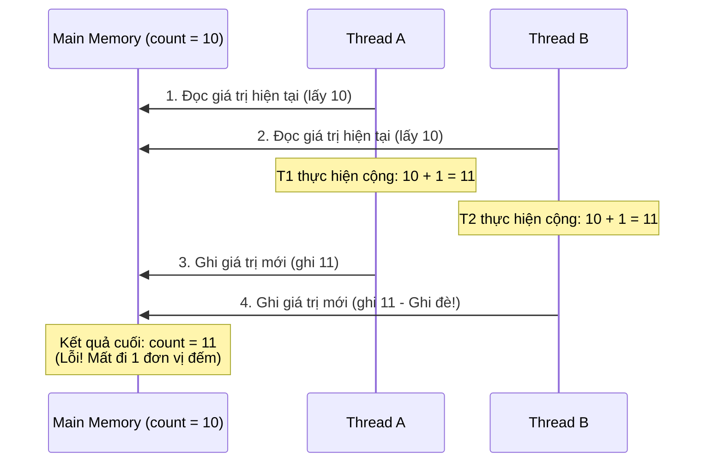

# Từ khóa volatile có thể thay thế hoàn toàn cho Lock được không? vì sao?

## ⚡ Tóm tắt ngắn (30s)
* **Tuyệt đối không**. `volatile` không thể thay thế cho Lock trong phần lớn các bài toán thực tế.
* Lý do cốt lõi là **`volatile` chỉ bảo đảm 2/3 tính chất** của lập trình song song: **Tính hiển thị (Visibility)** và **Trật tự lệnh (Ordering)**. Nó hoàn toàn **bỏ qua Tính nguyên tử (Atomicity)**.
* Đối với các thao tác phức tạp dạng **Read-Modify-Write** (như `count++`, `balance += amount`), việc đọc giá trị cũ, sửa đổi và ghi lại yêu cầu sự bảo vệ toàn vẹn của một **Lock** nhằm tránh hiện tượng ghi đè chéo mất mát dữ liệu (Lost Update).

---

## 🔍 Chi tiết bản chất kỹ thuật

### 1. Phân tích Thao tác không nguyên tử (i++) dưới lăng kính Bytecode
Khi bạn viết `count++` trên một biến `volatile int count`, bạn tưởng đó là một lệnh duy nhất. Nhưng thực chất khi JVM biên dịch sang bytecode, thao tác này bị phân tách thành 3 chỉ thị độc lập:
1. `getstatic`: Đọc giá trị hiện tại của `count` từ Main Memory đưa vào thanh ghi CPU của Thread.
2. `iadd`: Cộng thêm 1 vào giá trị trong thanh ghi.
3. `putstatic`: Ghi lại giá trị mới từ thanh ghi về Main Memory.

Nếu hai luồng Thread A và Thread B đồng thời thực hiện `count++` khi `count = 10`:
* Thread A chạy bước 1 đọc `count = 10`.
* Thread B chạy bước 1 đọc `count = 10` (do volatile bảo đảm tính hiển thị, nhưng cả hai đều đọc cùng lúc nên cùng lấy giá trị 10).
* Thread A chạy bước 2 và 3, cập nhật `count = 11` xuống RAM.
* Thread B chạy bước 2 và 3, cập nhật `count = 11` xuống RAM.
$
ightarrow$ Lẽ ra count phải bằng 12, nhưng do mất đồng bộ nguyên tử, giá trị cuối cùng chỉ là 11. Thao tác tăng của Thread A đã bị Thread B ghi đè đè bẹp hoàn toàn!

### 2. Khi nào Volatile có thể thay thế được Lock?
Lập trình viên Senior chỉ thay thế Lock bằng Volatile khi thỏa mãn đồng thời cả hai điều kiện khắt khe sau:
1. Thao tác ghi vào biến **không phụ thuộc vào giá trị hiện tại của chính nó** (chỉ gán giá trị trực tiếp như `active = false`, `config = newConfig`).
2. Chỉ có **duy nhất 1 Thread thực hiện Ghi** (Write), các Thread khác chỉ thực hiện Đọc (Read). Lúc này hoàn toàn không xảy ra tranh chấp ghi chéo.

---

## 🎨 Sơ đồ kịch bản Đụng độ ghi chéo biến Volatile (Race Condition)



---

## 💻 Code Example

### BAD ❌ (Dùng volatile để đếm lượt truy cập đa luồng dẫn đến sai số nghiêm trọng)
```java
public class CounterService {
    // ❌ Sai lầm: Volatile không giúp phép ++ trở nên an toàn đa luồng.
    // Kết quả cuối cùng sẽ luôn nhỏ hơn số lượng request thực tế dưới tải cao.
    private volatile int visitCount = 0;

    public void increment() {
        visitCount++; 
    }

    public int getCount() { return visitCount; }
}
```

### GOOD ✅ (Giải pháp thay thế Lock bằng cơ chế CAS không chặn - Lock-free)
```java
public class SecureCounterService {
    // ✅ Tốt: Sử dụng AtomicInteger hoạt động trên cơ chế CAS (Compare-And-Swap) ở cấp phần cứng.
    // Giúp đảm bảo tính nguyên tử tuyệt đối mà không cần dùng đến từ khóa synchronized nặng nề.
    private final AtomicInteger visitCount = new AtomicInteger(0);

    public void increment() {
        visitCount.incrementAndGet(); // ✅ Nguyên tử, Thread-safe và cực nhanh
    }

    public int getCount() { return visitCount.get(); }
}
```

---

## 📊 So sánh giải pháp đồng bộ hóa: Volatile vs Lock vs Atomic

| Tiêu chí | Volatile | Lock (Synchronized/Explicit) | Atomic (AtomicInteger) |
| :--- | :--- | :--- | :--- |
| **Bảo vệ khối mã** | Không (Chỉ bảo vệ 1 biến đơn lẻ) | **Có** (Bao bọc cả một đoạn code nghiệp vụ dài) | Không (Chỉ áp dụng trên biến đơn lẻ) |
| **Tính nguyên tử** | Không | **Có** | **Có** (Thông qua phần cứng CAS) |
| **Cơ chế hoạt động** | Ghi thẳng xuống RAM vật lý | Khóa loại trừ tương hỗ (Mutex Lock) | Thử lại liên tục đến khi thành công (Optimistic/Spin) |
| **Chi phí luồng bị chặn**| Không bao giờ chặn (Lock-free) | Có thể bị chặn ở trạng thái BLOCKED | Không bị chặn (Lock-free/Spinning) |

---

## ⚠️ Common Gotchas & Questions follow-up
1. **Lỗi lạm dụng Volatile gây giảm tốc độ**:
   Đọc ghi biến volatile bắt buộc phải đi qua rào cản bộ nhớ (Memory Barrier), triệt tiêu các tối ưu hóa của bộ nhớ đệm CPU L1/L2. Do đó, việc lạm dụng volatile cho các biến lặp đi lặp lại trong vòng lặp kín không cần thiết sẽ làm sụt giảm đáng kể tốc độ chạy của CPU.
2. 👉 **Câu hỏi đào sâu từ interviewer**: *Trong mô hình Singleton Double-Checked Locking, tại sao instance bắt buộc phải khai báo volatile?*
   * *(Trả lời: Để tránh hiện tượng đọc phải đối tượng rác chưa khởi tạo xong (Partially Initialized Object). Câu lệnh `instance = new Singleton()` gồm 3 bước: (1) Phân bổ vùng nhớ, (2) Chạy hàm khởi tạo constructor, (3) Gán con trỏ trỏ tới vùng nhớ. Nếu không có volatile, CPU có thể đảo lệnh chạy bước 3 trước bước 2. Thread khác tiếp cận đúng lúc đó thấy con trỏ khác null liền lấy ra sử dụng, nhưng thực tế constructor chưa chạy xong $
ightarrow$ Ứng dụng crash lập tức).*