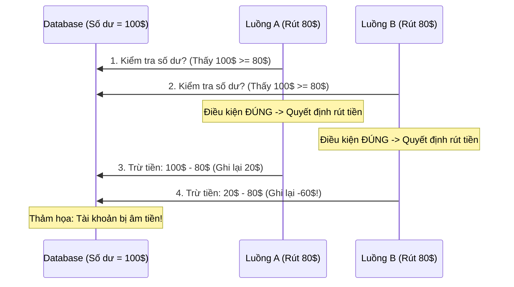

# Race Condition (Tranh chấp luồng) là gì? Phân tích ví dụ thực tế và giải pháp

## ⚡ Tóm tắt ngắn (30s)
* **Race Condition (Tranh chấp luồng)** xảy ra trong môi trường đa luồng khi nhiều luồng truy cập và sửa đổi đồng thời một tài nguyên dùng chung, và **kết quả cuối cùng hoàn toàn phụ thuộc vào trật tự thực thi ngẫu nhiên (timing)** của các luồng đó.
* Sự cố này dẫn tới sai lệch dữ liệu không nhất quán, cực kỳ nguy hiểm vì lỗi chỉ xảy ra ngẫu nhiên dưới tải cao và rất khó tái hiện trong môi trường kiểm thử (Testing).
* **Phân loại chính**: **Read-Modify-Write** (như cộng dồn số dư) và **Check-then-Act** (như khởi tạo lười Singleton, rút tiền vượt hạn mức).

---

## 🔍 Chi tiết hai kiểu Race Condition kinh điển

### 1. Dạng Read-Modify-Write (Đọc - Sửa - Ghi)
Xảy ra khi các luồng đọc một trạng thái hiện tại, tính toán giá trị mới dựa trên trạng thái đó và ghi đè lại.
* **Kịch bản thực tế**: Thao tác tăng lượt click quảng cáo, cập nhật số lượng hàng trong kho.
* **Bản chất**: Nếu không có cơ chế cô lập, hai luồng đọc cùng một giá trị cũ và cùng thực hiện ghi đè giá trị mới giống nhau, làm triệt tiêu mất một hoặc nhiều đợt cập nhật của luồng khác.

### 2. Dạng Check-then-Act (Kiểm tra rồi Hành động)
Xảy ra khi luồng sử dụng một điều kiện kiểm tra (ví dụ: `if (x == null)`) để đưa ra quyết định hành động tiếp theo, nhưng ngay sau khi kiểm tra xong, luồng khác đã nhảy vào thay đổi điều kiện đó trước khi luồng ban đầu kịp hành động.
* **Kịch bản thực tế**: Rút tiền tài khoản ATM.
  * Tài khoản có 100$.
  * Thread A kiểm tra: `if (balance >= 80)` $
ightarrow$ Thấy thỏa mãn (100 >= 80).
  * Ngay trước khi Thread A trừ tiền, Thread B chen ngang kiểm tra: `if (balance >= 80)` $
ightarrow$ Thấy vẫn thỏa mãn (100 >= 80).
  * Thread A thực hiện rút tiền: `balance = balance - 80` $
ightarrow$ Còn 20$.
  * Thread B thực hiện rút tiền: `balance = balance - 80` $
ightarrow$ Tài khoản bị âm còn -60$ (Lỗi rút quá hạn mức cho phép!).

---

## 🎨 Sơ đồ kịch bản lỗi Rút tiền quá hạn mức (Check-then-Act)



---

## 💻 Code Example

### BAD ❌ (Đoạn mã rút tiền dính lỗi Race Condition dạng Check-then-Act)
```java
public class Account {
    private int balance = 100;

    public void withdraw(int amount) {
        // ❌ Lỗi Check-then-Act: Hai thread có thể đi qua dòng check này cùng lúc
        if (balance >= amount) { 
            // Thread khác có thể chen vào đây trừ tiền trước!
            try { Thread.sleep(10); } catch (InterruptedException e) {} 
            balance -= amount;
            System.out.println("Rút tiền thành công! Số dư còn lại: " + balance);
        } else {
            System.out.println("Tài khoản không đủ tiền!");
        }
    }
}
```

### GOOD ✅ (Đồng bộ hóa cô lập hoàn toàn khối kiểm tra và thực thi giao dịch)
```java
public class SecureAccount {
    private int balance = 100;
    private final Object lock = new Object();

    public void withdraw(int amount) {
        // ✅ Tốt: Sử dụng khối synchronized bao bọc toàn bộ chu trình kiểm tra và hành động.
        // Đảm bảo không một luồng nào được phép chen ngang giữa lúc kiểm tra số dư.
        synchronized(lock) {
            if (balance >= amount) {
                balance -= amount;
                System.out.println("Rút tiền thành công! Số dư còn lại: " + balance);
            } else {
                System.out.println("Tài khoản không đủ tiền!");
            }
        }
    }
}
```

---

## 📊 Trade-off Analysis: Các giải pháp triệt tiêu Race Condition

| Giải pháp | Ưu điểm | Nhược điểm | Use Case phù hợp |
| :--- | :--- | :--- | :--- |
| **Khóa đồng bộ (Synchronized / Mutex Lock)** | Cực kỳ an sau, dễ viết, giải quyết triệt để mọi loại Race Condition phức tạp. | Gây nghẽn cổ chai luồng, giảm hiệu năng hệ thống khi lượng request đồng thời tăng cao. | Các giao dịch tài chính lớn, ghi đè dữ liệu nhạy cảm. |
| **Khóa lạc quan (Optimistic Locking / CAS)** | Tốc độ cực nhanh, không chặn luồng (Lock-free), tối ưu cho hệ thống thiên về Đọc dữ liệu. | Đòi hỏi xử lý logic Retry thủ công khi cập nhật thất bại. | Đếm lượt truy cập, cập nhật giỏ hàng thương mại điện tử. |
| **Không chia sẻ trạng thái (Stateless / Immutability)** | **An toàn tuyệt đối**: Bản chất đối tượng không thể sửa đổi thì không thể xảy ra đụng độ băm. | Tốn bộ nhớ để liên tục khởi tạo đối tượng mới thay vì sửa đổi. | Thiết kế API DTOs, cấu trúc dữ liệu dùng chung trong hệ thống microservices. |

---

## ⚠️ Common Gotchas & Questions follow-up
* **Ảo tưởng về Concurrent Collection**:
  Nhiều lập trình viên nghĩ rằng chỉ cần thay `HashMap` bằng `ConcurrentHashMap` là hệ thống tự động an toàn trước Race Condition. Đây là sai lầm phổ biến. `ConcurrentHashMap` chỉ bảo vệ tính nguyên tử của các thao tác đơn lẻ như `put()`, `get()`. Nếu ta viết:
  ```java
  // ❌ VẪN DÍNH RACE CONDITION (Dạng Check-then-Act)
  if (!map.containsKey("key")) {
      map.put("key", new Value());
  }
  // ✅ Giải pháp đúng: Dùng hàm atomic cung cấp sẵn
  map.putIfAbsent("key", new Value());
  ```
* 👉 **Câu hỏi đào sâu từ interviewer**: *Làm sao để phát hiện Race Condition tự động trong giai đoạn chạy thử nghiệm?*
  * *(Trả lời: Ta có thể cấu hình công cụ **ThreadSanitizer (TSan)** khi chạy ứng dụng hoặc chạy stress test đa luồng chuyên sâu bằng các framework như **jcstress** (Java Concurrency Stress). jcstress được thiết kế để tạo ra hàng nghìn luồng ép CPU chạy chéo lệnh liên tục nhằm bắt gọn các lỗi Happens-before và Race Condition rình rập).*