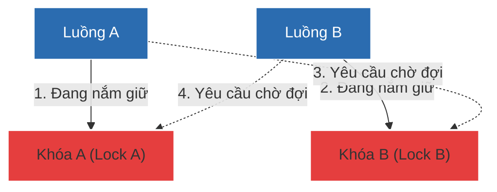

# Deadlock (Khóa chết) là gì? Nguyên lý và Chiến lược phòng tránh thực chiến

## ⚡ Tóm tắt ngắn (30s)
* **Deadlock (Khóa chết)** là trạng thái lỗi nghiêm trọng trong lập trình đa luồng khi hai hoặc nhiều luồng bị **đóng băng vĩnh viễn** do **chờ đợi lẫn nhau giải phóng tài nguyên (Khóa)**.
* **4 Điều kiện Coffman** bắt buộc phải xảy ra đồng thời để Deadlock tồn tại:
  1. **Mutual Exclusion (Loại trừ tương hỗ)**: Tài nguyên độc quyền, chỉ 1 luồng giữ tại một thời điểm.
  2. **Hold and Wait (Giữ và Chờ)**: Luồng đang giữ tài nguyên này nhưng vẫn yêu cầu thêm tài nguyên khác.
  3. **No Preemption (Không cướp đoạt)**: Không thể cưỡng bức cướp khóa luồng khác đang giữ.
  4. **Circular Wait (Chờ đợi vòng tròn)**: Thread 1 đợi Thread 2, Thread 2 đợi Thread 1.
* **Chiến lược khắc phục**: Cách tốt nhất là triệt tiêu điều kiện Chờ đợi vòng tròn bằng quy tắc **Nhất quán thứ tự giành khóa (Lock Ordering)** hoặc sử dụng khóa có giới hạn thời gian chờ (**ReentrantLock.tryLock()**).

---

## 🔍 Chi tiết bản chất kỹ thuật

### 1. Bản phân tích 4 điều kiện Coffman
Để ngăn chặn deadlock, ta chỉ cần phá vỡ tối thiểu **1 trong 4** điều kiện sau:
* **Mutual Exclusion**: Khó phá vỡ vì bản chất một số tài nguyên (như connection ghi DB, file ghi) bắt buộc phải độc quyền để tránh hư hỏng dữ liệu.
* **Hold and Wait**: Ép luồng phải yêu cầu tất cả các khóa cần thiết ngay từ đầu. Nếu thiếu dù chỉ 1 khóa, luồng không được giữ bất kỳ khóa nào. Tuy nhiên, cách này làm lãng phí tài nguyên cực lớn.
* **No Preemption**: Nếu luồng giữ khóa A yêu cầu khóa B thất bại, nó phải tự động trả tự do cho khóa A đang nắm giữ để luồng khác sử dụng. Đây là cơ chế của `ReentrantLock.tryLock()`.
* **Circular Wait**: Sắp xếp tất cả các khóa theo một thứ tự ưu tiên nhất quán (ví dụ: luôn giành Lock A trước Lock B). Đây là cách làm thực tế và tối ưu hiệu năng nhất.

### 2. Định vị Deadlock trên Production
Khi hệ thống bị đơ lag, CPU tụt về 0% đột ngột nhưng ứng dụng không phản hồi API:
* **Cách 1 (Sử dụng jstack)**: Chạy lệnh `jstack <PID> > dump.txt` tìm kiếm cụm từ `Found one Java-level deadlock:`. JVM sẽ chỉ rõ đích danh Thread nào đang giữ khóa nào và chờ khóa nào.
* **Cách 2 (Sử dụng Arthas)**: Chạy lệnh `thread -b` để Arthas tự động quét và chỉ ra dòng code gây nghẽn khóa ngay lập tức.
* **Cách 3 (Lập trình tự động phát hiện)**: Sử dụng API của JVM trong code ứng dụng:
  ```java
  ThreadMXBean bean = ManagementFactory.getThreadMXBean();
  long[] deadlockedThreads = bean.findDeadlockedThreads(); // Trả về danh sách Thread ID bị deadlock
  ```

---

## 🎨 Sơ đồ Chờ đợi vòng tròn của hai Luồng (Circular Wait)



---

## 💻 Code Example

### BAD ❌ (Gây deadlock chắc chắn do thứ tự giành khóa chéo nhau)
```java
public class DeadlockDemo {
    private final Object lockA = new Object();
    private final Object lockB = new Object();

    public void processT1() {
        synchronized (lockA) { // Giành khóa A trước
            try { Thread.sleep(50); } catch (InterruptedException e) {}
            synchronized (lockB) { // Yêu cầu khóa B sau
                System.out.println("T1 hoàn thành công việc!");
            }
        }
    }

    public void processT2() {
        synchronized (lockB) { // ❌ Nguy hiểm: Giành khóa B trước
            try { Thread.sleep(50); } catch (InterruptedException e) {}
            synchronized (lockA) { // Yêu cầu khóa A sau
                System.out.println("T2 hoàn thành công việc!");
            }
        }
    }
}
```

### GOOD ✅ (Phòng tránh bằng Lock Ordering nhất quán tuyệt đối)
```java
public class SecureLockDemo {
    private final Object lockA = new Object();
    private final Object lockB = new Object();

    public void processT1() {
        synchronized (lockA) { // Bước 1: Giành khóa A
            try { Thread.sleep(50); } catch (InterruptedException e) {}
            synchronized (lockB) { // Bước 2: Giành khóa B
                System.out.println("T1 hoàn thành công việc!");
            }
        }
    }

    public void processT2() {
        // ✅ Tốt: Ép buộc tất cả các luồng phải giành khóa theo một thứ tự nhất quán.
        // Luồng T2 bắt buộc phải xếp hàng chờ Lock A giải phóng xong mới được sờ tới Lock B.
        synchronized (lockA) { // Bước 1: Giành khóa A trước!
            try { Thread.sleep(50); } catch (InterruptedException e) {}
            synchronized (lockB) { // Bước 2: Giành khóa B
                System.out.println("T2 hoàn thành công việc!");
            }
        }
    }
}
```

---

## 📊 Trade-off Analysis: Các chiến lược phòng chống Deadlock

| Chiến lược | Lợi ích | Chi phí đánh đổi | Độ phức tạp |
| :--- | :--- | :--- | :--- |
| **Quy chuẩn Lock Ordering** | Tối đa hóa hiệu năng, không tốn tài nguyên chạy ngầm của CPU. | Đòi hỏi lập trình viên phải cực kỳ kỷ luật, kiểm soát chặt chẽ thứ tự gọi khóa trong toàn bộ dự án. | Dễ nếu hệ thống nhỏ, cực khó nếu dùng nhiều thư viện bên thứ ba lồng nhau. |
| **tryLock với Timeout** | Chủ động giải phóng tài nguyên, an toàn tuyệt đối trước mọi loại deadlock. | Phải viết thêm code xử lý kịch bản thất bại (Retry, Rollback dữ liệu đã chỉnh sửa trước đó). | Trung bình (Đòi hỏi thiết kế luồng nghiệp vụ tốt). |
| **Sử dụng Lock-free / Immutable** | Triệt tiêu hoàn toàn sự tồn tại của khóa $
ightarrow$ 0% cơ hội xảy ra deadlock. | Tốn nhiều RAM để tạo đối tượng mới liên tục, đòi hỏi tư duy lập trình hàm cao. | Khó (Yêu cầu tái thiết kế toàn bộ kiến trúc). |

---

## ⚠️ Common Gotchas & Questions follow-up
1. **Deadlock ở Tầng Cơ sở Dữ liệu (Database Connection Pool)**:
   Deadlock không chỉ xảy ra ở code Java. Nếu bạn có Thread Pool kích thước 10, và Database Connection Pool kích thước 10.
   * Thread A chiếm connection 1, đợi connection 2 để thực hiện join giao dịch.
   * Cùng lúc đó, 9 thread còn lại cũng chiếm hết các connection có sẵn và đợi nhau giải phóng.
   * Toàn bộ hệ thống bị đứng bóng vĩnh viễn (gọi là **Connection Pool Deadlock**).
   👉 **Cách xử lý**: Luôn thiết lập Connection Timeout hợp lý và kích thước Connection Pool phải lớn hơn tối thiểu `Số Thread * (Số Connection yêu cầu cùng lúc - 1) + 1`.
2. 👉 **Câu hỏi đào sâu từ interviewer**: *Thế nào là thuật toán Banker trong việc phòng tránh Deadlock? Tại sao nó ít được dùng trong thực tế?*
   * *(Trả lời: Thuật toán Banker do Edsger Dijkstra đề xuất, hoạt động bằng cách phân tích tài nguyên hệ thống trước khi cấp phát. OS sẽ giả định kịch bản tệ nhất để xem việc cấp phát khóa có đưa hệ thống vào "Vùng không an toàn" (Unsafe State - có tiềm ẩn deadlock) hay không. Nếu có, OS sẽ từ chối cấp phát. Thuật toán này không thực tế vì nó yêu cầu hệ thống phải biết trước chính xác 100% nhu cầu tài nguyên tối đa của mỗi tiến trình trước khi chạy, một điều bất khả thi trong các ứng dụng Web động hiện đại).*