# Phân biệt chi tiết Livelock, Starvation và Deadlock trong lập trình đa luồng

## ⚡ Tóm tắt ngắn (30s)
Ba khái niệm này là các lỗi nghiêm trọng về tính sinh tồn (**Liveness hazards**) của hệ thống đa luồng, nhưng hành vi vật lý của chúng hoàn toàn khác nhau:
* **Deadlock (Khóa chết)**: Các luồng bị **đông cứng hoàn toàn** ở trạng thái **BLOCKED/WAITING**, không chạy tiếp được, tiêu thụ CPU = 0%.
* **Livelock (Khóa sống)**: Các luồng **liên tục thay đổi trạng thái và hành động** để nhường nhịn nhau nhưng không tiến triển được công việc. Tiêu thụ **CPU vọt lên 100%** do luồng chạy liên tục không nghỉ.
* **Starvation (Đói tài nguyên)**: Một hoặc nhiều luồng hoàn toàn khỏe mạnh nhưng **vĩnh viễn không được cấp phát CPU hoặc giành được Khóa** vì bị các luồng có độ ưu tiên cao hơn liên tục tranh đoạt chiếm dụng.

---

## 🔍 Chi tiết bản chất thực chiến

### 1. Bản chất Livelock (Khóa sống)
* **Nguyên lý hoạt động**: Giống như hai người lịch sự đối mặt nhau trong một hành lang hẹp. Cả hai cùng bước sang trái để nhường đường, rồi cùng bước sang phải, rồi lại cùng bước sang trái. Họ liên tục chuyển động (chạy) nhưng không ai đi qua được hành lang.
* Trong Java, Livelock thường xảy ra khi ta lập trình cơ chế tránh deadlock bằng cách: Cho luồng tự động nhả khóa đang giữ nếu không lấy được khóa tiếp theo, sau đó thử lại ngay lập tức. Nếu hai luồng chạy đồng thời với tốc độ hoàn hảo, chúng sẽ nhả khóa và cùng giành khóa chéo nhau vô hạn.
* **Giải pháp khắc phục**: Bổ sung tính chất ngẫu nhiên (**Random Backoff/Jitter**) hoặc thời gian chờ ngẫu nhiên trước khi thử lại để phá vỡ sự đồng bộ thời gian hoàn hảo giữa các luồng.

### 2. Bản chất Starvation (Đói tài nguyên)
* **Nguyên lý hoạt động**: Xảy ra khi một luồng không bao giờ giành được quyền thực thi.
* **Nguyên nhân chính**:
  1. Thiết lập mức độ ưu tiên luồng sai lệch (`Thread.setPriority()`). Các luồng ưu tiên thấp (Low Priority) bị các luồng ưu tiên cao (High Priority) chiếm dụng CPU liên tục.
  2. Sử dụng cấu trúc khóa không công bằng (**Unfair Locks**). Mặc định, `synchronized` và `ReentrantLock` sử dụng cơ chế Unfair. Nghĩa là khi khóa giải phóng, các luồng đang chờ sẽ tranh cướp ngẫu nhiên mà không quan tâm luồng nào đã đợi lâu nhất. Một luồng xui xẻo có thể bị chen ngang liên tiếp và đói khóa vĩnh viễn.
* **Giải pháp khắc phục**: Khởi tạo khóa công bằng bằng cách dùng `new ReentrantLock(true)` (Fair Lock). JVM sẽ ép luồng đi vào hàng đợi FIFO (First-In, First-Out), đảm bảo thread nào đợi trước sẽ được lấy khóa trước.

---

## 🎨 Sơ đồ trực quan phân biệt 3 trạng thái Liveness Hazards

```mermaid
graph TD
    subgraph DL["Deadlock (Đông cứng)"]
        T1["Luồng A (Blocked)"] <== Chờ chéo ==> T2["Luồng B (Blocked)"]
        CPU1["CPU Tiêu thụ: 0%"]
    end
    
    subgraph LL["Livelock (Khóa sống)"]
        T3["Luồng A (Active)"] <== Nhường nhịn liên tục ==> T4["Luồng B (Active)"]
        CPU2["CPU Tiêu thụ: 100% 🔥"]
    end
    
    subgraph ST["Starvation (Đói tài nguyên)"]
        HP1["Luồng ưu tiên CAO"] --> Lock["Khóa Dùng Chung"]
        HP2["Luồng ưu tiên CAO"] --> Lock
        LP["Luồng ưu tiên THẤP (Đợi vô hạn)"] -.->|Bị chen ngang| Lock
        CPU3["CPU Tiêu thụ: Bình thường"]
    end

    style DL fill:#1a365d,stroke:#e53e3e,stroke-width:2px
    style LL fill:#2d3748,stroke:#ed8936,stroke-width:2px
    style ST fill:#1c1c1c,stroke:#4299e1,stroke-width:2px
```



---

## 💻 Code Example

### BAD ❌ (Giải pháp tránh Deadlock ngây thơ dẫn đến thảm họa Livelock 100% CPU)
```java
public class LivelockDemo {
    private final Lock lock1 = new ReentrantLock();
    private final Lock lock2 = new ReentrantLock();

    public void processT1() {
        while (true) {
            lock1.lock();
            System.out.println("T1 lấy được Lock 1");
            if (!lock2.tryLock()) {
                System.out.println("T1 thất bại lấy Lock 2. Nhả Lock 1 để tránh deadlock...");
                lock1.unlock();
                continue; // ❌ Thử lại lập tức không có độ trễ ngẫu nhiên!
            }
            break; // Lấy được cả 2 khóa
        }
    }

    public void processT2() {
        while (true) {
            lock2.lock();
            System.out.println("T2 lấy được Lock 2");
            if (!lock1.tryLock()) {
                System.out.println("T2 thất bại lấy Lock 1. Nhả Lock 2 để tránh deadlock...");
                lock2.unlock();
                continue; // ❌ Thử lại lập tức không có độ trễ ngẫu nhiên!
            }
            break; // Lấy được cả 2 khóa
        }
    }
}
```

### GOOD ✅ (Phá vỡ Livelock bằng thuật toán Random Backoff)
```java
public class SecureLivelockDemo {
    private final Lock lock1 = new ReentrantLock();
    private final Lock lock2 = new ReentrantLock();
    private final Random random = new Random();

    public void processT1() {
        while (true) {
            lock1.lock();
            if (!lock2.tryLock()) {
                lock1.unlock();
                // ✅ Tốt: Ngủ chờ một khoảng thời gian ngẫu nhiên (Jitter) trước khi thử lại.
                // Phá vỡ chu kỳ nhịp điệu đồng bộ hoàn hảo giữa hai luồng.
                try { 
                    Thread.sleep(random.nextInt(50) + 10); 
                } catch (InterruptedException e) {
                    Thread.currentThread().interrupt();
                }
                continue;
            }
            break; 
        }
    }
}
```

---

## 📊 Trade-off Analysis: So sánh toàn diện Deadlock vs Livelock vs Starvation

| Tiêu chí | Deadlock (Khóa chết) | Livelock (Khóa sống) | Starvation (Đói tài nguyên) |
| :--- | :--- | :--- | :--- |
| **Trạng thái Luồng** | **BLOCKED / WAITING** (Đông cứng hoàn toàn) | **RUNNABLE** (Chạy liên tục thay đổi trạng thái) | **WAITING / RUNNABLE** (Nhưng không được cấp CPU/Khóa) |
| **Tiêu hao CPU** | **0%**: Luồng ngủ sâu, không tốn bất kỳ chu kỳ CPU nào. | **100%**: Đốt cháy CPU nhân đó do chạy vòng lặp vô hạn. | **Bình thường**: Hệ thống vẫn hoạt động, chỉ có 1 vài luồng bị kẹt. |
| **Nguyên nhân chính**| Giành khóa chéo nhau vòng tròn (Circular Wait). | Cơ chế nhường khóa chéo nhau đồng điệu thời gian. | Thiết lập Thread Priority không cân bằng, lạm dụng Unfair Locks. |
| **Khắc phục** | Lock Ordering, tryLock with Timeout. | Random Backoff (Jitter) trước khi retry. | Dùng Fair Locks (`new ReentrantLock(true)`), tránh chỉnh Thread Priority. |

---

## ⚠️ Common Gotchas & Questions follow-up
* **Cạm bẫy của Khóa Công Bằng (Fair Lock)**:
  Nhiều lập trình viên nghĩ rằng để tránh Starvation thì nên cấu hình tất cả các khóa là Fair Lock (`new ReentrantLock(true)`).
  👉 **Sự đánh đổi khốc liệt**: Fair Lock có hiệu năng **thấp hơn gấp nhiều lần** so với Unfair Lock. Để duy trì hàng đợi FIFO công bằng, JVM bắt buộc phải thực hiện các thao tác quản lý hàng đợi phức tạp và liên tục đánh thức các thread cũ. Unfair Lock tận dụng tối đa cơ chế "Barging" (luồng mới đến đang có sẵn trong CPU cache được phép cướp khóa luôn), tối đa hóa thông lượng (Throughput) thô của ứng dụng. Do đó, chỉ dùng Fair Lock khi thực sự có bằng chứng về lỗi Starvation trên Production.
* 👉 **Câu hỏi đào sâu từ interviewer**: *Thế nào là thuật toán Exponential Backoff và Jitter trong lập trình phân tán và đa luồng?*
  * *(Trả lời: Khi xảy ra va chạm tài nguyên (như xung đột ghi database hoặc xung đột khóa), thay vì thử lại ngay lập tức với khoảng thời gian cố định, ta tăng thời gian chờ lên theo hàm mũ (`base * 2^attempt`) - gọi là **Exponential Backoff**. Để tránh hiện tượng tất cả các node bị đồng bộ thời gian và lại va chạm tiếp vào chu kỳ sau, ta cộng thêm một lượng thời gian ngẫu nhiên nhỏ - gọi là **Jitter**. Công thức này là tiêu chuẩn vàng để xử lý xung đột trong cả lập trình đa luồng lẫn hệ thống phân tán).*