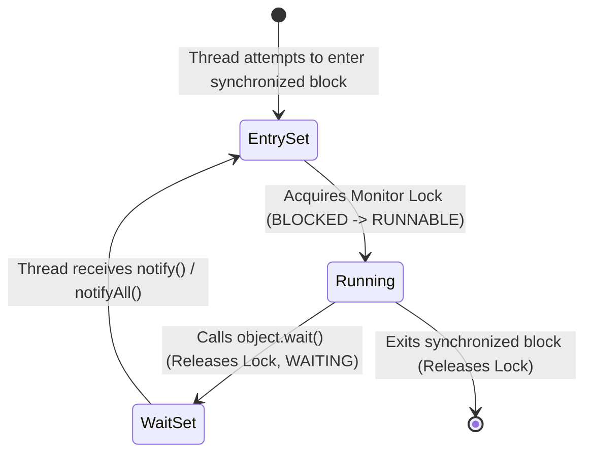

# wait(), notify(), notifyAll() hoạt động ra sao trong Java?

## ⚡ Tóm tắt ngắn (30s)
* **`wait()`**, **`notify()`**, **`notifyAll()`** là các phương thức nguyên bản của lớp `Object` dùng để giao tiếp liên luồng (**Inter-thread communication**) thông qua cơ chế **Monitor Lock**.
* **Ràng buộc nghiêm ngặt**: Chúng **BẮT BUỘC** phải được gọi bên trong một khối hoặc phương thức `synchronized` sở hữu Monitor Lock của đối tượng đó. Nếu không, JVM sẽ ném ra ngoại lệ `IllegalMonitorStateException`.
* **`wait()`**: Giải phóng khóa ngay lập tức, chuyển luồng hiện tại sang trạng thái `WAITING` và đưa vào **Wait Set** của đối tượng.
* **`notify()`**: Đánh thức **một luồng ngẫu nhiên** trong Wait Set. Luồng được đánh thức không chạy ngay mà chuyển sang trạng thái `BLOCKED` ở **Entry Set** để chờ giành lại khóa.
* **`notifyAll()`**: Đánh thức **toàn bộ luồng** trong Wait Set. Đây là lựa chọn an toàn thực chiến để tránh bỏ sót tín hiệu hoặc đánh thức nhầm luồng.

---

## 🔍 Chi tiết bản chất thực chiến

### 1. Monitor Lock & Trạng thái Luồng trong Java
Mỗi đối tượng trong Java liên kết với một cấu trúc dữ liệu Monitor gồm hai hàng đợi chính:
1. **Entry Set (Hàng đợi gia nhập)**: Chứa các luồng đang muốn đi vào khối `synchronized` nhưng chưa có được khóa. Trạng thái luồng: `BLOCKED`.
2. **Wait Set (Hàng đợi chờ đợi)**: Chứa các luồng đã chủ động giải phóng khóa bằng cách gọi `wait()`. Trạng thái luồng: `WAITING` hoặc `TIMED_WAITING`.

### 2. Luồng đi của Giao tiếp Liên Luồng
* Khi Luồng A gọi `object.wait()`: Luồng A nhả khóa đang giữ, đi thẳng vào **Wait Set** của `object`, giải phóng CPU.
* Khi Luồng B chiếm được khóa, gọi `object.notify()` hoặc `object.notifyAll()`:
  * Đối với `notifyAll()`: Toàn bộ các luồng trong **Wait Set** được đẩy sang **Entry Set** để tranh giành khóa.
  * Đối với `notify()`: JVM chọn ngẫu nhiên một luồng từ **Wait Set** chuyển sang **Entry Set**.
* **Điểm mấu chốt**: Luồng được gọi `notify()` chỉ thực sự chạy tiếp khi Luồng B thực thi xong khối `synchronized` của mình và giải phóng khóa.

---

## 🎨 Sơ đồ trực quan Vòng đời Monitor Lock với Wait-Notify



---

## 💻 Code Example

### BAD ❌ (Dùng wait/notify ngoài synchronized và sử dụng câu lệnh "if" nguy hiểm)
```java
public class NaiveQueue {
    private List<String> list = new ArrayList<>();

    public void put(String item) {
        list.add(item);
        // ❌ Lỗi 1: Ném IllegalMonitorStateException vì không gọi trong block synchronized
        notify(); 
    }

    public String take() throws InterruptedException {
        // ❌ Lỗi 2: Dùng câu lệnh "if" có thể gây lỗi logic khi bị Spurious Wakeup
        if (list.isEmpty()) {
            wait(); 
        }
        return list.remove(0);
    }
}
```

### GOOD ✅ (Dùng synchronized, while-loop chuẩn chỉ và xử lý Spurious Wakeup)
```java
public class ThreadSafeQueue {
    private final List<String> list = new ArrayList<>();
    private final int LIMIT = 10;

    public synchronized void put(String item) throws InterruptedException {
        // ✅ Tốt: Dùng vòng lặp while để kiểm tra điều kiện (chống Spurious Wakeup)
        while (list.size() == LIMIT) {
            wait(); // Nhả khóa, đợi tín hiệu khi hàng đợi có chỗ trống
        }
        list.add(item);
        // ✅ Tốt: Dùng notifyAll() để đảm bảo đánh thức cả các luồng đang đợi take()
        notifyAll();
    }

    public synchronized String take() throws InterruptedException {
        // ✅ Tốt: Luôn check trạng thái trong vòng lặp while trước và sau khi tỉnh dậy
        while (list.isEmpty()) {
            wait(); // Nhả khóa, đợi tín hiệu khi hàng đợi có item mới
        }
        String item = list.remove(0);
        notifyAll(); // Đánh thức các luồng put() đang đợi
        return item;
    }
}
```

---

## 📊 Trade-off Analysis: So sánh notify() vs notifyAll()

| Tiêu chí | notify() | notifyAll() |
| :--- | :--- | :--- |
| **Số luồng được đánh thức** | Duy nhất **1** luồng (JVM lựa chọn ngẫu nhiên dựa trên thuật toán tối ưu của OS). | **Toàn bộ** các luồng đang nằm trong Wait Set của đối tượng. |
| **Hiệu năng (Performance)** | **Cao hơn**: Chỉ tốn chi phí đánh thức một luồng đơn lẻ, tránh hiện tượng tranh đoạt ồ ạt khóa của CPU. | **Thấp hơn chút**: Do có thể gây ra hiện tượng Thundering Herd (tất cả cùng thức dậy, tranh cướp khóa rồi hầu hết lại bị block). |
| **Tính an toàn (Thread Safety)** | **Thấp**: Có nguy cơ gây thất lạc tín hiệu (**Signal Loss**). Nếu luồng được chọn thức dậy không khớp điều kiện logic, nó sẽ ngủ tiếp mà không chuyển tiếp tín hiệu cho luồng khác. | **Tuyệt đối an toàn**: Bảo đảm không luồng nào bị bỏ lửng tín hiệu vô hạn. |
| **Khuyến cáo sử dụng** | Chỉ dùng khi các luồng chờ thực hiện **chính xác một công việc như nhau** và tối đa 1 luồng xử lý được dữ liệu. | **Là lựa chọn mặc định** cho hầu hết các bài toán thực chiến để đảm bảo an toàn. |

---

## ⚠️ Common Gotchas & Questions follow-up

* **Hiện tượng Spurious Wakeup (Đánh thức giả lập)**:
  Một luồng đang trong trạng thái `wait()` có thể tự dưng thức dậy mà **không hề** có luồng nào gọi `notify()` hay `notifyAll()`. Đây là đặc tính kỹ thuật ở mức hệ điều hành (POSIX threads). 
  👉 **Cách phòng vệ duy nhất**: Luôn đặt `wait()` bên trong vòng lặp `while` kiểm tra điều kiện thực thi: `while (condition) { wait(); }`. Không bao giờ dùng `if`.
* **Tại sao wait() và notify() lại nằm ở Object chứ không phải Thread?**
  👉 Vì trong Java, khóa Monitor Lock (Intrinsic Lock) thuộc về **bản thân đối tượng** (Object) chứ không thuộc về Luồng (Thread). Luồng chỉ là thực thể đi chiếm đoạt khóa. Do đó, việc ra lệnh đợi hay đánh thức phải được thực thi trên chính đối tượng làm khóa để quản lý Wait Set và Entry Set tương ứng.
* 👉 **Câu hỏi đào sâu từ interviewer**: *Tại sao gọi wait() lại giải phóng khóa còn sleep() thì không?*
  * *(Trả lời: wait() được thiết kế cho việc giao tiếp và đồng bộ luồng. Nếu wait() không giải phóng khóa, luồng khác sẽ không bao giờ có thể đi vào khối synchronized để thay đổi trạng thái dữ liệu và gọi notify() $
ightarrow$ Gây ra deadlock tức thì. Trong khi đó, sleep() dùng để trì hoãn thời gian thực thi của chính luồng đó, không nhằm mục đích phối hợp đồng bộ, nên nó vẫn giữ nguyên các khóa đã chiếm để bảo toàn tính nguyên tử).*