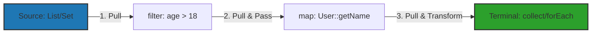

# Stream API là gì? Phân tích mô hình Pull-based pipeline

## ⚡ Tóm tắt ngắn (30s)
`Stream API` (được giới thiệu từ Java 8) là một công cụ mạnh mẽ dùng để xử lý các tập hợp dữ liệu (Collections, Arrays) theo phong cách **khai báo (Declarative)** và **lập trình hàm (Functional Programming)**.
Điểm khác biệt tối thượng so với Collection truyền thống:
1. **Không lưu trữ dữ liệu**: Stream không phải là một cấu trúc dữ liệu lưu trữ phần tử. Nó chỉ là một đường ống (**Pipeline**) vận chuyển và biến đổi dữ liệu từ nguồn gốc (Source) đến đích (Terminal).
2. **Lười biếng (Lazy Evaluation)**: Các phần tử chỉ được tính toán khi thực sự cần thiết (khi kích hoạt Terminal Operation).
3. **Mô hình Pull-based**: Dữ liệu không được đẩy (push) qua các bước xử lý, mà được kéo (pull) ngược từ Terminal Operation quay lại Source theo cơ chế yêu cầu phần tử tiếp theo (on-demand).

---

## 🔍 Chi tiết bản chất thực chiến

### 1. Phân biệt sâu sắc Collection và Stream
* **Collection** tập trung vào việc **quản lý và lưu trữ dữ liệu** trong bộ nhớ Heap. Tất cả phần tử đều được nạp sẵn và tính toán trước (Eager).
* **Stream** tập trung vào việc **tính toán và biến đổi dữ liệu**. Các phần tử được duyệt qua theo luồng và tính toán trễ (Lazy).

### 2. Mô hình Pull-Based Pipeline hoạt động ra sao?
Trong Stream API, pipeline được xây dựng bằng cách xâu chuỗi các mắt xích xử lý thông qua interface `Spliterator` hoặc `Iterator`. 
Khi gọi Terminal Operation, nó sẽ gửi yêu cầu lấy kết quả. Mắt xích cuối cùng sẽ yêu cầu mắt xích liền trước nó cung cấp một phần tử đã biến đổi, cứ thế lan truyền ngược lại cho đến nguồn dữ liệu (Source). Cơ chế này giúp tối ưu hóa bộ nhớ vì nó không cần tạo các Collection trung gian ở mỗi bước biến đổi.

### 3. Sơ đồ luồng xử lý phần tử trong Stream Pipeline


---

## 💻 Code thực chiến: BAD vs GOOD

### ❌ BAD: Dùng cách duyệt imperative truyền thống hoặc thay đổi state trong Stream
```java
import java.util.ArrayList;
import java.util.List;

public class BadStreamUsage {
    public List<String> getAdultUserNames(List<User> users) {
        // Anti-pattern 1: Khởi tạo list trung gian và duyệt thủ công
        List<String> names = new ArrayList<>();
        for (User u : users) {
            if (u.getAge() > 18) {
                names.add(u.getName());
            }
        }
        return names;
    }

    // Anti-pattern 2: Lạm dụng side-effect làm thay đổi trạng thái bên ngoài trong stream
    public List<String> getAdultNamesUnsafe(List<User> users) {
        List<String> names = new ArrayList<>();
        users.stream()
             .filter(u -> u.getAge() > 18)
             .forEach(u -> names.add(u.getName())); // Cực kỳ nguy hiểm nếu dùng Parallel Stream!
        return names;
    }
}
```

###  GOOD: Viết Stream chuẩn phong cách Declarative và Thread-safe
```java
import java.util.List;
import java.util.stream.Collectors;

public class GoodStreamUsage {
    public List<String> getAdultUserNames(List<User> users) {
        // Mô hình biến đổi dữ liệu thuần túy (Immutable & Thread-safe)
        return users.stream()
             .filter(user -> user.getAge() > 18)
             .map(User::getName)
             .collect(Collectors.toList()); // Terminal operation thu thập an toàn
    }
}
```

---

## 📊 Trade-off: So sánh Collection và Stream

| Tiêu chí | Collection (Eager) | Stream (Lazy) |
| :--- | :--- | :--- |
| **Không gian lưu trữ** | Chiếm dụng bộ nhớ RAM thực tế để lưu các phần tử | Không chiếm bộ nhớ để lưu phần tử, chỉ lưu công thức xử lý |
| **Thời gian tính toán** | Eager - Tính toán tất cả phần tử ngay khi khởi tạo | Lazy - Chỉ tính toán khi Terminal Operation yêu cầu |
| **Tái sử dụng** | Có thể duyệt và sử dụng lại nhiều lần | Chỉ duyệt qua được 1 lần duy nhất (Single-use) |
| **Khả năng vô tận** | Không hỗ trợ cấu trúc dữ liệu vô tận | Hỗ trợ nguồn dữ liệu vô tận (`Stream.generate`, `iterate`) |

---

## ⚠️ Common Gotchas & Questions follow-up

* **Cạm bẫy Stream chỉ sử dụng một lần (Single-use Gotcha)**:
  Một đối tượng Stream sau khi đã gọi Terminal Operation sẽ bị đánh dấu là đóng (closed). Nếu bạn cố tình gọi tiếp bất kỳ operation nào trên stream đó, JVM sẽ lập tức ném ra `IllegalStateException: stream has already been operated upon or closed`.
  * *Khắc phục:* Luôn tạo một stream mới từ nguồn dữ liệu gốc nếu muốn thực hiện một pipeline xử lý mới.
*  **Câu hỏi đào sâu từ interviewer**: *Làm thế nào để sinh ra một dòng dữ liệu vô hạn (infinite stream) trong Java, và làm thế nào để dừng luồng vô tận đó an toàn mà không làm treo hệ thống?*
  * *(Trả lời: Ta có thể sinh ra dòng dữ liệu vô hạn bằng cách sử dụng `Stream.iterate()` hoặc `Stream.generate()`. Để đảm bảo an toàn, bắt buộc phải chèn một mắt xích giới hạn (Short-circuiting operation) như `limit(N)` hoặc dùng `takeWhile(Predicate)` (từ Java 9) để ngắt luồng dữ liệu khi đạt điều kiện nhất định trước khi gọi các Terminal operation thu hoạch kết quả như `collect()` hoặc `forEach()`).*
---