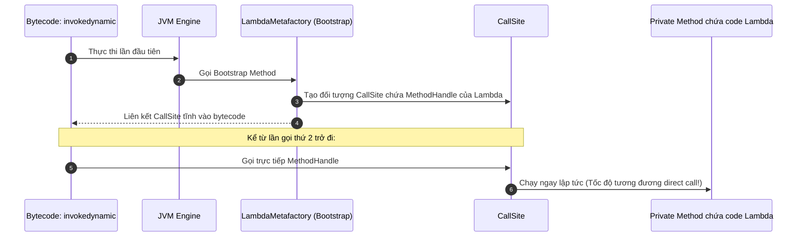

# Lambda expression được compile như thế nào? Giải mã bí ẩn bytecode invokedynamic (Indy)

## ⚡ Tóm tắt ngắn (30s)
Lambda Expression trong Java **KHÔNG** đơn giản là một cú pháp viết tắt (Syntactic Sugar) cho Lớp ẩn danh (Anonymous Inner Class).
Kiến trúc biên dịch Lambda cực kỳ tinh tế và tối ưu nhờ chỉ thị **`invokedynamic` (Indy)**:
1. **Thời điểm biên dịch (Compile-time)**: Trình biên dịch Java (`javac`) không sinh ra file `.class` vật lý mới cho Lambda. Nó chỉ sinh ra một chỉ thị bytecode `invokedynamic` tại điểm gọi và đóng gói code của Lambda thành một private method (tĩnh hoặc động) nằm ngay trong chính class đó.
2. **Thời điểm khởi chạy lần đầu (First Execution)**: JVM thực thi chỉ thị `invokedynamic`, gọi một Bootstrap Method (`LambdaMetafactory.metafactory`). Hàm này sẽ sinh động một Class ẩn trong runtime (Hidden Runtime Class) bằng thư viện ASM và liên kết trực tiếp Method Handle của Lambda vào Call Site.
3. **Các lần chạy tiếp theo**: JVM gọi trực tiếp Method Handle siêu nhanh, hoàn toàn bỏ qua chi phí load class vật lý hay phản chiếu (Reflection).

---

## 🔍 Chi tiết bản chất thực chiến

### 1. Sự thất bại của Anonymous Inner Class
Nếu dùng Anonymous Inner Class:
* Mỗi Lambda sẽ tạo ra một file vật lý dạng `OuterClass$1.class` trên đĩa cứng $\rightarrow$ làm phình to dung lượng gói ứng dụng (JAR/WAR).
* Khi khởi chạy, JVM bắt buộc phải load file class này lên bộ nhớ, cấp phát RAM cho Class Object $\rightarrow$ tốn tài nguyên và tăng thời gian startup ứng dụng.
* Rủi ro rò rỉ bộ nhớ cao vì Anonymous Class luôn giữ một tham chiếu mạnh ngầm định (`this`) đến outer class.

### 2. Sự ưu việt tối thượng của invokedynamic (Indy)
Chỉ thị `invokedynamic` tách biệt hoàn toàn định nghĩa của điểm gọi (Call Site) và phương thức đích thực tế cần chạy. Nó cho phép JVM trì hoãn việc quyết định cách thực thi Lambda cho đến runtime. Nhờ thế, các kỹ sư thiết kế JDK có thể thoải mái cải tiến thuật toán tối ưu hóa Lambda trong các phiên bản Java mới mà không cần biên dịch lại mã nguồn cũ!

### 3. Sơ đồ cơ chế hoạt động của invokedynamic tại Runtime


---

## 💻 Code thực chiến: Minh họa bản chất compile

### Cú pháp viết Lambda của lập trình viên
```java
import java.util.function.Function;

public class LambdaCompilerDemo {
    public void run() {
        // Viết Lambda đơn giản
        Function<String, Integer> parser = s -> Integer.parseInt(s);
        System.out.println(parser.apply("123"));
    }
}
```

### Cấu trúc Bytecode logic sau khi JVM biên dịch (Decompiled Conceptual Code)
```java
import java.lang.invoke.*;
import java.util.function.Function;

public class LambdaCompilerDemo {
    public void run() {
        try {
            // JVM sử dụng invokedynamic để liên kết động thay vì tạo "new AnonymousClass()"
            CallSite callSite = (CallSite) bootstrapLambda();
            Function<String, Integer> parser = (Function<String, Integer>) callSite.getTarget().invokeExact();
            System.out.println(parser.apply("123"));
        } catch (Throwable e) {
            throw new RuntimeException(e);
        }
    }

    // 1. JVM tự động tách code của Lambda thành một Private Static Method trong Class
    private static Integer lambda$run$0(String s) {
        return Integer.parseInt(s);
    }

    // 2. Định nghĩa Bootstrap Method để sinh class ẩn tại Runtime
    private static CallSite bootstrapLambda() throws Exception {
        MethodHandles.Lookup lookup = MethodHandles.lookup();
        MethodType type = MethodType.methodType(Integer.class, String.class);
        MethodHandle implMethod = lookup.findStatic(LambdaCompilerDemo.class, "lambda$run$0", type);
        
        // Gọi LambdaMetafactory để sinh class ẩn và trả về CallSite liên kết
        return LambdaMetafactory.metafactory(
            lookup,
            "apply",
            MethodType.methodType(Function.class),
            MethodType.methodType(Object.class, Object.class),
            implMethod,
            type
        );
    }
}
```

---

## 📊 So sánh Anonymous Inner Class và Lambda Expression

| Tiêu chí | Anonymous Inner Class | Lambda Expression |
| :--- | :--- | :--- |
| **Biên dịch vật lý** | Tạo ra file `*.class` vật lý phụ trên ổ cứng | Không tạo ra bất kỳ file class vật lý nào khi compile |
| **Cơ chế Runtime** | `ClassLoader.loadClass()` truyền thống | `invokedynamic` sinh Hidden Class động siêu nhẹ trong RAM |
| **Chi phí khởi tạo** | Tốn kém bộ nhớ Heap và Metaspace | Siêu rẻ, chỉ chạy Bootstrap một lần duy nhất đầu tiên |
| **Kỹ thuật tối ưu** | Khó tối ưu, cố định theo phiên bản Java lúc compile | JVM tự động cải tiến hiệu năng theo phiên bản JRE chạy thực tế |

---

## ⚠️ Common Gotchas & Questions follow-up

* **Cạm bẫy rò rỉ bộ nhớ do bắt biến instance (Capturing Lambda Memory Leak Gotcha)**:
  Nếu Lambda của bạn truy cập vào các biến instance (non-static fields) của outer class, JVM sẽ bắt buộc phải truyền tham chiếu `this` vào trong hàm lambda được generate cục bộ (`lambda$run$0(this, s)`).
  * *Hậu quả:* Lambda Instance sẽ giữ một tham chiếu mạnh đến thực thể của Outer Class. Nếu Lambda này được đẩy vào một Thread dài hạn hoặc cache, Outer Class sẽ **không bao giờ được Garbage Collector giải phóng**, gây ra hiện tượng rò rỉ bộ nhớ (Memory Leak) thầm lặng cực kỳ khó tìm!
*  **Câu hỏi đào sâu từ interviewer**: *Tại sao các biến cục bộ (Local Variables) được truy cập bên trong Lambda Expression bắt buộc phải là biến bất biến hoặc có tính chất bất biến ngầm định (effectively final)? Chuyện gì sẽ xảy ra ở mức byte-code nếu ta cố tình thay đổi giá trị của biến cục bộ đó sau khi khai báo Lambda?*
  * *(Trả lời: JVM giải quyết bài toán này bằng kỹ thuật **Variable Capture (Bắt giữ biến)**. Vì biến cục bộ nằm trên Stack Frame của luồng hiện tại, còn Lambda instance có thể được thực thi bất đồng bộ ở một luồng khác khi Stack Frame ban đầu đã bị hủy. Do đó, JVM sẽ tạo một bản sao (copy) giá trị của biến cục bộ đó truyền vào Lambda. Nếu Java cho phép thay đổi giá trị của biến sau khi sao chép, ta sẽ gặp tình trạng không nhất quán dữ liệu giữa biến gốc trên Stack và bản sao bên trong Lambda. Vì vậy, Java cấm tuyệt đối và báo lỗi biên dịch `local variables referenced from a lambda expression must be final or effectively final` để đảm bảo tính nhất quán dữ liệu tuyệt đối).*
---