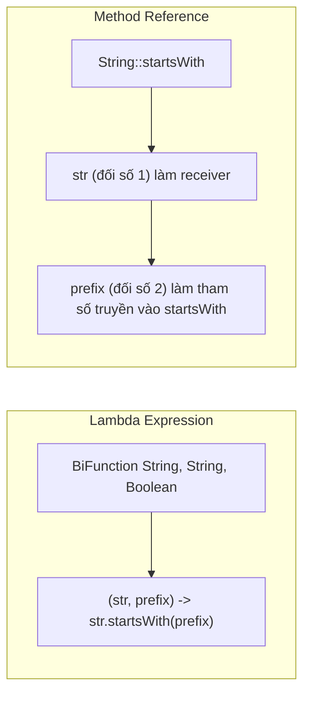

# Method reference là gì? Phân tích 4 loại Method Reference thực chiến

## ⚡ Tóm tắt ngắn (30s)
`Method Reference` (`Class::methodName`) là cú pháp viết tắt cực kỳ ngắn gọn của Lambda Expression khi Lambda đó chỉ làm duy nhất một việc là chuyển tiếp tham số gọi một phương thức có sẵn.
Bản chất hoạt động:
1. **Không phát sinh chi phí hiệu năng**: JVM biên dịch Method Reference thành cùng một chỉ thị bytecode `invokedynamic` giống hệt Lambda, không tạo thêm class ẩn phụ hay sử dụng Reflection chậm chạp.
2. **Nâng cao tính tường minh (Readability)**: Loại bỏ các mã boilerplate dư thừa như tham số đầu vào và dấu ngoặc nhọn.
3. **Phân chia thành 4 loại rõ rệt**: Trỏ tới Static method, Bound Instance method, Unbound Instance method và Constructor.

---

## 🔍 Chi tiết bản chất thực chiến

### 1. Phân loại 4 nhóm Method Reference
*   **Static Method Reference**: Trỏ tới một phương thức tĩnh.
    *   *Lambda:* `(s) -> Integer.parseInt(s)`
    *   *Method Ref:* `Integer::parseInt`
*   **Bound Instance Method Reference**: Trỏ tới phương thức của một đối tượng cụ thể tồn tại sẵn ngoài lambda.
    *   *Lambda:* `(s) -> myStringValidator.isValid(s)`
    *   *Method Ref:* `myStringValidator::isValid`
*   **Unbound Instance Method Reference**: Trỏ tới phương thức của một đối tượng thuộc một kiểu cụ thể, nhưng đối tượng này chính là **tham số đầu tiên** truyền vào lambda.
    *   *Lambda:* `(User u) -> u.getName()`
    *   *Method Ref:* `User::getName`
*   **Constructor Reference**: Trỏ tới hàm khởi tạo để tạo instance mới.
    *   *Lambda:* `() -> new ArrayList<>()`
    *   *Method Ref:* `ArrayList::new`

### 2. Sự ảo diệu của Unbound Instance Method Reference (Arbitrary Object)
Nhiều lập trình viên bối rối khi thấy cú pháp `User::getName` (getName là phương thức instance không tĩnh của lớp User, nhưng lại được gọi qua tên Lớp `User`).
Bản chất ở đây là **Unbound (Không ràng buộc)**. Đối số đầu tiên của Functional Interface sẽ đóng vai trò là đối tượng kích hoạt phương thức (Receiver), còn các đối số tiếp theo (nếu có) sẽ làm tham số cho phương thức đó.
Ví dụ: `BiFunction<String, String, Boolean> starsWith = String::startsWith;` tương đương với lambda: `(str, prefix) -> str.startsWith(prefix)`.

### 3. Sơ đồ cơ chế dịch chuyển tham số trong Unbound Method Reference


---

## 💻 Code thực chiến: BAD vs GOOD

### ❌ BAD: Viết Lambda rườm rà lặp lại tham số thừa thãi
```java
import java.util.List;
import java.util.stream.Collectors;

public class BadLambdaUsage {
    public List<String> cleanNames(List<String> rawNames) {
        return rawNames.stream()
                       // Boilerplate thừa thãi: lặp lại biến s liên tục không cần thiết
                       .map(s -> s.trim()) 
                       .filter(s -> s.isEmpty())
                       .collect(Collectors.toList());
    }
}
```

###  GOOD: Dùng Method Reference tăng tối đa tính tường minh và sạch sẽ của code
```java
import java.util.List;
import java.util.stream.Collectors;

public class GoodMethodRefUsage {
    public List<String> cleanNames(List<String> rawNames) {
        return rawNames.stream()
                       // Cực kỳ gọn gàng, tựa như ngôn ngữ tự nhiên
                       .map(String::trim) 
                       .filter(String::isEmpty)
                       .collect(Collectors.toList());
    }
}
```

---

## 📊 Bảng so sánh 4 loại Method Reference

| Loại Method Reference | Cú pháp Minh Họa | Biểu Thức Lambda Tương Đương | Bản Chất Thu Nhận Tham Số |
| :--- | :--- | :--- | :--- |
| **Static** | `Math::abs` | `x -> Math.abs(x)` | Tham số lambda chuyển thẳng làm đối số hàm tĩnh |
| **Bound Instance** | `System.out::println` | `x -> System.out.println(x)` | Tham số lambda chuyển làm đối số của thực thể xác định sẵn |
| **Unbound Instance**| `String::toLowerCase` | `s -> s.toLowerCase()` | Tham số đầu tiên làm thực thể gọi, các tham số sau làm đối số |
| **Constructor** | `User::new` | `name -> new User(name)` | Các tham số lambda làm đối số hàm khởi tạo của Class |

---

## ⚠️ Common Gotchas & Questions follow-up

* **Cạm bẫy NullPointer tại thời điểm khai báo Bound Method Reference (Eager Evaluation NPE Gotcha)**:
  Hãy cẩn thận với Bound Method Reference như `obj::methodName`. Biểu thức `obj` sẽ bị đánh giá (evaluated) **ngay lập tức** tại thời điểm bạn khai báo dòng code đó để xác định instance đích trỏ tới, chứ không đợi đến khi Stream được thực thi!
  * *Hậu quả:* Nếu `obj` bị `null` tại thời điểm khai báo dòng khai báo method reference, chương trình sẽ ném ngay lập tức `NullPointerException` tại đó. Trong khi đó, nếu dùng lambda `s -> obj.methodName(s)`, lỗi NPE chỉ xảy ra khi stream bắt đầu chạy và gọi tới hàm lambda đó (Lazy Evaluation).
*  **Câu hỏi đào sâu từ interviewer**: *Về mặt bytecode và tối ưu hóa bộ nhớ, Bound Method Reference và Unbound Method Reference khác nhau như thế nào?*
  * *(Trả lời: Với **Unbound** Method Reference (`String::toLowerCase`), lambda không bắt giữ (capture) bất kỳ trạng thái bên ngoài nào. Do đó, JVM chỉ tạo ra một instance duy nhất (Singleton) của Functional Interface tại runtime và tái sử dụng nó cho mọi lần gọi. Với **Bound** Method Reference (`myValidator::isValid`), vì nó cần liên kết chặt chẽ với đối tượng `myValidator` bên ngoài, JVM buộc phải truyền tham chiếu của đối tượng đó vào constructor của class ẩn sinh động tại runtime (Eager Capturing). Điều này dẫn đến việc tạo ra một instance mới của Functional Interface trên Heap cho mỗi lần đoạn code được gọi, gây phát sinh chi phí cấp phát bộ nhớ).*
---