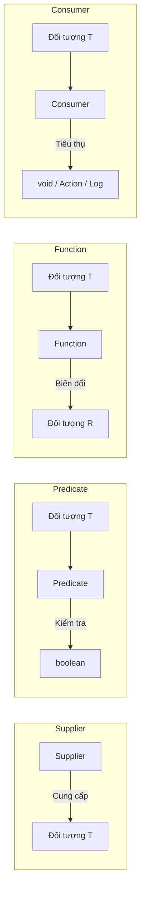

# Predicate, Function, Consumer, Supplier dùng khi nào? Phân tích chuyên sâu về functional interface dựng sẵn

## ⚡ Tóm tắt ngắn (30s)
Để chuẩn hóa việc xử lý dữ liệu trong thế giới lập trình hàm, Java 8 cung cấp sẵn 4 Functional Interfaces cốt lõi trong gói `java.util.function`:
1.  **`Predicate<T>`**: Nhận vào đối tượng kiểu $T$, thực hiện kiểm tra và trả về `boolean`. Thường dùng trong **`filter()`**.
2.  **`Function<T, R>`**: Nhận vào kiểu $T$, xử lý biến đổi dữ liệu và trả về kiểu $R$. Thường dùng trong **`map()`**.
3.  **`Consumer<T>`**: Nhận vào kiểu $T$, tiêu thụ phần tử (làm các tác vụ phụ hoặc side-effect) và trả về `void`. Thường dùng trong **`forEach()`**, **`peek()`**.
4.  **`Supplier<T>`**: Không nhận vào tham số nào, chỉ cung cấp/khởi tạo một đối tượng kiểu $T$. Thường dùng trong **`orElseGet()`**, **`generate()`**.

Để triệt tiêu chi phí Autoboxing/Unboxing của các kiểu nguyên thủy (`int`, `long`, `double`), Java cung cấp thêm các biến thể chuyên dụng như `IntPredicate`, `LongFunction`, `DoubleConsumer` giúp tăng hiệu năng hệ thống lên gấp nhiều lần.

---

## 🔍 Chi tiết bản chất thực chiến

### 1. Tại sao cần các biến thể Primitive Functional Interfaces?
Khi sử dụng các phiên bản Generic thông thường như `Predicate<Integer>`, Java bắt buộc phải chuyển đổi từ kiểu dữ liệu nguyên thủy `int` sang lớp bọc `Integer` (Autoboxing) để đưa vào generic, và ngược lại (Unboxing) khi tính toán.
*   Chi phí này cực kỳ đắt đỏ trong các vòng lặp hàng triệu phần tử do liên tục tạo các đối tượng `Integer` ngắn hạn trên Heap, làm đầy bộ nhớ và ép Garbage Collector hoạt động liên tục.
*   *Giải pháp:* Luôn ưu tiên dùng `IntPredicate`, `LongFunction`, `DoubleConsumer` khi làm việc với kiểu số nguyên thủy.

### 2. Sức mạnh của Function Composition (Kết hợp các hàm)
Các Functional Interfaces dựng sẵn được thiết kế rất thông minh nhờ tích hợp sẵn các default methods cho phép ghép nối các logic lại với nhau tạo thành một chuỗi xử lý phức tạp cực kỳ trực quan:
*   **Predicate chaining**: `predicateA.and(predicateB).or(predicateC).negate()`
*   **Function chaining**: `functionA.andThen(functionB)` (chạy A trước, lấy kết quả truyền vào B) hoặc `functionA.compose(functionB)` (chạy B trước, lấy kết quả truyền vào A).

### 3. Sơ đồ luồng đi của 4 lõi Functional Interfaces


---

## 💻 Code thực chiến: BAD vs GOOD

### ❌ BAD: Sử dụng sai kiểu generic nguyên thủy gây nghẽn autoboxing và code chắp vá
```java
import java.util.List;
import java.util.function.Predicate;

public class BadFunctionalUsage {
    // Sai lầm 1: Dùng Predicate<Integer> cho mảng int nguyên thủy gây Autoboxing
    public int countEvenNumbers(int[] numbers, Predicate<Integer> criteria) {
        int count = 0;
        for (int num : numbers) {
            if (criteria.test(num)) { // Autoboxing diễn ra tại đây! num (int) -> Integer
                count++;
            }
        }
        return count;
    }
}
```

###  GOOD: Dùng đúng biến thể Primitive và tận dụng Function Composition cực sạch
```java
import java.util.Arrays;
import java.util.function.IntPredicate;

public class GoodFunctionalUsage {
    // Sử dụng IntPredicate thay vì Predicate<Integer> - Tránh hoàn toàn Autoboxing!
    public long countEvenNumbers(int[] numbers, IntPredicate criteria) {
        return Arrays.stream(numbers)
                     .filter(criteria) // Xử lý trực tiếp trên vùng nhớ nguyên thủy stack
                     .count();
    }

    // Kết hợp nhiều Predicate bằng mặc định .and()
    public IntPredicate getEvenAndGreaterTenFilter() {
        IntPredicate isEven = val -> val % 2 == 0;
        IntPredicate isGreaterThanTen = val -> val > 10;
        
        return isEven.and(isGreaterThanTen); // Kết hợp siêu đẹp và tường minh!
    }
}
```

---

## 📊 Bảng so sánh 4 Core Functional Interfaces

| Interface | Phương thức trừu tượng (SAM) | Tham số đầu vào | Kết quả đầu ra | Default Methods hữu ích | Kịch bản sử dụng thực chiến |
| :--- | :--- | :--- | :--- | :--- | :--- |
| **`Predicate<T>`** | `boolean test(T t)` | $T$ | `boolean` | `and()`, `or()`, `negate()` | Kiểm tra điều kiện trong `filter()` |
| **`Function<T, R>`**| `R apply(T t)` | $T$ | $R$ | `andThen()`, `compose()` | Ánh xạ biến đổi dữ liệu trong `map()` |
| **`Consumer<T>`** | `void accept(T t)` | $T$ | `void` | `andThen()` | In log, cập nhật dữ liệu, gọi API phụ |
| **`Supplier<T>`** | `T get()` | Không có | $T$ | Không có | Khởi tạo lười (lazy), ném Exception |

---

## ⚠️ Common Gotchas & Questions follow-up

* **Cạm bẫy Eager Evaluation khi dùng orElse thay vì orElseGet (Eager vs Lazy Supplier Gotcha)**:
  Đây là lỗi kinh điển làm giảm hiệu năng hệ thống nghiêm trọng. Cú pháp `optional.orElse(new HeavyObject())` luôn khởi tạo đối tượng `HeavyObject` **bất kể** optional có chứa giá trị hay không!
  * *Khắc phục:* Luôn dùng `optional.orElseGet(() -> new HeavyObject())` vì nó nhận một `Supplier`. Hàm Supplier này chỉ thực sự chạy để khởi tạo đối tượng khi và chỉ khi optional bị rỗng (Lazy Evaluation).
*  **Câu hỏi đào sâu từ interviewer**: *Sự khác nhau giữa Function.identity() và biểu thức lambda x -> x là gì? JVM tối ưu hóa chúng như thế nào?*
  * *(Trả lời: Về mặt hành vi logic, cả hai đều trả về chính tham số truyền vào. Tuy nhiên, `Function.identity()` luôn trả về một thực thể **Singleton** đã được khởi tạo sẵn trong JDK để dùng chung. Trong khi đó, `x -> x` sẽ được biên dịch qua chỉ thị `invokedynamic` tạo ra một điểm Call Site riêng tại lớp chứa nó. Do đó, sử dụng `Function.identity()` giúp tiết kiệm bộ nhớ Heap hơn vì không cần sinh thêm bất kỳ instance ẩn nào tại runtime).*
---