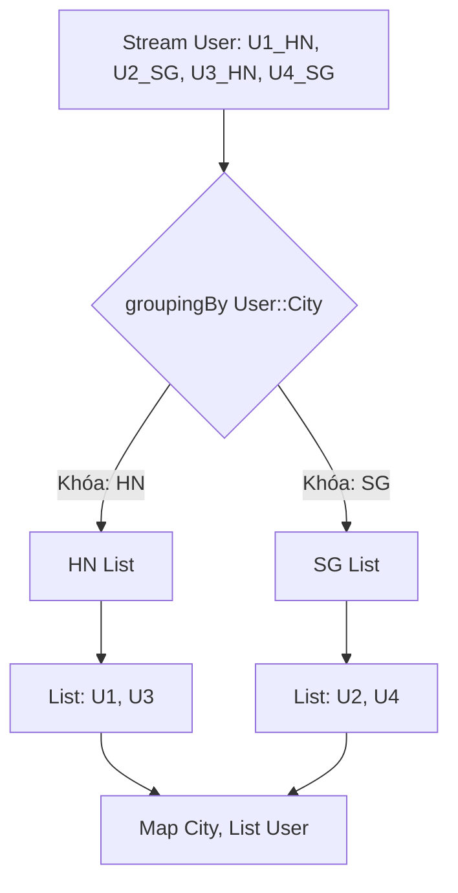

# Làm sao group data bằng Collectors.groupingBy()? Gom nhóm phân tầng, tối ưu bộ nhớ

## ⚡ Tóm tắt ngắn (30s)
`Collectors.groupingBy()` là terminal operation cực kỳ mạnh mẽ dùng để phân nhóm dòng dữ liệu thành một `Map`, tương tự như mệnh đề `GROUP BY` trong SQL.
Hoạt động qua 3 phiên bản nạp chồng (overloaded methods) linh hoạt:
1.  **`groupingBy(classifier)`**: Gom nhóm cơ bản. Đầu ra là `Map<K, List<T>>`.
2.  **`groupingBy(classifier, downstreamCollector)`**: Gom nhóm kèm tính toán tiếp theo trên các nhóm (như tính tổng, đếm số lượng, gom thành Set). Đầu ra là `Map<K, D>`.
3.  **`groupingBy(classifier, mapFactory, downstreamCollector)`**: Gom nhóm cho phép kiểm soát định dạng Map đầu ra (ví dụ: muốn trả về `TreeMap` để tự động sắp xếp khóa).

Để tối ưu hóa đa luồng, ta có `groupingByConcurrent` ghi trực tiếp vào một `ConcurrentHashMap` dùng chung, triệt tiêu chi phí merge Map đắt đỏ của parallel stream.

---

## 🔍 Chi tiết bản chất thực chiến

### 1. Phân nhóm đa tầng (Multi-level Grouping)
Chúng ta có thể lồng đệ quy `groupingBy` bên trong chính nó để tạo ra các bản đồ phân cấp phức tạp.
Ví dụ: Gom nhóm nhân viên theo **Phòng ban**, bên trong mỗi phòng ban lại phân nhóm tiếp theo **Chức vụ**.
```java
Map<Department, Map<Role, List<Employee>>> multiLevel = employees.stream()
    .collect(groupingBy(Employee::getDepartment, 
             groupingBy(Employee::getRole)));
```

### 2. Tối ưu hóa hiệu năng Merge Map khi chạy song song
*   Với `groupingBy` thông thường trên Parallel Stream, mỗi Worker Thread sẽ thu thập phần tử vào các Map cục bộ riêng độc lập. Sau khi xử lý xong, JVM bắt buộc phải thực hiện gộp (merge) các Map này lại thành một Map lớn cuối cùng. Thao tác gộp Map tốn chi phí CPU khổng lồ do liên tục rehash phần tử.
*   *Giải pháp:* Dùng `groupingByConcurrent`. Mọi luồng xử lý song song sẽ đẩy trực tiếp dữ liệu vào duy nhất một bản đồ `ConcurrentHashMap` dùng chung không khóa. Tốc độ sẽ tăng vượt bậc, tuy nhiên Map trả về không bảo toàn thứ tự ban đầu.

### 3. Sơ đồ hoạt động của Collectors.groupingBy()


---

## 💻 Code thực chiến: BAD vs GOOD

### ❌ BAD: Gom nhóm thủ công bằng loop rườm rà hoặc dùng Stream nhưng nhồi nhét logic thô sơ
```java
import java.util.ArrayList;
import java.util.HashMap;
import java.util.List;
import java.util.Map;

public class BadGroupingUsage {
    // Viết code rườm rà, dễ phát sinh lỗi logic khi khởi tạo Map rỗng
    public Map<String, List<User>> groupUsersByCity(List<User> users) {
        Map<String, List<User>> result = new HashMap<>();
        for (User user : users) {
            String city = user.getCity();
            if (!result.containsKey(city)) {
                result.put(city, new ArrayList<>());
            }
            result.get(city).add(user);
        }
        return result;
    }
}
```

###  GOOD: Gom nhóm đa tầng cực kỳ Declarative và tối ưu hiệu năng
```java
import java.util.List;
import java.util.Map;
import java.util.TreeMap;
import java.util.stream.Collectors;

public class GoodGroupingUsage {
    // Gom nhóm và tính lương trung bình của từng phòng ban, sắp xếp theo tên phòng ban
    public Map<String, Double> getAverageSalaryByDept(List<Employee> employees) {
        return employees.stream()
            .collect(Collectors.groupingBy(
                Employee::getDepartment,               // 1. Phân nhóm theo phòng ban
                TreeMap::new,                          // 2. Ép trả về TreeMap để tự động sort tên
                Collectors.averagingDouble(Employee::getSalary) // 3. Tính lương trung bình (downstream)
            ));
    }
}
```

---

## 📊 So sánh 3 dạng nạp chồng của groupingBy()

| Signature (Dạng nạp chồng) | Map Trả Về Mặc Định | Kiểu Dữ Liệu Value của Map | Khả Năng Tùy Biến |
| :--- | :--- | :--- | :--- |
| **`groupingBy(classifier)`** | `HashMap` | `List<T>` | Cơ bản, không thể thay đổi Map type hay xử lý downstream |
| **`groupingBy(classifier, downstream)`** | `HashMap` | Tùy biến theo collector (Set, Long, Double...) | Rất tốt, cho phép đếm số lượng, tính trung bình hoặc gom nhóm con |
| **`groupingBy(classifier, mapFactory, downstream)`** | Tùy chọn (`TreeMap`, `LinkedHashMap`) | Tùy biến theo collector | Tuyệt đối, kiểm soát hoàn hảo cả loại Map và cách thu gom |

---

## ⚠️ Common Gotchas & Questions follow-up

* **Cạm bẫy Null Key trong groupingBy (Null Pointer Key Gotcha)**:
  Hàm phân nhóm `classifier` tuyệt đối **không được trả về giá trị null**. Vì `Collectors.groupingBy` sử dụng `HashMap` bên dưới, tuy HashMap của Java hỗ trợ chứa key `null`, nhưng Collector API lại cố ý cấm việc này để tránh nhập nhằng dữ liệu và sẽ ném ngay lập tức `NullPointerException` nếu gặp phải key null!
  * *Khắc phục:* Luôn lọc bỏ dữ liệu null trước khi group: `.filter(e -> e.getProperty() != null)` hoặc bọc logic null-safe trong classifier: `e -> e.getProperty() == null ? "UNKNOWN" : e.getProperty()`.
*  **Câu hỏi đào sâu từ interviewer**: *Làm thế nào để gom nhóm dữ liệu và chỉ lấy ra thực thể có lương cao nhất của mỗi phòng ban nhưng Map đầu ra phải chứa Object trực tiếp chứ không chứa kiểu Optional (đầu ra dạng Map<String, Employee> thay vì Map<String, Optional<Employee>>)?*
  * *(Trả lời: Ta sử dụng Collector bổ trợ `Collectors.collectingAndThen`. Hàm này cho phép ta áp dụng một hàm biến đổi lên kết quả thu hoạch của collector khác.
    ```java
    Map<String, Employee> topSalary = employees.stream()
        .collect(groupingBy(
            Employee::getDepartment,
            collectingAndThen(
                maxBy(Comparator.comparingDouble(Employee::getSalary)),
                Optional::get // Tự động unwrap Optional ra Object trực tiếp
            )
        ));
    ```
    Cú pháp này cực kỳ mạnh mẽ, giải phóng hoàn toàn code khỏi các lớp bọc Optional thừa thãi).*
---