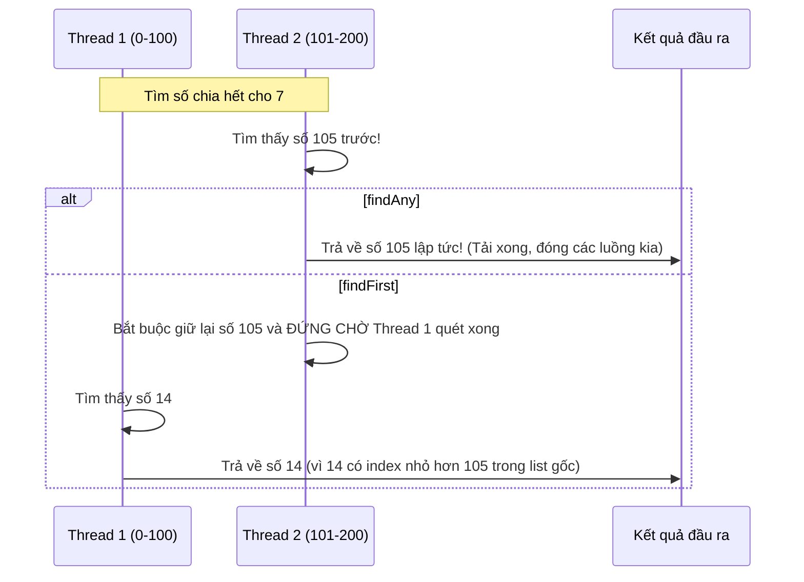

# Sự khác nhau giữa findFirst() và findAny(). Tối ưu hóa đa luồng và hiệu năng

## ⚡ Tóm tắt ngắn (30s)
Cả `findFirst()` và `findAny()` đều là các terminal operations dạng ngắt sớm (Short-circuiting), được dùng để lấy ra một phần tử thỏa mãn điều kiện và bọc trong `Optional`.
Sự khác biệt mang tính chất cốt lõi nằm ở **Độ ưu tiên thứ tự (Encounter Order)** và **Hiệu năng xử lý đa luồng**:
1.  **`findFirst()`**: Luôn luôn trả về phần tử **đầu tiên** xuất hiện trong luồng dữ liệu gốc. Trong môi trường song song (`parallelStream`), nó bắt buộc phải đồng bộ hóa tài nguyên giữa các thread để kiểm soát thứ tự đầu tiên đó, gây ảnh hưởng nghiêm trọng đến tốc độ.
2.  **`findAny()`**: Trả về **bất kỳ** phần tử nào tìm thấy trước tiên. Trong đa luồng, worker thread nào hoàn thành phép tìm kiếm của mình trước sẽ ngay lập tức trả kết quả về Call Site, tối ưu hiệu năng tối đa mà không mất chi phí đồng bộ luồng.

---

## 🔍 Chi tiết bản chất thực chiến

### 1. Ý nghĩa tối thượng của Encounter Order (Thứ tự bắt gặp)
Tính quyết định của thứ tự bắt gặp phụ thuộc vào cấu trúc dữ liệu nguồn:
*   Nếu nguồn dữ liệu có thứ tự chặt chẽ (như `List`, `LinkedHashSet`, mảng hoặc mảng sort): `findFirst()` cam kết luôn trả về đúng phần tử đầu tiên thỏa mãn.
*   Nếu nguồn dữ liệu không có thứ tự (như `HashSet`, `ConcurrentHashMap`): Thứ tự bắt gặp bị phá vỡ. Lúc này, về mặt bản chất, `findFirst()` cũng sẽ hành xử ngẫu nhiên giống `findAny()`.

### 2. Sự nghẽn mạch của findFirst() trong Parallel Stream
Khi chia nhỏ Stream ArrayList thành 4 luồng CPU chạy song song:
*   **Với `findAny()`**: Thread 3 tìm thấy phần tử thỏa mãn điều kiện tại index 750. Nó ngay lập tức báo hiệu cho toàn hệ thống dừng lại, hủy bỏ các luồng khác và trả kết quả về. Tốc độ cực nhanh.
*   **Với `findFirst()`**: Thread 3 tìm thấy phần tử ở index 750. Tuy nhiên, nó **không được phép** trả kết quả ngay. Nó phải đứng chờ Thread 1 (xử lý index 0-250) và Thread 2 (xử lý index 251-500) quét xong. Chỉ khi chắc chắn Thread 1 & 2 không có phần tử nào thỏa mãn, Thread 3 mới được trả về kết quả. Chi phí chờ đợi này triệt tiêu hoàn toàn hiệu năng của chạy song song.

### 3. Sơ đồ tìm kiếm song song của findAny() vs findFirst()


---

## 💻 Code thực chiến: BAD vs GOOD

### ❌ BAD: Dùng findFirst() trong Parallel Stream khi không yêu cầu khắt khe về mặt thứ tự
```java
import java.util.List;
import java.util.Optional;

public class BadFindUsage {
    // Tìm bất kỳ ID user nào đang online để gửi thông báo khẩn cấp
    public Optional<User> findOnlineUserToAlert(List<User> users) {
        // Sai lầm: Sử dụng parallelStream kết hợp findFirst
        // Ép JVM đồng bộ luồng vô ích chỉ để lấy người đầu tiên trong danh sách
        return users.parallelStream()
                    .filter(User::isOnline)
                    .findFirst(); 
    }
}
```

###  GOOD: Tận dụng findAny() tối đa hóa hiệu năng đa luồng cực đỉnh
```java
import java.util.List;
import java.util.Optional;

public class GoodFindUsage {
    // Đã chạy song song tìm kiếm, hãy để các luồng tự do cạnh tranh, ai xong trước lấy trước
    public Optional<User> findOnlineUserToAlert(List<User> users) {
        return users.parallelStream()
                    .filter(User::isOnline)
                    .findAny(); // ✅ Siêu nhanh! Không có barrier đồng bộ luồng
    }
}
```

---

## 📊 Bảng so sánh findFirst() và findAny()

| Tiêu chí so sánh | findFirst() | findAny() |
| :--- | :--- | :--- |
| **Tính Nhất Quán Đầu Ra** | Tuyệt đối nhất quán (Deterministic) trên nguồn có thứ tự | Có thể thay đổi ngẫu nhiên (Non-deterministic) khi chạy song song |
| **Hiệu Năng Stream Tuần Tự** | Tương đương với `findAny()` | Tương đương với `findFirst()` |
| **Hiệu Năng Parallel Stream**| **RẤT CHẬM** do chi phí đồng bộ thứ tự | **CỰC KỲ NHANH** do cơ chế cạnh tranh luồng tự do |
| **Kịch Bản Thực Tế** | Cần lấy đúng phần tử đầu tiên (Ví dụ: Lấy hóa đơn mới nhất) | Chỉ cần tìm thấy 1 phần tử hợp lệ (Ví dụ: Kiểm tra quyền truy cập) |

---

## ⚠️ Common Gotchas & Questions follow-up

* **Cạm bẫy hiểu lầm về tính ngẫu nhiên của findAny trong Stream tuần tự (Sequential Gotcha)**:
  Nhiều lập trình viên nghĩ rằng dùng `findAny()` sẽ trả về một phần tử ngẫu nhiên ngẫu nhiên trong danh sách. Nhưng thực tế, nếu chạy Stream tuần tự (`sequential()`), JVM xử lý tuần tự từ trái qua phải, nên `findAny()` **hầu như luôn trả về phần tử đầu tiên** y hệt như `findFirst()`. Tính bất định ngẫu nhiên của `findAny()` chỉ thực sự lộ diện khi chạy `parallel()`.
*  **Câu hỏi đào sâu từ interviewer**: *Tại sao các phương thức tìm kiếm như findFirst/findAny lại đóng vai trò tối thượng trong việc xử lý dòng dữ liệu vô hạn (Infinite Streams) mà không sợ bị tràn bộ nhớ hay treo máy?*
  * *(Trả lời: Đó là nhờ cơ chế **Short-circuiting (Ngắt mạch sớm)**. Dòng dữ liệu vô hạn (như sinh số ngẫu nhiên liên tục `Stream.generate(Math::random)`) sẽ chạy mãi mãi không bao giờ dừng. Khi ta lắp bộ lọc `filter` và gọi `findFirst()` hoặc `findAny()`, ngay khi luồng dữ liệu trôi qua gặp phần tử đầu tiên khớp điều kiện, operation này lập tức ngắt mạch dòng chảy (terminate pipeline) và đóng Stream lại, bảo vệ ứng dụng khỏi thảm họa lặp vô hạn).*
---