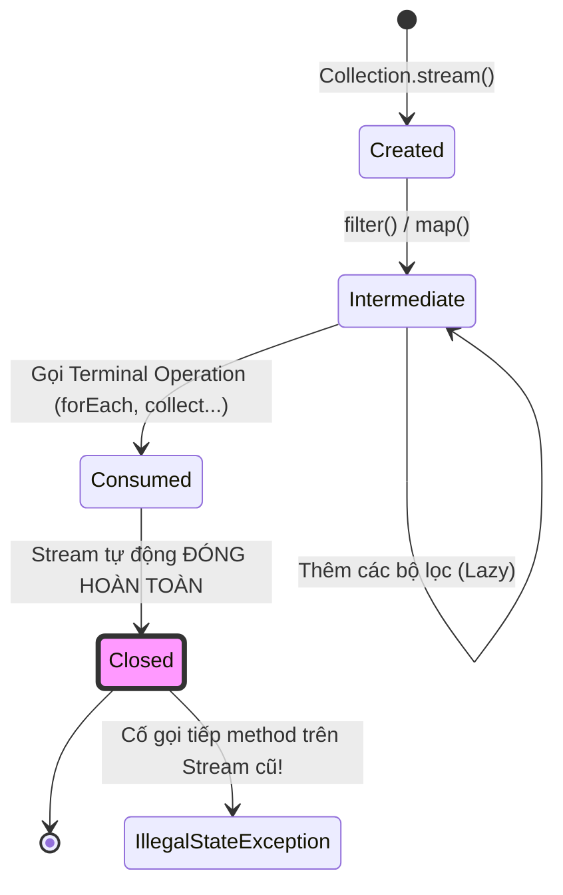

# Stream có tái sử dụng được không? Tại sao ném Exception và cách giải quyết

## ⚡ Tóm tắt ngắn (30s)
Câu trả lời ngắn gọn là **KHÔNG**. Một đối tượng Stream trong Java **chỉ được phép tiêu thụ duy nhất một lần**.
Bản chất kỹ thuật:
1.  **Dòng chảy một chiều**: Stream không phải là một cấu trúc dữ liệu lưu trữ phần tử (như List hay Set). Nó chỉ là một đường ống dẫn hướng (Pipeline) cho phép dữ liệu đi qua.
2.  **Đóng ống sau khi tiêu thụ**: Một khi bất kỳ **Terminal Operation** nào (như `collect()`, `forEach()`, `count()`) được kích hoạt, luồng dữ liệu sẽ chảy hết và đối tượng Stream đó lập tức bị đóng (closed).
3.  **Hậu quả**: Nếu bạn cố gắng thực hiện thêm bất kỳ thao tác nào trên Stream đã đóng, JVM sẽ ném ra ngay lập tức ngoại lệ `java.lang.IllegalStateException: stream has already been operated upon or closed`.

Để giải quyết vấn đề này thực chiến, ta phải tạo ra các Stream tươi mới từ Collection ban đầu, hoặc sử dụng **`Supplier<Stream<T>>`** để tự động tái sinh dòng stream sạch sẽ bất cứ lúc nào.

---

## 🔍 Chi tiết bản chất thực chiến

### 1. Tại sao Java cấm tái sử dụng Stream?
Thiết kế này nhằm đảm bảo **tối ưu hóa tài nguyên phần cứng vượt trội**:
*   Vì Stream không lưu trữ phần tử trong bộ nhớ, các phần tử dữ liệu sau khi chảy qua các bộ lọc và được biến đổi sẽ lập tức được giải phóng hoặc thu gom. Việc này cho phép Java xử lý hàng tỷ bản ghi (Big Data) mà không sợ tràn bộ nhớ Heap.
*   Nếu Java cho phép đi ngược lại hoặc tái sử dụng Stream, JVM buộc phải lưu trữ (cache) toàn bộ trạng thái và các phần tử đã đi qua vào bộ nhớ RAM. Thiết kế này sẽ triệt tiêu hoàn toàn ưu thế "tiết kiệm bộ nhớ" của lập trình hàm.

### 2. Tái sinh Stream bằng Supplier cứu cánh
Thay vì truyền trực tiếp một thực thể Stream đi qua nhiều hàm xử lý (dẫn đến crash lỗi), ta truyền vào một `Supplier<Stream<T>>`. Mỗi khi cần dùng, ta chỉ việc gọi `supplier.get()` để sinh ra một đường ống dẫn mới tinh từ nguồn dữ liệu gốc một cách an toàn tuyệt đối.

### 3. Sơ đồ vòng đời một chiều của Stream


---

## 💻 Code thực chiến: BAD vs GOOD

### ❌ BAD: Tái sử dụng biến Stream dẫn đến crash chương trình thầm lặng tại Runtime
```java
import java.util.stream.Stream;

public class BadStreamReuse {
    public void processUsers(Stream<String> userStream) {
        // Hành động 1: Gọi terminal operation "anyMatch" -> Stream chính thức BỊ ĐÓNG!
        boolean hasAdmin = userStream.anyMatch(name -> name.equals("Admin"));
        System.out.println("Has Admin: " + hasAdmin);

        try {
            // Hành động 2: Cố tình gọi tiếp terminal operation "count" trên stream đã đóng
            long totalUsers = userStream.count(); // ⚠️ Quăng IllegalStateException nát hệ thống!
            System.out.println("Total: " + totalUsers);
        } catch (IllegalStateException e) {
            System.err.println("Lỗi nghiêm trọng: " + e.getMessage());
        }
    }
}
```

###  GOOD: Tái sinh Stream linh hoạt bằng cách tạo mới hoặc sử dụng Supplier
```java
import java.util.List;
import java.util.function.Supplier;
import java.util.stream.Stream;

public class GoodStreamReuse {
    // Giải pháp thực chiến: Dùng Supplier để tự động cấp phát stream mới tại mỗi bước gọi
    public void processUsersCorrectly(List<String> users) {
        // Tạo Supplier quản lý nguồn sinh Stream
        Supplier<Stream<String>> userStreamSupplier = () -> users.stream();

        // Bước 1: Lấy Stream mới tinh để kiểm tra
        boolean hasAdmin = userStreamSupplier.get().anyMatch(name -> name.equals("Admin"));
        System.out.println("Has Admin: " + hasAdmin);

        // Bước 2: Lấy tiếp Stream mới tinh khác để đếm - An toàn tuyệt đối!
        long totalUsers = userStreamSupplier.get().count();
        System.out.println("Total: " + totalUsers);
    }
}
```

---

## 📊 So sánh vòng đời giữa Collection và Stream

| Đặc tính kỹ thuật | Collection (List, Set) | Stream API |
| :--- | :--- | :--- |
| **Bản chất** | Cấu trúc lưu trữ dữ liệu (Data Structure) | Pipeline truyền dẫn và biến đổi hành vi dữ liệu |
| **Lưu trữ RAM** | Giữ toàn bộ các phần tử trực tiếp trong Heap | Không giữ phần tử nào, phần tử chảy qua rồi biến mất |
| **Vòng đời sử dụng** | Bất tử (Có thể đọc/ghi đi đọc/ghi lại vô hạn lần) | Một chiều (Chỉ dùng đúng 1 lần duy nhất rồi đóng) |
| **Thời điểm tính toán** | Tính toán ngay lập tức (Eager) khi thêm phần tử | Tính toán lười biếng (Lazy), chỉ chạy khi gọi terminal |

---

## ⚠️ Common Gotchas & Questions follow-up

* **Cạm bẫy rò rỉ tài nguyên hệ thống từ Stream I/O (I/O Stream Leak Gotcha)**:
  Có một số loại Stream đặc biệt liên kết với tài nguyên vật lý bên ngoài hệ thống (như `Files.lines(path)` đọc file, hoặc `Stream` kết nối database qua JPA). Mặc dù chúng cũng tuân thủ nguyên tắc không tái sử dụng, nhưng nếu ta dùng xong mà **không chủ động đóng** chúng, các file handle hoặc connection socket sẽ bị treo lơ lửng, gây rò rỉ tài nguyên hệ thống (Resource Leak) nghiêm trọng dẫn đến lỗi treo OS `Too many open files`.
  * *Khắc phục:* Luôn bọc các loại Stream I/O này trong khối **try-with-resources** để đảm bảo chúng tự động được giải phóng an toàn khi ra khỏi khối code:
    ```java
    try (Stream<String> lines = Files.lines(Paths.get("data.txt"))) {
        lines.filter(l -> !l.isEmpty()).forEach(System.out::println);
    } // JVM cam kết tự động gọi lines.close() giải phóng file handle!
    ```
*  **Câu hỏi đào sâu từ interviewer**: *Tại sao các kỹ sư thiết kế Java lại đặt ra nguyên tắc cấm đi ngược dòng hay tái sinh Stream tự động từ phía JVM để bảo vệ lập trình viên khỏi lỗi IllegalStateException?*
  * *(Trả lời: Java hoàn toàn có thể làm được điều đó bằng cách ngầm định lưu giữ bản sao dữ liệu trong RAM. Tuy nhiên, việc cấm này mang tính chất **định hướng kiến trúc lập trình hàm chuẩn chỉ**. Nó ép lập trình viên phải hiểu sâu sắc rằng Stream là Stateless và Transient (tạm thời), ngăn chặn tư duy viết code Imperative cũ kỹ lạm dụng biến toàn cục gây nghẽn hiệu năng đa luồng. Việc ném ra ngoại lệ là cảnh báo đắt giá để lập trình viên tổ chức lại code sạch sẽ).*
---