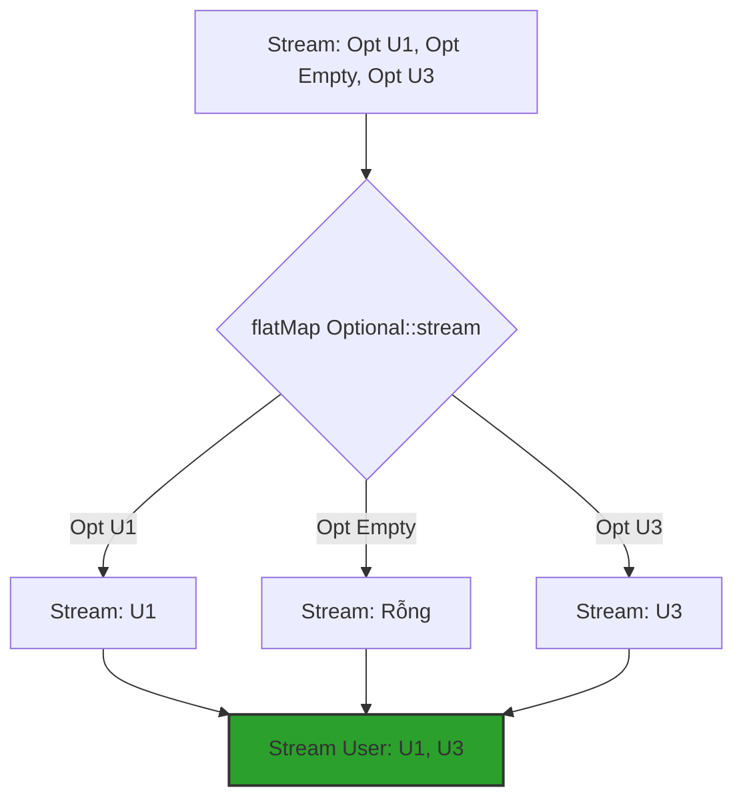

# Optional kết hợp với stream như thế nào? Xử lý Null-safety thanh lịch, tránh Anti-pattern

## ⚡ Tóm tắt ngắn (30s)
Sự kết hợp giữa `Optional` và `Stream` là giải pháp tối thượng để xử lý Null-safety trong lập trình hàm Java, xóa bỏ hoàn toàn các khối code `if (x != null)` lồng nhau nhức mắt.
Các kỹ thuật cốt lõi bao gồm:
1.  **`Optional.stream()` (Java 9+)**: Biến đổi một `Optional` thành một `Stream` có 1 phần tử (nếu có giá trị) hoặc rỗng (nếu rỗng). Cực kỳ mạnh mẽ khi kết hợp với `flatMap()` để thanh lọc toàn bộ giá trị rỗng ra khỏi dòng dữ liệu.
2.  **Unwrap an toàn**: Dùng các hàm đầu ra như `orElseGet()` hoặc `orElseThrow()` để xử lý các kịch bản mặc định hoặc lỗi.
3.  **Quy tắc cấm kỵ (Anti-patterns)**: Không bao giờ gọi `.get()` trực tiếp mà không kiểm tra, không dùng `Optional` làm tham số truyền vào của phương thức (Method parameters), và không dùng làm thuộc tính lớp (Class fields).

---

## 🔍 Chi tiết bản chất thực chiến

### 1. Kỹ thuật flatMap(Optional::stream) vi diệu
Giả sử bạn có một danh sách ID người dùng, bạn gọi API tìm kiếm trả về các `Optional<User>`. Nhiệm vụ là thu thập toàn bộ các User thực tế tồn tại.
*   *Cách cũ (Java 8):* Phải lọc trước rồi mới lấy: `.filter(Optional::isPresent).map(Optional::get)`.
*   *Cách mới (Java 9+):* `.flatMap(Optional::stream)` chuyển hướng trực tiếp từng Optional thành luồng dữ liệu nhỏ và làm phẳng (flatten) chúng thành một dòng sạch bóng null.

### 2. Tại sao cấm dùng Optional làm Class Field?
*   **Không hỗ trợ Serialization**: Lớp `Optional` cố tình không implements giao diện `java.io.Serializable`. Nếu bạn dùng Optional làm thuộc tính của một Class, khi hệ thống thực hiện tuần tự hóa (để lưu vào Redis, Session, hoặc gửi qua mạng), JVM sẽ quăng lỗi `NotSerializableException` lập tức.
*   **Tốn dung lượng RAM**: Mỗi đối tượng `Optional` là một Wrapper Object riêng biệt trên Heap. Việc dùng nó làm thuộc tính cho hàng triệu Entity trong bộ nhớ sẽ gây hao tổn RAM vô cùng vô ích.
*   *Giải pháp:* Chỉ dùng Optional làm kiểu trả về (Return Type) của phương thức.

### 3. Sơ đồ cơ chế lọc sạch null bằng flatMap(Optional::stream)


---

## 💻 Code thực chiến: BAD vs GOOD

### ❌ BAD: Viết code chắp vá, gọi .get() trực tiếp nguy hiểm và lạm dụng Optional làm tham số
```java
import java.util.List;
import java.util.Optional;
import java.util.stream.Collectors;

public class BadOptionalUsage {
    // Sai lầm 1: Dùng Optional làm tham số đầu vào (Method parameter) -> Gây gánh nặng check null cho caller!
    public void processUserBonus(Optional<User> userOpt) {
        // Sai lầm 2: Gọi .get() trực tiếp không kiểm tra -> Nguy cơ quăng NoSuchElementException cực cao!
        User user = userOpt.get(); 
        System.out.println("Processing: " + user.getName());
    }

    // Sai lầm 3: Cách lọc Optional trong stream kiểu cũ, dài dòng
    public List<User> getActiveUsers(List<String> ids) {
        return ids.stream()
                  .map(this::fetchUser) // Trả về Optional<User>
                  .filter(Optional::isPresent) // Lọc thủ công
                  .map(Optional::get)          // Unwrap thủ công
                  .collect(Collectors.toList());
    }

    private Optional<User> fetchUser(String id) { return Optional.empty(); }
}
```

###  GOOD: Code chuẩn chỉ Java 9+, Null-safety tuyệt đối và khai phóng sức mạnh flatMap
```java
import java.util.List;
import java.util.Objects;
import java.util.Optional;
import java.util.stream.Collectors;

public class GoodOptionalUsage {
    // Đúng đắn: Tham số truyền vào phải là Object trực tiếp. Dùng Objects.requireNonNull để bảo vệ
    public void processUserBonus(User user) {
        Objects.requireNonNull(user, "User cannot be null");
        System.out.println("Processing: " + user.getName());
    }

    // Đúng đắn: Tận dụng flatMap và Optional::stream siêu sạch
    public List<User> getActiveUsers(List<String> ids) {
        return ids.stream()
                  .map(this::fetchUser)     // Trả về Optional<User>
                  .flatMap(Optional::stream) // ✅ Lọc sạch rỗng và unwrap chỉ trong 1 dòng!
                  .collect(Collectors.toList());
    }

    private Optional<User> fetchUser(String id) { 
        return Optional.of(new User("User-" + id)); 
    }
}
```

---

## 📊 So sánh các phương thức tháo gỡ (Unwrap) Optional

| Phương thức | Tham số nhận vào | Bản chất tính toán (Evaluation) | Kịch bản sử dụng thực chiến |
| :--- | :--- | :--- | :--- |
| **`orElse(defaultValue)`** | Hằng số hoặc Object có sẵn | **Eager (Luôn khởi tạo)** bất chấp Optional có rỗng hay không | Khi giá trị mặc định là hằng số tĩnh cực nhẹ |
| **`orElseGet(Supplier)`** | Một `Supplier` lambda | **Lazy (Chỉ khởi tạo)** khi và chỉ khi Optional thực sự rỗng | Khi cần khởi tạo đối tượng mới đắt đỏ hoặc gọi DB phụ |
| **`orElseThrow(Supplier)`**| Một `Supplier` cung cấp Exception | **Lazy** ném lỗi khi rỗng | Khi không tìm thấy dữ liệu bắt buộc (như User ID trong API) |

---

## ⚠️ Common Gotchas & Questions follow-up

* **Cạm bẫy dùng Optional.of() trên biến có nguy cơ null (Optional.of NPE Gotcha)**:
  Phương thức `Optional.of(value)` yêu cầu biến `value` bắt buộc phải khác null. Nếu truyền vào một biến null, nó sẽ quăng ngay `NullPointerException` lập tức thay vì bọc nó lại thành một Optional rỗng!
  * *Khắc phục:* Luôn dùng `Optional.ofNullable(value)` nếu biến đó có bất kỳ cơ hội nào bị null.
*  **Câu hỏi đào sâu từ interviewer**: *Tại sao việc lạm dụng Optional làm giảm hiệu năng của các ứng dụng tính toán tốc độ cao (High-Throughput)? JVM giải quyết vấn đề này như thế nào trong tương lai?*
  * *(Trả lời: Mỗi `Optional` được khởi tạo là một đối tượng vật lý trên Heap, tiêu tốn 16 bytes dung lượng bộ nhớ và sinh thêm một lớp con trỏ tham chiếu (Indirection). Việc tạo ra hàng triệu instance Optional mỗi giây trong các luồng Hot Paths sẽ tăng gánh nặng dọn dẹp cho Garbage Collector cực lớn.
    Để khắc phục triệt để vấn đề này, dự án **Project Valhalla** của JDK đang phát triển tính năng **Value Classes (Primitive Objects)**. Trong tương lai gần, `Optional` sẽ được định nghĩa là một Value Class không có danh tính đối tượng (Identity-less), giúp JVM tự động ép dẹt (flatten) nó vào Stack hoặc trực tiếp vào vùng nhớ mảng mà không phát sinh thêm bất kỳ chi phí cấp phát Heap nào).*
---